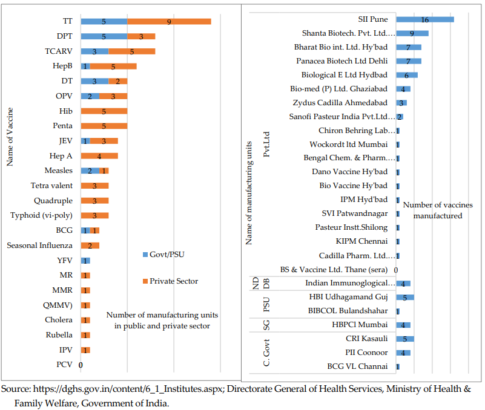

**Draft report:**

**Landscape Analysis on Alternatives to Animal Testing for Drug
Development**

**in India**

> **Index**

1.  Executive Summary

2.  Introduction

3.  Generics and Differentiated Drugs

4.  New Chemical Entities/ New Biological Entities

5.  Cell and gene therapies

6.  Biosimilars

7.  Non Animal Methodologies (NAMs) for Drug testing

8.  Cross sectoral tests: Pyrogen testing

9.  Vaccines

10. Ecosystem level recommendations

> **1: Executive Summary**

**Background**

The Indian pharmaceutical industry is projected to expand to 150-200
billion USD in the next decade contributing significantly to the global
supply of pharmaceutical drugs. “*India ranks as the 13th largest
pharmaceutical market by value and the third largest by volume globally.
It supplies over 20% of the global generic medicines market and accounts
for more than 60% of the world’s vaccines*.”

- The recent “Policy to Catalyse R&D and Innovation in the Pharma
  MedTech Sector in India” aims to encourage R&D in pharmaceuticals and
  medical devices along with creating an ecosystem for innovation to
  enable in order India to become leader in drug discovery and
  innovative medical devices.5

With a rising trend towards innovation in the pharmaceutical sector in
the country, it is envisaged that preclinical testing will also
subsequently increase for NCEs/NBEs, generics, biosimilars, cell and
gene therapy etc.

Animal testing also has long been the standard for preclinical drug
development, yet these models often fail to recapitulate the complexity
of human biological systems specifically in the context of
organ-specific toxicity and disease-specific responses. The animal
models fail to recapitulate the complexity of human system due to
species-specific difference in physiology, metabolism and
genetics between animals and human which leads to discrepancies in data.
This leads to high failure rates in clinical trials and significant
delays in bringing safe and effective therapies to market. Only about
10% of drugs progress from Phase I trials to regulatory approval. To
address these limitations, the global scientific and regulatory
landscape is rapidly shifting toward Non-Animal Methods which includes
technologies like organ-on- chip, organoids and in silico models. The
period from 2022 onwards has witnessed a turning point in drug
development with the recent adoption of the FDA Modernization Act 2.0 in
the USA which authorises the use of non-animal methods to assess the
safety and efficacy of drugs.

Besides issues of human relevance and ethical reasons, the cost of
animal research is high—in dollars, leading to delays in drug approval,
and in the loss of potentially beneficial drugs for human use. Globally,
the non-animal models have also been shown to provide economic benefits,
providing remarkable business opportunities Thus, it is essential to map
potential opportunities for 3Rs – (refine, reduce and replace, with key
focus on the latter two) within New Trials and Drugs Rules, 2019,
comparing it to the global regulations like European Medical Agency
guidelines, key reflection papers, Food & Drugs Administration, USA
guidance documents and International Council for Harmonisation of
Technical Requirements for Pharmaceuticals for Human Use (ICH)
guidelines.

India has taken a stance towards new emerging technologies that
human-relevant with the recent amendment that has been introduced to the
New Drugs and Clinical Trial Rules (2023), which allows the use of
non-animal and human-based methods like 3D organoids, organs-on-chip,
and advanced computational methods, for testing safety and efficacy of
new drugs.  Considering this pivotal step by the Indian regulatory body,
this report aims to map and identify non-animal technologies that may
have potential to be adopted into the India ecosystem, as well as
provide recommendations to develop and facilitate their adoption by the
pharma industry.

The year long analysis was undertaken by four key organizations viz Dr.
Reddy’s Laboratories, DBT- InSTEM, Humane World for Animals India and
Animal Law and Policy Network to assess various 3R opportunities across,
generics, biosimilars, cell and gene therapy, NCEs/NBEs and provide a
landscape view of the emerging non-animal technologies. With the
governance structure of a steering committee, the project was divided
across different verticals with specific focus (Figure 1).

**Figure 1:** Structure of the entire project including details
regarding specific verticals

Process of data collection was based on a rigorous process as referring
to more than 300 publications, more than 100 company websites and
consultation with more than 30 national and international stakeholders
as shown in Figure 2a & 2b.

\(a\)

**(b)** 

**Figure 2:** Process of data collection from different sources (a) and
diverse kinds of stakeholders consulted (b)

**Scope of the project:**

A qualitative assessment was done for various 3R opportunities across
different sectors and opportunities were designated as very high, high,
moderate and low.

- **Biosimilars and generics:** With India being a key player in the
  generics and biosimilars space, this domain presents opportunities for
  3Rs especially for reduction and waiver opportunities when NDCT rules,
  2019 are compared to global regulations.

- **NCE & Biologics:** While opportunities to reduce usage of animals as
  per global regulations exist- as India is developing very few
  molecules, the impact from these two domains may not be drastic.
  However, this scenario may undergo a shift in the future considering
  the country’s emphasis on innovation. Opportunities for introduction
  of NAMS exist at CROs which cater to the global market engaged in
  innovation

- **Cell and gene therapy:** With India approving the first home grown
  gene therapy in India, potential exists in this domain. While scope
  exists for 3Rs, CGT is still an emerging field in the country

- **Vaccines:** India has emerged as a key bulk vaccine manufacturer and
  contributes to nearly 60 percent of the world's vaccines. In the
  recent decades, several in vitro methods have been developed to test
  the safety and potency of vaccines during the batch testing process.
  In this sector, we document the in vitro methods that have been
  accepted by regulatory bodies and also the methods that are currently
  in the process of validation during the batch testing of vaccines.

- **Cross-sectoral tests: Pyrogen testing**: The detection of pyrogens
  is a critical step for assuring the quality and safety of parental
  pharmaceuticals and medical devices. In this sector, we document and
  analysis the key non-animal technologies to detect pyrogens and
  endotoxins, namely Monocyte Activation Test (MAT) and the recombinant
  Factor C assay (rFC), and provide recommendations to enable the
  adoption of these tests in India.

**Figure 3: Qualitative assessment of 3R opportunities across different
sectors**

**Methodology to assess technologies in different sectors:**

**Regulatory space - Generics, Biosimilars, Cell and Gene Therapy,
NCEs/NBEs, Vaccines batch release testing, Pyrogen testing:** For
vertical 1, to identify potential opportunities for waiver, reduction
and replacement of animals during the drug development process, a
detailed assessment of non clinical studies listed in New Drugs and
Clinical Trials, 2019 was carried out.  Comparative assessment with
International Council for Harmonisation of Technical Requirements for
Pharmaceuticals for Human Use (ICH) guidelines, FDA guidance documents
and European Medicines Agency guidelines was done. Independent documents
were also referred by FDA and EMA. For cell and gene therapy, a detailed
assessment of national guidelines on gene therapy product development &
clinical trials was done. Comparative assessment of such studies was
done with the recent released guideline on quality, non-clinical and
clinical requirements for investigational advanced therapy medicinal
products in clinical trials by EMA and FDA guidelines4   

Besides covering the regulatory space, few opportunities were also
mapped in the non regulatory space for generics, NCEs/NBEs based on
consultation with stakeholders.

**Analysis of global landscape of emerging non animal methodologies for
drug development:** A detailed list of major industry players in NAMs
was created after curating the websites of global industry players which
was validated by multiple stakeholders (e.g.,pharmaceutical companies,
Contract Research Organizations (CROs), academicians and researchers and
toxicologists). NAMs based on their application to specific tissues or
organs such as the liver, heart, skin, eye, kidney, intestine, lungs and
nervous system were listed.The list includes information on whether the
model is 2D, 3D or *in silico*, the type of cells or materials used, and
the *invitro* endpoints measured. We have classified these NAMs based on
their technology readiness level (TRL) considering i) their complexity
of adoption ii) their overall impact including cost efficiency,
reduction in animal usage iii) status of their approval by regulatory
agencies and iv) their scalability and usage. Recommendations
(specifically in an Indian context) for the adoption of NAMs were made
after consulting with the various stakeholders.

**Identified opportunities and key recommendations across sectors
(Regulatory Space)**

**Generics and Modified versions of new drugs:**

<table>
<colgroup>
<col style="width: 15%" />
<col style="width: 34%" />
<col style="width: 25%" />
<col style="width: 25%" />
</colgroup>
<tbody>
<tr>
<td style="text-align: left;"><strong>Drug Products</strong></td>
<td style="text-align: left;"><strong>India Regulatory
Requirement</strong></td>
<td style="text-align: left;"><strong>Waiver/Reduction/
Opportunities</strong></td>
<td><strong>Key Recommendations</strong></td>
</tr>
<tr>
<td style="text-align: left;">Generics</td>
<td style="text-align: left;"><ul>
<li>
Special studies such as sub acute animal toxicity studies for IV
infusions / Injectables at least in two species for minimum 14
days
</li>
<li>
Any Drugs or API which has not been used in the country to any
significant extent shall continue to be new drugs for a period of four
years-
</li>
</ul>
<ul>
<li>
should conduct all
</li>
</ul>
<blockquote>

1.Single dose tox studies

2.Repeated dose toxicity studies in two species

3. For derma products- GPMT, local tolerance studies

</blockquote></td>
<td style="text-align: left;"><ul>
<li>
Waiver of the Tox studies : Stronger language in favour of 3Rs
can be adopted in accordance with EMA guidelines/ FDA guidance
</li>
<li>
Waiver of the tox studies :Stronger language of 3Rs can be
adopted in accordance with EMA guidelines/ FDA guidance
</li>
</ul></td>
<td rowspan="2"><blockquote>

Taking consensus of key industry partners and form a
(consortium),creating a white paper incorporating all the relevant data
of evidences, other regulatory guidelines,conducting workshops with
relevant stake holders,

approaching CDSCO with a roadmap for introducing amendment to NDCT
Rules, 2019 via a circular

</blockquote></td>
</tr>
<tr>
<td style="text-align: left;">
Modified versions of New Drugs/

Differentiated drugs
</td>
<td style="text-align: left;"><ul>
<li>
Animal pharmacological (PK/PD) studies as necessary
</li>
<li>
Toxicological data in Two species
</li>
</ul>
<blockquote>

(This usually be determined on case-by-case basis depending on the
type of new claims being made)

</blockquote></td>
<td style="text-align: left;"><ul>
<li>
Waiver/ Reduction:
</li>
</ul>
<blockquote>

Conditional basis animal studies Scientific advices where bridging
toxicity studies conducted in relevant species as evidence

</blockquote></td>
</tr>
</tbody>
</table>

**New chemical entities/ new biological entities**

<table>
<colgroup>
<col style="width: 33%" />
<col style="width: 33%" />
<col style="width: 33%" />
</colgroup>
<tbody>
<tr>
<td style="text-align: center;"><strong>Type of test</strong></td>
<td style="text-align: center;"><strong>Reduction/Waiver
opportunity</strong></td>
<td style="text-align: center;"><strong>Key Recommendation</strong></td>
</tr>
<tr>
<td style="text-align: center;">Single dose toxicity studies</td>
<td style="text-align: center;"><strong>Waiver</strong> of single dose
toxicity studies</td>
<td rowspan="4" style="text-align: left;">
Taking consensus of key
industry partners and form a (consortium),creating a white paper
incorporating all the relevant data of evidences, other regulatory
guidelines,conducting workshops with relevant stake holders,

<blockquote>

approaching CDSCO with a roadmap for introducing amendment to NDCT
Rules, 2019 via a circular

</blockquote></td>
</tr>
<tr>
<td style="text-align: center;">Repeat dose toxicity (Sub acute/
Chronic)</td>
<td style="text-align: center;"><strong>Reduction</strong>
opportunities: Use of single species on a case by case basis,
Integrating other safety endpoints, Refinement: shortening duration of
study on a case by case basis</td>
</tr>
<tr>
<td style="text-align: center;">Reproductive and development toxicity
(DART) studies</td>
<td style="text-align: center;"> </td>
</tr>
<tr>
<td style="text-align: center;">Female</td>
<td style="text-align: center;"><strong>Reduction</strong>: Use of same
animals in DART testing</td>
</tr>
<tr>
<td style="text-align: center;">Male</td>
<td style="text-align: center;">Waiver</td>
<td style="text-align: center;"></td>
</tr>
<tr>
<td style="text-align: center;">Carcinogenicity studies</td>
<td style="text-align: center;"><strong>Reduction/ waiver</strong> :In
vitro studies can be substantiated on Case by case</td>
<td style="text-align: center;"></td>
</tr>
<tr>
<td style="text-align: center;">Phototoxicity</td>
<td style="text-align: center;"><strong>Reduction:</strong> Validated
invitro method can be used before animal usage</td>
<td style="text-align: center;"></td>
</tr>
<tr>
<td style="text-align: center;">Pharmacological action studies /
ADME</td>
<td style="text-align: center;"><strong>Reduction:</strong> Number of
animals and single species</td>
<td style="text-align: center;"></td>
</tr>
</tbody>
</table>

**Biosimilars**

|  |  |  |  |
|:---|:---|:---|:---|
| **Drug Products** | **India Regulatory Requirement** | **Waiver/Reduction/ Opportunities** | **Recommendations** |
| Biosimilars (Therapeutic proteins/ Monoclonal antibodies) | Repeated dose toxicity study in relevant /non relevant species | Waiver of tox studies as per EMA/ FDA/ MHRA/ HC guidance documents/ scientific advices where toxicity studies waiver granted with case studies as evidence | Revision of Guidelines on Similar Biologics: Regulatory Requirements for Marketing Authorization in India, 2016 |
| Biosimilars (Antibody Drug Conjugates) | Repeated dose toxicity study in relevant and non relevant species (Toxins) | Waiver of tox studies similar to EMA/ FDA guidance documents/ scientific advices where toxicity studies waiver granted with case studies as evidence for biosimilars | Revision of Guidelines on Similar Biologics: Regulatory Requirements for Marketing Authorization in India, 2016 |

**Cell and Gene Therapy**

|  |  |  |
|----|----|----|
| **Key points** | **Key reduction/Waiver opportunities** | **Key Recommendation** |
| Selection of non-clinical models while considering 3Rs | **Replacement/ Reduction:** Stronger language in favour of 3Rs/ in vitro technologies can be adopted in accordance with EMA guidelines | Key opportunities for 3R will be shared with key academicians, CDSCO and ICMR for incorporating such recommendations in the Guidelines on cell and gene therapy to be released by CDSCO. |
| Combining toxicology and PK studies | **Reduction**: Combining Toxicology and PK studies should be preferred as per EMA guidelines which can be adopted in the current national guidelines |  |
| Preference for small animals over large animals | **Reduction:** EMA guidelines have a conditional rationale for including large animals when extrapolation from small animal models becomes challenging, while as per National Guidelines both small and large animals should be included. |  |
| Preference for single species for toxicology studies: | **Reduction:** Conditional basis for conducting animal studies in one species is currently not existing in the National Guidelines. |  |
| GTP vector choice | **Reduction**: Multi arm trials to incorporate multiple GTP vectors is mentioned as per current national guidelines while this is not included in the EMA guidelines |  |
| Additional Toxicology studies | **Reduction:** No specific requirement for additional toxicity studies are mentioned in EMA guidelines when there are differences between clinical & preclinical vectors |  |
| Conditional waiver of repeat dose toxicity | **Reduction:** Conditional waiver of repeat dose toxicity can be included in the national guidelines |  |
| Conditional basis for safety pharmacology studies | **Reduction:** Conditional basis for safety pharmacology studies are part of EMA guidelines but not national guidelines |  |

**Vaccines**

<table>
<colgroup>
<col style="width: 24%" />
<col style="width: 24%" />
<col style="width: 25%" />
<col style="width: 25%" />
</colgroup>
<tbody>
<tr>
<td style="text-align: left;"><strong>Test Name</strong></td>
<td style="text-align: left;"><strong>Current requirements in
IP</strong></td>
<td style="text-align: left;"><strong>Non-animal method/Regulatory
status</strong></td>
<td style="text-align: left;"><strong>Recommendation</strong></td>
</tr>
<tr>
<td style="text-align: left;">Abnormal Toxicity Test (ATT)</td>
<td style="text-align: left;">
Deleted from product monographs and
omitted from routine lot release once the consistency in the production
has been established

Still retained in the General Chapter for Vaccines and immunosera for
human use where it is still used for newer vaccines
</td>
<td style="text-align: left;">
Deleted from Eu Ph

Deletion recommended by WHO
</td>
<td style="text-align: left;">Complete deletion of ATT from IPC</td>
</tr>
<tr>
<td style="text-align: left;">Adventitious agents tests</td>
<td style="text-align: left;">Inoculation of the test sample into
newborn and adult mice, and embryonated hens’ eggs</td>
<td style="text-align: left;">High throughput sequencing
(HTS)/Recommended in the <a
href="https://database.ich.org/sites/default/files/ICH_Q5A(R2)_Guideline_2023_1101.pdf"><u>ICH
Q5A(R2)</u></a></td>
<td style="text-align: left;"></td>
</tr>
<tr>
<td style="text-align: left;">Diphtheria (specific toxicity)</td>
<td style="text-align: left;">In vivo tests in guinea pigs by
subcutaneous injection</td>
<td style="text-align: left;">VERO cell assay/<a
href="https://iris.who.int/bitstream/handle/10665/80681/WHO_IVB_11.11_eng.pdf?sequence=1"><u>Accepted
as Compendial by WHO</u></a>.</td>
<td style="text-align: left;">Incorporation of in vitro assay in the IP
as a compendial test</td>
</tr>
<tr>
<td style="text-align: left;">
Diphtheria (Absence of tetanus
toxin)

(safety)
</td>
<td style="text-align: left;">In vivo test</td>
<td style="text-align: left;">BINACLE assay/ <a
href="https://www.edqm.eu/documents/52006/286251/BSP%20programme%20for%203Rs%20-%20Vaccines%20for%20Human%20Use%20-%20Tetanus%20vaccine%20-%20In%20vitro%20detection%20of%20tetanus%20toxicity%20-%20Part%201.pdf/a5cf8208-cc48-1577-7c65-4a95810536a5?t=1727275865283"><u>Validated</u></a>,
to be included in the Eu Ph (2025-26)</td>
<td style="text-align: left;">Incorporation of in vitro assay in the IP
as a compendial or alternate test</td>
</tr>
<tr>
<td style="text-align: left;">
Tetanus (Irreversibility of toxin)

(safety)
</td>
<td style="text-align: left;">In vivo assay</td>
<td style="text-align: left;">Deletion of the in vivo assay/<a
href="https://www.edqm.eu/en/-/european-pharmacopoeia-on-tetanus-vaccines-rationalising-toxicity-testing-requirements"><u>Deletion
accepted in European Pharmacopoeia</u></a></td>
<td style="text-align: left;">Incorporation of in vitro assay in the IP
as a compendial test</td>
</tr>
<tr>
<td style="text-align: left;">Rabies (Potency)</td>
<td style="text-align: left;">Challenge assay in mice</td>
<td style="text-align: left;">
RFFID / SRID (bulk and final lot -&gt;
but accepted as release in some cases ELISA

<u>Alternative method in Eu Ph (compendial status planned from 2026
onward)</u>
</td>
<td style="text-align: left;">Incorporation of in vitro assay in the IP
as a compendial test</td>
</tr>
<tr>
<td style="text-align: left;">Oral Polio Vaccine (Neurovirulence
testing)</td>
<td style="text-align: left;">Monkey neurovirulence test</td>
<td style="text-align: left;">HTS/<a
href="https://www.who.int/publications/m/item/recommendations-to-assure-the-quality--safety-and-efficacy-of-poliomyelitis-vaccines-(oral--live--attenuated)--annex-2"><u>Recommended
by WHO</u></a></td>
<td style="text-align: left;">Incorporation of in vitro assay in the IP
as a compendial or alternate test</td>
</tr>
</tbody>
</table>

**Key Next Step:** Work with vaccine manufacturing companies to perform
an assessment of how they can shift to in vitro methods; and submit
joint statement to IPC towards complete deletion of ATT and waiver of
Tetanus safety test (irreversibility of toxoid).

**Cross-sectoral tests: Pyrogen testing**

|  |  |  |  |
|----|----|----|----|
| **Test Name** | **Current Requirement in IP** | **Non-animal method/Regulatory status** | **Recommendation** |
| Pyrogen Test | Rabbit Pyrogen Test (but chapter on MAT introduced in IP in 2018) | MAT (going to be mandatory in Brazil from end of 2025; Accepted as alternate test in US FDA; Going to be accepted in Eu Ph by 2025 | To be accepted as Alternate/Compendial in IP |
| Endotoxin Test | LAL (but recombinant methids accepted as Alternative in the new Draft Guidelines) | rFC/Accepted as Compendial in Eu Ph and Alternative in USP | To be accepted as Alternate/Compendial in IP |

**Key Next Step:** Work with pharma companies, especially Dr Reddy Labs
to submit validation data to IPC for rFC and MAT; and work towards the
incorporation of these tests in IPC. Work with govt./biotech companies
for setting up indigenous supply chin to manufacture reagents, PBMCs,
buffers to reduce the cost of these tests.

**Identified opportunities and key recommendations across different
sectors (Non-regulatory Space)**

<table>
<colgroup>
<col style="width: 18%" />
<col style="width: 30%" />
<col style="width: 28%" />
<col style="width: 23%" />
</colgroup>
<tbody>
<tr>
<td style="text-align: left;"><strong>Drug Products</strong></td>
<td style="text-align: left;"><strong>Type of study</strong></td>
<td style="text-align: left;"><strong>Preclinical studies</strong></td>
<td style="text-align: left;"><strong>3R Opprtunities</strong></td>
</tr>
<tr>
<td style="text-align: left;">Generics</td>
<td style="text-align: left;">Comparability of formulations (Screening
assays)</td>
<td style="text-align: left;">Typically, studies in relevant animal
species are carried out for formulation rank ordering (mice, rats,
dogs)</td>
<td style="text-align: left;">Reduction in No. of animals/single
relevant species</td>
</tr>
<tr>
<td style="text-align: left;"></td>
<td style="text-align: left;">Formulation impact (e.g. API form impact
crystalline vs amorphous)</td>
<td style="text-align: left;">Specific cases in vivo studies (Rodents)
are also conducted to understand formulation impact</td>
<td style="text-align: left;">Reduction in No. of animals/single
relevant species</td>
</tr>
<tr>
<td style="text-align: left;"></td>
<td style="text-align: left;">Excipients Impact</td>
<td style="text-align: left;">To evaluate excipients impact on
absorption In vivo studeis are conducted( Rodents/ Non rodents)</td>
<td style="text-align: left;">Reduction in No. of animals/single
relevant species</td>
</tr>
<tr>
<td style="text-align: left;"></td>
<td style="text-align: left;">Ex vivo animal models (Used mostly for
topical generic formulations as a critical tool in justifying
formulation differences)</td>
<td style="text-align: left;">Excised human skin used and give a good
prediction of in vivo bioavailability and bioequivalence and provide a
practical surrogate to clinical bioequivalence studies</td>
<td style="text-align: left;">Where Opportunities exist to use in vitro
assays for drug screening as part of non regulatory requirements for
generics</td>
</tr>
<tr>
<td style="text-align: left;">Differentiated Drugs/ Modified versions of
New Drugs</td>
<td style="text-align: left;">*Pharmacodynamic studies</td>
<td style="text-align: left;">For differentiated products where
rationale needs to be demonstrated through an in-vivo pharmacodynamic
study (in Rodents) in order to seek approval for clinical trials</td>
<td style="text-align: left;">Waiver: No Pharmacodynamic studies are
required (API unchanged) Except for repurposing</td>
</tr>
<tr>
<td style="text-align: left;"></td>
<td style="text-align: left;">Efficacy studies for complex products
(where the agency specifically mentions conducting such studies to
demonstrate functional biological sameness)</td>
<td style="text-align: left;">In vivo efficacy studies in Rodents/ Non
rodents</td>
<td style="text-align: left;">Reduction in No. of animals/single
relevant species</td>
</tr>
<tr>
<td style="text-align: left;"></td>
<td style="text-align: left;">Topical applications</td>
<td style="text-align: left;">Animal studies for absorption, tissue
penetration, systemic availability</td>
<td style="text-align: left;">Reduction in No. of animals/single
relevant species</td>
</tr>
<tr>
<td style="text-align: left;">New Chemical Entities (NCEs)</td>
<td style="text-align: left;"><ul>
<li>
Invivo PK /ADME studies for Lead optimization
</li>
</ul></td>
<td style="text-align: left;">PK studies in Rodents</td>
<td style="text-align: left;">In Vitro studies / NAMs as applicable</td>
</tr>
<tr>
<td style="text-align: left;"></td>
<td style="text-align: left;"><ul>
<li>
To identify Organ specific efficacy and toxicity
</li>
</ul></td>
<td style="text-align: left;">Liver, kidney, CNS where no relevant
animal models are not existing</td>
<td style="text-align: left;">NAMS</td>
</tr>
<tr>
<td style="text-align: left;"></td>
<td style="text-align: left;"><ul>
<li>
Insitu animal studies
</li>
</ul></td>
<td style="text-align: left;">To study absorption behavior of drug in
absence/presence of specific excipients or other drugs in a specific
region of gastrointestinal tract Typically, rat is used for such
tests</td>
<td style="text-align: left;">NAMs</td>
</tr>
<tr>
<td style="text-align: left;"></td>
<td style="text-align: left;"><blockquote>

Ex Vivo animal models (POC studies)

</blockquote></td>
<td style="text-align: left;">
Specific tissue of the animal is
removed and it is studied for the evaluation of specific excipient/other
drugs on behavior of drug

E.g. rat intestinal (duodenum, jejunum) and use in the study (e.g.
everted gut sac)

Skin tissues for permeability studies (e.g.porcine skin)
</td>
<td style="text-align: left;">NAMs</td>
</tr>
</tbody>
</table>

**Key recommendations**

· An industrial consortium can be formed to lead for the implementation
of 3Rs during drug development and adoption of *in silico, in vitro* and
Generative AI approaches for the reduction of animal usage.

· Leveraging organizations like Indian Pharmaceutical Alliance (IPA) to
encourage many pharmaceutical companies to reduce their dependence on
animal testing by making them aware of the potential cost-savings that
the shift could entail.

**Emerging global landscape for non animal methodologies and key
recommendations**

For verticals 2 and 3, we analyzed the key global industry player in
NAMs. Based on our analysis of the 122 evaluated NAMs, the NAMs related
to liver toxicity have the highest technological readiness level.
Notably, Liver-on-chip from Emulate Bio is part of the FDA’s Innovative
Science and Technology Approaches for New Drugs (ISTAND) Pilot Program
and is in the advanced stage of evaluation and approval. However, no
NAMs have currently received full regulatory acceptance. Therefore, at
this stage, no opportunities are identified for waiver of toxicology
studies. Our analysis of the 124 NAMs revealed that the highest number
of NAMs are utilized for studying dermal toxicity (23) and hepatic
toxicity (26). In addition to these, NAMs are also employed for toxicity
assessments of other tissues, including ocular, renal, respiratory,
intestinal, central nervous system (CNS), and cardiac toxicity (Figure
1).

**Fig 4:** Bar graph showing the number of industry players in NAMs in
different tissue-specific toxicity testing

The liver NAMs are classified as high TRL since they have high impact in
terms of cost and animal reduction and they are widely being used by
pharma companies and CROs. For example, the liver-on-chip model by
Emulate Bio is part of the FDA’s Innovative Science and Technology
Approaches for New Drugs (ISTAND) Pilot Program while InSphero’s 3D
liver spheroids have been utilized in collaboration with the U. S. FDA
for liver toxicity studies. These advanced TRL liver NAMs are
particularly valuable for assessing hepatotoxicity and drug-induced
liver injury (DILI), offering significant potential for integration into
drug development processes within the Indian pharmaceutical sector.
Therefore, we recommend the adoption of these high TRL liver NAMs in the
Indian pharmaceutical context. Apart from the liver, NAMs with lower
TRL, particularly for the kidney, lungs and heart require urgent focus.
Technologies such as 2D *in vitro* cell culture models for lungs, 2D
iPSC-derived cardiomyocytes and *in silico* cardiotoxicity prediction
tools have low complexity of adoption and high impact in terms of cost
reduction. Therefore, the Indian pharma industry should move towards
adopting these NAMs in future.

**Key Recommendations for adoption of NAMs:**

1.  Development of indigenous biobanks for validating human cells,
    including liver cells like HepG2 and primary hepatocytes.

2.  Indigenous manufacturing of cell culture media, reagents, and
    labware to reduce costs and logistical barriers.

3.  Conducting capacity-building programs such as training, workshops,
    and stakeholder engagement events.

4.  Leveraging public-private partnerships and government funding from
    agencies like DBT, BIRAC, and CSIR.

5.  Expanding use of in-silico tools (e.g., GastroPlus, DILIsym) in
    regulatory submissions and internal decision-making.

6.  Adopting high-TRL NAMs (especially liver-on-chip) in early-stage
    drug discovery.

Although full replacement of animal models is not yet feasible NAMs
present a strong opportunity for reduction especially in hepatic,
dermal, respiratory and cardiac toxicity assessments. With appropriate
investments in infrastructure, training and validation, NAMs can reduce
dependency on animal testing.

**The immediate next steps to be taken for adoption of NAMs in India:**

<table>
<colgroup>
<col style="width: 28%" />
<col style="width: 28%" />
<col style="width: 43%" />
</colgroup>
<tbody>
<tr>
<td style="text-align: left;"><strong>Key recommendations</strong></td>
<td style="text-align: left;"><strong>Possible challenges for
implementation</strong></td>
<td style="text-align: left;"><strong>Immediate next steps</strong></td>
</tr>
<tr>
<td style="text-align: left;">Indigenous establishment of high quality
and well-validated cell repository for Liver NAM’s for: i) HepG2, ii)
primary hepatocytes for liver</td>
<td style="text-align: left;">Maintenance and scaling, QC, workflows of
the cell lines in the repository</td>
<td style="text-align: left;">Identify indigenous stakeholders for the
development of cell repositories</td>
</tr>
<tr>
<td style="text-align: left;">Indigenous production of media components,
labware and reagents for cell culture as sourcing them from outside
India is a challenge due to high cost.</td>
<td style="text-align: left;">Production of reliable, high quality
growth factors and other additives for cell culture</td>
<td style="text-align: left;">Identify Indigenous stakeholders to
produce lab wares and cell culture reagents</td>
</tr>
<tr>
<td style="text-align: left;">Increasing awareness of the latest NAM
technologies</td>
<td style="text-align: left;">Challenges adopting disruptive approaches
like using NAMs over traditional animal-based approaches</td>
<td style="text-align: left;">Organizing workshops, and roundtables
conferences with the key stakeholders.</td>
</tr>
<tr>
<td style="text-align: left;">Leveraging public-private partnership
grants within India</td>
<td style="text-align: left;">Convincing the funding agencies in
conjunction with regulators to prioritize funding in this area</td>
<td style="text-align: left;">Consulting with funding agencies (public
and private) for prioritization of NAM development and use in India</td>
</tr>
<tr>
<td style="text-align: left;">Adoption of in-silico tools like
GastroPlus, SIMCYP, PKSIM which can have a significant impact on
decreasing number of animal studies</td>
<td style="text-align: left;">Accuracy of these physiological models to
mimic real world scenarios. Model validation is necessary before
implementation</td>
<td style="text-align: left;">
Validating the preclinical
physiological models across compounds to gain confidence on
predictability

Indigenous development of software for predicting pharmacokinetics
and pharmacodynamics (PK/PD) in partnership with the DCGI
</td>
</tr>
</tbody>
</table>

**Ecosystem level recommendations:** **The Three Ecosystems
Approach**[^1]

This report deals primarily with three different ecosystems with each
ecosystem being composed of a diverse set of stakeholders.

1.  **Ecosystem 1:** Sectors where there are clearly available 3R
    opportunities (generics, biosimilars, cell and gene therapies,
    vaccines, NCEs and NBEs).

2.  **Ecosystem 2:** Drug development sector (NAMs).

3.  **Ecosystem 3:** Post-release sector (MAT, rCR and rFC).

Ecosystem level recommendations for each of these three are likely to
vary significantly.

**Ecosystem 1: Sectors with existing 3R opportunities**

**Key stakeholders in Ecosystem 1:**

Fig 1. Key Stakeholders in Ecosystem 1

**Key recommendations:**

1.  Creation of an **industry consortium** to bring together key
    industry players in these sectors to collectively advocate for the
    3Rs.

The consortium will have the following **functions**:

1.  Awareness generation about the benefits of moving away from animal
    testing: reduction of costs; increased ability to invest in more
    human-relevant research methods; etc. within the pharmaceutical
    industry. For instance, the U.S. NTP Interagency Center for the
    Evaluation of Alternative Toxicological Methods (NICEATM) conducts
    workshops and webinars on the 3Rs approach.[^2]

2.  Focus on creating more awareness about 3R opportunities within the
    pharmaceutical industry in India by collating and disseminating best
    practices that have already been/can be adopted to reduce the number
    of animal tests.

3.  Leverage the Indian Pharmaceutical Association (IPA) to encourage
    more and more pharmaceutical companies to reduce their dependence on
    animal testing by making them aware of the potential cost-savings
    that the shift could entail.

4.  Collectively approach regulators to advocate for reduction and
    replacement opportunities by seeking meetings, submitting
    representations, and inviting them to workshops and webinars
    organised by the Consortium.

<!-- -->

2.  Civil society groups (like Humane World for Animals) could advocate
    for greater data transparency from agencies like the Committee for
    Control and Supervision of Experiments on Animals (CCSEA) as far as
    the extent and nature of experimentation on animals is concerned.

> The availability of this data will help shape public opinion and
> thereby create more public pressure on the pharmaceutical industry as
> well as regulators to explore and utilise the available 3R
> opportunities.

**Ecosystem 2: Drug development sector (NAMs)**

**Key stakeholders in Ecosystem 2:**

Fig 2. Key Stakeholders in Ecosystem 2

**Key recommendations:**

Diagrammatic representation:

Fig 3. Overall representation of Key Ecosystem Recommendations

High level changes are also required in the ecosystem to facilitate
development of NAMS

These would include:

1.  **Set up Centres of Excellence (CoEs) based on a hub and spoke
    model.**

**Objective:** To spur research and innovation in order to indigenously
develop NAMs technologies.

**Rationale:**

Establishing dedicated Centres of Excellence (CoEs) can accelerate the
development and adoption of NAMs by offering specialised infrastructure,
training, and validation services.

In the proposed CoE, the following iteration of the Hub and Spoke Model
is proposed:

**Central Hub (Core CoE):**

State‐of‐the‐art resources: Large‐scale laboratories equipped with
high‐throughput screening systems, organ‐on‐chip devices, and data
repositories. The hub could define research agendas, manage
collaborations (with industry, academia, regulators), and ensure quality
control.

**Spoke Institutions (Specialised Labs):**

1.  Research and innovation spokes: Located in IITs or national labs
    focusing on specialised NAMs research, e.g., computational
    toxicology.

2.  Training and education spokes: Offer workshops, certification
    courses, and skill development programs for both academic and
    industry professionals.

**2.Establish a Consortium to catalyse the development and subsequent
adoption of NAMs.**

**Objective:** To bring together various stakeholders in the NAMs
ecosystem on one common platform and catalyse development and adoption
of NAMs.

**Rationale:**

Globally, Consortiums have played a significant role in propelling NAMs
technologies further. (Example: International Consortium for Innovation
and Quality in Pharmaceutical Development (IQMPS)). In its roadmap to
accelerate the maturation of NAMs in the country, Australia has also
proposed setting up of a Consortium.

**3. Establish a Central Agency for NAMs.**

**Objective:** To facilitate greater adoption of NAMs by the industry
and CROs by working closely with regulators to create frameworks
essential for NAMs adoption.

**Rationale:**

The FDA’s proposed central NAMs office represents a strategic shift from
a fragmented approach towards methodical validation and implementation
with respect to NAMs.

**Ecosystem 3: Post-release sector (MAT, rCR and rFC)**

**Key stakeholders in Ecosystem 3:**

Fig 5. Key Stakeholders for Post-Release

**Key recommendations:**

1.  Awareness generation within the pharmaceutical industry about the
    availability and benefits of alternatives to Rabbit Pyrogen Test and
    Limulus Amoebocyte Lysate (LAL) test through workshops and webinars.
    This function can be performed by the Consortia that have been
    recommended as part of Ecosystems 1 and 2.

2.  Even though the Indian Pharmacopoeia (IP) General chapter for
    Monocyte Activation Test was introduced in IP 2018: 2.2.25​, detailed
    guidelines from the IP on how it can be used by the pharmaceutical
    industry could propel greater adoption of this technology. This
    function can be performed by the Consortia that have been
    recommended as part of Ecosystems 1 and 2.

3.  Production of indigenous reagents associated with the rFC, rCR, and
    MAT tests to reduce the costs of adoption by the industry
    (pharmaceutical companies and CROs).

4.  Ensuring a continuous supply chain for the kits/reagents.

Documentation of the global standardisation efforts of these tests: As
standardisation of the assays, including the types that use whole blood
and cell lines for MAT assays, would be essential to reduce the
variability and increase consistency of production. Documenting and
increasing access to the global efforts in this direction, including
guidelines by WHO, EDQM etc. could help in this direction.

5.  Improving adoption of NAMS in the Indian CRO sector via regular
    sensitization programmes, assessing current need via surveys etc.

> **2.Introduction**

**Problem Statement**

> A new study suggests only 5% of the total amount of drugs tested on
> animals enter the market. Safety and efficacy testing of drugs before
> market introduction is important, however, the statistics regarding
> how inefficiently drug testing through animal experimentation is being
> conducted is alarming with a pass percentage of only 5%. This begs the
> question, why are alternative methods to animal testing not being
> utilised? 
>
> The use of animal models for evaluating drug safety and efficacy has
> made it evident that these methods cannot accurately predict human
> responses. In response to this, alternatives to animal testing for
> drug development are steadily on the rise. These alternatives comprise
> non-animal models which are human-derived and three-dimensional. They
> preserve human physiology, enabling the translation of toxicological
> and pharmacological data to humans. 
>
> The Indian pharmaceutical industry is projected to expand to 150-200
> billion USD in the next decade contributing significantly to the
> global supply of pharmaceutical drugs. “*India ranks as the 13th
> largest pharmaceutical market by value and the third largest by volume
> globally. It supplies over 20% of the global generic medicines market
> and accounts for more than 60% of the world’s vaccines*.” The
> government through the amendment to the New Drugs and Clinical Trials
> Rules in 2023 enabled researchers to use human relevant NAMs
> technologies such as 3D organoids, organs-on-chip, and computational
> methods conduct safety and efficacy testing of new drugs. However,
> animals continue to be used for experimentation in drug development
> processes. 
>
> Barriers to adopting NAMs technologies as an alternative to drug
> development involve economic barriers, regulatory barriers,
> infrastructure barriers, etc. Through this study, we will explore the
> feasibility of adopting NAMs technologies for drug testing in India
> and establish a roadmap for the same. 

Objectives of the Study

- Create a roadmap for adopting alternatives to animal experimentation
  for drug development in India.

- Analyse the regulatory landscape in India and globally to identify
  best practices surrounding animal testing and NAMs technologies, that
  can be adopted in India.

- Identify the barriers in India’s regulatory framework and propose
  pathways to adopt NAMs technologies across generics, biosimilars,
  vaccines, new chemical entities (NCEs), new biologic entities (NBEs),
  etc.

- Analyse the efficiency of rFC monocyte activation test (MAT) test over
  the Limulus amebocyte lysate (LAL) test for pyrogen testing.

- Prepare a prioritised list of existing NAMs technologies upon
  assessing their technological readiness levels and their application
  in tissue-specific toxicity and efficacy studies focusing on their
  strengths, limitations and future potential in transforming the drug
  discovery process.

- Examine the available alternatives to animal experimentation to
  identify 3R opportunities and phase out unnecessary animal testing.
  Map out areas where NAMs technologies can replace animal models.

- Analyse the barriers to adopting alternatives to animal
  experimentation in drug testing to make ecosystem-level
  recommendations to establish a drug development landscape that
  prioritises NAMs technologies over animal models for drug testing. 

**Hypothesis**

> Creating a roadmap for the adoption of alternatives to animal testing
> in the pharmaceutical sector will catalyse their adoption in drug
> development in India. This will consequently enhance accuracy and
> efficiency, ensuring compliance with global standards of drug
> development. The adoption of NAMs technologies such as invitro models,
> in-silico tools, organ-on-chip systems, AI-driven platforms, etc. in
> drug development will help establish India as a global frontrunner in
> drug development. Establishing an ecosystem supportive of NAMs
> technologies will enable an easier transition and build a robust
> ecosystem for pharmaceutical drug development.

**Research Questions**

1.  What are the key areas where animal experimentation for drug
    development can be phased out using NAMs technologies?

2.  How can the current regulatory framework in India enable the
    adoption of alternatives to animal testing for drug development in
    India across generics, biosimilars, new chemical entities, vaccines,
    and new biological entities sectors?

3.  What are the barriers to adopting NAMs technologies in the drug
    development sector in India?

4.  Identify high technological readiness level (HTRL) NAMs technologies
    that can phase out animal experimentation for drug development
    wherever feasible.

5.  What are the scientific benefits of replacing animal models with
    alternative NAMs technologies?

6.  What best practices can be adopted from the USA, Europe, Canada,
    Australia, Korea, Japan, and Brazil regarding implementing NAMs in
    the Indian context?

7.  What infrastructure changes are required to equip Indian industry,
    CRO and academia players to adopt  NAMs technologies?

8.  What are the economic implications of adopting NAMs in the Indian
    drug development process?

9.  What frameworks can be established to enable cross-sector
    collaboration between industry, CRO and academic players?

10. How can indigenous manufacturing of NAMs technologies catalyse their
    adoption in drug development?

11. What are the roles of a Central Agency, a Centre for Excellence, and
    a Consortium in catalysing the adoption of NAMs technologies in drug
    development?

12. How can we establish a data management system dedicated to promoting
    the adoption and use of NAMs technologies in drug development in
    India?

**Methodology**

Overview of Research Methods

> This study employs a multi-method research design, combining
> qualitative and quantitative approaches to assess the adoption
> potential of Non-Animal Methodologies (NAMs) in India’s drug
> development sector. The research is structured into three core
> components:

1.  Regulatory Analysis – The study evaluates India’s current drug
    testing regulations and global regulatory precedents to identify
    gaps and adoption opportunities. This analysis is done using
    doctrinal methods, and stakeholder interviews were conducted
    subsequently.

2.  Technological and Economic Feasibility Study – This involved mapping
    NAM adoption readiness, technological maturity and collating a list
    of NAMs being developed based on the context of use and technology
    readiness level.

3.  Stakeholder Engagement and Recommendations – Gathering primary and
    secondary data from industry leaders, regulatory agencies, contract
    research organisations (CROs), and scientific researchers through : 

    1.  Surveys sent to Contract Research Organisations

    <!-- -->

    1.  Interviews and Expert Consultations with over 30 stakeholders

    <!-- -->

    1.  Presentations at relevant conferences and working groups

    <!-- -->

    1.  Questionnaires sent to NAMs experts on Ecosystem Recommendations

> Data Collection Methods

- Doctrinal Research 

  - Systematic Review of Literature on Non-Animal Methods, 

  - Detailed Assessment of Non-Clinical studies listed in New Drugs and
    Clinical Trials, 2019

  - Comparative assessment of studies was done with International

> Council for Harmonisation of Technical Requirements for
> Pharmaceuticals for
>
> Human Use (ICH) guidelines, FDA guidance documents and European
> Medicines Agency guidelines.

-  Regulatory Mapping of Institutions in India

<!-- -->

- Webinars and trainings by Organisations on 3Rs

<!-- -->

- Analysis of regulations and guidance documents from : Food and Drug
  Administration (FDA), European Medicines Agency (EMA), National
  Collaborative Research Infrastructure (NCRIS)

<!-- -->

- Empirical Research

  - Survey sent to Contract Research Organisations

  - Meetings with Regulatory stakeholders

  - Structured and Semi-Structured Interviews with expert stakeholders
    (List attached as Annexure-\_\_)

  - Analysis of Company websites, Application Notes and Publications:

    - Curated data from over 124 company websites (e.g., AxoSim,
      Tissuse, Emulate Bio, inSphero, EPISKIN).

    - Reviewed more than 400 publications, including validation reports
      that detail tissue-specific applications, disease models,
      endpoints, and real-world use cases (drug efficacy, absorption,
      metabolism, etc.).

    - Organised documents into tissue-wise categorized folders.

  - Compiling a List of Industry Players in NAMs for Tissue-Specific
    Toxicity:

  - Developed a comprehensive list (see Supplementary Document 1)
    categorizing NAMs by tissue or organ (liver, heart, skin, eye,
    kidney, intestine, lungs, nervous system).

  - Captured details on model format (2D, 3D, or in-silico),
    cell/material types used, and in vitro endpoints.

  - Identified models that meet global regulatory guidelines (OECD, FDA,
    ICH) ensuring relevance for preclinical testing and regulatory
    submissions.

  - Included manufacturer names, websites, contact details, and
    supporting publications/application notes (further detailed in
    Tables 2-9).

**Sources of Data Collection**

- Primary Sources: 

<!-- -->

- Expert Interviews

- Official government and technical reports

<!-- -->

- Secondary Sources:

<!-- -->

- Academic Literature

  - Peer-reviewed articles and scholarly publications.

- International Laws, Treaties and Reports

  - Documentation from international regulatory bodies and agreements.

- Indian Legislation and Policy Papers

  - Analysis of NDCT Rules (2019) and Amendment in 2023

- Regulatory Documents

  - Analysis and reference to guidance documents and regulations from:  
    FDA, EMA, and NCRIS  
    OECD and ICH guidelines (as part of comparative assessment)

- Media Reports

**Scope and Limitations**

> This study examines the existing landscape of Non-Animal Methods in
> India, and focuses on India’s transition from animal testing to
> Non-Animal Methodologies (NAMs) in drug development, focusing on
> regulatory adaptation, technological readiness, industry adoption, and
> ecosystem level recommendations. It provides a strategic roadmap to
> guide Indian policymakers, pharmaceutical companies, contract research
> organisations (CROs), and scientific institutions in integrating
> human-relevant, efficient, and globally compliant NAMs.
>
> The focus areas contained in the study, are elaborated below:
>
> 1\. Regulatory Framework and Policy Adaptation

- Mapping the current regulatory landscape in India, including the New
  Drugs and Clinical Trials Rules (2019, 2023 amendments) and other
  relevant policies governing drug development.

- Comparative analysis of global regulatory frameworks (e.g., FDA
  Modernization Act 2.0, EMA’s NAM initiatives, ICH guidelines, OECD
  Test Guidelines) to identify best practices for India’s transition.

- Examining barriers in India’s current regulatory framework that
  prevent the full adoption of NAMs.

- Identifying pathways for regulatory acceptance of NAMs in generics,
  biosimilars, vaccines, biologics, new chemical entities (NCEs), and
  novel drugs.

> 2\. Technological Readiness and Feasibility of NAMs

- Assessing the availability, adoption, and validation of NAMs within
  India’s pharmaceutical and contract research organisation (CRO)
  sectors.

- Analysing the technological readiness levels (TRLs) of NAMs and
  identifying methods that are ready for immediate implementation.

- Evaluating specific NAMs, including:

  - In vitro models (e.g., 3D cell cultures, stem cell-derived
    organoids).

  - In silico tools (e.g., AI-driven predictive toxicology,
    computational pharmacokinetics).

  - Microphysiological systems (e.g., organs-on-chips, bioprinting
    technologies).

- Mapping areas where NAMs can replace animal models, particularly in
  toxicology, ADME (Absorption, Distribution, Metabolism, Excretion)
  studies, and pharmacokinetic assessments.

> 4\. Multi-Sector Stakeholder Consultations and Feedback

- Engaging regulatory agencies (CDSCO, CCSEA, Indian Pharmacopoeia
  Commission) and industry players (pharmaceutical companies, CROs, and
  scientific institutions).

- Assessing the perspectives of key stakeholders, including government
  bodies, industry leaders, researchers, and advocacy organisations.

- Proposing an industry-led consortium model to drive NAM validation,
  regulatory advocacy, and policy adoption.

- Developing a structured approach for knowledge sharing between
  academia, industry, and regulatory agencies.

> 5\. Ecosystem-Level Recommendations for Adoption of NAMs in India

- Establishing Centres of Excellence to support NAM research,
  validation, and training.

- Developing national-level multi-stakeholder consortiums to coordinate
  research, validation, and policy advocacy.

- Encouraging public-private partnerships (PPPs) to fund and accelerate
  NAM development.

- Focusing on boosting indigenous manufacturing of NAMs in India, with
  specific recommendations using the MAT and RFC Kit as a case study.

- Strengthening AI and computational toxicology infrastructure to reduce
  reliance on traditional in vivo testing.

- Developing frameworks for inter-agency collaboration between the
  pharmaceutical industry, regulatory agencies, and academic
  institutions.

> The Limitations of the Study, include: 

- Limited availability of authorised, institutional and historical data
  on Non-Animal Methods and animals used in experimentation in India.

- Non-inclusion of NAMs in biomedical-research in this study.

- Non-pharmaceutical applications of NAMs (e.g., agrochemicals,
  cosmetics, food safety, environmental testing) are not included in
  this study.

- Early-stage research on experimental NAMs with low TRL that have yet
  to enter regulatory validation have not been included in the study.

> **3.Generics and Differentiated Drugs **

**Introduction:**

EMA :

As per European Medicines Agency, a generic medicinal product is defined
as a medicinal product that has:

 • the same qualitative and quantitative composition in active
substance(s) as the reference product, 

• the same pharmaceutical form as the reference medicinal product, 

• and whose bioequivalence with the reference medicinal product has been
demonstrated by appropriate bioavailability studies. 

Hybrid medicinal product: A medicine that is similar to an authorised
medicine containing the same active substance, but where there are
certain differences between the two medicines such as in their strength,
indication or pharmaceutical form

FDA

 A generic drug is a medication created to be the same as an already
marketed brand-name drug in dosage form, safety, strength, route of
administration, quality, performance characteristics, and intended use.

Regulatory Scenario

> According to Article 10 (1) of Directive 2001/83/EC the applicant is
> not required to provide the results of pre-clinical tests and clinical
> trials if he can demonstrate that the medicinal product is a generic
> medicinal product of a reference medicinal product which is or has
> been authorised under Article 6 of Directive 2001/83/EC for not less
> than 8 years in a Member State or in the Union. 
>
> The period of 8 years from initial authorisation of the reference
> medicinal product, providing a period of so-called “data exclusivity”,
> applies only for reference medicinal products for which the marketing
> authorisation application has been submitted.
>
>  Hybrid medicinal product- Hybrid applications under Article 10(3) of
> Directive 2001/83/EC differ from generic applications in that the
> results of appropriate pre-clinical tests and clinical trials will be
> necessary in the following three circumstances:
>
>  • where the strict definition of a ‘generic medicinal product’ is not
> met; 
>
> • where the bioavailability studies cannot be used to demonstrate
> bioequivalence;
>
> • where there are changes in the active substance(s), therapeutic
> indications, strength, pharmaceutical form or route of administration
> of the generic product compared to the reference medicinal product.
>
> A 505(b)(2) application is an NDA (new drug application) submitted
> under section 505(b)(1) and approved under section 505(c) of the FD&C
> Act that contains full reports of investigations of safety and
> effectiveness, where at least some of the information required for
> approval comes from studies not conducted by or for the applicant and
> for which the applicant has not obtained a right of reference or use. 
>
> A 505(b)(2) application is considered similar to the hybrid
> application approved via Article 10(3) in the EU for which "the
> results of appropriate pre-clinical tests and clinical trials will be
> necessary where the strict definition of a 'generic medicinal product'
> is not met; where the bioavailability studies cannot be used to
> demonstrate BE; where there are changes in the active substance(s),
> therapeutic indications, strength, pharmaceutical form or route of
> administration of the generic product compared to the reference
> medicinal product
>
> Background:
>
> Generic drugs are essentially copies of brand-name drugs but without
> the hefty price tags. Once the patent on a branded drug expires, other
> manufacturers can produce and sell the same drug under its chemical
> name. These drugs must meet strict regulatory standards to ensure
> they’re as effective and safe as their branded counterparts.
>
> India plays a significant role here, accounting for around 20% of the
> global supply of generic medicines (ref). Over 40% of India’s generic
> drug production is exported. From antibiotics to cancer treatments,
> the range is vast,(ref).
>
> Nonclinical Studies and Their Role in Drug Development
>
> Applicants are required to submit, among other things, nonclinical
> information to support approval of an NDA or BLA. For example, the NDA
> regulations provide that NDAs include data about the drug’s
> pharmacology and disposition (pharmacological effects, including
> mechanism(s) of action; absorption, distribution, metabolism,
> excretion) and toxicology (acute, subacute, and chronic toxicity;
> developmental and reproductive toxicity; carcinogenicity;  and special
> toxicology, as appropriate). 
>
> The NDA regulations note that these data can come from studies
> conducted in animals or in vitro. (FDA Draft Guidance “Generally
> Accepted Scientific Knowledge in Applications for Drug and Biological
> Products: Nonclinical Information Guidance for Industry” 2023,
>
> The nonclinical information described above addresses critical issues
> that allow the Agency to 1. Identify the pharmacological effects,
> including mechanism(s) of action of the drug in vitro and/or *in vivo*
>
> 2\. Identify the absorption, distribution, metabolism, and excretion
> of the drug in vitro and/or in animals.,
>
> 3\. Identify possible consequences of exposure duration (e.g.,
> chronic) 
>
> 4\. Identify risks for special populations (e.g., pediatrics)
>
> 5\. Identify specific parameters to inform safety in humans 
>
> 6\. Identify the mechanistic understanding of an adverse biological
> change observed in  animals or humans 
>
> Relevant regulations do not specify the exact study types and designs
> needed to examine particular issues or determine particular outcomes.
> The studies recommended to address these issues are a matter of
> scientific and regulatory judgment, and are often described in FDA 
> guidances and International Council for Harmonisation guidelines. The
> guidances that discuss which studies may be appropriate in a given
> situation also provide flexibility, and alternative  approaches to
> those recommended can be used if they satisfy the applicable statutes
> and  regulations.
>
> Standalone marketing applications submitted under section 505(b)(1) of
> the FD&C Act or section 351(a) of the PHS Act must contain data
> sufficient to demonstrate the safety and effectiveness of the drug, or
> the safety, purity, and potency of the biological product,
> respectively. As a general matter, applicants for standalone marketing
> applications rely on either  their own data or data to which they have
> a right of reference. A standalone application’s nonclinical data
> (which, as discussed above, may be derived from in vitro or in vivo
> studies, as  appropriate) thus generally come from two potential
> sources: studies conducted by the sponsor and studies not conducted by
> or for the sponsor but to which the sponsor has a right of reference.
>
> FDA has  drafted the guidance on Generally  accepted scientific
> knowledge (GASK) which may be relied on for drug or biological product
> approval This guidance describes instances in which it may be
> appropriate to rely on GASK to meet certain nonclinical safety
> requirements for new drug applications (NDAs) submitted under section
> 505(b) of the Federal Food, Drug, and Cosmetic Act (FD&C Act) (21
> U.S.C. 355(b)) and biologics license applications (BLAs) under section
> 351 of the Public Health Service Act (PHS Act) (42 U.S.C. 262(a)). The
> information that supports the nonclinical safety of a drug and that
> must be submitted in the application can include references to GASK,
> when appropriate, instead of or in addition to, specific studies
> conducted with respect to the drug. In such cases, therefore, it might
> be unnecessary to conduct certain nonclinical studies.
>
> As discussed above, in most cases, nonclinical studies provide
> necessary information relevant to  the determination of the safety and
> effectiveness of a drug, or the safety, purity, and potency of a
> biological product, to support approval of a marketing application. In
> some cases, however, what is already known, for example, about a drug,
> the patient’s condition, or a relevant  biological process (i.e., the
> biological context in which a drug is expected to act) in a given
> patient population is sufficient to confidently predict the outcome of
> a given nonclinical study. If  there is GASK relevant to the
> application, it may be unnecessary for a sponsor to conduct certain 
> nonclinical studies. This may result in streamlined product
> development that avoids unnecessary animal testing, decreases a drug’s
> development costs, and quickens the drug’s time to approval and
> marketing — and thus, its availability to patients.
>
> Current Regulatory Expectation in India:
>
> THE NEW DRUGS AND CLINICAL TRIALS RULES, 2019, Central Drugs Standard
> Control Organization, Ministry of Health and Family Welfare, Govt. of
> India
>
> DATA REQUIRED TO BE SUBMITTED BY AN APPLICANT FOR GRANT OF PERMISSION
> TO IMPORT OR MANUFACTURE A NEW DRUG ALREADY APPROVED IN THE COUNTRY
>
> In case of an application for permission to undertake clinical trial
> of a new drug formulation, which is already approved in the country,
> no chemical and pharmaceutical data and non-clinical and clinical data
> is required to be submitted provided the clinical trial is proposed to
> be conducted with a new drug manufactured or imported by a firm under
> necessary new drug permission or import registration and licence, as
> the case may be granted by the Central Licencing Authority.
>
> Special studies conducted with approval of Central Licencing
> Authority 

- Bioavailability or Bioequivalence and comparative dissolution studies
  for oral dosage forms

- Sub-acute animal toxicity studies for intravenous infusions and
  injectables

> Differentiated drugs/ Modified versions of New Drugs
>
> DATA REQUIRED TO BE SUBMITTED BY AN APPLICANT FOR CONDUCT OF CLINICAL
> TRIAL OF AN APPROVED NEW DRUG WITH NEW CLAIMS, NAMELY, NEW INDICATION
> OR NEW DOSAGE FORM OR NEW ROUTE OF ADMINISTRATION OR NEW STRENGTH OR
> TO IMPORT OR MANUFACTURE SUCH NEW DRUG FOR SALE OR DISTRIBUTION
>
> Animal pharmacological and toxicological data as referred in clause 1,
> clause 2 and clause 3 of this Schedule
>
> The animal pharmacological and toxicological data and clinical data
> needed in such cases will usually be determined on case-by-case basis
> depending on the type of new claims being made by the applicant as
> well as the mechanism of action, patho-physiology of the disease or
> condition, safety and efficacy profile in the respective conditions or
> population and clinical data already generated with the drug in the
> approved claim. 
>
> The requirements may be abbreviated or relaxed or omitted as
> considered appropriate by the Central Licencing Authority under
> following conditions: (a) the drug is already approved and marketed in
> other country for the proposed new claim; (b) clinical data supporting
> the benefit-risk ratio in favour of the drug in the proposed new claim
> is available; (c) the clinical trial doesn’t involve a route of
> administration, dose, patient population that significantly increases
> the risk associated with the use of the drug.
>
> BACKGROUND
>
> Generally, nonclinical data support use of a drug product by a
> particular route and also reflect the planned duration of use. Much of
> the available nonclinical information used to support approval of an
> initial formulation can be used to support the safety of new
> formulations, but in some cases these data may not be sufficient to
> support additional approvals because changes in the formulation could
> produce a new toxicity or more commonly because the new formulation
> will be used in a different way. In those cases, additional
> nonclinical studies might be recommended to ensure that the toxicity
> of a new formulation, as it is to be used, is fully characterized.
> (Nonclinical Safety Evaluation of Reformulated Drug Products and
> Products Intended for Administration by an Alternate Route, Guidance
> for Industry and Review Staff,  U.S. Department of Health and Human
> Services Food and Drug Administration Center for Drug Evaluation and
> Research (CDER) 2015)
>
> If the new formulation is to be used in a manner similar to previous
> formulations, the need for additional nonclinical data generally will
> be limited. However, if the new formulation will be used in a
> substantially different way (e.g., new route, longer duration), the
> need for additional nonclinical data becomes greater and additional
> nonclinical information may be needed even if no change is made in the
> composition of the formulation.
>
> The recommendations provided in this guidance assume that the
> nonclinical evaluations of the previously approved drug products were
> adequate by current standards. If this is not the case, and the change
> in formulation or route of administration triggers the need for
> additional studies, then additional nonclinical studies might be
> recommended to address any preexisting deficiencies.
>
> SYSTEMIC TOXICITY CONSIDERATIONS
>
> All routes of administration can result in systemic exposure.
> Therefore, the adequacy of the available systemic toxicity information
> should be evaluated based on a comparison of the systemic exposure
> obtained after administration of a proposed new formulation to the
> systemic exposure with use of the previously approved formulation.
>
> Additional toxicity studies might be recommended if the available
> toxicity information is not sufficient to support the exposure
> associated with the new formulation or route or if a significantly
> different pattern of exposure results from the new formulation or
> route.
>
> An adequate evaluation of the pharmacokinetics and absorption,
> distribution, metabolism, and elimination (PK/ADME) of the drug
> substance is recommended for new formulations
>
> For all drug product reformulations and for all drug products with new
> routes of administration, acute and/or repeat-dose toxicity studies
> with complete histological evaluation should be conducted using the
> clinical route of administration. Acute studies may not be needed when
> repeat-dose studies are conducted. Note that as with systemic
> toxicity, new studies may not be needed if existing information is
> already sufficient
>
> Implementation of the principles of the 3Rs of animal testing at CDER:
>
> The studies discussed here, and the efforts at implementing the 3Rs,
> are focused on those studies conducted to satisfy regulatory
> requirements, and encompass studies typically categorized as “toxicity
> testing.” Animal studies conducted for all regulatory purposes (i.e.,
> not just pharmaceuticals) are estimated to account for approximately
> one quarter of all animals used for scientific purposes (European
> Commission, 2020). 
>
> Although not strictly speaking a CDER-initiated effort, the creation
> of the 505(j) and 505(b)(2) NDA approval pathways by passage of The
> Drug Price Competition and Patent Term Restoration Act (often referred
> to as the Hatch-Waxman Amendments) in 1984 has had a tremendous and
> continuing impact on the number of animals used to support drug
> development, by eliminating the need for duplicative animal studies.

<table>
<colgroup>
<col style="width: 31%" />
<col style="width: 35%" />
<col style="width: 33%" />
</colgroup>
<thead>
<tr>
<th style="text-align: left;"><blockquote>

<strong>Drug Products</strong>

</blockquote></th>
<th style="text-align: left;"><strong>India  Regulatory
Requirement</strong></th>
<th style="text-align: left;"><blockquote>

<strong>Scientific / Regulatory Precedent</strong>

</blockquote></th>
</tr>
</thead>
<tbody>
<tr>
<td style="text-align: left;"><blockquote>

Generics

</blockquote></td>
<td><ul>
<li>
If product is approved in India ( If API process is different  -
Repeated dose  tox studies in two species.
</li>
<li>
If the product is not approved in India – considered as New Drug
- conduct all single dose, repeated dose tox studies in 2
species;
</li>
<li>
For derma products- GPMT, local tolerance studies
</li>
</ul></td>
<td><ul>
<li>
As  per  505 (j)and EMA -Generics &amp; Hybrids
guidelines
</li>
</ul>
<ul>
<li>
Scientific advices where toxicity studies waiver granted with
case studies as evidence
</li>
</ul></td>
</tr>
<tr>
<td style="text-align: left;"><blockquote>

Modified versions of New Drugs/

Differentiated drugs 

</blockquote></td>
<td><ul>
<li>
Animal pharmacological (PK/PD) studies as necessary
</li>
<li>
Toxicological data in Two species 
</li>
</ul></td>
<td><ul>
<li>
As  per  505 (B) (2)
</li>
<li>
 EMA -Generics &amp; Hybrids guidelines
</li>
</ul>
<ul>
<li>
Scientific advices where bridging toxicity studies conducted in
relevant species  as evidence
</li>
</ul></td>
</tr>
</tbody>
</table>

> The 505(j) Abbreviated New Drug Application (ANDA) pathway for generic
> drugs allowed the FDA to rely upon its prior conclusions regarding the
> safe use of the innovator’s active pharmacological ingredient (API),
> eliminating the need to conduct animal studies to assess the safety of
> the API. Indeed, the regulation directly prohibits the FDA from
> requiring such studies on the API for an ANDA approval (21 U.S.C.
> 355).
>
> The 505(b)(2) provisions of the Act define a pathway whereby an
> applicant can rely upon information that it does not own, or have
> right of reference to, in supporting its NDA marketing application (21
> U.S.C. 355). This allows an applicant to leverage what is already
> known about a drug, including FDA’s determination of safety and
> efficacy, without having to conduct duplicative studies in animals or
> humans. This pathway could be used, for example, for a new formulation
> of a previously approved active ingredient being used by a new route.
> In many cases, this translates into a markedly reduced non-clinical
> development program, often involving only a short-term ‘bridging’
> toxicology study to confirm that there are no toxicologically
> significant differences between the new drug product and the drug
> product being relied upon that would preclude reliance upon the safety
> determination for the listed drug product. The savings in animals from
> not having to repeat chronic toxicity, reproductive and developmental
> toxicity and carcinogenicity studies is substantial.
>
> *NON CLINICAL ASSESSMENT FOR GENERIC/HYBRID APPLICATIONS WITHOUT
> NON-CLINICAL DATA*
>
> As per Rapporteur day 80 critical assessment report (Article 10.1 or
> 10.3), Non clinical & clinical aspects – generic/hybrid medicinal
> products, A non-clinical overview on the pharmacology,
> pharmacokinetics and toxicology has been provided, which is based on
> up-to-date and adequate scientific literature. The overview justifies
> why there is no need to generate additional non-clinical pharmacology,
> pharmacokinetics and toxicology data. The non-clinical aspects of the
> SmPC are in line with the SmPC of the reference product. The impurity
> profile has been discussed and was considered acceptable (
> EMA/627621/2011 rev.1)
>
> Methodology: To identify potential opportunities for waiver, reduction
> and replacement of animals during the drug development process, a
> detailed assessment of non clinical studies listed in New Drugs and
> Clinical Trials, 2019 was carried out.  
>
> Comparative assessment of non clinical studies was done  with FDA 505
> (j) 505 (B) (2),and EMA -Generics & Hybrids guidelines and is
> presented in the Table:1
>
> Table:1 Comparative assessment of non clinical studies 
>
> A larger number of animals are used in basic and applied research
> settings not directly associated with regulatory purposes. CDER is
> aware that Sponsors take steps to reduce, refine, or replace animal
> use in the early stages of product development (e.g., research,
> discovery, candidate selection) but CDER generally does not play a
> role in this stage of product development and thus cannot assess the
> impact of alternatives in this area.
>
> Table : 2 Opportunity for implementation of 3Rs in early stages of
> product development

<table>
<colgroup>
<col style="width: 33%" />
<col style="width: 35%" />
<col style="width: 30%" />
</colgroup>
<thead>
<tr>
<th style="text-align: left;"><blockquote>

Drug Products

</blockquote></th>
<th style="text-align: left;"><blockquote>

Non Regulatory Requirement

</blockquote></th>
<th style="text-align: left;"><blockquote>

3Rs

</blockquote></th>
</tr>
</thead>
<tbody>
<tr>
<td style="text-align: left;"><blockquote>

Generics

</blockquote></td>
<td><ul>
<li>
For formulation comparability studies - Use of dogs/Rats (Rank
ordering, Excipient Impact)
</li>
<li>
Topical application generics-
</li>
<li>
Excised human skin- good prediction of  invivo
bioavailability
</li>
<li>
Pharmacology studies in rats/mice/dogs
</li>
</ul></td>
<td style="text-align: left;"><blockquote>

Reduction in No. of animals/single relevant species 

Waiver of Pharmacology studies

</blockquote></td>
</tr>
<tr>
<td style="text-align: left;"><blockquote>

Modified versions

of New Drugs/

Differentiated drugs / Hybrid medicinal products 

</blockquote></td>
<td><ul>
<li>
Animal pharmacodynamics studies as necessary to demonstrate
functional biological sameness
</li>
<li>
Topical applications –usage of animals for absorption, tissue
distribution 
</li>
</ul></td>
<td style="text-align: left;"><blockquote>

Waiver of Efficacy studies

</blockquote></td>
</tr>
</tbody>
</table>

> Major Challenges :

1.  Validation of alternate new  approach methodologies as an alternate
    to animal toxicity testing for regulatory acceptance

2.  Waiver of tox studies , reduction of animals require supporting data
    from other agencies across the globe.

> Recommendations :

1.  It is important to bridge industry and regulators together via 
    workshops, meetings to deliberate on opportunities  for 3R in the
    current NDCT Rules, 2019 in the regulatory space.

2.  Industrial consortium to create and lead for the implementation of
    3Rs during drug development and adoption of in silico, in vitro and
    Generative AI approaches  for the reduction of animal usage.

3.  Pre meetings with Regulators on the proposed protocols for the
    implementation of 3Rs

> References: (to be formatted as per final format of the report)
>
> 1\. THE NEW DRUGS AND CLINICAL TRIALS RULES, 2019, Central Drugs
> Standard Control Organization, Ministry of Health and Family Welfare,
> Govt. of India
>
> 2\. Generally Accepted Scientific Knowledge in Applications for Drug
> and Biological Products: Nonclinical Information Guidance for
> Industry, U.S. Department of Health and Human Services Food and Drug
> Administration Center for Drug Evaluation and Research (CDER) Center
> for Biologics Evaluation and Research (CBER), May 2023, Pharmacology
> /Toxicology. 
>
> 3\. Nonclinical Safety Evaluation of  Reformulated Drug Products and
> Products Intended for Administration by an Alternate Route. Guidance
> for Industry and Review Staff Good Review Practice, , U.S. Department
> of Health and Human Services Food and Drug Administration Center for
> Drug Evaluation and Research (CDER), October 2015, Pharmacology
> /Toxicology. 
>
> 4\. Ronald L. Wange, Paul C. Brown, Karen L. Davis-Bruno (2021)
> Implementation of the principles of the 3Rs of animal testing at CDER:
> Past, present and future, Regulatory Toxicology and Pharmacology,
> Volume 123, 104953
>
> 5\. OVERVIEW OF THE 505(B)(2) REGULATORY PATHWAY FOR NEW DRUG
> APPLICATIONS- Beth Goldstein, Science Policy Analyst, CDER Office of
> New Drug Policy- Presentation
>
> 6\. Determining Whether to Submit an ANDA or a 505(b)(2) Application
> Guidance for Industry, U.S. Department of Health and Human Services
> Food and Drug Administration Center for Drug Evaluation and Research
> (CDER), May 2019, Generics
>
> 7\. DIRECTIVE 2001/83/EC OF THE EUROPEAN PARLIAMENT AND OF THE COUNCIL
> of 6 November 2001 on the Community code relating to medicinal
> products for human use.
>
> 8\. Rapporteur day 80 critical assessment report (Article 10.1 or
> 10.3), Non clinical & clinical aspects – generic/hybrid medicinal
> products
>
> 9\. EMA/627621/2011 rev.1 Human Medicines Evaluation Division 
> “Quality Review of Documents general principles regarding the SmPC
> information for a generic/ hybrid/ biosimilar product’
>
> **4. New Chemical Entities and New Biological Entities**

**Current scenario in India**

While a huge network of pharma companies exists in the country coupled
with many scientists and researchers skilled in the drug development
space; India lags behind in the development of New Chemical Entity
(NCE)/ New Biologics entities when compared to USA and Europe.1 This is
reconfirmed by the fact that India ranked 39th out of 133 economies in
the Global Innovation Index 2024. 2

Drug discovery is generally a “high risk and high reward” space and many
Indian pharmaceutical companies have conventionally made low investments
in NCE R&D due to the high cost, and longer time. Other contributory
factors could be a strong industry−academia collaboration which could be
a hurdle to innovative drug discovery and development. Moreover, there
is ready dominance of key international players like Pfizer, Novartis,
Roche, Eli Lilly and Bristol Myers Squibb.  
While such factors are operational, a report by Bain and company
recently reported that India’s top 10 players have a robust pipeline
comprising over 40 NCEs/NBEs, signaling a strong push toward
innovation3

**Newer policy interventions can transform the innovation landscape**

The Indian industry needs to be made relevant by expanding into New
Molecular Entities space which accounts for 2/3rd of global value pool
and where India has currently small presence today.4 With the
introduction of “Policy to Catalyse R&D and Innovation in the Pharma
MedTech Sector in India” prepared to encourage R&D in pharmaceuticals
and medical devices alongwith creating an ecosystem for innovation to
enable in order India to become leader in drug discovery and innovative
medical devices; this scenario may undergo a transformation in the next
decade.5 The Indian pharmaceutical industry is the 3rd
largest pharmaceutical industry in the world by volume with current
market size of around USD 50 Billions. It is estimated that the industry
could potentially grow to USD 120-130 Billion over the next decade; one
of the key drivers for this growth being expansion of the industry’s
presence in the innovation space.5 One of the key priority
areas for research in the policy include Novel Chemical Entities.

**Potential opportunities for 3Rs – New Drugs and Clinical Trials Rules,
2019 and global regulatory requirements**

With a rising trend towards innovation in the coming years in the
country, it is envisaged that preclinical testing will also subsequently
increase for NCEs/NBEs. Thus, it is essential to map potential
opportunities for 3Rs within New Trials and Drugs Rules, 20196 comparing
it to the global regulations like European Medical Agency guidelines and
reflection papers7-8, Food & Drugs Administration, USA
guidance documents and International Council for Harmonisation of
Technical Requirements for Pharmaceuticals for Human Use (ICH)
guidelines9. Considering that India has taken a stance
towards welfare of animals with the recent amendment that has been
introduced to the New Drugs and Clinical Trial Rules (2023), passed by
the Government of India, to replace the use of animals in research, with
non-animal and human-relevant methods like 3D organoids, organs-on-chip,
and advanced computational methods, for testing safety and efficacy of
new drugs; scope of introducing amendments to the NDCT rules, 2019 for
waiver and reduction opportunities for NCEs/NBEs also exists.

**Intensive growth of the CRO sector in India offers great potential for
NAMS**

The CRO sector in India is growing @ CAGR 10.75 % which is expected to
reach USD 2.5 Billion by 2030. The CRO sector is driven by specialized
research and development service providers assisting pharmaceutical and
biotechnology companies in drug discovery and development programs.
These include discovery CROs, pre-clinical CROs, clinical CROs and the
CROs offering bioequivalence and bioavailability services.10

Global pharmaceutical and biopharmaceutical companies adhering to global
regulations like FDA and EMA often outsource specific services to CROs
to leverage their specialized expertise and infrastructure. There is
thus a great potential to introducing non animal methodologies at these
CROs.

**Methodology:** To identify potential opportunities for waiver,
reduction and replacement of animals during the drug development
process**,** a detailed assessment of non clinical studies listed in New
Drugs and Clinical Trials, 2019 was carried out. Comparative assessment
with International Council for Harmonisation of Technical Requirements
for Pharmaceuticals for Human Use (ICH) guidelines, FDA guidance
documents and European Medicines Agency guidelines was done. Independent
documents were also referred by FDA and EMA. 11 For eg:
[<u>Reflection paper providing an overview of the current regulatory
testing requirements for medicinal products for human use and
opportunities for implementation of the
3Rs</u>](https://www.ema.europa.eu/en/documents/scientific-guideline/reflection-paper-providing-overview-current-regulatory-testing-requirements-medicinal-products-human-use-and-opportunities-implementation-3rs-first_en.pdf)

**Opportunity assessment for waiver, reduction and replacement of
animals:**

**Opportunities for waiver – Single Dose toxicity studies**

As per NDCT Rules 2019, single dose toxicity studies should be carried
out in 2 rodent species (mice and rats) using the same route as intended
for humans. (Table 1) In addition, unless the intended route of
administration in humans is only intravenous, at least one more route
should be used in one of the species to ensure systemic absorption of
the drug**.**

**Global regulatory requirements on single dose toxicity studies**

The ICH guidance for acute toxicity assessment is the “Guidance on
Nonclinical Safety Studies for the Conduct of Human Clinical Trials and
Marketing Authorization for Pharmaceuticals M3(R2)” 12
indicates that data needed to assess acute toxicity can be obtained from
repeated-dose toxicity studies. Usually, submission of multi-dose rather
than single-dose animal studies are done as multi-dose studies can be
used to support multi-dose clinical trials and marketing a product for
even a single dose in humans, per ICH M3(R2). ICH guideline on
Preclinical Safety Evaluation of Biotechnology-Derived Pharmaceuticals
S6(R1) (ICH, 1997/2011) also suggests that obtaining acute toxicity
information from studies other than single dose studies and lethality
tests can be done. 13

Earlier, FDA used to receive single-dose toxicity information to support
single-dose clinical trials in humans, but it does not recommend
conducting such studies when toxicity information is already available
(from other countries or regions) or will be available from multi-dose
studies. FDA advises against the conduct of lethality tests and
considers any other single dose studies unnecessary.

The FDA Center for Drug Evaluation and Research is in agreement that
acute systemic toxicity data are not needed during the development of
pharmaceuticals. The CDER therefore does not request nonclinical acute
systemic toxicity data.14

FDA CBER (Center for Biologics Evaluation and Research) follows ICH
guidelines although FDA’s adherence to these guidance documents is not
mandatory. CBER regulates biological products for human use which are
not regulated by Center for Drug Evaluation and Research, such as
vaccines, blood and blood products, allergenics, cellular and tissue
products, and gene therapies. CBER does not regulate monoclonal
antibodies for therapeutic use, proteins for therapeutic use,
immunomodulators, or products intended to alter the production of
hematopoietic cells *in vivo.*

In Europe as well, following discussions within the Safety Working Party
of the Committee for Medicinal Products for Human Use, it was agreed to
remove the guideline on single dose toxicity. The decision was based
mainly on the same fact that data obtained in traditional single dose
toxicity studies have limited value and that information on acute
toxicity can be obtained in other types of toxicity studies which would
also contribute towards animal welfare.15

|  |  |  |  |  |  |  |
|:--:|:--:|:--:|:--:|:--:|----|:--:|
| **Table 1: Single dose and repeated dose toxicity testing for NCEs/NBEs along with 3R opportunities as per global regulations** |  |  |  |  |   | ** ** |
| **S. No** | **Type of studies** | **Objective** | **Species** | **No.of Animals** | **References/ Guidelines** | **Implemented 3R opportunities** |
| 1 | Single dose toxicity testing | Acute systemic toxicity testing involves an assessment of the general toxic effects of a single or multiple doses of a chemical or product, with in 24 hours by particular route (oral, dermal, inhalation) and that occur during a subsequent 14/21 day observation period. | Rats/ Mice/ Dogs/ monkeys | Rodent: 5/sex/group | ICH M3 (R2), |   |
|  |  |  |  | Non Rodent: 1/sex/group |  |  Not required |
|  |  |  |  |   |  |   |
|  |  |  |  |   |  |   |
|  |  |  |  |   |  |   |
|  |  |  |  |   |  |   |
| 2 | 7-14 day repeat dose DRF studies with Toxicokinetics | To study the toxicity potential and Toxicokinetics profile of the drug when administered over a short period of time by desired route (Oral/ Parenteral/Dermal). These studies serveto decide the right doses for the 4 week definitive studies | Rats/ Mice/ Dogs/ monkeys | Rodent: 5/sex | ICH S3 A |   |
|  |  |  |  | Non Rodent: 2/sex |  |  |
|  |  |  |  |   |  |  |
|  |  |  |  |   |  |  |
|  |  |  |  |   |  |  |
|  |  |  |  |   |  |  |
| 3 | 4 weeks repeat dose Toxicity studies with Toxicokinetics followed by 2 weeks recovery period | To study the toxicity potential and Toxicokinetics profile of the drug when administered over a period of 4 weeks by desired route (Oral/ Parenteral/Dermal). Also to understand the reversibility of observed effects or delayed onset of toxicity. These studies are aimed to determine target organs drug exposure, kinetics and to determine NOAEL which is crucial to select the first in human dose. | Rats/ Mice/ Dogs/ monkeys | Rodent: 10/sex/groupNon Rodent: 3/sex/group | 1.Note for Guidance on Non-Clinical Safety Studies for the Conduct of Human Clinical Trials and Marketing Authorisation for Pharmaceuticals (CPMP/ICH/286/95; ICH M3(R2)) | REDUCTION : One species could be acceptable on a case by case approach, duration may be shortened |
|  |  |  |  |   | 2\. Guideline on repeated dose toxicity (CPMP/SWP/1042/99 Rev 1 Corr) EMA/CHMP/ICH/731268/1998 |  |
| 4 | 13 weeks repeat dose Toxicity studies with Toxicokinetics followed by 4 weeks recovery period | To study the toxicity potential and Toxicokinetics profile of the drug when administered subchronically over a period of 13 weeks by desired route (Oral/ Parenteral/Dermal). Also to understand the reversibility of observed effects or delayed onset of toxicity. These studies are aimed to determine target organs drug exposure, kinetics and to determine NOAEL. | Rats/ Mice/ Dogs/ monkeys | Rodent: 10/sex/group | ICHS9) |   |
| 5 | 26-52 weeks repeat dose Toxicity studies with Toxicokinetics followed by 4-8 weeks recovery period | To study the toxicity potential and Toxicokinetics profile of the drug when administered chronically over a period of 26-52 weeks by desired route (Oral/ Parenteral/Dermal). Also to understand the reversibility of observed effects or delayed onset of toxicity. These studies are aimed to determine target organs drug exposure, kinetics and to determine NOAEL. | Rats/ Mice/ Dogs/ monkeys | Rodent: 20/sex/group |   |   |
|  |  |  |  | Non Rodent: 4 /sex/group | ICH M3R2  | Refinement: Study duration may be shortened on a case to case basis   |

The change in regulations has been supported by evidence from studies
like the one in Europe which surveyed 18 pharmaceutical companies and
CROs to determine how acute toxicity studies that included lethality
were used in the industry to support the development of traditional
pharmaceuticals.16 The authors found that acute toxicity
studies were no longer the first studies conducted on pharmaceuticals
and that acute toxicity data were not used to support dose selection for
repeated-dose studies in animals or for the first clinical trials in
humans.  The conclusions were discussed and agreed with representatives
of regulatory bodies from the US, Japan and Europe.

**Key recommendation:** Considering key global regulatory changes,
single dose toxicity studies may not be required to be carried out
independently and can be part of repeated dose toxicity studies in
India. Thus, there could be a provision of waiving off such studies when
multi dose studies have been planned.

**Opportunities for reduction:**

**Repeated Dose toxicity Studies:**

Repeat-dose toxicity studies are carried out to evaluate adverse effects
  of compounds when administered to the experimental animals repeatedly
for a period of time. The duration of repeat-dose studies can be short
(e.g., daily dose for up to 14 days), subchronic (up to 3 months), or
chronic (longer than 3 months and usually up to 2 years). 

**India scenario:**

As per NDCT Rules, 2019 these studies should be carried out in at least
two mammalian species, of which one should be a non-rodent. Dose ranging
studies should precede the 14-, 28-, 90- or 180- day toxicity studies.
Duration of the final systematic toxicity study would depend on the
duration, therapeutic indication and scale of the proposed clinical
trial. If a species is known to metabolise the drug in the same way as
humans it becomes pharmacologically relevant and should be preferred for
toxicity studies.

**Opportunities post assessment of Global regulatory requirements:**
Following

opportunities exist for repeat dose toxicity studies with regard to:

1.  Reduction :

- Restricting the number of species

- Combining other studies as part of repeat dose toxicity studies

2.  Refinement

> Shortening to duration for certain studies

**Reduction opportunities - Restricting number of species on a case to
case basis**

Short- and long-term repeat-dose toxicology assessments of experimental
therapeutic molecules are generally conducted in both a rodent and a
non-rodent species, consistent with existing regulatory guidance.
Exceptions exist, particularly for some biologics which can be
applicable in India:

- **When similar target organ toxicity profiles are identified in short
  term toxicology studies (4 weeks) and long term toxicology studies
  (the 13, 26 or 39 weeks) are to be designed:** For biotherapeutic
  molecules that are pharmacologically active in both a rodent and a
  non-rodent species, **ICH S6(R1) provides** an opportunity to reduce
  to a single species (preferably rodent) for long-term toxicology
  studies, where scientifically justified, largely based on similarity
  of toxicity findings identified in each of the two species from early,
  typically FIH-enabling, toxicology studies. 

- **Assessing pharmacological relevance**

> **a.Studies involving monoclonal antibodies:** Due to the high
> selectivity of biologics, often only one pharmacologically relevant
> species can be identified which is usually the non-human primate
> (NHP), (because of higher sequence homology between the human and NHP
> proteome). Consequently, single species toxicology packages for
> biologics have been relatively common and widely
> accepted.17
>
> **b.Anticancer immunotherapies:** There are few published examples of
> nonclinical programmes with no animal toxicology data, particularly
> for
> anti-cancer [<u>immunotherapies</u>](https://www.sciencedirect.com/topics/pharmacology-toxicology-and-pharmaceutical-science/immunotherapy) ,
> where no relevant toxicology species were identified.18, 19
>
> **c. For small molecules:** In certain circumstances, determined on a
> case-by-case basis, alternative approaches can be appropriate (e.g.,
> for genotoxic drugs targeting rapidly dividing cells, a repeat dose
> toxicity study in one rodent species might be considered sufficient,
> provided the rodent is a relevant species. 20
>
> **d. Other drug modalities like oligonucleotides:** Some drug
> modalities, such as oligonucleotides and other peptides, span the
> small molecule and biologics space but often follow ICH M3(R2)
> guidance, and chronic studies are performed in two species, including
> a 9-month duration study for the non-rodent. Some oligonucleotides
> have successfully justified single-species programs based on
> pharmacological relevance,  more flexibility towards **ICH
> S6(R1)** rather than **ICH M3(R2)** approaches for these molecule
> types may be justified, 21, 22

**Key recommendation:**

- Based on currently existing regulations and few studies, use of single
  species for different modalities could be opportunities for potential
  adoption which currently fall outside the remit of repeat dose
  toxicity studies under NDCT Rules, 2019.

**b. Combining studies with repeated dose toxicity studies to reduce
animal usage:**

> ICHMR2 states that consideration should be given to inclusion of any
> *in vivo* evaluations as additions to general toxicity studies, to the
> extent feasible, in order to reduce animal use.

These could include the following studies:

1.  **Genotoxicity studies:** If genotoxicity endpoints are to be
    incorporated into a general toxicity study, then an appropriate
    maximum dose should be selected based on a MFD, MTD or limit dose of
    1000 mg/kg/day.

2.  **Safety pharmacology studies:** Animal use may be reduced by
    replacing standalone safety pharmacology studies with integrated
    toxicology studies, which is consistent with current ICH guidance
    (ICH, 2009). When such studies are combined, about 20–40% reduction
    in animal use may be observed.

> While this is a common approach during the development of biologics
> and anti-cancer therapeutics, many companies are reluctant to
> implement this approach for other types of drugs without evidence that
> regulators will accept it in practice. This is based on the impact of
> possible confounding factors, such as the influence of
> pharmacokinetic/toxicokinetic (PK/TK) blood collections from main
> study animals on functional safety parameters. However, this could be
> overcome by multiple phase studies that firstly assess safety
> pharmacology parameters followed by other procedures (e.g. blood
> collection) in the same animals. 23
>
> (\*In addition to the essential safety pharmacological studies,
> additional supplemental and followup safety pharmacology studies may
> need to be conducted as appropriate in India which are in accordance
> with ICH Guidelines)

3.  **Local tolerance studies:** It is preferable to evaluate local
    tolerance by the intended therapeutic route as part of the general
    toxicity studies; stand alone studies are generally not recommended
    as per ICHM3R2. Further details about these studies would be
    discussed in forthcoming section.

|  |  |  |  |  |  |
|:--:|----|:--:|----|:--:|----|
| **S. No** | **Type of studies** | **Objective** | **Species** | **No.of Animals** | **References/ Guidelines** |
| 1 | Central Nervous system safety evaluation | To evaluate the toxicity potential of drug on the central nervous system | Rats/ Mice | 5/sex/group | ICH S7A |
|  |  |  |  |  |  |
|  |  |  |  |  |  |
|  |  |  |  |  |  |
|  |  |  |  |  |  |
|  |  |  |  |  |  |
| 2 | Cardiovascular system safety evaluation | To evaluate the toxicity potential of drug on the cardiovascular system | Rats/dogs/minipigs/monkeys | Rodents : 3/sex/group, | 1\. ICH S7A |
|  |  |  |  | Non rodents: 1/sex/group | 2\. Note for Guidance on the Non-clinical |
|  |  |  |  |   | Evaluation of the Potential for |
| 3 | Respiratory system safety evaluation | To evaluate the toxicity potential of drug on the respiratory system | Rats/dogs/monkeys | Rodents : 5 /group, Non rodents: 3 /group | ICH S7A |

**Table 2 showing essential pharmacology studies which can be combined
with**

> **General toxicity studies**

**Refinement – Shortening duration of study**

1.  **Shortening duration of study from 9 to 6 months in non-rodents:**

>  Small molecules and other drugs such as oligonucleotides and peptides
> that generally follow ICH M3(R2) guidance  are usually
> required to provide data from two species (a rodent and a non-rodent)
> following dosing for 6 months in rodent or 9 months in non-rodent. A
> dosing duration of 6 months is accepted for non-rodent data submitted
> within the EU, although this is not standard practice.
>
> A reduction in study duration in non-rodents from 9 to 6 months is an
> important consideration to discuss across the industry in EU, with
> opportunities to refine study designs allowing a shorter period on
> study for the animals involved. Secondary wins would be reduced use of
> test compounds, cost savings and time savings. 24

2.  **Shortening duration of toxicity studies for monoclonal Abs from 6
    to 3 months**: To support registration of  monoclonal (mAbs) for
    chronic indications, 6-month toxicity studies have historically been
    conducted. Experience with mAb development has shown a relatively
    benign and well-understood safety profile for this class, with most
    toxicity findings anticipated based on pharmacology. Evaluation
    whether a 6-month toxicity study is necessary to assess the
    long-term safety of mAbs. Data on First-in-Human (FIH)-enabling
    and [<u>chronic toxicity
    studies</u>](https://www.sciencedirect.com/topics/pharmacology-toxicology-and-pharmaceutical-science/chronic-toxicity-study) were
    shared for 142 mAbs submitted by 11 companies. Opportunities to
    further optimize study designs to reduce animal usage were
    identified. For 71% of mAbs, no toxicities or no new toxicities were
    noted in chronic studies compared to FIH-enabling study findings.
    New toxicities of potential concern for human safety or that changed
    trial design were identified in 13.5% of cases, with 7% being
    considered critical and 2% leading to program termination. An
    iterative, weight-of-evidence model which considers factors that
    influence the overall risk for a mAb to cause toxicity was
    developed. This model enables an evidence-based justification,
    suggesting when 3-month toxicity studies are likely sufficient to
    support late-stage clinical development and registration for some
    mAbs.25

3.   **For molecules intended for advanced cancer
    indications** following ICH S9 guidance,  dosing
    durations of 3 months in a rodent and a non-rodent species are
    generally considered sufficient.

**Female reproduction and developmental toxicity (DART) studies:** As
per NDCT Rules, 2019, these studies need to be carried out for all drugs
proposed to be studied or used in women of child bearing age. Segment I,
II and III studies (Table 3) are to be performed in albino mice or rats,
and segment II study should include albino rabbits also as a second test
species. On the occasion, when the test article is not compatible with
the rabbit (e.g. antibiotics which are effective against gram positive,
anaerobic organisms and protozoas) the Segment II data in the mouse may
be substituted.

When compared to ICH S5R3 Guidelines, specific opportunities for 3Rs can
be considered26

1.  **Use of same animals in DART testing:** The use of the same species
    and strain as in already completed toxicity studies can eliminate
    the need to use of additional animals or conduct additional studies
    to characterize pharmacokinetics and metabolism, and/or for dose
    range finding.

2.  **For biopharmaceuticals:**

<!-- -->

1.  **FEED studies are not warranted in advanced cancer cases:** Unless
    the biopharmaceutical is intended to treat advanced cancer, in which
    case FEED studies are not warranted, animals should be sexually
    mature at study initiation in order for an adequate evaluation of
    the reproductive tissues to be made.

2.  **Segment II (EFD- Embryofetal development studies in one
    species):**

> -The effect of biopharmaceuticals on EFD should typically be assessed
> in two species (one rodent and one non-rodent) if both are
> pharmacologically relevant. However, the rodent is often not
> pharmacologically relevant, in which case EFD assessment in a single
> pharmacologically relevant non-rodent species can be conducted.
>
> \- Biopharmaceuticals intended for the treatment of advanced cancer
> typically need only be assessed in a single pharmacologically relevant
> species (ICH S9).

3.  **Waiver of EFD studies:** If there are no relevant species,
    genetically modified animals or surrogates available, *in vivo*
    reproductive toxicity testing is not meaningful. In this case, the
    approach used for risk assessment, or rationale for not conducting
    studies, should be justified.

**c. Alternative Approaches for Addressing EFD Risk**

A number of alternative *in vitro,* ex vivo, and non-mammalian *in vivo*
assays (alternative assays) have been developed to detect potential
hazards to embryo-fetal development. They have been used as drug
discovery screens for adverse effects on EFD and have assisted in the
understanding of the mechanism of toxicity, which can be useful for
translating nonclinical data to human risk (especially for
human-specific targets). Continued use of alternative assays for these
purposes is encouraged. If properly qualified, alternative assays have
the potential to defer or replace (in certain circumstances)
conventional *in vivo* studies. This has the added benefit of
potentially reducing animal use

**Table 3 showing key development and reproductive testing studies in
NDCT rules, 2019**

<table style="width:97%;">
<colgroup>
<col style="width: 7%" />
<col style="width: 11%" />
<col style="width: 12%" />
<col style="width: 8%" />
<col style="width: 12%" />
<col style="width: 21%" />
<col style="width: 23%" />
</colgroup>
<tbody>
<tr>
<td style="text-align: center;"><strong>S. No</strong></td>
<td style="text-align: center;"><strong>Type of studies</strong></td>
<td style="text-align: center;"><strong>Objective</strong></td>
<td style="text-align: center;"><strong>Species</strong></td>
<td style="text-align: center;"><strong>No.of Animals</strong></td>
<td style="text-align: center;"><strong>References/
Guidelines</strong></td>
<td style="text-align: center;"><strong>3R opportunities</strong></td>
</tr>
<tr>
<td style="text-align: center;">9</td>
<td style="text-align: center;">Fertility and general reproductive
perfomance assessment</td>
<td style="text-align: center;">To study male and female fertility and
reproductive performance</td>
<td style="text-align: center;">Rats/ Mice</td>
<td style="text-align: center;">10/ sex/group</td>
<td style="text-align: center;">Note for Guidance on the Detection</td>
<td style="text-align: center;">
Specific considerations for advanced
cancer cases

-Use of same animals for DART testing
</td>
</tr>
<tr>
<td rowspan="6" style="text-align: center;">10</td>
<td rowspan="6" style="text-align: center;">Teretology or Embryo-fetal
toxicity Studies / Segment II</td>
<td rowspan="6" style="text-align: center;">To study the toxicity
potential of drug to cause damage to the developing embryo</td>
<td rowspan="6" style="text-align: center;">Rats/ Rabbits</td>
<td rowspan="6" style="text-align: center;">20 Females/ Group</td>
<td rowspan="6" style="text-align: center;">ICH S5 (R3)</td>
<td rowspan="5" style="text-align: center;"><ul>
<li>
Use of alternative assays
</li>
<li>
EFD assays in one species
</li>
</ul></td>
</tr>
<tr>
</tr>
<tr>
</tr>
<tr>
</tr>
<tr>
</tr>
<tr>
<td style="text-align: center;"></td>
</tr>
<tr>
<td style="text-align: right;">11</td>
<td style="text-align: center;">Prenatal and postnatal deveopmental
toxicity study (PPND)/ Segment III</td>
<td style="text-align: center;">To evaluate drug effects during the last
trimester of pregnancy and the period of lactation</td>
<td style="text-align: center;">Rats</td>
<td style="text-align: center;">20 Females/ Group</td>
<td style="text-align: center;">ICH S5 (R3)</td>
<td style="text-align: center;">Use of same animals for DART
testing</td>
</tr>
</tbody>
</table>

**Local toxicity**—NDCT Rules, 2019: These studies are required when the
new drug is proposed to be used by some special route (other than oral)
in humans. The drug should be applied to an appropriate site (e.g., skin
or vaginal mucous membrane) to determine local effects in a suitable
species. Typical study designs for these studies should include three
dose levels and untreated or vehicle control, preferably use of two
species, and increasing group size with increase in duration of
treatment. While NDCT Rules, 2019 include using alternatives for skin
and eye before initiating experiments on animals, specific opportunities
can be incorporated from EMA guidelines, 27 which are :

**Emphasis on 3Rs:** Guideline on regulatory acceptance of 3R testing
approaches should be consulted before conducting non-clinical studies.
It is recommended that if animal studies are necessary for an evaluation
of local tolerance by the intended clinical route of administration,
such an evaluation is included as part of the general toxicity studies
whenever possible, and not as a “stand-alone” study.

**Inclusion of all in vitro methods**: “Consideration should be given to
internationally validated and regulatory accepted OECD methods as well
as internationally validated methods not yet included in OECD test
guidelines. In vitro methods not having undergone international
validation could be considered, if scientifically justified, on a case
by case basis in a specific context of use (e.g. in a weight-of-evidence
approach).”

**Animal welfare considerations for refinement: “**Animal welfare should
be one of the highest priorities when investigating local tolerance. In
cases where unexpected local intolerance occurs, the experiment should
be terminated before the point where severe adverse reactions are seen
and/or the continuation of the experiment is not expected to provide
results essential for risk assessment.

**Phototoxicity:** As per NDCT Rules, 2019**,** should be tested by
Armstrong or Harber test in guinea pig. This test should be done if the
drug or a metabolite is related to an agent causing photosensitivity or
the nature of action suggests such a potential (e.g., drugs to be used
in treatment of leucoderma).

**ICH Guidelines S10** suggest that to reduce the use of animals in
accordance with the 3R principles, a validated *in vitro* method should
generally be considered before conducting animal testing (see, for
example, Directive 2010/63/EU). If the drug developer chooses an *in
vitro* approach, the 3T3 NRU-PT is currently the most widely used assay
and in many cases could be considered as an initial test for
phototoxicity. The high sensitivity of the 3T3 NRU-PT results in good
negative predictivity and the negative results are generally accepted as
sufficient evidence that a substance is not phototoxic. In such cases no
further testing is recommended and no direct phototoxicity is
anticipated in humans. In some situations (e.g., poorly soluble
compounds), an initial assessment of phototoxicity in an *in vitro*
assay might not be appropriate. In this case, an assessment in animals
or in humans could be considered. Alternatively, if drug distribution
data are available, they could, on a case-by-case basis, support a
decision that no further photosafety assessment is warranted.

**Opportunities for replacement are described in the chapter on
non-animal methodologies, few examples that can be cited here as:**

**Pharmacokinetics:**

1.Non-clinical evaluation of drug-drug interactions is limited to in
vitro investigations as per ICH guideline M12 on drug interaction
studies (EMA/CHMP/ICH/652460/2022).

2\. Complex in vitro systems like Organ-on-Chip (OoC)) have been
developed for ADME and could potentially be used to generate data for a
regulatory submission or a qualification procedure.

**Safety pharmacology:**

1.Integrated test strategy including in vitro tests (e.g. hERG assay)
for assessment of QT interval prolongation (ICH S7B). Increased
predictive capacity of in vitro assays through implementation of best
practices for in vitro IKR/hERG assays, in vitro ventricular
repolarisation assays (e.g. human induced pluripotent stem cell derived
cardiomyocyte assays).

2.EMA is developing regulatory acceptance criteria for qualification of
3Rs proarrhythmic models, including organ-on-chip models, for use as
part of an integrated risk assessment for regulatory purposes. This will
be included in the Guideline on the principles of regulatory acceptance
of 3Rs testing approaches (2)

**Overall recommendations for bringing regulatory transformation for
implementation of 3Rs**

1.  It is important to bridge industry and regulators together via
    workshops, meetings to deliberate on opportunities for 3R in the
    current NDCT Rules, 2019. This effort could begin with formation of
    an industry consortium to take consensus on key opportunities for
    3Rs and then approach regulators.

2.  To accelerate progress in this area, industry champions should be
    identified which assume responsibility for identifying novel methods
    and approaches that have the potential to be accepted by regulators.

- The champion would then lead a group comprised of a number of
  companies who are abreast of the latest science and would provide a
  consensus opinion on appropriate practice.

- This group would also provide a link between industry and regulators
  to enable greater interaction and data-sharing between the two groups.

3.  Post deliberations at a workshop comprising key industry players and
    regulators, amendments to NDCT rules could be envisioned in the form
    of a circular.

**References: (to be formatted as per final format of the report)**

1.[<u>Innovative Drug Discovery Research by Pharmaceutical Companies in
India and
China</u>](https://pubs.acs.org/doi/pdf/10.1021/acs.jmedchem.4c01180)

2\. [<u>Top 10 most innovative countries in 2024: Where does India
stand?</u>](https://indianexpress.com/article/trending/top-10-listing/top-10-most-innovative-countries-2024-india-rank-innovation-index-9597268/)

3\. [<u>Healing the World: A Roadmap for Making India a Global Pharma
Exports Hub \| Bain &
Company</u>](https://www.bain.com/insights/healing-the-world-a-roadmap-for-making-india-a-global-pharma-exports-hub/)

4 [<u>PowerPoint
Presentation</u>](https://www.education.gov.in/sites/upload_files/mhrd/files/nep/TS9_Catalyzing_IAC_SJ.pdf)

5\. [<u>Press Release:Press Information
Bureau</u>](https://pib.gov.in/PressReleasePage.aspx?PRID=1960812)

6\. [<u>NEW DRUGS ANDctrS RULE,
2019.pdf</u>](https://cdsco.gov.in/opencms/resources/UploadCDSCOWeb/2022/new_DC_rules/NEW%20DRUGS%20ANDctrS%20RULE,%202019.pdf)

7.[<u>Non-clinical guidelines \| European Medicines Agency
(EMA)</u>](https://www.ema.europa.eu/en/human-regulatory-overview/research-and-development/scientific-guidelines/non-clinical-guidelines)

8.[<u>Reflection paper providing an overview of the current regulatory
testing requirements for medicinal products for human use and
opportunities for implementation of the
3Rs</u>](https://www.ema.europa.eu/en/documents/scientific-guideline/reflection-paper-providing-overview-current-regulatory-testing-requirements-medicinal-products-human-use-and-opportunities-implementation-3rs-first_en.pdf)

9\. [<u>ICH Official web site :
ICH</u>](https://www.ich.org/page/ich-guidelines)

10.[<u>STUDY ON CRO SECTOR IN INDIA Conducted by Department of
Pharmaceuticals Ministry of Chemicals & Fertilizers Government of India
AUGUST,
2023</u>](https://pharma-dept.gov.in/sites/default/files/CRO%20Market%20Report_High%20Resolution.pdf)

11\. [<u>Reflection paper providing an overview of the current
regulatory testing requirements for medicinal products for human use and
opportunities for implementation of the
3Rs</u>](https://www.ema.europa.eu/en/documents/scientific-guideline/reflection-paper-providing-overview-current-regulatory-testing-requirements-medicinal-products-human-use-and-opportunities-implementation-3rs-first_en.pdf)

12\. ([<u>ICH,
2009</u>](https://pmc.ncbi.nlm.nih.gov/articles/PMC5878133/#R30))

13.PRECLINICAL SAFETY EVALUATION OF BIOTECHNOLOGY-DERIVED
PHARMACEUTICALS S6(R1)

14\. [<u>Status of Acute Systemic Toxicity Testing Requirements and Data
Uses by U.S. Regulatory Agencies -
PMC</u>](https://pmc.ncbi.nlm.nih.gov/articles/PMC5878133/)

15\. [<u>24 June
2010</u>](https://www.ema.europa.eu/en/documents/scientific-guideline/questions-answers-withdrawal-note-guidance-single-dose-toxicity_en.pdf)

16\. [<u>A European pharmaceutical company initiative challenging the
regulatory requirement for acute toxicity studies in pharmaceutical drug
development - PubMed</u>](https://pubmed.ncbi.nlm.nih.gov/18295384/)

17\. [<u>Opportunities for use of one species for longer-term toxicology
testing during drug development: A cross-industry evaluation -
ScienceDirect</u>](https://www.sciencedirect.com/science/article/pii/S0273230020300507?via%3Dihub)

18.[<u>Brizmohun,
2019</u>](https://www.sciencedirect.com/science/article/pii/S0273230020300507?via%3Dihub#bib9);

19. [<u>English,
2011</u>](https://www.sciencedirect.com/science/article/pii/S0273230020300507?via%3Dihub#bib17)

20\. [<u>S9 step
4</u>](https://database.ich.org/sites/default/files/S9_Guideline.pdf)

21\. [<u>Outcomes of the European Federation of Pharmaceutical
Industries and Associations Oligonucleotide Working Group Survey on
Nonclinical Practices and Regulatory Expectations for Therapeutic
Oligonucleotide Safety Assessment -
PubMed</u>](https://pubmed.ncbi.nlm.nih.gov/33054599/);

22\. [<u>Exploring Greater Flexibility for Chronic Toxicity Study
Designs to Support Human Safety Assessment While Balancing 3Rs
Considerations -
PMC</u>](https://pmc.ncbi.nlm.nih.gov/articles/PMC11408957/)\_

23\. [<u>Pharmaceutical toxicology: Designing studies to reduce animal
use, while maximizing human translation -
ScienceDirect</u>](https://www.sciencedirect.com/science/article/pii/S0273230013000329)

24\. [<u>Exploring Greater Flexibility for Chronic Toxicity Study
Designs to Support Human Safety Assessment While Balancing 3Rs
Considerations -
PMC</u>](https://pmc.ncbi.nlm.nih.gov/articles/PMC11408957/)

25\. [<u>Re-evaluating the need for chronic toxicity studies with
therapeutic monoclonal antibodies, using a weight of evidence approach -
ScienceDirect</u>](https://www.sciencedirect.com/science/article/pii/S0273230022002161)

26\.
[<u>S5-R3_Step4_Guideline_2020_0218.pdf</u>](https://database.ich.org/sites/default/files/S5-R3_Step4_Guideline_2020_0218.pdf),

27\. [<u>Guideline on non-clinical local tolerance testing of medicinal
products</u>](https://www.ema.europa.eu/en/documents/scientific-guideline/guideline-non-clinical-local-tolerance-testing-medicinal-products_en.pdf)

28\.
[**<u>101105_S10_Step1DocumentSynopsis_Draft</u>**](https://database.ich.org/sites/default/files/S10_Guideline.pdf)

**5. Cell and gene therapies**

**Global scenario**

The global cell and gene therapy market size is calculated at USD 25.03
billion in 2025 and is forecasted to reach around USD 117.46 billion by
2034, accelerating at a CAGR of 18.7% from 2025 to 2034.1
Various factors attribute to the market growth including the areas of
advanced therapies, gene delivery technologies, progressive competition,
as well as key players focusing on commercialisation of such therapies.

**India’s regulatory framework with respect to Cell and Gene therapy**

Almost a decade ago, the Government of India started its initiative to
develop Cell therapy in India. In 2016, an initiative to accelerate the
application of stem cell technology in human diseases was published. In
the following year of 2017, revised national ethical guidelines for
biomedical & health research, regulations, & guidelines for recombinant
DNA research & biocontainment were published. Then in 2019, national
guidelines on gene therapy product development & clinical trials were
published by Government of India alongwith new drugs & clinical trial
rules.

To initiate, the first approval required is from the Institutional Bio
Safety Committee, followed by a test license NOC from the central
authority & the local state authority. The pre-clinical application is
then submitted to the Review Committee on Genetic Manipulation. Post
approval pre-clinical data is provided followed by clinical trials. For
new developers seeking advice on clinical development, Gene Therapy
Advisory Evaluation Committee is approached which also provides NOC
before initiating clinical trials. After completion of the clinical
phases, the marketing authorization application is submitted to CDSCO
which participates in inspections of that jurisdiction, issuing test
license followed by manufacturing license. Thus, while the RCGM under
the Department of Biotechnology take care of the biosafety level &
animal studies, the Indian Council of Medical Research under the
Ministry of Health & Family Welfare issues the NOC for trials.

It has been encouraging to see India’s first approved cell therapy
become available to patients in 2023. A recent clinical study by
scientists at the Center for Stem Cell Research, Tamil Nadu using gene
therapy with lentiviral-transduced autologous cells for haemophilia-A
showed promising results by restoring factor VIII production in the
patients. Similarly, another indigenous therapy for sickle-cell anaemia
with CRISPR-Cas is progressing in India. Considering that there will be
an increase in development of such therapies in India, current
guidelines may be revised as per global regulations to incorporate a
better 3Rs framework.

Studies focused on different disease areas, ranging from blood cancer to
the more difficult solid cancers, and from anaemia to vision correction,
auto-immune disease, and Parkinson's disease

**Methodology:** To identify potential opportunities for waiver,
reduction and replacement of animals, a detailed assessment of national
guidelines on gene therapy product development & clinical trials was
done. Comparative assessment of such studies was done with the recent
released guideline on quality, non-clinical and clinical requirements
for investigational advanced therapy medicinal products in clinical
trials by EMA and FDA guidelines4

**Global regulatory requirements**

In Europe the guideline on quality, non-clinical and clinical
requirements for investigational advanced therapy medicinal products in
clinical trials have been recently released and present the following
opportunities which can be incorporated in the currently existing
guidelines for a better 3Rs framework: 4

1.  **Case to case basis evaluation of non-clinical program:** The
    non-clinical program can be determined on a case-by-case basis
    depending on the type of respective ATMP, availability of
    appropriate non-clinical models, and the intended clinical use.

> **-** Furthermore, the extent and duration of exposure to the
> investigational ATMP also affects the extent of the non-clinical
> program. For example, if the product is administered locally and/or
> kept isolated by physical or biological means, the need for evaluation
> of systemic effects is reduced.
>
> **-** The risk-based approach may be applied to identify the necessary
> non-clinical data on a case-by-case basis. 5
>
> **2.Selection of non-clinical models while considering 3Rs**
>
> *In vivo* animal studies should be carefully planned to ensure
> generation of robust and meaningful data while considering the 3Rs
> (reduction, replacement, refinement) principles. Where appropriate,
> animal testing should be replaced by in vitro, ex vivo or in silico
> studies or a combination thereof.
>
> While Indian Guidelines offer a different type of conditional approach
>
> “10.2.1.4. In the event that no specific in vivo disease models are
> available, the GTP can be evaluated by combination studies in suitable
> in vitro disease models and in normal strains of animals based on
> evidence in literature, on a case by case basis.”
>
> **3.Combining toxicology and PK studies:** It is supported to combine
> relevant safety endpoints and biodistribution analysis in a
> proof-of-concept study. Safety data can be collected in toxicology
> studies as well as in proof-of-concept studies conducted in the
> disease model(s) provided that adequate safety endpoints are included.
> *In silico*, *in vitro* and/or *ex vivo* data can be used to
> substitute or supplement *in vivo* animal data. The overall safety
> evaluation should take into account cell persistence and
> biodistribution data. The use of the same animal model in both the
> toxicology investigations and the pharmacokinetic studies may be
> beneficial, as it allows correlation of the biodistribution of the
> investigational ATMP with observed toxicity signals.
>
> Combining such studies is not defined in the National Guidelines.
>
> **4.Conditional basis for selection of large vs small animals:** Small
> animal models such as rodents are often useful and widely employed
> since they are readily available and easy to manipulate. However, if
> extrapolation from small animal models to human becomes challenging
> due to e.g. differences in the body size and anatomy that may preclude
> certain administration procedures and devices in small animal models,
> large animal models may be needed.
>
> EMA guidelines have a conditional rationale for including large
> animals when extrapolation from small animal models becomes
> challenging, while as per National Guidelines both small and large
> animals should be included.
>
> -10.2.2.3. Pharmacokinetics, dose-response-If the GTP is a first of
> its kind developed either for preclinical or clinical use, further
> delineation of biologically active and relevant dose range should be
> done, wherever possible in multiple animal models, preferably
> including both small and large animals”.
>
> -10.2.1.5. For a GTP that is under pre-clinical evaluation for a first
> in clinical use, a tiered preclinical testing paradigm involving
> different assays for efficacy/toxicity documentation and both small
> and large animal models (if available) should be employed to
> characterize the functional attributes of the GTP.
>
> **5. Preference for single species for toxicology studies:** In the
> case that animal studies are conducted, one animal species is
> sufficient if the model is considered predictive. However, multiple
> animal species or strains may be needed to cover all relevant safety
> aspects on a case-by-case basis. Both sexes should be included unless
> justified. A conditional requirement for one conducting animal studies
> in one species is currently not existing in the National Guidelines.
>
> **6. GTP vector choice:**
>
> Multi arm trials to incorporate multiple GTP vectors is mentioned as
> per current national guidelines while this is not included in the EMA
> guidelines
>
> 11.3.2.6. Multi-arm trial designs to compare multiple GTP vectors for
> delivery efficiency or therapeutic efficiency must incorporate in
> depth justification from pre-clinical animal testing in both small and
> large animal models to establish the need for such a design in humans.
>
> **7. Additional toxicity studies:** The need for additional toxicity
> studies e.g. genotoxicity, tumourigenicity, reproductive and
> developmental toxicity, and immunotoxicity studies should be
> determined on a case-by-case basis taking into consideration the risks
> related to the nature and characteristics of the particular class of
> ATMPs and the intended clinical use

**-Genotoxicity studies:** Standard genotoxicity assays are generally
not appropriate for ATMPs.

**- Tumourigenicity:** Standard lifetime rodent carcinogenicity studies
are usually not required. However, depending on the type of product, the
tumourigenic and oncogenic potential shall be investigated in relevant
in vitro/in vivo models for neoplasm signals, oncogene activation or
cell proliferation index.

\- **Reproductive and developmental toxicity:** If effects on
reproductive function and/or development are anticipated, relevant
reproductive and developmental toxicity studies should be conducted
before exposing larger patient populations.

Additional toxicity studies are mentioned in the National guidelines
when there are differences in clinical and preclinical vectors - “If
there are differences between the preclinical and clinical vectors, or
their production process,Additional toxicity studies pertaining to
clinical grade vectors may be required.(10.2.5.2)”

8\. **Conditional waiver of repeat dose toxicity:** Conditional waiver
of repeat dose toxicity can be included in the national guidelines on
cell and gene therapy “Repeat-dose toxicity data are needed to support
multiple administrations in humans. However, a clinical study with
multiple administrations could be initiated without repeat-dose toxicity
data provided that such data are available before multiple dosing in
humans commences. Omission of repeat-dose toxicity studies may be
justifiable if the investigational ATMP has been eliminated from the
body before subsequent administrations (e.g., if the dosing interval is
very long)”. Conditional waiver of repeat dose toxicity can be included
in the national guidelines.

**9. Conditional waiver of safety pharmacology studies:** Safety
pharmacology data are not routinely needed for investigational ATMPs as
per EMA guidelines apart from certain circumstances i.e when potential
effects on major vital physiological functions i.e. cardiovascular,
central nervous system, or respiratory function are anticipated,
appropriate safety pharmacology data should be available before human
exposure. Safety pharmacology endpoints can be incorporated in the
proof-of-concept and /or toxicity studies, if feasible.

**Key recommendations to fast track 3R opportunities in this sector
would include:**

Key opportunities for 3R to be shared with key academicians, CDSCO and
ICMR for incorporating such recommendations in the Revised Guidelines on
cell and gene therapy to be released by CDSCO.

**References:**

1.  [<u>Cell and Gene Therapy Market Size to Surpass USD 117.46 Bn By
    2034</u>](https://www.precedenceresearch.com/cell-and-gene-therapy-market)

2.  [<u>REGULATORY FRAMEWORK FOR DEVELOPING CELL & GENE THERAPY PRODUCTS
    IN INDIA -
    ScienceDirect</u>](https://www.sciencedirect.com/science/article/abs/pii/S1465324924004572)

3.  [<u>Driving innovation: India's foray into gene and cell therapies -
    The Economic
    Times</u>](https://economictimes.indiatimes.com/small-biz/entrepreneurship/driving-innovation-indias-foray-into-gene-and-cell-therapies/articleshow/116702561.cms?from=mdr)

4.  [<u>Guideline on quality, non-clinical and clinical requirements for
    investigational advanced therapy medicinal products in clinical
    trials</u>](https://www.ema.europa.eu/en/documents/scientific-guideline/guideline-quality-non-clinical-clinical-requirements-investigational-advanced-therapy-medicinal-products-clinical-trials_en.pdf)

5.  Guideline on the risk-based approach according to annex I, part IV
    of Directive 2001/83/EC applied to Advanced therapy medicinal
    products (EMA/CAT/CPWP/686637/2011).

**Table 1:** **Key 3R opportunities post comparison with National
Guidelines for Gene Therapy Product Development and Clinical Trials and
EMA Guidelines, 2025**

<table>
<colgroup>
<col style="width: 10%" />
<col style="width: 23%" />
<col style="width: 31%" />
<col style="width: 35%" />
</colgroup>
<tbody>
<tr>
<td style="text-align: left;"><strong>Key points</strong></td>
<td style="text-align: left;"><strong>Key recommendations/ opportunities
for 3R</strong></td>
<td style="text-align: left;"><strong>National Guidelines for Gene
Therapy Product Development and Clinical Trials</strong></td>
<td style="text-align: left;"><strong>EMA Guidelines,
2025*</strong></td>
</tr>
<tr>
<td style="text-align: left;">Selection of non-clinical models while
considering 3Rs</td>
<td style="text-align: left;">Replacement/ Reduction: Stronger language
in favour of 3Rs/ <em>in vitro</em> technologies can be adopted in
accordance with EMA guidelines</td>
<td style="text-align: left;">
In the event that no specific in vivo
disease models are available, the GTP can be evaluated by combination
studies in suitable in vitro disease models and in normal strains of
animals based on evidence in literature, on a case by case basis

(10.2.1.4)
</td>
<td style="text-align: left;"><em>In vivo</em> animal studies should be
carefully planned to ensure generation of robust and meaningful data
while considering the 3Rs (reduction, replacement, refinement)
principles. Where appropriate, animal testing should be replaced by in
vitro, ex vivo or in silico studies or a combination thereof. (5.2)</td>
</tr>
<tr>
<td style="text-align: left;">Combining toxicology and PK studies</td>
<td style="text-align: left;">Reduction: Combining Toxicology and PK
studies should be preferred as per EMA guidelines which can be adopted
in the current national guidelines</td>
<td style="text-align: left;">Not clearly defined in the current
guidelines</td>
<td style="text-align: left;">It is supported to combine relevant safety
endpoints and biodistribution analysis in a proof-of-concept study.
Safety data can be collected in toxicology studies as well as in
proof-of-concept studies conducted in the disease model(s) provided that
adequate safety endpoints are included. In silico, in vitro and/or ex
vivo data can be used to substitute or supplement in vivo animal data.
The overall safety evaluation should take into account cell persistence
and biodistribution data. The use of the same animal model in both the
toxicology investigations and the pharmacokinetic studies may be
beneficial, as it allows correlation of the biodistribution of the
investigational ATMP with observed toxicity signals</td>
</tr>
<tr>
<td style="text-align: left;">Preference for small animals over large
animals</td>
<td style="text-align: left;">Reduction: EMA guidelines have a
conditional rationale for including large animals when extrapolation
from small animal models becomes challenging, while as per National
Guidelines both small and large animals should be included.</td>
<td style="text-align: left;">
10.2.2.3. Pharmacokinetics,
dose-response-If the GTP is a first of its kind developed either for
preclinical or clinical use, further delineation of biologically active
and relevant dose range should be done, wherever possible in multiple
animal models, preferably including both small and large animals”.

10.2.1.5. For a GTP that is under pre-clinical evaluation for a first
in clinical use, a tiered preclinical testing paradigm involving
different assays for efficacy / toxicity documentation and both small
and large animal models (if available) should be employed to
characterize the functional attributes of the GTP.
</td>
<td style="text-align: left;">Small animal models such as rodents are
often useful and widely employed since they are readily available and
easy to manipulate. However, if extrapolation from small animal models
to human becomes challenging due to e.g. differences in the body size
and anatomy that may preclude certain administration procedures and
devices in small animal models, large animal models may be needed.</td>
</tr>
<tr>
<td style="text-align: left;">Preference for single species for
toxicology studies:</td>
<td style="text-align: left;">Conditional basis for conducting animal
studies in one species is currently not existing in the National
Guidelines.</td>
<td style="text-align: left;">Not mentioned in the current
guidelines</td>
<td style="text-align: left;">In the case that animal studies are
conducted, one animal species is sufficient if the model is considered
predictive. However, multiple animal species or strains may be needed to
cover all relevant safety aspects on a case-by-case basis. Both sexes
should be included unless justified.</td>
</tr>
<tr>
<td style="text-align: left;">GTP vector choice</td>
<td style="text-align: left;">Reduction: Multi arm trials to incorporate
multiple GTP vectors is mentioned as per current national guidelines
while this is not included in the EMA guidelines</td>
<td style="text-align: left;">GTP vector choice: iv. Multi-arm trial
designs to compare multiple GTP vectors for delivery efficiency or
therapeutic efficiency must incorporate in depth justification from
pre-clinical animal testing in both small and large animal models to
establish the need for such a design in humans ( 11.3.2.6)</td>
<td style="text-align: left;">Not mentioned in the guidelines</td>
</tr>
<tr>
<td style="text-align: left;">Additional Toxicology studies</td>
<td style="text-align: left;">Reduction: No specific requirement for
additional toxicity studies are mentioned in EMA guidelines when there
are differences between clinical &amp; preclinical vectors</td>
<td style="text-align: left;">
If there are differences between the
preclinical and clinical vectors, or

their production process,Additional toxicity studies pertaining to
clinical grade vectors may be required.

(10.2.5.2)
</td>
<td style="text-align: left;">Not mentioned in guidelines</td>
</tr>
<tr>
<td style="text-align: left;">Conditional waiver of repeat dose
toxicity</td>
<td style="text-align: left;">Reduction: Conditional waiver of repeat
dose toxicity can be included in the national guidelines</td>
<td style="text-align: left;">Not mentioned in the current
guidelines</td>
<td style="text-align: left;">Repeat-dose toxicity data are needed to
support multiple administrations in humans. However, a clinical study
with multiple administrations could be initiated without repeat-dose
toxicity data provided that such data are available before multiple
dosing in humans commences. Omission of repeat-dose toxicity studies may
be justifiable if the investigational ATMP has been eliminated from the
body before subsequent administrations (e.g., if the dosing interval is
very long).</td>
</tr>
<tr>
<td style="text-align: left;">Conditional basis for safety pharmacology
studies</td>
<td style="text-align: left;">Reduction: Conditional basis for
conducting safety pharmacology studies are part of EMA guidelines but
not national guidelines</td>
<td style="text-align: left;">Not clearly defined in the current
guidelines</td>
<td style="text-align: left;">Safety pharmacology data are not routinely
needed for investigational ATMPs. When potential effects on major vital
physiological functions i.e. cardiovascular, central nervous system, or
respiratory function are anticipated, appropriate safety pharmacology
data should be available before human exposure. Safety pharmacology
endpoints can be incorporated in the proof-of-concept and /or toxicity
studies, if feasible</td>
</tr>
</tbody>
</table>

> **6.Biosimilars**

**<u>(Consideration for waiver of in-vivo non-clinical studies’
requirement for Similar Biologics / Biosimilars in India)</u>**

**Background:**

Over the last several years and after the administration of millions of
doses, the world has gained tremendous experience in the development and
use of Biosimilars with no untoward incidences reported anywhere in the
world. The EMA and FDA have approved more than 130 Biosimilar products
till date, none of them have failed animal toxicological testing because
these studies are less sensitive in detecting any difference between a
biosimilar candidate and its reference product (1). Similarly, in India
more than 100 biosimilar products are approved till date, without a
single reported incidence of any biosimilar having failed *in-vivo*
animal toxicology studies over more than 20 years. 

The foundation of biosimilars are supported by ‘totality of evidence’
comprising extensive characterization using orthogonal analytical
methods for physical and structural similarity along with functional
similarity by *in vitro* potency and mechanistic studies. Totality of
evidence demonstrate that the biosimilar active substance is highly
similar to the reference product, and will have the same biological
activity. 

Majority of biosimilars do not elicit pharmacological activities in
non-relevant species like small animals. Hence, are not predictive of
possible toxicity.

Since last few years, Regulatory Authorities worldwide have started
adopting a science and evidence-based approach towards the requirement
of in-vivo non-clinical evaluation. With advent of state of art
analytical tests and extensive analytical similarity exercise for
establishing similarity between the proposed biosimilar and the
reference product analytical similarity exercise is considered more
sensitive to offer more accurate information on the safety and
tolerability of biosimilar candidate than the in-vivo animal based
models. 

Authorities like US-FDA and EMA encourage early discussion on analytical
similarity data and these days have given waiver for conduct of in-vivo
non-clinical studies for many biosimilar products. Authorities like MHRA
and HC clearly state that the non-clinical evaluation using animal
models are not necessary / requested any more. Thus, a congruence in
opinion of all Regulatory authorities worldwide has emerged on the
approach towards preclinical safety evaluation such that these are not
relevant for showing comparability between a proposed biosimilar
candidate and its reference product. 

In this rapidly evolving scientific and regulatory area, there is an
urgent need for reconsideration on requirement of in-vivo non-clinical
studies for Similar Biologics / Biosimilar products in India. 

Current Regulatory Expectation in India:

Guidelines on Similar Biologics: Regulatory Requirements for Marketing
Authorization in India, 2016 (2).

*<u>Data Requirements for Preclinical Studies </u>*

*1. Preclinical Studies (Pharmacodynamic and Toxicology Studies) *

The preclinical studies should be conducted prior to the initiation of
any clinical studies. These preclinical studies should be comparative in
nature and designed to detect differences if any, between the Similar
Biologic and Reference Biologic. The preclinical study design may vary
depending upon the clinical parameters such as therapeutic index, the
type and number of indications applied.

The approach adopted should be fully justified in the preclinical
overview. Preclinical studies should be conducted with the final
formulation of the Similar Biologic intended for clinical use and for
the Reference Biologic unless otherwise justified. The dosage form,
dose, strength and route of administration of the Similar Biologic
should be the same as that of the Reference Biologic and in case of any
differences in these parameters, it should be justified. The following
studies are required for preclinical evaluation:

*2.Pharmacodynamic Studies *

1.  In vitro studies: Comparability of Similar Biologic and Reference
    Biologic should be established by in vitro cell based bioassay (e.g.
    cell proliferation assays /cytotoxicity / neutralizing / receptor
    binding assays). 

<!-- -->

1.  In vivo studies: In vivo evaluation of Biological/ pharmacodynamic
    activity may be dispensable if in vitro assays are available, which
    are known to reliably reflect the clinically relevant
    pharmacodynamic activity of the Reference Biologic. In cases where
    the in-vitro assays do not reflect the pharmacodynamics, In vivo
    studies should be performed, as applicable.

*3. Toxicological Studies *

In case of in vivo toxicity studies, <u>at least one repeat dose
toxicity study in a pharmacologically relevant species is required to be
conducted with an intended route of administration. </u>

Regarding the animal models to be used, the applicant should provide the
scientific justification for the choice of animal model(s) based on the
data available in scientific literature. <u>However, if the
pharmacologically relevant animal species are not available and has been
appropriately justified, toxicity studies need to be undertaken either
in rodent or nonrodent species as per requirements of Schedule Y with
due permission from RCGM</u>. 

Regarding route of administration either in pharmacologically relevant
or pharmacologically non-relevant animal model the route of
administration would include only the intended route as per schedule Y
(now NDCT Rules, 2019)*.*

*4. Immune Responses in Animals *

Antibody response to the Similar Biologic should be compared to that
generated by the reference Biologic in suitable animal model. The test
serum samples should be tested for reaction to host cell proteins. 

For evaluating immune toxicity of the Similar Biologic under study, the
results of local tolerance (part of repeat dose or standalone test)
should be analyzed with the observations regarding immunogenicity in
sub-chronic study. Therefore, the immunogenicity testing should be
included as part of the sub-chronic repeated-dose study while developing
the protocols. 

The other parameters for evaluating immune toxicity include immune
complexes in targeted tissues may be considered while evaluating
histopathology observations, etc. After completion of preclinical
studies, the reports are submitted to RCGM for review and
consideration. 

Other toxicity studies, including safety pharmacology, reproductive
toxicity, mutagenicity and carcinogenicity studies are not generally
required for evaluation of a Similar Biologic unless warranted by the
results from the repeated-dose toxicological studies*. *

Based on the successful evaluation of preclinical study reports
including demonstration of consistency of the process and product,
product characterization, product specifications and comparison of
similar biologics to reference Biologic, RCGM will recommend the DCG(I)
to allow the sponsor to conduct appropriate phase of clinical trial as
per the CDSCO requirements. The applicant may submit parallel
application to RCGM and office of DCG (I) seeking approval to conduct
clinical trial. However, office of DCG (I) shall complete the scrutiny
of application and issue permission, only after RCGM recommendation was
received.”

The key challenges faced by Indian Industries with respect to the
current regulatory process are:

1.  Sacrifice of animals in toxicology studies with no additional
    insight into biosimilarity is against the International Council of
    Harmonization (ICH) guidelines to promote safe, ethical development
    and availability of new drugs with reduced use of animals in
    accordance with the 3R (reduce/refine/replace) principles

2.  India often are not a part of global trials due to this requirement.
    All other Agencies do not require the in-vivo non-clinical studies
    including toxicity studies and ultimately the global trials are done
    excluding India as one of the sites. 

3.  Many times, when the pharmacologically relevant model is not
    available companies end up performing the toxicity studies in a
    non-relevant animal model for the sake of meeting the regulatory
    expectation in India

4.  There is also requirement of conducting the animal immunogenicity
    studies. Since most of the Biosimilars are humanized proteins, they
    elicit immune response in animals which cannot be extrapolated to
    the human immune response and therefore this data becomes irrelevant
    from the product development perspective. 

Based on the above, no additional information is gained from the in-vivo
non-clinical studies, while excessive investment of time and money spent
on such toxicity studies resulting in delayed access of affordable
biosimilar products to the Indian patients.

Recommendation: 

Waive the in-vivo non-clinical studies for Similar Biologics /
Biosimilar

The proposal is to consider the waiver requirements of in-vivo
non-clinical studies from product development as well as for securing
marketing authorization for biosimilar/similar biologic in India. 

Proposed write-up for Non-clinical studies

2.Non-clinical Studies 

This section provides general guidance on non-clinical information
required for similar biologics. 

- Pharmacodynamic Studies 

i\. *In vitro* studies: Comparability of Similar Biologic and Reference
Biologic shall be established by in vitro cell based bioassay (e.g. cell
proliferation assays /cytotoxicity / neutralizing) and receptor binding
assays. 

ii\. *In vivo* studies: *In vivo* evaluation of Biological/
pharmacodynamic activity may be dispensable if in vitro assays are
available, which are known to reliably reflect the clinically relevant
pharmacodynamic activity of the Reference Biologic. In cases where the
in-vitro assays do not reflect the pharmacodynamics, In vivo studies may
be performed, as applicable.

**Toxicological Studies **

<u>Toxicity waiver for a similar biologic product may be granted by the
agency if the following conditions / criteria are met:</u>

1.  Candidate similar biologic is expressed in an established expression
    system. 

2.  The amino acid sequence of the similar biologics is identical to
    that of the RBP

3.  The strength, route of administration, human dose, indications
    proposed for the similar biologics are same as the RBP 

4.  Process related impurities such as HCP and HCD are within the safety
    limits set by any international agencies

5.  Initial analytical similarity has been demonstrated by structural
    and functional studies 

6.  If there are any identified differences between Similar Biologics
    and Reference biologic, they are scientifically justified to have no
    safety impact

In case, the proposed dosage form and formulation of the similar
biologic is different from the RBP, the applicant need to provide the
rationale for this difference. 

<u>Toxicity waiver for a similar biologic product may not be granted by
the Agency in any of the following scenario:</u>

1.  If there are differences that cannot be ruled out as having no
    safety impact

2.  When a novel excipient is being used for the first time for
    biological products specific to the claim route of administration 

3.  If the applicant plans to do clinical study using a route of
    administration which is not tested / approved by agencies for the
    RBP

4.  If the planned human dose of the drug is higher than approved for
    innovator

If the outcome of the initial analytical similarity exercise suggests
that a Similar biologic candidate may not be highly similar to the RBP,
conduct of toxicity studies in animals does not contribute to resolving
the difference in analytical similarity. Therefore, toxicity studies
should not be done with this intent.

Other toxicological studies, including safety pharmacology, reproductive
toxicology, mutagenicity and carcinogenicity studies, are not generally
required for a Similar Biologic submission.

The justification and the scientific rationale for the waiver of in-vivo
non-clinical studies as well as the advantages of the proposed approach
are provided below: 

Justification for the proposed recommendation:

1.  Science based  

Do the current Toxicology studies for Similar Biologics / Biosimilars
serve any purpose? Are the toxicology study data critical? 

1.  An Innovator product for which a Biosimilar is being developed has
    already been assessed thoroughly through pharmacology and toxicology
    studies in the originator non-clinical and clinical trials and the
    dose selected is generally proven to be having a high benefit to
    risk ratio. Additional in-vivo non-clinical studies for a Biosimilar
    that has already been established to have a very high degree of
    analytical similarity to such an innovator product do not add any
    new knowledge.

2.  Analytical similarity exercise is more sensitive with the current
    state of art analytical tests as compared to in vivo animal studies.

3.  Further, Non-clinical studies conducted for Biosimilars (mostly
    mAbs) in non-relevant species (Rodent or non-rodent) don’t serve any
    purpose since the target (receptor) is not available, leading to no
    drug-target binding. 

4.  New biosimilar mAbs are humanized or fully human and they tend to
    get quickly neutralized in non-relevant species adding no further
    beneficial outcome. 

5.  National Center for the Replacement, Refinement and Reduction of
    Animals in Research (NC3Rs)-UK, MHRA-UK & Biotech industry conducted
    a study on the use of animals in Biosimilar drug development (3). As
    per the study, 

“The working group also was not able to identify an instance where
nonclinical *in-vivo* data provided useful information to a proposed
biosimilar program that had a strong *in-vitro* data package showing a
high degree of similarity. It is the opinion of the working group that
nonclinical *in-vivo* studies do not add value in assessing the
similarity of proposed biosimilars in most cases, primarily because of
the variability and general insensitivity of *in-vivo* studies relative
to *in-vitro* assays.”

“In our opinion, the majority of decisions on similarity should be based
on *in-vitro* studies of quality attributes, and a lack of similarity or
inadequate *in-vitro* data should not justify the conduct of *in-vivo*
studies.”

1.  Evidence based – Regulatory Guidelines and Precedence

<!-- -->

1.  <u>US-FDA:</u>

FDA: Scientific Considerations in Demonstrating Biosimilarity to a
Reference Product, April 2015 (4)

*Animal Toxicity Studies*

*<u>As a scientific matter, animal toxicity data are considered useful
when, based on the results of extensive structural and functional
characterization, uncertainties remain about the safety of the proposed
product that need to be addressed before initiation of clinical studies
in humans</u> (assuming results from animal studies can meaningfully
address the remaining uncertainties).*

*The scope and extent of any animal toxicity studies will depend on
information about the reference product, information about the proposed
product, and the extent of known similarities or differences between the
two. <u>FDA encourages sponsors to initiate early discussions with the
Agency with regard to their biosimilar development plans, including
identifying appropriate scientific justifications for not conducting an
animal toxicity study or for the scope and extent of such a
study.” </u>*

*“Animal toxicity studies are generally not useful if there is no animal
species that can provide pharmacologically relevant data for the product
(i.e., no species in which the biologic activity of the product mimics
the human response).”*

- <u>US House passes legislation to end FDA animal testing Mandate
  (Express Pharma News June 2022) (5)</u>

 The US House of Representatives has passed the FDA Modernization Act as
a rider to a larger package of FDA-related reforms. *“Leaders of the
House and lawmakers from both parties, recognise that the United States
must lift archaic animal-testing mandate for drug development and
replace that strategy with 21st-century methods grounded on human
biology,”* said Wayne Pacelle, President, Animal Wellness Action. *“This
is the biggest policy development in Congressional history on the fight
to replace animal testing with morally and scientifically superior
methods.”*

<https://www.expresspharma.in/us-house-passes-legislation-to-end-fda-animal-testing-mandate/>

- U.S. Senator Ben Ray Luján (D-N.M.) introduced The Reducing Animal
  Testing (RAT) Act to remove the requirement for animal studies in the
  approval specific biosimilar drug applications (6)

- Robust scientific evidence states that animal models do not provide
  necessary information in the determination of safety and effectiveness
  for biosimilar drugs. The legislation would remove this requirement
  and save needless animal testing while maintaining the FDA’s ability
  to fully assess the safety and effectiveness of biosimilar drugs.

Biosimilars are generic versions of biologic drugs. The Biologics Price
Competition and Innovation Act of 2009 (BPCI Act) was passed as part of
the Affordable Care Act that President Obama signed into law on March
23, 2010. The law created an abbreviated licensure pathway for
biosimilar products and requires the applicant submit three things to
prove 1) analytical studies, 2) clinical studies, and 3) animal models.
Scientific research has found that the first two are sufficient, and
animal models are not necessary in this application process (6).

<u>Example where *in-vivo* non-clinical study not considered for
approval by US-FDA</u>

| **Brand name** | **generic name** | **company name** | **Year of Approval** |  | **Source** |
|:---|:---|:---|:---|:---|:---|
| Cimerli | ranibizumab-eqrn | Coherus BioSciences, Inc.), | 2022 | <https://www.accessdata.fda.gov/drugsatfda_docs/nda/2022/761165Orig1s000MultidisciplineR.pdf> |  |
| Stimufend | pegfilgrastim-fpgk | Fresenius Kabi, USA | 2022 | <https://www.accessdata.fda.gov/drugsatfda_docs/nda/2022/761173Orig1s000MultidisciplineR.pdf> |  |

2.  <u>EMA</u>: 

EMA Guideline on similar biological medicinal (7, 8)

*“It is acknowledged that biotechnology-derived proteins may mediate
in-vivo effects that cannot be fully elucidated by in-vitro studies.
Therefore, non-clinical evaluation in in-vivo studies may be necessary
to provide complementary information, <u>provided that a relevant
in-vivo model with regard to species or design is available</u>.”*

*<u> “If the biosimilar comparability exercise for the physicochemical
and biological characteristics and the non-clinical in-vitro studies
(see step 1) are considered satisfactory and no issues are identified in
step 2 which would block direct entrance into humans, an in-vivo animal
study is usually not considered necessary.”</u>*

*“If there is a need for additional in-vivo information, <u>the
availability of a relevant animal species or other relevant models (e.g.
transgenic animals, transplant models) should be considered.”</u>*

* <u>“If a relevant in-vivo animal model is not available, the applicant
may choose to proceed to human studies taking into account principles to
mitigate any potential risk.”</u>*

<u>EMA Strategic Reflection paper, Regulatory Science to 2025 endorse
the leverage of non-clinical models and 3R principles. </u>

“Non-clinical models of the effects of medicines, such <u>as improved
use of tests based on human cells and organoids and in-silico modelling
for early drug discovery are the subject of much ongoing research and
have the potential to benefit drug development and support early
efficacy studies. They are closely linked to the 3Rs concept, intended
to replace, reduce and refine animal testing”</u>

<u>Example where *in-vivo* non-clinical studies not considered for
approval by EMA</u>

| Brand name | generic name | company name | Year of Approval | Source |
|:---|:---|:---|:---|:---|
| Onbevzi | bevacizumab | Samsung Bioepis NL B.V. | 2021 | <https://www.ema.europa.eu/en/documents/assessment-report/onbevzi-epar-public-assessment-report_en.pdf> |
| Stimufend | pegfilgrastim | Fresenius Kabi Deutschland GmbH | 2022 | <https://www.ema.europa.eu/en/documents/assessment-report/stimufend-epar-public-assessment-report_en.pdf> |
| Byooviz | ranibizumab | Samsung Bioepis NL B.V. | 2021 | <https://www.ema.europa.eu/en/documents/assessment-report/byooviz-epar-public-assessment-report_en.pdf> |

3.  <u>Health Canada:</u>

Guidance Document: Information and Submission Requirements for
Biosimilar Biologic Drugs (Date Adopted:  2010-03-05, Revised Date:
2016-11-14, Administrative Changes Date: 2017-04-20, Revised Date:
2022-08-26) (9)

*“2.3.3.2 Non-clinical studies*

*<u>Where similarity is well established by structural and functional
studies, and where extensive in-vitro mechanistic studies are indicative
of similarity, in-vivo non-clinical studies may not be necessary</u>. *

<u>Example where *in-vivo* non-clinical studies not considered for
approval by Health Canada</u>

4.  <u>WHO:</u>

Guidelines on evaluation of biosimilars; Replacement of Annex 2 of WHO
Technical Report Series, No. 977 (10)

*“<u>Determination of the need for in-vivo animal studies</u>*

*<u>On the basis of the totality of quality and nonclinical in-vitro
data available and the extent to which there is residual uncertainty
about the similarity of a biosimilar and its RP, it is at the discretion
of the involved NRA to waive or not to waive a requirement for
additional nonclinical in-vivo animal studies.</u> *

<u>United Kingdom</u>

MHRA - Guideline on similar biological medicinal products, Published: 6
May 2021; Last updated: 7 November 2022 (11)

*“Non-clinical*

*<u>No in-vivo studies from animals are requested as these are not
relevant for showing comparability between a biosimilar candidate and
its RP: this includes pharmacodynamic studies, kinetic studies and
toxicity studies</u>. *

*<u>Where investigations in the quality dataset suggest the possibility
that a biosimilar candidate may not be highly similar to the RP, conduct
of in-vivo studies in animals does not contribute to resolving this and
in-vivo studies should not be done with this intent - development as a
new biological product should be considered. </u>*

5.  <u>INDIA</u>

New Drugs and Clinical Trials Rules, 2019, Rule 75 -Point no. 8. (12)

*“The submission of requirements relating to animal toxicology,
reproduction studies, teratogenic studies, perinatal studies,
mutagenicity and carcinogenicity in the application referred to in
sub-rule (1), may be modified <u>or relaxed</u> in case of new drugs
approved and marketed for more than two years in other countries, if the
Central Licensing Authority is satisfied that there is adequate
published evidence regarding the safety of the drug, subject to other
provisions of these rules”.  *

Frequently Asked Questions (FAQs) on New Drugs and Clinical Trials (13):

*“Q.118. Whether animal toxicology study data generated as per ICH
guidelines is acceptable? *

*Yes. While, the animal toxicology requirements as referred in clause 2
of Second Schedule should be viewed as general guidance for drug
developments, animal toxicology studies may be planned, designed and
conducted as per the International Council of Harmonization (ICH)
guidelines to promote safe, ethical development and availability of new
drugs with reduced use of animals in accordance with the 3R
(reduce/refine/replace) principles.”*

CDSCO is also supporting 3R (reduce/refine/replace) principles of ICH as
mentioned above in the FAQs for NDCT rules 2019. 

1.  Risk based 

If the toxicology studies for Similar Biologics / Biosimilars waived off
– is there any increase in risk or perception of risk and what is the
mitigation strategy

There is no increase in risk or perception of risk if the toxicology
studies for Similar Biologics / Biosimilars are waived. Also, no
bridging studies are required. Justification for the same is provided
below:

1.  Analytical Similarity is one of the key strategies in establishing
    the physiochemical and functional properties with Reference product
    followed by clinical trial and can be used as mitigation strategy
    for the waiver of in-vivo non-clinical studies. If any differences
    detected in the quality attributes are appropriately justified with
    regard to their potential impact on safety (including
    immunogenicity) and efficacy then Analytical Similarity package is
    robust by orthogonal analytical methods to any difference
    characterize properties such as primary, secondary, tertiary  &
    biological activities (by In-vitro)  & other properties as
    appropriate, no further *in-vivo* toxicological studies or bridging
    toxicology/non-clinical study are required as tests of analytical
    similarity are more sensitive to identify differences than the
    animal studies. In general, Analytical similarity and Clinical
    study/ies are sufficient to prove the safety, purity and potency of
    the Biosimilar product not requiring any bridging study. 

<!-- -->

1.  Toxicity studies done in Non-relevant species provide no additional
    insights as these studies do not provide any technical or scientific
    information (due to non-availability of target / receptor) about
    similarity which an Analytical Similarity program can prove.

<!-- -->

1.  Relevant species are also not recommended by global regulatory
    agencies and waivers have already been granted as there is minimal
    insight through these studies unlike Analytical Similarity which
    gives lot of information about the Biosimilar molecule as the tests
    are orthogonal. There is now precedence of Indian companies getting
    the Toxicity waiver for Biosimilar development from global
    regulatory agencies and the table below summarizes the same.

| Agency | Number of advices  | Toxicity waiver granted | Period in which Toxicity waiver was granted | Number of In-house and RMP batches used for seeking Toxicity waiver |
|:---|:---|:---|:---|:---|
| US-FDA | 8 | Yes | 2016 to 2023 | NMT 3 |
| EMA | 9 | Yes | 2014 to 2023 | NMT 3 |
| MHRA | 2 | Yes | 2021 to 2023 | NMT 3 |

4.  The animal toxicity studies and immunogenicity studies in the
    non-relevant animal species should be discouraged. Moreover, in
    India the toxicity studies are normally conducted on rats and
    rabbits, which in the case of mAbs is considered to be
    inappropriate.

<!-- -->

4.  If a biosimilar candidate may not be highly similar to the RP with
    respect to analytical similarity, conduct of in-vivo studies in
    animals does not contribute to resolving this and in-vivo studies
    should not be done with this intent. As per UK guideline,
    development as a new biological product should be considered.

<!-- -->

4.  A reference biological product that has undergone animal toxicity
    testing has established safety in humans. In case of biosimilars,
    analytical similarity alone is sensitive enough to demonstrate that
    there is no risk of unexpected response (14).

References

1.  Niazi SK. Biosimilars: harmonizing the approval guidelines.
    Biologics. 2022 Jul 28;2(3):171-95.
    <https://www.mdpi.com/journal/biologics> 

2.  India: Guideline on Similar Biologics: Regulatory Requirements for
    Marketing Authorization in India, 2016

3.  Chapman K, Adjei A, Baldrick P et. al., Waiving in vivo studies for
    monoclonal antibody biosimilar development: national and global
    challenges. InMAbs 2016 Apr 2 (Vol. 8, No. 3, pp. 427-435). Taylor &
    Francis.

4.  US-FDA Guidance for Industry: Scientific Considerations in
    Demonstrating Biosimilarity to a Reference Product. April 2015

5.  US House passes legislation to end FDA animal testing mandate (EP
    news, June 2022);
    <https://www.expresspharma.in/us-house-passes-legislation-to-end-fda-animal-testing-mandate/>

6.  Luján Introduces Legislation to Reduce Animal Testing, MAY 20, 2022;
    https://www.lujan.senate.gov/newsroom/press-releases/lujan-introduces-legislation-to-reduce-animal-testing/

7.  EMA: Guideline on similar biological medicinal products containing
    biotechnology-derived proteins as active substance: non-clinical and
    clinical issues, EMEA/CHMP/BMWP/42832/2005 Rev1,18 December 2014

8.  EMA: Guideline on similar biological medicinal products containing
    monoclonal antibodies – non-clinical and clinical issues,
    EMA/CHMP/BMWP/403543/2010, 30 May 2012.

9.  Canada: Guidance Document: Information and Submission Requirements
    for Biosimilar Biologic Drugs (Date Adopted:  2010-03-05, Revised
    Date: 2016-11-14, Administrative Changes Date: 2017-04-20, Revised
    Date: 2022-08-26)

10. WHO: Guidelines on evaluation of biosimilars: Replacement of Annex 2
    of WHO Technical Report Series, No. 977, 2022

11. UK: Guideline on similar biological medicinal products, Published: 6
    May 2021, Last updated: 7 November 2022

12. New Drugs and Clinical Trials Rules, 2019.

13. Frequently Asked Questions (FAQs) on New Drugs and Clinical Trials

Opinion: The Debate Over Animal Toxicology Studies;
<https://www.centerforbiosimilars.com/view/opinion-the-debate-over-animal-toxicology-studies>

> **7.Non-animal Methodologies (NAMs) for drug testing**

**7.1 Background (Global and Indian - market size and number of
approvals)**

Animal testing has been the backbone of preclinical studies for drug
development. Both rodent and non-rodent models are used  to assess 
systemic as well as tissue specific toxicity, efficacy and
pharmacokinetics of a particular drug (PMID: 33442468). For example
dermal toxicity assessments of a drug involves invivo tests in rabbits
like the Draize skin irritation assay1. 

However, these models often fail to recapitulate the complexity of human
biological systems specifically in the context of organ-specific
toxicity and disease-specific responses 2. The translational
success rate from animals to humans is low. A study conducted by Daniel
G Hackam et al in 2006 revealed that out of the 76 animal studies only
28 were replicated in human trials, which indicated that about one third
of animal research translated at the level of human  trials (PMID:
17032985). Only 10% of the drug development projects make it from phase
1 to approval (PMID: 27357012, PMID: 21283095, PMID: 39805539). This
results in delay in the delivery of safe and effective therapies to
patients. Despite the use of animal models for evaluating drug safety
and efficacy, it has become increasingly evident that these methods
cannot accurately predict human responses 3. There is a
species-specific differences in physiology, metabolism and genetics 
between animals and human which leads to discrepancies in data (PMID:
23401516). The poor transcriptional response of mouse model to human
diseases is due to the evolutional distance between mice and humans, the
complexity of the human disease, the inbred nature of the mouse model,
the use of single mechanistic models, the differences in cellular
composition between mouse and human tissues (PMID: 23401516). This
results in failure of clinical trials 4, 5 . These
challenges emphasize on  the urgent need for innovative and
human-centric non-animal testing platforms.

Because of this, over the last few decades, a number of global
regulatory developments have been done to promote non-animal
methodologies. The main attention has been given to the 3R principles
(replacement, reduction, refinement of animal use) with more focus on
tests that reduces the use of animals .This has been mandated by the
Directive 2010/63/EU and seen in the recent EU resolution ([TA
MEF](https://www.europarl.europa.eu/doceo/document/TA-9-2021-0387_EN.pdf))
and actions6, 7.

The adoption of Non-Animal Methods or New Approach Methodologies (NAMs)
is revolutionizing the field of drug discovery and toxicity assessment
by offering more human-relevant, ethical and scientifically advanced
alternatives to traditional animal testing 8.NAMs leverage
technologies such as 2D invitro cultures, 3D organoids,3D organ-on-chips
and computational modelling to address the limitations of animal
testing. NAMs can reduce animal testing in the non-clinical domain. For
example, in September, 2024, FDA’s CDER accepted Emulate Bio’s liver on
chip into their ISTAND (Innovative Science and Technology Approaches for
New Drugs  pilot program). The ISTAND Pilot Program accepts submissions
for qualification of types of drug development tools (DDTs) that are out
of scope for existing DDT qualification programs but may still be
beneficial for drug development. This liver on chip can be used to
predict DILI for different therapeutic drugs.(PMID: 39155655). 

The global NAMs testing market size has grown rapidly in recent years. A
report from the business research company published in January 2025
estimated that the NAMs market will grow from \$ 2.33 billion in 2024 to
\$ 2.6 billion in 2025. This growth is due to: i)  economic growth in
the drug market ii) increasing cost of animal studies iii) increased
adoption of such technologies iv) increased investment towards NAMs v)
increased research grants for NAMs vi) increased social awareness
against animal cruelty. 

(<https://www.thebusinessresearchcompany.com/report/non-animal-alternatives-testing-global-market-report>
<u>)</u>

Many major pharmaceutical players in the field of NAMs are spin off from
academic labs. For example TissUse from Technische University Berlin,
Emulate Bio from Wyss Institute for Biologically Inspired Engineering in
Boston, Mimetas from Leiden University and Nortis from University of
Washington. Other suppliers licensed MPS technologies from academia. For
example, CN Bio licensing the PhysioMimix platform from the
Massachusetts Institute of technology (MIT) in Cambridge, InSphero
licensing the tissue plate platform from the ETH in Zurich and Hesperos
using the technology developed at Cornell University. This indicates a
collaborative approach between academia and industry (PMID: 32113184)
(table).

This chapter provides insight into the key global industry players in
NAMs .These global industry players collaborate directly with
international regulatory agencies like US FDA to validate new
approaches. This includes standardized protocols and accepted validation
studies. Studying these global industry players is essential because
they can bridge the Indian datasets with global requirements and make
them more streamlined ,scientifically sound and accepted by regulatory
agencies.This chapter also focuses on the NAMs and  their application in
tissue specific toxicity and efficacy studies with main focus on their
strengths, limitations. This study also builds recommendations for
increasing adoption of NAMs by the Indian pharmaceutical industry, CROs
and academicians.

7.2 Methodology (exact regulations cited and stakeholders consulted)

A detailed list of major industry players in NAMs was created after
curating different company websites (attached in supplementary
document 1) which was validated by multiple stakeholders (Table 1).
Recommendations ( specifically in an Indian context) for the adoption
of  NAMs were made after consulting with these stakeholders. The
flowchart for the methodology is given in Fig 1. The methodology
followed is listed:

7.2.1. Analysing company websites, application notes and publications

Detailed information from manufacturers like AxoSim, Tissuse, Emulate
Bio, inSphero, EPISKIN, etc about their products/ technologies were
analysed. This includes information on tissue-specific applications, the
disease model studied, the end-points evaluated, etc. Documents
containing information on how NAMs are applied in real-world scenarios
including methodologies, protocols and outcomes for specific use cases
like drug efficacy, absorption, and metabolism studies were collected
and reviewed. These documents are catalogued in specific folders
(tissue-wise categorization of folders). Publications that serve as
validation reports, detailing experimental outcomes and supporting the
usage of NAM technologies were analysed. Over 124 company websites were 
curated and over 400 publications were reviewed and analysed.

7.2.2. Compiling a list of industry- players in NAMs for tissue-specific
toxicity

NAMs based on their application to specific tissues or organs such as
the liver, heart, skin,eye, kidney, intestine, lungs and nervous system
were listed in Supplementary document 1 (detailed list) and in Tables
2-9. The list included information on whether the model is 2D, 3D, or
*in-silico*, the type of cells or materials used, and the *in vitro*
endpoints measured. The models that meet global regulatory guidelines,
e.g., OECD, FDA, and ICH guidelines were identified ensuring relevance
for preclinical testing and regulatory submissions​​. The names, websites
and contact details of manufacturers, along with any supporting
publications or application notes were included in the list​​.

We have classified these NAMs based on their technology readiness level
(TRL) considering i) their complexity of adoption ii) their overall
impact including cost efficiency, reduction in animal usage iii) status
of their approval by regulatory agencies and iv) their scalability and
usage.

7.2.3. Engaging stakeholders for input

We engaged in discussions with key stakeholders to validate and refine
the list of industry players in NAMs. This was a critical step to ensure
their adoption in the Indian market. The stakeholders were consulted to
validate the list as well as provide recommendations to increase
adoption of NAMs in the Indian market. The following group of
stakeholders were consulted (Table 1 shows the details of the
stakeholders consulted):

1.  Pharmaceutical companies

2.  Contract Research Organizations (CROs)

3.  Academicians and researchers

4.  Toxicologists

      Table 1: Table showing the details of the stakeholder consulted:

<table>
<colgroup>
<col style="width: 26%" />
<col style="width: 31%" />
<col style="width: 20%" />
<col style="width: 21%" />
</colgroup>
<thead>
<tr>
<th style="text-align: left;">Name of stakeholder</th>
<th style="text-align: left;">Designation</th>
<th style="text-align: left;">Associated organisation</th>
<th style="text-align: left;">Type of organization</th>
</tr>
</thead>
<tbody>
<tr>
<td style="text-align: left;">Dr. Viraj Mehta</td>
<td style="text-align: left;">DMPK Scientist, Organoids technology
lab</td>
<td style="text-align: left;">Sai Lifesciences</td>
<td style="text-align: left;">CRO</td>
</tr>
<tr>
<td style="text-align: left;">Dr. Janette Turner</td>
<td style="text-align: left;">Director, Medicines, Research and
toxicology Dept</td>
<td style="text-align: left;">Humane World for Animals</td>
<td style="text-align: left;"></td>
</tr>
<tr>
<td style="text-align: left;">Dr. Nirnith Devireddy, Dr. Pranav Karmwar
and Dr. Daniel Röshammar</td>
<td style="text-align: left;">
Dr. Nirnith Devireddy- Founder

Dr. Pranav Karmwar- Chief Scientific Officer

Dr. Daniel Röshammar- Vice President of R&amp;D Dept
</td>
<td style="text-align: left;">InSilico Minds</td>
<td style="text-align: left;">CRO</td>
</tr>
<tr>
<td style="text-align: left;">Dr. Rekha Pal, Dr. Peter Hsu</td>
<td style="text-align: left;">
Dr. Rekha Pal- Senior Director

Dr. Peter Hsu- Director of Business development
</td>
<td style="text-align: left;">Crown Biosciences</td>
<td style="text-align: left;">CRO</td>
</tr>
<tr>
<td style="text-align: left;">Dr. Jugnu Jain</td>
<td style="text-align: left;">Co-founder and CEO</td>
<td style="text-align: left;">Sapien Biosciences</td>
<td style="text-align: left;">Biobank and personalised medicine
company</td>
</tr>
<tr>
<td style="text-align: left;">Dr. Rahul Date, Dr. Abhay Deshpande </td>
<td style="text-align: left;">
Dr. Rahul Date- R&amp;D group
leader

Dr. Abhay Deshpande- Director
</td>
<td style="text-align: left;">JRF Global</td>
<td style="text-align: left;">CRO</td>
</tr>
<tr>
<td style="text-align: left;">Dr. Suresh Poosala</td>
<td style="text-align: left;">Founder and President</td>
<td style="text-align: left;">OncoSeek Bio Pvt Ltd</td>
<td style="text-align: left;">CRO</td>
</tr>
<tr>
<td style="text-align: left;">Dr. Prajakta Dandekar Jain</td>
<td style="text-align: left;">UGC Assistant Professor at Dept of
Pharmaceutical Sciences and Technology (DPST)</td>
<td style="text-align: left;">ICT, Mumbai</td>
<td style="text-align: left;">Academic Institution</td>
</tr>
<tr>
<td style="text-align: left;">Dr. Rajarshi Pal</td>
<td style="text-align: left;">Co-founder and chief scientist</td>
<td style="text-align: left;">Eyestem</td>
<td style="text-align: left;">Biotech Startup</td>
</tr>
<tr>
<td style="text-align: left;">ManojKumar S</td>
<td style="text-align: left;">Co-founder and Chief Executive
Officer</td>
<td style="text-align: left;">Biodimensions</td>
<td style="text-align: left;">CRO</td>
</tr>
<tr>
<td style="text-align: left;">Dr. Nirmala Raju</td>
<td style="text-align: left;">Senior Director, Biosimilars product
development</td>
<td style="text-align: left;">Dr. Reddy’s laboratories</td>
<td style="text-align: left;">Pharma company</td>
</tr>
<tr>
<td style="text-align: left;">Dr. Pushkar Kulkarni</td>
<td style="text-align: left;">Senior Research Scientist</td>
<td style="text-align: left;">Dr. Reddy’s laboratories</td>
<td style="text-align: left;">Pharma company</td>
</tr>
<tr>
<td style="text-align: left;">Dr Madhu Nag, Dr Arumugham
Raghunathan</td>
<td style="text-align: left;">
Dr Madhu Nag- Chief Scientific
Officer

Dr Arumugham Raghunathan- Senior director of Business
development
</td>
<td style="text-align: left;">inSphero</td>
<td style="text-align: left;">Biotech company</td>
</tr>
<tr>
<td style="text-align: left;">Dr Sujit Tangadpalliwar</td>
<td style="text-align: left;">CEO</td>
<td style="text-align: left;">Biolligence</td>
<td style="text-align: left;">CRO</td>
</tr>
<tr>
<td style="text-align: left;">Dr Sivacharan Kollipara</td>
<td style="text-align: left;">Biopharmaceutics head</td>
<td style="text-align: left;">Dr. Reddy’s laboratories</td>
<td style="text-align: left;">Pharma company</td>
</tr>
<tr>
<td style="text-align: left;">Dr Christian Pellevoisin</td>
<td style="text-align: left;">Scientific Director</td>
<td style="text-align: left;">Mattek Lifesciences</td>
<td style="text-align: left;">Biotech company</td>
</tr>
<tr>
<td style="text-align: left;">Dr Lorna Ewart</td>
<td style="text-align: left;">Chief Scientific Officer</td>
<td style="text-align: left;">Emulate Bio</td>
<td style="text-align: left;">Biotech company</td>
</tr>
</tbody>
</table>

Fig 1. Flowchart for mapping the tissue-specific toxicity using NAMs

7.3. NAMs in toxicity testing and their applications

In this section we have highlighted the key industry players in NAMs
for  tissue specific toxicity studies. Accordingly, the applications of
NAMs has been divided into type of toxicity testing including Dermal,
hepatic, renal, respiratory, CNS, cardiac, intestinal  and ocular The
usage of NAMs in these areas are more relevant to humans and can also
lead to a potential reduction in the number of animals being used for
preclinical studies. The detailed list of the industry players is
provided in Supplementary document 1.

7.3.1. Dermal toxicity testing

The use of animal testing like the Draize skin test for testing of skin
irritation has limitations like a large variation in test results and
species-difference between rabbit and human (PMID:
[28744350](https://pubmed.ncbi.nlm.nih.gov/28744350/)). Alternatives to
animal testing of dermal toxicity are designed to measure a range of
biological endpoints which are critical to understand the effects of
chemicals and drugs on human skin. These include evaluating skin
irritation, corrosion and sensitization. These endpoints can be
validated by measuring cell viability, histopathology and cytokine
release. International regulatory agencies have established
comprehensive guidelines to ensure the reliability and validity of
non-animal testing methods.OECD guidelines like OECD TG 431 and TG 439
permit the use of NAMs for chemical testing for invitro skin corrosion,
sensitization and irritation. OECD has validated five skin models :
SkinEthic RHE, Episkin, EpiDermTM, EPI-MODEl-24, and
epiCS®9,10. 

A study by Fusco et al states that OECD TG 439 validated SkinEthic™
Reconstructed human Epidermis (RhE) can also be used for graphene-based
materials (GBM). SkinEthic™ was used in this study to predict the skin
irritation potential of GBMs using MTT assay and measuring cytokine
release like IL-6, IL-8, IL-1α 11. In a study by Kojima et al
in 2012, 25 chemicals were tested for their dermal toxicity using
LabCyte EPI-MODEL24. MTT assay and IL-1α measurements were done using
the model and the data generated was accurate and highly reproducible
between different laboratories12. Similarly, the skin
irritation test (SIT) method for epiCS® was done for substances to
distinguish them as irritants and non-irritants by exposing the tissues
to the substance for 20 mins followed by a MTT assay. The validation of
the SIT method was done by EURL-ECVAM and was incorporated into OECD TG
439 13.Since the RhE closely mimics the histological,
morphological, biochemical and physiological properties of the upper
parts of the human skin, i.e. the epidermis,these invitro models can
provide to be an alternative to animal testing while ensuring high
compliance with global regulatory standards,  They are important for the
development of safer cosmetics and pharmaceuticals. RhE models can be 

used for measuring in vitro drug release (IVRT) and in vitro drug
permeation testing (IVPT) in pharma industries (PMID:
[35893811](https://pubmed.ncbi.nlm.nih.gov/35893811/)). In order to
ensure adoption of these NAMs in the Indian pharmaceutical context,
there should be collaborative work among academia, industry, and
regulatory agencies in the pharmaceutical community (PMID: 37702017).
Also, establishment of biobanks which can provide a source of
keratinocytes and  primary dermal cells can also act as the driving
force to facilitate the adoption of these NAMs.

Examples of few key industry players in dermal NAMs are listed in Table
2.

Table 2: Table listing the industry players in NAMs used for studying
dermal toxicity

<table>
<colgroup>
<col style="width: 17%" />
<col style="width: 16%" />
<col style="width: 20%" />
<col style="width: 21%" />
<col style="width: 7%" />
<col style="width: 16%" />
</colgroup>
<thead>
<tr>
<th style="text-align: left;">Parameters / End points of In vivo
studies</th>
<th style="text-align: left;">Parameters/ in vitro end points</th>
<th style="text-align: left;">Guidelines</th>
<th style="text-align: left;">Commercially available NAMs</th>
<th style="text-align: left;">Type of NAM</th>
<th style="text-align: left;">Name of the company</th>
</tr>
</thead>
<tbody>
<tr>
<td rowspan="11" style="text-align: left;">Skin
irritation/corrosion</td>
<td rowspan="11" style="text-align: left;">Skin
irritation/corrosion</td>
<td rowspan="11" style="text-align: left;">OECD TG 404, 431, 439 (Skin
corrosion/irritaion)</td>
<td style="text-align: left;">SkinEthic TM RHE , EPISKIN TM</td>
<td style="text-align: left;">3D</td>
<td style="text-align: left;">EPISKIN</td>
</tr>
<tr>
<td style="text-align: left;">Reconstructed human epidermis</td>
<td style="text-align: left;">3D</td>
<td style="text-align: left;">Scantox</td>
</tr>
<tr>
<td style="text-align: left;">Reconstructed human epidermis</td>
<td style="text-align: left;">3D</td>
<td style="text-align: left;">SenzaGen</td>
</tr>
<tr>
<td style="text-align: left;">Skin models using reconstructed human
tissues</td>
<td style="text-align: left;">3D</td>
<td style="text-align: left;">XCellR8</td>
</tr>
<tr>
<td style="text-align: left;">organoids (Skimune® AD, Skimune® Epi
AD)</td>
<td style="text-align: left;">3D</td>
<td style="text-align: left;">Alcyomics</td>
</tr>
<tr>
<td style="text-align: left;">EpiDermTM </td>
<td style="text-align: left;">3D</td>
<td style="text-align: left;">MatTek Life Sciences</td>
</tr>
<tr>
<td style="text-align: left;">Xenoskin H discs - ex vivo full thickness
skin explants</td>
<td style="text-align: left;">3D</td>
<td style="text-align: left;">Xenometrix</td>
</tr>
<tr>
<td style="text-align: left;">skin on chip</td>
<td style="text-align: left;">3D</td>
<td style="text-align: left;">Tissuse (HUMIMIC)</td>
</tr>
<tr>
<td style="text-align: left;">SURFACE (skin ubiome Reconstruction for
Assessment of Cutaneous Effects), </td>
<td style="text-align: left;">3D</td>
<td style="text-align: left;">Draper</td>
</tr>
<tr>
<td style="text-align: left;">Labcyte EPI-MODEl-24</td>
<td style="text-align: left;">3D</td>
<td style="text-align: left;">J-TEC</td>
</tr>
<tr>
<td style="text-align: left;">epiCS®</td>
<td style="text-align: left;">3D</td>
<td style="text-align: left;">SkinInVitro GmbH</td>
</tr>
<tr>
<td rowspan="8" style="text-align: left;">
Skin sensitization
studies

<table>
<colgroup>
<col style="width: 66%" />
<col style="width: 33%" />
</colgroup>
<thead>
<tr>
<th rowspan="2" style="text-align: left;"></th>
<th></th>
</tr>
<tr>
<th style="text-align: left;"></th>
</tr>
</thead>
<tbody>
</tbody>
</table></td>
<td rowspan="10" style="text-align: left;">Skin sensitization
studies</td>
<td rowspan="10" style="text-align: left;">OECD 406 (Skin
Sensitization)</td>
<td style="text-align: left;">3D skin models</td>
<td style="text-align: left;">3D</td>
<td style="text-align: left;">Keratify</td>
</tr>
<tr>
<td style="text-align: left;">keratinocyte cell lines KeratinoSens® and
LuSens</td>
<td style="text-align: left;">2D</td>
<td style="text-align: left;">acCELLerate</td>
</tr>
<tr>
<td style="text-align: left;">skin-on-a-chip</td>
<td style="text-align: left;">3D</td>
<td style="text-align: left;">Ten Bio</td>
</tr>
<tr>
<td style="text-align: left;">Skin-on-chip</td>
<td style="text-align: left;">3D</td>
<td style="text-align: left;">Vitrocell</td>
</tr>
<tr>
<td style="text-align: left;">Reconstructed human epidermis</td>
<td style="text-align: left;">3D</td>
<td style="text-align: left;">Scantox</td>
</tr>
<tr>
<td style="text-align: left;">organoids (Skimune® AD, Skimune® Epi
AD)</td>
<td style="text-align: left;">3D</td>
<td style="text-align: left;">Alcyomics</td>
</tr>
<tr>
<td style="text-align: left;">Reconstructed human epidermis</td>
<td style="text-align: left;">3D</td>
<td style="text-align: left;">XCellR8</td>
</tr>
<tr>
<td style="text-align: left;">Reconstructed human epidermis,
GARDskin</td>
<td style="text-align: left;">3D</td>
<td style="text-align: left;">SenzaGen</td>
</tr>
<tr>
<td rowspan="2" style="text-align: left;"></td>
<td style="text-align: left;">Skin including dermal papillae on
chip</td>
<td style="text-align: left;">3D</td>
<td style="text-align: left;">Tissuse (HUMIMIC)</td>
</tr>
<tr>
<td style="text-align: left;">SURFACE (skin ubiome Reconstruction for
Assessment of Cutaneous Effects)</td>
<td style="text-align: left;">3D</td>
<td style="text-align: left;">Draper</td>
</tr>
<tr>
<td rowspan="8" style="text-align: left;">Skin absorption</td>
<td rowspan="8" style="text-align: left;">Skin absorption</td>
<td rowspan="8" style="text-align: left;">OECD 428 (Skin
absorption)</td>
<td style="text-align: left;">in-vitro skin tissues, skin discs and
dermatomed skin, </td>
<td style="text-align: left;">
in-vitro skin tissues-2D;

skin discs and dermatomed skin-3D
</td>
<td style="text-align: left;">Primacyt</td>
</tr>
<tr>
<td style="text-align: left;">Xenoskin H discs - ex vivo full thickness
skin explants</td>
<td style="text-align: left;">3D</td>
<td style="text-align: left;">Xenometrix</td>
</tr>
<tr>
<td style="text-align: left;">invitro skin models</td>
<td style="text-align: left;">2D</td>
<td style="text-align: left;">DTL (Dermal tech lab)</td>
</tr>
<tr>
<td style="text-align: left;">Reconstructed human epidermis</td>
<td style="text-align: left;">3D</td>
<td style="text-align: left;">SenzaGen</td>
</tr>
<tr>
<td style="text-align: left;">frozen full thickness skin</td>
<td style="text-align: left;">3D</td>
<td style="text-align: left;">Xenometrix</td>
</tr>
<tr>
<td style="text-align: left;">in vitro skin tissues</td>
<td style="text-align: left;">3D</td>
<td style="text-align: left;">PKDERM</td>
</tr>
<tr>
<td style="text-align: left;">Reconstructed human epidermis,
GARDskin</td>
<td style="text-align: left;">3D</td>
<td style="text-align: left;">SenzaGen</td>
</tr>
<tr>
<td style="text-align: left;">SkinEthic RHE / Human Epidermis</td>
<td style="text-align: left;">3D</td>
<td style="text-align: left;">EPISKIN</td>
</tr>
<tr>
<td rowspan="7" style="text-align: left;">Photo toxicity testing</td>
<td rowspan="7" style="text-align: left;">Photo toxicity testing</td>
<td rowspan="7" style="text-align: left;">
ICH guideline S10:

Guidance on photosafety evaluationof pharmaceuticals

(EMA/CHMP/ICH/752211/2012)
</td>
<td style="text-align: left;">EpiDermTM </td>
<td style="text-align: left;">3D</td>
<td style="text-align: left;">MatTek Life Sciences</td>
</tr>
<tr>
<td style="text-align: left;">skin-on-a-chip</td>
<td style="text-align: left;">3D</td>
<td style="text-align: left;">Tenskin</td>
</tr>
<tr>
<td style="text-align: left;">SkinEthic RHE / Human Epidermis</td>
<td style="text-align: left;">3D</td>
<td style="text-align: left;">EPISKIN</td>
</tr>
<tr>
<td style="text-align: left;">Reconstructed human epidermis</td>
<td style="text-align: left;">3D</td>
<td style="text-align: left;">Scantox</td>
</tr>
<tr>
<td style="text-align: left;">EpiDermTM FT</td>
<td style="text-align: left;">3D</td>
<td style="text-align: left;">MatTek Life Sciences</td>
</tr>
<tr>
<td style="text-align: left;">skin tumor on chip</td>
<td style="text-align: left;">3D</td>
<td style="text-align: left;">Tissuse (HUMIMIC)</td>
</tr>
<tr>
<td style="text-align: left;">FibroExir™</td>
<td style="text-align: left;">3D</td>
<td style="text-align: left;">ExirBio</td>
</tr>
<tr>
<td style="text-align: left;">Photoallergy or dermal phototoxicity</td>
<td style="text-align: left;">Photoallergy or dermal phototoxicity</td>
<td style="text-align: left;">NDCT guidelines</td>
<td style="text-align: left;">Phenion® FT Skin Model</td>
<td style="text-align: left;">3D</td>
<td style="text-align: left;">Phenion</td>
</tr>
</tbody>
</table>

7.3.2. Hepatic toxicity testing

The animal models to study hepatic toxicity, for example, idiosyncratic
DILI is difficult to reproduce in human.There are species specific
differences in metabolism between mice, rats, monkeys, dogs and humans.
For example, animals express homologs of cytochrome P450 in humans. All
the homologs do not have the same substrate specificity, while mice show
more resemblance in P450 activity to humans, rats show least resemblance
(PMID: 31007174). This leads to preclinical failure of drugs This
creates a challenge in using animal models for predicting liver toxicity
in humans accurately. Therefore, application of NAMs in hepatic toxicity
testing holds a great potential for the pharma industry in the drug
development field. We have identified 20 global industry players in the
context of hepatic NAMs. The invivo endpoints for liver toxicity are
DILI assessment by  measuring blood biomarkers (ALT, AST, etc.),
histopathology, and clinical/behavioral observations. The invitro
endpoints for liver toxicity are assessment of DILI by measuring the
cell viability, leakage of hepatic enzymes like cytochrome P450,
measuring the Alanine Aminotransferase (ALT) activity, Aspartate
Aminotransferase (AST) activity and oxidative stress markers (PMID:
32325112).These invitro endpoints mimics the existing invivo endpoints
and can predict hepatic toxicity

Few examples are provided in Table 3 (A detailed list is provided in
Supplementary document 1). Regulatory guidelines play a crucial role in
ensuring the reliability of liver toxicity studies using NAMs. The key
guidelines include the FDA Guidance on In Vitro Methods16..

One of the companies that works in the field of liver NAMs is Emulate
Bio. In September, 2024, FDA’s CDER accepted Emulate Bio’s liver on chip
into their ISTAND pilot program. This liver on chip can be used to
predict DILI for different therapeutic drugs. Ewing et al in 2024 has
demonstrated the toxicology and pharmacology of cannabidol (CBD) for the
first time using these liver-on-chip systems.By measuring the levels of
ALT, miR-122 and Cyt P450 enzymes using these microphysiological
systems, they showed the potential of these systems to translate data
into clinical studies 20.InSphero, another company working in
the field of liver NAMs have developed liver microtissues can be used
for DILI prediction. In 2021, InSphero launched a consortium in
collaboration with key pharmaceutical companies like Pfizer, Sanofi,
Merck and Genentech for drug testing to predict DILI. A study by
Kostadinova et al in 2024 stated the use of these microtissues can also
be used to test the efficacy of antifibrotic compounds 18.
InSphero in collaboration with FDA NCTR published a study in 2024 where
they tested 152 FDA approved drugs for hepatotoxicity using these
microtissues19. These studies indicate that these advanced
technologies provide robust tools for evaluating liver toxicity ensuring
safer pharmaceuticals and reducing reliance on animal studies. To
accelerate the adoption of these techniques by Indian pharmaceutical
companies, there is a need to develop scientifically validated sources
of cell lines like hepatocytes and primary cells (PMID: 23495363).
Therefore, the establishment of indigenous biobank is necessary.

Table 3: Table listing the industry players in NAMs used for studying
hepatic toxicity

<table style="width:100%;">
<colgroup>
<col style="width: 19%" />
<col style="width: 24%" />
<col style="width: 13%" />
<col style="width: 19%" />
<col style="width: 8%" />
<col style="width: 13%" />
</colgroup>
<thead>
<tr>
<th style="text-align: left;">In vivo endpoints</th>
<th style="text-align: left;">In vitro endpoints</th>
<th style="text-align: left;">Guidelines</th>
<th style="text-align: left;">Commercially available NAMs</th>
<th style="text-align: left;">Type of NAM</th>
<th style="text-align: left;">Name of the company</th>
</tr>
</thead>
<tbody>
<tr>
<td rowspan="14" style="text-align: left;">Detection of DILI: Detection
and characterization of hepatic changes ( clinical chemistry,In life
findings,Enzymatic induction, Liver macroscopic and histopathology)</td>
<td rowspan="14" style="text-align: left;">
Detection of DILI: 1)
Albumin production rate, urea synthesis rate 2) Alanine aminotransferase
(ALT), Lactate dehydrogenase (LDH) activity

3) miR122, cytokines production and stability over time period of 14
days 4) Hepatocellular Necrosis, cell death end points(enzymes,leakage/
dye exclusion) 5) ATP production assays like CTG assay 6) Liver phase
I/II metabolizing enzymes capability (measure of CYP450 enzymatic
capacity and induction)
</td>
<td rowspan="14" style="text-align: left;">IQ MPS consortium</td>
<td style="text-align: left;">HEPATOMUNE® Cultures </td>
<td style="text-align: left;">2D</td>
<td style="text-align: left;">BioIVT</td>
</tr>
<tr>
<td style="text-align: left;">Gut-liver Multi-chip<a
href="https://cn-bio.com/consumables/multi-chip-plates/physiomimix-dual-organ-plate/"> </a></td>
<td style="text-align: left;">3D</td>
<td style="text-align: left;">CN Bio</td>
</tr>
<tr>
<td style="text-align: left;">liver on chip</td>
<td style="text-align: left;">3D</td>
<td style="text-align: left;">Emulate Bio</td>
</tr>
<tr>
<td style="text-align: left;">Liver on chip</td>
<td style="text-align: left;">3D</td>
<td style="text-align: left;">Tissuse (HUMIMIC)</td>
</tr>
<tr>
<td style="text-align: left;">InSight™ Liver Safety solutions-
spheroids</td>
<td style="text-align: left;">3D</td>
<td style="text-align: left;">InSphero</td>
</tr>
<tr>
<td style="text-align: left;">invitro liver hepatocytes</td>
<td style="text-align: left;">2D</td>
<td style="text-align: left;">Primacyt</td>
</tr>
<tr>
<td style="text-align: left;">HUREL® Micro Livers- self-assembling
co-cultures (SACCs) of primary hepatocytes</td>
<td style="text-align: left;">3D</td>
<td style="text-align: left;">Visikol</td>
</tr>
<tr>
<td style="text-align: left;">Liver- kidney- intestine- bile duct- on
chip</td>
<td style="text-align: left;">3D</td>
<td style="text-align: left;">AZAR</td>
</tr>
<tr>
<td style="text-align: left;">heart-liver-neuron-skeletal muscle on
chip</td>
<td style="text-align: left;">3D</td>
<td style="text-align: left;">Hesperos</td>
</tr>
<tr>
<td style="text-align: left;">Intestine – Liver – Kidney – Neuro on
chip</td>
<td style="text-align: left;">3D</td>
<td style="text-align: left;">Tissuse (HUMIMIC)</td>
</tr>
<tr>
<td style="text-align: left;">Intestine – Liver – Kidney – Neuro +
Blood-Brain-Barrier on chip</td>
<td style="text-align: left;">3D</td>
<td style="text-align: left;">Tissuse (HUMIMIC)</td>
</tr>
<tr>
<td style="text-align: left;">Lung – Liver on chip</td>
<td style="text-align: left;">3D</td>
<td style="text-align: left;">Tissuse (HUMIMIC)</td>
</tr>
<tr>
<td style="text-align: left;">spheroid (GenuineSelect-TOX)</td>
<td style="text-align: left;">3D</td>
<td style="text-align: left;">PredictCan</td>
</tr>
<tr>
<td style="text-align: left;">HepG2 </td>
<td style="text-align: left;">2D</td>
<td style="text-align: left;">acCELLerate</td>
</tr>
<tr>
<td rowspan="4" style="text-align: left;">
Ultra structural
pathology,

Morphometrics, Histological special strains &amp; antibody
detection
</td>
<td rowspan="4" style="text-align: left;">1) Histology of MPS 2) Drug
metabolizing relevant gene expression levels (mRNA expression levels of
ADME genes and their stability over time) 3) Measuring mitochondrial
metabolism 4) Measuring mitochondrial mass, potential and number of
mitochondria 5) Measuring ROS production 6) Imaging based assays 7)
Measures of daily rates of transporter substrate and bile acid uptake,
metabolism, conjugation, and export in media</td>
<td rowspan="4" style="text-align: left;">IQ MPS consortium</td>
<td style="text-align: left;">HEPATOPAC Cultures </td>
<td style="text-align: left;">2D</td>
<td style="text-align: left;">BioIVT</td>
</tr>
<tr>
<td style="text-align: left;">iPSC derived hepatocytes (OptiHEP)</td>
<td style="text-align: left;">2D</td>
<td style="text-align: left;">Definigen</td>
</tr>
<tr>
<td style="text-align: left;">invitro liver hepatocytes</td>
<td style="text-align: left;">2D</td>
<td style="text-align: left;">Primacyt</td>
</tr>
<tr>
<td style="text-align: left;">3D Intestine – Liver on chip</td>
<td style="text-align: left;">3D</td>
<td style="text-align: left;">Tissuse (HUMIMIC)</td>
</tr>
<tr>
<td rowspan="10" style="text-align: left;">Clinical signs of toxicity,
Clinical chemistry- AST, ALT,Bilurubin; Organ weights-Liver, Macroscopic
and microscopic evaluation of Liver</td>
<td rowspan="10" style="text-align: left;">1) Oxygen gradients and
metabolic zonation for studying zone specific toxicities 2) Regulated
fluidic flow for sampling of media flow-through for metabolites and
biomarkers 3) Study of multicellular biological interactions, including
role of innate and adaptive immune function on hepatobiliary BA
transport Study of immune mediated idiosyncratic DILI</td>
<td rowspan="10" style="text-align: left;">ICH S6 (R1), ICH M3, IQ MPS
consortium</td>
<td style="text-align: left;">iPSC derived hepatocytes (OptiHEP)</td>
<td style="text-align: left;">2D</td>
<td style="text-align: left;">Definigen</td>
</tr>
<tr>
<td style="text-align: left;">InSight™ Liver Safety solutions-
spheroids</td>
<td style="text-align: left;">3D</td>
<td style="text-align: left;">InSphero</td>
</tr>
<tr>
<td style="text-align: left;">HUREL® Micro Livers- self-assembling
co-cultures (SACCs) of primary hepatocytes</td>
<td style="text-align: left;">3D</td>
<td style="text-align: left;">Visikol</td>
</tr>
<tr>
<td style="text-align: left;">LiverChip model cultured in Multi-chip <a
href="https://cn-bio.com/consumables/multi-chip-plates/physiomimix-liver-plate/">Liver
plates</a> by the <a
href="https://cn-bio.com/physiomimix-ooc/">PhysioMimix® OOC</a> range of
microphysiological systems</td>
<td style="text-align: left;">3D</td>
<td style="text-align: left;">CN Bio</td>
</tr>
<tr>
<td style="text-align: left;">Human primary hepatocytes</td>
<td style="text-align: left;">2D</td>
<td style="text-align: left;">AnaBios</td>
</tr>
<tr>
<td style="text-align: left;">Javelin Liver Tissue Chip</td>
<td style="text-align: left;">3D</td>
<td style="text-align: left;">Javelin Biotech</td>
</tr>
<tr>
<td style="text-align: left;">Liver-on-chip</td>
<td style="text-align: left;">3D</td>
<td style="text-align: left;">Dynamic 42</td>
</tr>
<tr>
<td style="text-align: left;"><a
href="https://www.eurofinsdiscovery.com/solution/hepatotoxicity">DILI
mechanistic panel</a>, hepatocytes</td>
<td style="text-align: left;">3D</td>
<td style="text-align: left;">Eurofins</td>
</tr>
<tr>
<td style="text-align: left;">Hepatocytes</td>
<td style="text-align: left;">2D</td>
<td style="text-align: left;">JRF Global</td>
</tr>
<tr>
<td style="text-align: left;">Primary Human Hepatocytes or 3D
hLiMTs</td>
<td style="text-align: left;">
Primary Human -2D

hLiMTs-3D
</td>
<td style="text-align: left;">Evotec - Cyprotex</td>
</tr>
</tbody>
</table>

7.3.3. Renal toxicity testing

Kidney plays an important role in filtration, reabsorption and
excretion. This makes them highly susceptible to the toxic effects of
drugs. About 19-33% of acute kidney injury cases are due to drug
nephrotoxicity (PMID:
[30649541](https://pubmed.ncbi.nlm.nih.gov/30649541/)). Therefore, renal
toxicity testing becomes an essential component of drug safety
evaluation.The invivo endpoints to detect renal toxicity for drugs
includes urinary volume, specific gravity, osmolality, pH,
fluid/electrolyte balance, proteins, cytology, evaluation of biomarkers
of nephrotoxicity and blood chemistry determinations such as blood urea
nitrogen, creatinine and plasma proteins (ICH S7A guidelines). These
animal studies are expensive, have low-throughput and are time-consuming
and lower human reproducibility (PMID: 20574894). Therefore, animal
studies to predict renal toxicity leads to 8% to 9% drug failure in
preclinical and clinical stages of drug development (PMID:
[30649541](https://pubmed.ncbi.nlm.nih.gov/30649541/), PMID: 24833294).
The use of NAMs for this purpose can provide  human-relevant
alternatives that enhance the accuracy of prediction and also align with
the principles of the 3Rs. Evaluation of kidney toxicity using NAMs
includes a wide array of endpoints which include biomarkers of renal
toxicity including urinary total protein, kidney injury molecule-1
(KIM-1), clusterin, β2-microglobulin (β2-MG), cystatin C (CysC), trefoil
factor-3 (TFF-3), renal papillary antigen-1 (RPA-1) and albumin. The
measurement of cell viability, LDH, GSH and ATP can also be used for
studying renal toxicity (PMID:
[30510689](https://pubmed.ncbi.nlm.nih.gov/30510689/)). We have 
identified 8 industry players in the context of kidney NAMs. A few of
them have been listed in Table 4. 

The regulatory guidelines like ICH S7A outline the requirements for
safety evaluation emphasizing the kidney toxicity endpoints in
preclinical studies and support the usage of NAMs where
validated22.

A few key industry players in kidney NAMs that are listed in Table 4
are: EpiKidney™ (MatTek Lifesciences), Kidney-on-Chip (Emulate Bio) and
HUMIMIC® Kidney (Tissuse). A study by Kaluzhny et al showed that
Epikindney from MatTek Lifesciences can mimic human kidney. It expresses
the markers for renal clearance, secretion, and reabsorption. Therefore,
it can be used to predict human nephrotoxicity23 . Another
study from Mou et al, 2024 showed that they have successfully built a
kidney glomerulus-on-chip that mimics glomerular morphology and barrier
function using  biomimetic ultrathin membrane and human-induced
pluripotent stem cells from Emulate Bio.  This chip can be used for
modelling human kidney specific morphogenesis and function
24. Somova et al in 2024 developed a renal cell carcinoma
model using TissUse Humimic platform which can mimic the interplay
between healthy and malignant human tissue. They co-cultured healthy
human renal proximal tubule epithelial cells and renal cell carcinoma
spheroids. This co-culture system enabled them to study host-tumor
interactions 25.

These studies reveal that NAM technologies can be used for drug-induced
nephrotoxicity screening and studying the PKPD of the drug. Currently, a
major factor which limits the adoption of invitro methods for renal
toxicity is the lack of valid in vitro cell models of the kidney.
Secondly there is a lack of robust markers of kidney toxicity studies
by  in vitro methods (PMID:
[29626199](https://pubmed.ncbi.nlm.nih.gov/29626199/)). A well
established indigenous biobank which can provide validated cell lines
can accelerate the development of adoption of NAMs by Indian
pharmaceutical companies.

Table 4: Table listing the industry players in NAMs used for studying
renal toxicity

<table>
<colgroup>
<col style="width: 22%" />
<col style="width: 19%" />
<col style="width: 13%" />
<col style="width: 24%" />
<col style="width: 6%" />
<col style="width: 13%" />
</colgroup>
<thead>
<tr>
<th style="text-align: left;">In vivo endpoints</th>
<th style="text-align: left;">In vitro end points</th>
<th style="text-align: left;">Guidelines</th>
<th style="text-align: left;">Commercially available NAMs</th>
<th style="text-align: left;">Type of NAM</th>
<th style="text-align: left;">Name of the company</th>
</tr>
</thead>
<tbody>
<tr>
<td rowspan="8" style="text-align: left;">urinary volume, specific
gravity, osmolality, pH, fluid/electrolyte balance, proteins, cytology,
evaluation of biomarkers of nephrotoxicity and blood chemistry
determinations such as blood urea nitrogen, creatinine and plasma
proteins</td>
<td rowspan="8" style="text-align: left;">biomarkers of renal toxicity
including urinary total protein, kidney injury molecule-1 (KIM-1),
clusterin, β2-microglobulin (β2-MG), cystatin C , trefoil factor-3 ,
renal papillary antigen-1 (RPA-1) and albumin</td>
<td rowspan="8" style="text-align: left;">ICHS7A</td>
<td style="text-align: left;">kidney on chip</td>
<td style="text-align: left;">3D</td>
<td style="text-align: left;">Emulate Bio</td>
</tr>
<tr>
<td style="text-align: left;">EpiKidney™ (beta)</td>
<td style="text-align: left;">3D</td>
<td style="text-align: left;">MatTek Life Sciences</td>
</tr>
<tr>
<td style="text-align: left;">Proximal TubuleaProximate™,
aProximate™</td>
<td style="text-align: left;">3D</td>
<td style="text-align: left;">Newcells Biotech</td>
</tr>
<tr>
<td style="text-align: left;">Liver- kidney- intestine-bile duct on a
chip</td>
<td style="text-align: left;">3D</td>
<td style="text-align: left;">AZAR</td>
</tr>
<tr>
<td style="text-align: left;">
human telomerized cells from different
tissues and organs (e.g., Kidney)

RPTEC/TERT1, PODO/SVTERT152, PODO/TERT256
</td>
<td style="text-align: left;">2D</td>
<td style="text-align: left;">Evercyte</td>
</tr>
<tr>
<td style="text-align: left;">Intestine – Liver – Kidney – Neuro on
chip</td>
<td style="text-align: left;">3D</td>
<td style="text-align: left;">Tissuse (HUMIMIC)</td>
</tr>
<tr>
<td style="text-align: left;">Intestine – Liver – Kidney – Neuro +
Blood-Brain-Barrier on chip</td>
<td style="text-align: left;">3D</td>
<td style="text-align: left;">Tissuse (HUMIMIC)</td>
</tr>
<tr>
<td style="text-align: left;">Kidney (glomerulus) – Liver on chip</td>
<td style="text-align: left;">3D</td>
<td style="text-align: left;">Tissuse (HUMIMIC)</td>
</tr>
</tbody>
</table>

7.3.4. Respiratory toxicity testing

Respiratory toxicity testing is essential for evaluating the safety of
drugs, chemicals, and environmental pollutants that may impact lung
function. The invivo end points used to detect lung toxicity are
respiratory rate and respiratory function (e.g., tidal volume or
hemoglobin oxygen saturation).These include evaluations of both the
total respiratory system and the mechanical properties of the lung (ICH
S7A guidelines). But animal models fail to accurately predict lung
toxicity of drugs. Animal models differ from humans in the deposition
pattern of drugs and also in pathways by which the drug is cleared from
the lungs. This species specific difference results in drug failure
during the drug development process (PMID: 32582672). The use of NAMs
can provide an accurate alternative to animal testing. These invitro 
techniques  mimic in vivo lung structure & function and are of human
origin. In vitro air-liquid interface (ALI) cell culture models can
potentially be used to assess inhalation toxicology endpoints like
percentage cytotoxicity and release of cytokines (IL-6, IL-8)/chemokines
(MCP-1/CCL2, CXCL1/Groα, CXCL2/Groβ) and trans-epithelial electrical
resistance (TEER) (PMID: 32325112). We identified 16 global industry
players in the context of respiratory NAMs. A few of them have been
listed in Table 5 (The detailed list is provided in Supplementary
document 1). 

The use of NAMs in respiratory toxicity testing is increasingly
supported by regulatory guideline ICH S7A  which emphasizes the
importance of safety evaluations that consider respiratory system
toxicity during non-clinical studies22.

A few industry players in NAMs for respiratory toxicity listed in Table
5 include: Lung-on-Chip (AlveoliX), MucilAir™ (Epithelix), EpiAirway™
(MatTek Lifesciences), Lung-on-chip (Emulate Bio), HUMIMIC® Lung
(Tissuse) and ALIsens (Invitrolize). 

AlveoliX is one of the key industry player in respiratory NAMs.
AlveoliX’s Lung-on-Chip has been widely used by academicians and CROs
for testing inhalation toxicity. Sengupta et al in 2022 for the first
time reported a  primary derived alveolar epithelial cell line on-chip 
which represented both Alveolar Type 1 and 2  characteristics. This
AXlung-on-chip from AlveoliX can be used for  inhalation toxicity of
drugs and xenobiotics characterization27. Another study
conducted by Cochin et al in 2021 used MucilAir™ from Epithelix to show
that hydroxychloroquine and azithromycin cannot be used as antiviral
drugs against SARS-CoV-2 viral infections. This data was replicable in
hamster model for the infection. This indicated that MucilAir™ can be
used as a reliable model system to mimic human lung and can be used to
study respiratory disease pathologies28. Burla et al in 2024
showed that ALIsens®  from Invitrolize (3D alveolar model)
can identify respiratory toxic compounds. In this study they have also
identified   thymic stromal lymphopoietin receptor (TSLPr) cell surface
marker as a biomarker for predicting respiratory hazards29.
Wallace et al in 2023 has used human and rat EpiAirway™ for studying the
inhalation toxicity of therapeutic drugs. The end points for toxicity
measurements were viability by MTT assay, epithelial barrier integrity
(TEER, transepithelial electrical resistance) and tissue morphology.
Their study led to the conclusion that both rat and human EpiAirway™
respond similarly to drugs30. Lung-on-chip from Emulate Bio
has also been used extensively. A study conducted by Si et al in 2021
utilized the lung-on-chip from Emulate Bio to identify antiviral
therapeutics and prophylactics 31. These various studies
indicate that NAMs have a potential for screening drugs for inhalation
toxicity. In order to facilitate adoption of these invitro methods for
inhalation toxicity prediction, The cell culture should be done in ALI
conditions, i.e., cultures where cells are grown in direct contact with
air (PMID: 32582672). Also there should be an indigenous source of
validated primary cells obtained from human donors to catalyze the
adoption of NAMs by Indian pharmaceutical companies. 

 Table 5: Table listing the industry players in NAMs used for studying
respiratory toxicity

| ***In vivo* endpoints** | ***In vitro* end points** | **Guidelines** | **Commercially available NAMs** | **Type of NAM** | **Name of the company** |
|:---|:---|:---|:---|:---|:---|
| Respiratory rate,tidal volume, hemoglobin oxygen saturation; Follow up study parameters such as airway resistance,pulmonary arterial pressure, blood gases, Blood pH | Inhalation toxicology endpoints like percentage cytotoxicity and release of cytokines, chemokines and trans epithelial electrical resistance (TEER) | ICH S7A | AXLung-on-Chip System  | 3D | AlveoliX |
|  |  |  | lung on chip | 3D | Emulate Bio |
|  |  |  | MucilAir™- in vitro tissue model of the human upper airway epithelium | 3D | Epithelix |
|  |  |  | MucilAir™-Pool nasal- in vitro tissue model reconstituted with a mix of nasal cells from 14 different healthy human donors | 3D | Epithelix |
|  |  |  | SmallAir™ | 3D | Epithelix |
|  |  |  | ImmuPHAGE™ - an *in vitro* cell model of human alveolar macrophages | 2D | ImmuONE |
|  |  |  | ALIsens- human alveolar *in vitro* models | 3D | Invitrolize |
|  |  |  | EpiAirway™ | 3D | MatTek Life Sciences |
|  |  |  | Human Lung Fibroblasts | 3D | Newcells Biotech |
|  |  |  | Coculture models | 3D | Sabeu |
|  |  |  | invitro cells | 2D | Evercyte |
|  |  |  | Lung – Liver on chip | 3D | Tissuse (HUMIMIC) |
|  |  |  | Lung on a chip model | 3D | SynVivo |
|  |  |  | lung organoid | 3D | Thermo Fisher Scientific |

7.3.5. Central Nervous System (CNS) toxicity testing

CNS toxicity testing is a critical component in evaluating the safety of
pharmaceutical compounds particularly those that cross or interact with
the blood-brain barrier (BBB). The invivo endpoints used to detect
neurotoxicity of compounds include evaluation of motor activity,
behavioral changes, coordination, sensory/motor reflex responses and
body temperature (ICHS7A guidelines). But these animal models do not
accurately predict human disease. Specific differences in blood-brain
barrier (BBB) permeability, drug metabolizing enzymes and transporters
can lead to differences in drug exposure in the human brain compared to
animals (PMID: [29464550](https://pubmed.ncbi.nlm.nih.gov/29464550/)).
NAMs can be used for replicating CNS-specific toxicity thereby providing
alternatives to traditional in vivo methods. The invitro end points
include measurement of neurodevelopmental process at cellular level
(e.g.,proliferation, migration, neurite growth, synaptogenesis,
myelination, apoptosis) and nervous system connectivity (e.g.
structural, neurochemical, neurophysiological).The key guidelines
include ICH S7A22 and OECD TG 426 which provides guidelines
for Developmental Neurotoxicity (DNT) invitro battery
testing36. 

In our study 18 global industry players in NAMs were identified in the
context of CNS. A few of them are listed in Table 6 (The detailed list
is provided in Supplementary document 1). 

A few key industry players in NAMs listed in table 6 include BrainSim,
NerveSim, microBrain (AxoSim), Brain-on-chip (Emulate Bio), Neural
spheroids (BrainXell), 2D- invitro iPSC culture (Neurosetta), 3D-
Compartmentalized GABAergic & Glutamatergic Neurons (NETRI) and
MEPS-BBB-on-Chip. In 2021. Pediaditakis et al developed a Parkinsoon’s
disease model using Emulate Bio’s human brain-on-chip. This model could
mimic all the characteristics of Parkinson’s disease including the
accumulation of phospho α-Syn protein37. A number of studies
have been conducted globally using AxoSim’s 3D technologies. For example
in a study conducted by Zhong et al in 2020, they used the brain
spheroids to detect the developmental neurotoxicity of Paroxetine which
is a Selective serotonin reuptake inhibitor 38. In another
study by Gabriel-Segard et al in 2023, used 2D- invitro iPSC culture
from Neurosetta to build a microfluidic technology to model bilateral
neuro-immunological communication. This model can be used to test drug
compounds along the gut-brain axis39. Another commercial
player is NETRI which produces 3D- Compartmentalized GABAergic &
Glutamatergic Neurons which can be used for detecting developmental
neurotoxicity and drug screening. In 2020, Fantuzzoa et al in his study
showed that these neurons can be used for drug screening
applications40.

Such different studies indicate that these NAMs can be used for studying
developmental neurotoxicity and functional neuronal evaluations.

Table 6: Table listing the industry players in NAMs used for studying
CNS toxicity

<table>
<colgroup>
<col style="width: 28%" />
<col style="width: 19%" />
<col style="width: 10%" />
<col style="width: 18%" />
<col style="width: 11%" />
<col style="width: 10%" />
</colgroup>
<thead>
<tr>
<th style="text-align: left;"><strong><em>In vivo</em>
endpoints</strong></th>
<th style="text-align: left;"><strong><em>In vitro</em> end
points</strong></th>
<th style="text-align: left;"><strong>Guidelines</strong></th>
<th style="text-align: left;"><strong>Commercially available
NAMs</strong></th>
<th style="text-align: left;"><strong>Type of NAM</strong></th>
<th style="text-align: left;"><strong>Name of the company</strong></th>
</tr>
</thead>
<tbody>
<tr>
<td style="text-align: left;"></td>
<td style="text-align: left;"></td>
<td style="text-align: left;"></td>
<td style="text-align: left;"></td>
<td style="text-align: left;"></td>
<td style="text-align: left;"></td>
</tr>
<tr>
<td rowspan="19" style="text-align: left;">Motor activity,
neurobehavioural changes,coordination,sensory/ motor reflexes,
undisturbed behavioral observations and invasive tests such as reflex
testing</td>
<td rowspan="19" style="text-align: left;">
Neurodevelopmental process
at cellular level:

1) proliferation 2) migration

3) neurite growth 

4) synaptogenesis

5) myelination

6) apoptosis: 7) Differentiation 8) Neural network formation
</td>
<td rowspan="19" style="text-align: left;">ICHS7A, OECD 426- DNT invitro
testing battery</td>
<td style="text-align: left;">Organised individual neurons,
neurons-on-chip, NeuroHTS™</td>
<td style="text-align: left;">
Organised individual neurons- 2D,

neurons-on-chip, NeuroHTS™- 3D
</td>
<td style="text-align: left;">Ananda Devices</td>
</tr>
<tr>
<td style="text-align: left;">Vascularized Micro-Brain (VMB™)​</td>
<td style="text-align: left;">3D</td>
<td style="text-align: left;">Aracari Bio</td>
</tr>
<tr>
<td style="text-align: left;">brain-on-chip, brain organoids (BrainSim,
microBrain, NerveSim)</td>
<td style="text-align: left;">3D</td>
<td style="text-align: left;">AxoSim</td>
</tr>
<tr>
<td style="text-align: left;">neural spheroids, neurons, astrocytes,
microglia</td>
<td style="text-align: left;">
neural spheroids- 3D,

neurons, astrocytes, microglia- 2D
</td>
<td style="text-align: left;">BrainXell</td>
</tr>
<tr>
<td style="text-align: left;">brain on chip</td>
<td style="text-align: left;">3D</td>
<td style="text-align: left;">Creatio</td>
</tr>
<tr>
<td style="text-align: left;">neurospheres, hNPC (human neural
progenitor cells)</td>
<td style="text-align: left;">3D</td>
<td style="text-align: left;">DNTOX</td>
</tr>
<tr>
<td style="text-align: left;">Brain on chip</td>
<td style="text-align: left;">3D</td>
<td style="text-align: left;">Emulate Bio</td>
</tr>
<tr>
<td style="text-align: left;">NeuroExir™</td>
<td style="text-align: left;">3D</td>
<td style="text-align: left;">ExirBio</td>
</tr>
<tr>
<td style="text-align: left;">MEPS-BBB- blood brain barrier on chip</td>
<td style="text-align: left;">3D</td>
<td style="text-align: left;">MEPSGEN</td>
</tr>
<tr>
<td style="text-align: left;">BBB-on-a-chip </td>
<td style="text-align: left;">3D</td>
<td style="text-align: left;">MIMETAS</td>
</tr>
<tr>
<td style="text-align: left;">Ncyte® Neural Mix.</td>
<td style="text-align: left;">3D</td>
<td style="text-align: left;">Ncardia</td>
</tr>
<tr>
<td style="text-align: left;"> Directional Sensory Neurons
Projections</td>
<td style="text-align: left;">3D</td>
<td style="text-align: left;">NETRI</td>
</tr>
<tr>
<td style="text-align: left;">Compartmentalized GABAergic &amp;
Glutamatergic Neurons</td>
<td style="text-align: left;">3D</td>
<td style="text-align: left;">NETRI</td>
</tr>
<tr>
<td style="text-align: left;">invitro iPSC culture</td>
<td style="text-align: left;">2D</td>
<td style="text-align: left;">Neurosetta</td>
</tr>
<tr>
<td style="text-align: left;">Human neural organoids</td>
<td style="text-align: left;">3D</td>
<td style="text-align: left;">Stem Pharm</td>
</tr>
<tr>
<td style="text-align: left;">Intestine – Liver – Kidney – Neuro on
chip</td>
<td style="text-align: left;">3D</td>
<td style="text-align: left;">Tissuse (HUMIMIC)</td>
</tr>
<tr>
<td style="text-align: left;">Blood-Brain-barrier – Neuro – Liver on
chip</td>
<td style="text-align: left;">3D</td>
<td style="text-align: left;">Tissuse (HUMIMIC)</td>
</tr>
<tr>
<td style="text-align: left;">heart-liver-neuron-skeletal muscle on
chip</td>
<td style="text-align: left;">3D</td>
<td style="text-align: left;">Hesperos</td>
</tr>
<tr>
<td style="text-align: left;">NMJ on chip</td>
<td style="text-align: left;">3D</td>
<td style="text-align: left;">Hesperos</td>
</tr>
</tbody>
</table>

 

7.3.6. Cardiotoxicity testing

Cardiotoxicity of drugs remains a serious concern in drug development
and chemical safety evaluation as adverse effects on the heart can lead
to severe health outcomes including arrhythmias, myocardial dysfunction
and heart failure(PMID:
[29315692](https://pubmed.ncbi.nlm.nih.gov/29315692/)). A  large number
of invivo tests are routinely   performed to evaluate 
cardiotoxicity.The invivo endpoints include measurement of blood
pressure, heart rate, ECG and follow up parameters include cardiac
output, ventricular contractility and vascular resistance (ICHS7A,
ICHS7B guidelines). But species differences lead to increasing chance of
false positive or false negative prediction of patient responses (PMID:
[31600125](https://pubmed.ncbi.nlm.nih.gov/31600125/)). Therefore, NAMs
can be used as an alternative to animal testing offering human-relevant
insights into cardiac function, electrophysiology and cellular
mechanisms of toxicity. The invitro endpoints include measurement of 
pro-arrythmia risk by delayed ventricular potential. This can be
measured by measuring the  ionic currents in cardiomyocytes, action
potential parameters in isolated cardiac preparations  and QT interval.
Invitro IKr assays, ventricular repolarization assays and invitro
electrophysiology studies like cardiomyocyte calcium handling
transients, contractility, calcium homeostasis are also measured as
invitro parameters for testing of cardiotoxicity (ICHS7B guidelines).  
                                                                       
                                                                       
                                                                       
                                                                       
                                                                       
                                                                       
                      The use of NAMs in cardiotoxicity testing is
increasingly supported by key guidelines which include ICH S7A and S7B
which focus on evaluating the potential for delayed ventricular
repolarization (QT interval prolongation) and associated risks of
arrhythmias. It supports the use of in vitro and in silico models for
early hazard identification22,43. An  initiative
to accelerate use of invitro methods for cardiotoxicity prediction is
the FDA Comprehensive In Vitro Proarrhythmia Assay (CiPA) which
recommends combining ion channel assays, hiPSC-derived cardiomyocytes,
and in silico models to predict proarrhythmic risk, enhancing the
reliability of non-animal testing approaches44.

 (<https://www.fda.gov/drugs/regulatory-science-action/impact-story-improved-assessment-cardiotoxic-risk-drug-candidates-comprehensive-in-vitro-proarrhythmia><u>). </u>

We identified 12 key industry players for  cardiac NAMs. A few of them
have been listed in Table 7 (Detailed list provided in Supplementary
document 1). The industry-players in cardiac NAMs listed in Table 7 are
3D Cardiac Organoids by 4D Cell, Heart-on-Chip systems (BiomimX), Ncyte®
vCardiomyocytes, Ncyte® aCardiomyocytes (NCardia) , Atrial
cardiomyocytes, Ventricular cardiomyocytes (Axol Biosciences),
TrueCardium® Cardiac Organoids (inSphero) and The Maestro Pro and Edge
MEA systems (Axion Biosystems). In 2024, Axion Biosystems launched the
new [Maestro
Volt](https://www.axionbiosystems.com/products/mea/maestro-volt)™ which 
serves as an affordable benchtop microelectrode array (MEA) system . It
can therefore meet the demands of academic labs with limited budgets. 
In the field of cardiac NAMs, Axol Biosciences have also made a
significant progress. In a study conducted in 2021 by Kanade at al, they
used cardiomyocytes from Axol biosciences to determine the effect of
hypothermia on mechano physiology and electrophysiology of heart
45. In 2020, Błyszczuk et al conducted a study using
inSPhero’s 3D cardiac microtissues to model cardiac
fibrosis46. Another global player,Ncardia in January 2025
announced the launch of  *Ncyte® Heart in a Box*  which is a
robust platform to study heart disease and heart development. 

These studies implies that NAMs can be applied in the context of
drug-induced cardiotoxicity screening, investigating cellular and
molecular pathways involved in cardiotoxicity. 

Table 7: Table listing the industry players in NAMs used for studying
cardiac toxicity

<table>
<colgroup>
<col style="width: 19%" />
<col style="width: 15%" />
<col style="width: 11%" />
<col style="width: 20%" />
<col style="width: 21%" />
<col style="width: 11%" />
</colgroup>
<thead>
<tr>
<th style="text-align: left;"><strong><em>In vivo</em>
endpoints</strong></th>
<th style="text-align: left;"><strong><em>In vitro</em>
endpoints</strong></th>
<th style="text-align: left;"><strong>Guidelines</strong></th>
<th style="text-align: left;"><strong>Commercially available
NAMs</strong></th>
<th style="text-align: left;"><strong>Type of NAM</strong></th>
<th style="text-align: left;"><strong>Name of the company</strong></th>
</tr>
</thead>
<tbody>
<tr>
<td style="text-align: left;"></td>
<td style="text-align: left;"></td>
<td style="text-align: left;"></td>
<td style="text-align: left;"></td>
<td style="text-align: left;"></td>
<td style="text-align: left;"></td>
</tr>
<tr>
<td rowspan="15" style="text-align: left;">Blood pressure, Heart rate,
ECG; Follow up parameters:Cardiac output, ventricular contractility,
vascular resistance</td>
<td rowspan="15" style="text-align: left;">
Delayed ventricular
potential (pro-arythmia risk) measured via the following: 1) Ionic
currents in cardiomyocytes

2)Action potential parameters in isolated cardiac preparations

3)Proarrhythmic effects measured in isolated cardiac preparations (QT
interval). 
</td>
<td rowspan="15" style="text-align: left;">
1. ICH S7A

2. ICH S7B
</td>
<td style="text-align: left;">Cardiac organoid</td>
<td style="text-align: left;">3D</td>
<td style="text-align: left;">4DCell</td>
</tr>
<tr>
<td style="text-align: left;">heart on chip (uHeart)</td>
<td style="text-align: left;">3D</td>
<td style="text-align: left;">BiomimX</td>
</tr>
<tr>
<td style="text-align: left;">Engineered heart tissue (EHT), 2D heart
model, Celo.Cardiomyocytes</td>
<td style="text-align: left;">Engineered heart tissue (EHT)- 3D, 2D
heart model, Celo.Cardiomyocytes- 2D</td>
<td style="text-align: left;">Curi Bio</td>
</tr>
<tr>
<td style="text-align: left;">Cardiac organoid</td>
<td style="text-align: left;">3D</td>
<td style="text-align: left;">Foresee Biosystems</td>
</tr>
<tr>
<td style="text-align: left;">FLEXcyte 96 technology- growing  invitro
iPSC derived cardiomyocytes</td>
<td style="text-align: left;">2D</td>
<td style="text-align: left;">Innovitro</td>
</tr>
<tr>
<td style="text-align: left;">CardioExcyte 96- growing  invitro
non-contractile, such as hepatic or cancer cells, alongside contractile
cardiac cells.</td>
<td style="text-align: left;">2D</td>
<td style="text-align: left;">Innovitro</td>
</tr>
<tr>
<td style="text-align: left;">Ncyte® vCardiomyocytes, Ncyte®
aCardiomyocytes</td>
<td style="text-align: left;">2D</td>
<td style="text-align: left;">Ncardia</td>
</tr>
<tr>
<td style="text-align: left;">heart-liver on a chip</td>
<td style="text-align: left;">3D</td>
<td style="text-align: left;">Hesperos</td>
</tr>
<tr>
<td style="text-align: left;">heart-liver-cancer on chip</td>
<td style="text-align: left;">3D</td>
<td style="text-align: left;">Hesperos</td>
</tr>
<tr>
<td style="text-align: left;">heart-liver-neuron-skeletal muscle on
chip</td>
<td style="text-align: left;">3D</td>
<td style="text-align: left;">Hesperos</td>
</tr>
<tr>
<td style="text-align: left;">Cardio – Liver on chip</td>
<td style="text-align: left;">3D</td>
<td style="text-align: left;">Tissuse (HUMIMIC)</td>
</tr>
<tr>
<td style="text-align: left;">The <a
href="https://axionbiosystems.com/products/mea/maestro-pro">Maestro
Pro</a> and <a
href="https://axionbiosystems.com/products/mea/maestro-edge">Edge</a>
MEA systems</td>
<td style="text-align: left;"></td>
<td style="text-align: left;">Axion biosystems</td>
</tr>
<tr>
<td style="text-align: left;">Atrial cardiomyocytes</td>
<td style="text-align: left;">2D</td>
<td style="text-align: left;">Axol Bioscience</td>
</tr>
<tr>
<td style="text-align: left;">Ventricular cardiomyocytes</td>
<td style="text-align: left;">2D</td>
<td style="text-align: left;">Axol Bioscience</td>
</tr>
<tr>
<td style="text-align: left;">TrueCardium® Cardiac Organoids</td>
<td style="text-align: left;">3D</td>
<td style="text-align: left;">inSphero</td>
</tr>
</tbody>
</table>

7.3.7. Intestinal toxicity  testing

The intestinal tract plays a critical role in nutrient absorption,
metabolism and barrier defence making it highly susceptible to toxicity
from pharmaceuticals, chemicals and environmental agents. Animal models
are used to study intestinal toxicity endpoints like gastric secretion,
gastrointestinal injury potential, bile secretion, transit time in vivo,
ileal contraction in vitro, gastric pH measurement (ICHS7A guidelines).
The invivo testing methods are costly and not translationally relevant
due to species differences leading to failure of clinical trials. NAMs
can provide an alternative invitro platform to test drugs for intestinal
toxicity. The endpoints NAMs can be used to study are permeability,
barrier function, drug absorption, metabolism and drug transport.  We
identified 8 key industry players for intestinal NAMs. A few of them are
listed in Table 8 (The entire list is provided in Supplementary document
1). Global regulatory guidelines that support the integration of NAMs in
intestinal toxicity studies are ICH S7A which emphasizes the importance
of safety evaluations that consider intestinal toxicity during
non-clinical studies22. Some of the key industry-players in
intestinal NAMs listed in table 8 include Colon-on-a-plate® (Prodigest),
RepliGut Systems (Altis Biosystems), EpiIntestinal™ (MatTek Life
Sciences) and Colon-on-chip, Duodenum-on-Chip (Emulate Bio). The
RepliGut systems from Altis Biosystems has been used extensively for
studying drug metabolism, e.g., in 2019, study conducted by Speer at al
used this technology to study the pharmacokinetics of drugs
51. Ozkan et al, 2024 used colon-on-chip from Emulate Bio to
study the drivers of Inflammatory Bowel Disease (IBD) where they studied
the effect of carcinogens on colon cancer progression and effect of
female hormones on IBD syndrome52. Another study by Simon et
al , 2019 studied the effect of interleukin-6 on the drug metabolizing
enzymes and ABC transporters using EpiIntestinal™- 3D from MatTek
Lifesciences 53.These studies proved that these alternative
technologies can be applied for drug-induced toxicity screening,
pharmacokinetics of drug, food and nutrient safety testing and gut
microbiome interactions.

Table 8: Table listing the industry players in NAMs used for studying
intestinal toxicity

| ***In vivo* endpoints** | ***In vitro* endpoints** | **Guidelines** | **NAMs** | **Type of NAM** | **Name of the company** |
|:---|:---|:---|:---|:---|:---|
|  |  |  |  |  |  |
| Gastric secretion, gastrointestinal injury potential, bile secretion, transit time in vivo, ileal contraction in vitro, gastric pH measurement | Permeability, barrier function, Drug absorption, metabolism, drug transport | ICH S7A | Human primary intestinal epithelial cell model systems, RepliGut Systems | 2D | Altis Biosystems |
|  |  |  | colon-intestine chip | 3D | Emulate Bio |
|  |  |  | Duodenum intestine chip | 3D | Emulate Bio |
|  |  |  | Colon-on-a-plate®- in vitro simulation of the physiology and microbiology of the colon, SHIME®, Diamod® | 3D | Prodigest |
|  |  |  | EpiIntestinal™  | 3D | MatTek Life Sciences |
|  |  |  | Intestine – Liver on chip | 3D | Tissuse (HUMIMIC) |
|  |  |  | Intestine – Liver – Kidney – Neuro on chip | 3D | Tissuse (HUMIMIC) |
|  |  |  | Intestine – Liver – Kidney – Neuro + Blood-Brain-Barrier on chip | 3D | Tissuse (HUMIMIC) |

7.3.8. Ocular toxicity testing

Evaluating the safety of drugs and chemicals on eye is essential as
these may come into direct or indirect contact with our eyes. Animals
tests are used for testing ocular toxicity. For example, Draize test is
used to study ocular toxicity. The invivo models are used to measure
endpoints like ocular corrosion, irritation, sensitivity, absorption and
phototoxicity. Parameters used to measure ocular corrosion and
irritation are tests that evaluates the degree of eye irritation or
corrosion by scoring lesions on the cornea, iris, and conjunctiva. The
animal models perform poorly to translate to human studies. For example,
Draize test is not reliable because of the fundamental anatomical
differences between the human and rabbit eye. This highlights the
disadvantages of  *in vivo* test over *in vitro* alternative. (Stephen
R. Kaufman, M.D.). Thus, we should encourage the usage of vitro
technologies as an alternative to the *in vivo* tests. NAMs can act as
robust tools for ocular safety assessments offering human-relevant
insights into toxicity mechanisms while reducing reliance on animal
testing. The invitro endpoints of ocular corrosion an irritation can be
measured using cell viability assays (MTT assays).These technologies can
be used for evaluating the irritancy potential of pharmaceuticals,
cosmetics and industry chemicals. The regulatory guidelines that promote
alternative methods include OECD TG 496, 498 which specifies the use of
reconstructed human corneal epithelial models, such as EpiOcular™ and
SkinEthic™ HCE for assessing eye irritation and serious eye
damage55,56.

In our study we have identified 7 global industry player in the field of
ocular NAMs. A few of them have been listed in Table 9 (A detailed list
provided in Supplementary document 1). The few major industry player in
ocular NAMs listed in Table 9 include EpiOcular™ (MatTek Life Sciences),
OptiSafeTM EIT3 (Lebrun labs) SkinEthic™ HCE (Human Corneal Epithelium)
(Episkin). In 2009, Pauly et al, studied the toxic effect of
Benzalkonium Chloride on eye using EpiSkin’s SkinEthicTM HCE - Human
Corneal Epithelium 57. In another study conducted by Kaluzhny
et al in 2015, tested the effect of solid compounds on eye treated at
different time points from 90 mins to 6 hours58. Lubrun labs
in 2019 conducted a study using OptiSafeTM EIT3to develop a prediction
model for classifying irritants on the basis of  in vitro histopathology
studies . They used 16 different chemicals based on Globally Harmonized
System (GHS) and U.S. Environmental Protection Agency  (EPA)
classification systems 59.Therefore, these technologies can
be applied for eye irritancy testing, drug-induced ocular toxicity
testing and permeability and absorption studies.

Table 9: Table listing the industry players in NAMs used for studying
ocular  toxicity

| ***In vivo* endpoints** | ***Invitro* endpoints** | **Guidelines** | **Commercially available NAMs** | **Type of NAM** | **Name of the company** |
|:---|:---|:---|:---|:---|:---|
| Ocular corrosion and irritation assay | Ocular corrosion and irritation assay | OECD TG 405,496 | SkinEthicTM HCE - Human Corneal Epithelium, Statens Seruminstitut Rabbit Cornea (SIRC) cells | 2D | EPISKIN |
|  |  |  | EpiOcularTM | 3D | Mattek Life Sciences |
|  |  |  | Retinal organoids, Retinal Pigment Epithelium | 3D | Newcells Biotech |
|  |  |  | OptiSafeTM EIT | 3D | LEBRUN labs |
| Ocular Sensitization assay | Ocular Sensitization assay | NA | Reconstructed Human Cornea -like epithelium | 3D | XCellR8 |
| Ocular Absorption assay | Ocular Absorption assay | OECD TG 437 | 3D skin tissue | 3D | Scantox |
| Ocular Phototoxicity test  | Ocular Phototoxicity test  | OECD TG 498 | Reconstructed Human Cornea -like epithelium | 3D | XCellR8 |

Based on the analysis of industry- players involved in NAMs, we have
quantified the presence of industry players within the context of
tissue-specific toxicity studies. Of the 124 NAMs evaluated, the highest
number are utilized for studying dermal toxicity (35) and hepatic
toxicity (20). In addition to these, NAMs are also employed for toxicity
assessments of other tissues, including ocular, renal, respiratory,
intestinal, central nervous system (CNS), and cardiac toxicity, as
summarized in Table 10 and illustrated in Figure 2.

Table 10: Table quantifying the number of industry- players in NAMs used
for studying tissue-specific toxicity

| General toxicity or tissue-specific toxicity | Number of industry players in NAMs |
|:---|:---|
| General toxicity | 0 |
| Dermal | 35 |
| Hepatic | 20 |
| Central nervous system | 18 |
| Cardiovascular | 12 |
| Ocular | 7 |
| Respiratory | 16 |
| Intestine | 8 |
| Renal | 8 |

  
  
Fig 2: Bar graph showing the number of industry players in NAMs in
different tissue-specific toxicity testing

7.4. Case studies of NAMs in efficacy assessment and precision medicine

7.4.1. Rare diseases

Rare diseases present an interesting area to use human-relevant
technologies as several challenges are associated with rare disease
therapeutics, with animal models either unavailable or often failing as
preclinical test systems and providing limited insights regarding their
biological mechanisms. Currently, there are no approved treatments for
95% of rare diseases. NAMs are being used in two domains of drug
development for rare diseases: nonclinical research (efficacy testing)
and precision medicine (Table 11).

Table 11: Table listing the NAMs in efficacy testing in nonclinical
research and precision medicine

<table>
<colgroup>
<col style="width: 13%" />
<col style="width: 0%" />
<col style="width: 14%" />
<col style="width: 7%" />
<col style="width: 6%" />
<col style="width: 10%" />
<col style="width: 0%" />
<col style="width: 22%" />
<col style="width: 0%" />
<col style="width: 21%" />
</colgroup>
<thead>
<tr>
<th colspan="10" style="text-align: left;">Nonclinical Research</th>
</tr>
</thead>
<tbody>
<tr>
<td colspan="2" style="text-align: left;">Name of the rare disease</td>
<td colspan="2" style="text-align: left;">NAM used</td>
<td colspan="2" style="text-align: left;">Name of the drug</td>
<td colspan="3" style="text-align: left;">Description of the usage</td>
<td style="text-align: left;">Reference</td>
</tr>
<tr>
<td colspan="2" style="text-align: left;">Chronic inflammatory
demyelinating polyneuropathy (CIDP)</td>
<td colspan="2" style="text-align: left;">Human-on-a-chip model of
peripheral motoneuron conduction velocity.</td>
<td colspan="2" style="text-align: left;">Sutimlimab (SAR-445088;
formerly BIVV-020), a humanised anti-C1s monoclonal antibody</td>
<td colspan="3" style="text-align: left;">
Efficacy testing

This was one of the first cases in 2023 where an IND application was
approved for conducting clinical trials based on efficacy data purely
generated from CIVM. 
</td>
<td style="text-align: left;"><a
href="https://doi.org/10.1016/j.devcel.2021.04.004">Rumsey <em>et
al</em> 2022</a> <u>60</u></td>
</tr>
<tr>
<td colspan="2" style="text-align: left;">Cystic fibrosis</td>
<td colspan="2" style="text-align: left;">In vitro models of the
different CFTR mutations in Fisher rat thyroid cell lines. These cells
were then treated with ivacaftor and assessed with Ussing chamber
electrophysiology</td>
<td colspan="2" style="text-align: left;">ivacaftor</td>
<td colspan="3" style="text-align: left;">
Extension of pharmaceutical
approval

In 2017, the FDA granted expanded approval to Vertex Pharmaceuticals’
cystic fibrosis (CF) drug ivacaftor on the basis of in vitro data. The
change adds 23 mutations in the cystic fibrosis transmembrane
conductance regulator (CFTR) gene to the existing 10 mutations
previously covered by the drug label, representing a further ~900
patients in the United States
</td>
<td style="text-align: left;"><a
href="https://doi.org/10.1007/s12551-021-00841-6#:~:text=In%20vitro%20data%20can%20be,diseases%20such%20as%20cystic%20fibrosis.">Kingwell,
2017</a> <u>61</u></td>
</tr>
<tr>
<td colspan="10" style="text-align: left;">Clinical Research (Efficacy
testing and precision medicine)</td>
</tr>
<tr>
<td style="text-align: left;">Rare disease</td>
<td colspan="2" style="text-align: left;">
ClinicalTrials.gov ID/

EudraCT Number
</td>
<td colspan="2" style="text-align: left;">Name of the Project</td>
<td colspan="2" style="text-align: left;">Start Date/Status</td>
<td style="text-align: left;">Interventional/Observational</td>
<td colspan="2" style="text-align: left;">Usage of organoids/iPSCs in
the clinical trials</td>
</tr>
<tr>
<td style="text-align: left;">CF</td>
<td colspan="2" style="text-align: left;">NCT06468527</td>
<td colspan="2" style="text-align: left;">Clinical Trial to Evaluate the
Efficacy and Safety of Dirocaftor/​Posenacaftor/​Nesolicaftor in Adults
With CF (CHOICES)</td>
<td colspan="2" style="text-align: left;">Ongoing</td>
<td style="text-align: left;">Interventional:
Dirocaftor/​Posenacaftor/​Nesolicaftor</td>
<td colspan="2" style="text-align: left;">(i)Performing a two-step
approach, where in the first step, novel CFTR modulators/combinations
were tested on organoids from over 500 European and Israeli CF patients
with rare CFTR mutations to identify patients predicted to clinically
benefit from these treatments. The second step will evaluate the
predicted clinical effect in subjects identified by their organoid
response.</td>
</tr>
<tr>
<td style="text-align: left;">CF</td>
<td colspan="2" style="text-align: left;">
2016-001619-19

(Netherlands - Competent Authority)
</td>
<td colspan="2" style="text-align: left;">Genistein as an add-on
treatment for CF?</td>
<td colspan="2" style="text-align: left;">Ongoing</td>
<td style="text-align: left;">Interventional: Genistein</td>
<td colspan="2" style="text-align: left;">(i)Assessing correlations
between individual Ivacaftor genistein induced CFTR function in vitro
(organoid-based measurements) and in vivo treatment affect</td>
</tr>
<tr>
<td style="text-align: left;">CF</td>
<td colspan="2" style="text-align: left;">
NCT05100823

(University Hospital, Montpellier, France)
</td>
<td colspan="2" style="text-align: left;">Validation of Therapeutic
Efficacy Targeting the Splicing Variants in Cystic Fibrosis and CFTR
Pathologies (ONB-CFTR)</td>
<td colspan="2" style="text-align: left;">Ongoing</td>
<td style="text-align: left;">Interventional: Oligonucleotide blockers
(ONB)</td>
<td colspan="2" style="text-align: left;">
(i)Assessing ONB (named
ONB-CFTR) to be performed using an air-liquid interface model of airway
epithelium, developed from nasal cells of patients, without or with a
combination of existing CFTR modulators, depending on the patient'
genotype.

(ii)Building a local biobank of rectal organoids from CF
patients
</td>
</tr>
</tbody>
</table>

7.4.2. Cancer

1.  Colorectal cancer

Using a large biobank of patient-derived colorectal cancer organoids
(CRC), MCLA-158, a bispecific antibody binding epidermal growth factor
receptor (EGFR) and leucine-rich repeat-containing G-protein-coupled
receptor 5 (LGR5), was identified as the most effective antibody as it
could reliably discriminate between cancerous and healthy cells. Based
on the data from human-derived cancer organoids, the compound went from
bench to bedside in just 3 years (Clinical Trial No:
[NCT03526835](https://clinicaltrials.gov/ct2/show/NCT03526835);
<https://www.cancercarenorthwest.com/clinical-research/nct03526835> )

2.  Small cell lung carcinoma

Amivantamab is a bispecific antibody against EGFR and the
mesenchymal-epithelial transition receptor, and its efficacy was
preclinically tested in patient-derived cells and organoids that
harbour *EGFR* Exon20ins mutation62. The standard drugs,
including Tyrosine kinases, have a poor prognosis for this mutation. The
results were replicated in clinical trials (Clinical Trial No.:
[NCT04538664](https://clinicaltrials.gov/ct2/show/NCT04538664)), and
amivantamab was eventually approved by the EMA for the treatment of
non-small cell lung cancer.

3.  Breast Cancer

Currently, 36 trials are underway that are using patient-derived
organoids to verify the effectiveness, feasibility and consistency of
the PDO model in predicting treatment, and establish an evaluation
system for treatment plans to help precision treatment of advanced
breast cancer. Examples of five such trials have been provided for
reference in Table 12.

Table 12: Table listing the clinical trials using patient-derived
organoids

| Clinical Trial No. | Trial Description | Description of the usage |
|:---|:---|:---|
| NCT06702800 | Clinical Exploratory Study on Predicting Drug Sensitivity for Breast Cancer Treatment Using Simulated Organoid Models | Assess drug sensitivity in PDO and compare with clinical characteristics. |
| NCT06102824 | Organoid-based Functional Precision Therapy for Advanced Breast Cancer | Assess drug sensitivity in PDO and compare with clinical characteristics |
| NCT06438055 | Clinical Treatment of Refractory Breast Cancer Based on Organoid Drug Sensitivity Results | Assess drug sensitivity in PDO and compare with clinical characteristics. |
| NCT06468124 | Sensitivity of Organoids to Predict Treatment Outcome in Breast Cancer Metastases | Assess drug sensitivity in PDO and compare with clinical characteristics. |
| NCT06268652 | Patient-Derived Organoid-guided Personalized Treatment Versus Treatment of Physician's Choice in Breast Cancer | Assess drug sensitivity in PDO and compare with clinical characteristics. |

7.5*. In-silico* approaches to NAMs 

In order to reduce the animals usage in the drug discovery and
development, 3Rs principle was introduced by Russell and Birch in late
1950’s that focussed on replacement, reduction, refinement of animal
use63. While the approaches of reduction and refinement have
been practiced widely since last few decades, the concept of replacement
now being increasingly used to promote the complete abolition of all
animal based research 64. The US FDA modernization act passed
on Oct 2022. This act removed the animal testing as a requirement for
new drug applications (NDA) and is considered as a notable step to
replace animal testing with cutting-edge technologies, cell-based
assays, human organ chips and computational modelling . 

In silico approaches or computational tools in the recent times enabled
the simulation of entire drug discovery and development scenario. These
approaches have demonstrated applications in both preclinical and
clinical development scenarios. In the preclinical space, in silico
approaches are used to predict drug safety, toxicity, efficacy, suitable
formulation selection for toxicity studies and PK-PD correlations. In
clinical development scenarios, in silico approaches are applied to
simulate clinical scenarios such as clinical trial outcome,
bioequivalence and bioavailability predictions, drug-drug interactions
65, 66, optimization of formulation to achieve
desired clinical response. Approaches such as physiologically based
pharmacokinetic modeling (PBPK) and physiologically based
biopharmaceutics modeling (PBBM) enabled clinical development and
transformation by reduction in human clinical studies and trials to a
greater extent 67, 68. Regulatory agencies such as
US FDA 69, and EMA70 now have dedicated guidance
documents encouraging the sponsors to use these approaches widely at new
drug and generic product development scenarios. 

In the era of preclinical development, the application of in silico
approachesa are multi-fold. In silico simuation approaches can be used
to predict the toxicity resulting from the new chemical entity. For
example, early prediction of cardiotoxicity is essential for drug
development. while the use of animal models raise concerns about ethical
and translational capabilities71, human based computational
models were reported. In silico approaches combining computational and
experimental methods72 can be used to predict clinical risk
of drug induced arrhythmias based on ion channel information. A deep
machine learning approach has been reported in the recent times that
73 can predict the prolongation of QT interval that can lead
to fatal cardiotoxicity that may result in withdrawal of drugs from the
market, if identified lately. Other models to predict hepatotoxicity
have also been reported in the literature wherein the models built on
complex pathology, hepatotoxicity end points was able to predict
hepatotoxicity early thereby enabling early flagging of molecules
exhibiting such risk patterns74. Similarly, computational
models also have been reported in the literature for prediction of
efficacy (e.g. in the field of Cancer)75 based on molecular,
cellular and clinical data thereby enabling selection of appropriate
molecules for drug development. Such models, when validated against
clinical data, becomes robust and powerful tools to reduce the extent of
preclinical testing in the drug discovery and development program. 

Other potential applications of in silico tools in reduction of animal
testing is the application of quantitative systems pharmacology (QSP) in
the drug development. The QSP models are the computational tools that
describe dynamic interactions between drug and pathophysiology to
understand how the system works
(<https://www.allucent.com/resources/blog/benefits-and-uses-qsp-drug-development>).
QSP models are used to predict the exposure in preclinical species, to
perform interspecies scaling, estimating first in human (FIH) exposures
and establishment of in vitro in vivo extrapolation approaches. QSP was
found to have significant role in preclinical stage for oncology
molecules to increase the probability of success of proof of concept
(POC) studies when applied from early preclinical stage76 .
Such approaches can reduce the use of preclinical studies and animal
requirement for the efficacy studies. Apart from the clinical
pharmacological studies, in silico approaches can be widely used to
support formuation development for preclinical studies, food effect
evaluation, impact of acid reducing agents etc thereby avoiding the
requirement of preclinical studies77. 

This summary and assessment clearly indicates the applications of in
silico modeling in reducing the preclinical efficacy, toxicity, ADME
characterization and formulation selections. 

Table 13: Table listing the industry players in in-silico modeling 

| Type of study | Objective | NAMs | Name of company | Company website |
|:---|:---|:---|:---|:---|
| Insilico prediction of cardiotoxicity | predicts a compound’s proarrhythmic risk using electrophysiology and machine learning | Cardiac Drug Safety Suite (QT/TdP Risk Screen) | InsilicoMinds | <https://insilicominds.com/> |
| In silico | predict the behavior of a drug in the human body, identify potential safety concerns, and optimize dosing regimens | 505b2 insilsico support | InsilicoMinds | <https://insilicominds.com/> |
| In silico | Quantitative Systems Pharmacology (QSP) is a mathematical modeling approach that integrates biological, pharmacological, and physiological knowledge to understand and predict the behavior of drugs in the body.   | Quantitative Systems Pharmacology (QSP) | InsilicoMinds | <https://insilicominds.com/> |
| In silico to predict PBPK of drugs | Inter-species PBPK models are used to predict how a drug or chemical will be distributed, metabolized, and eliminated in the bodies of different animal species as well as humans.  | Inter-species PBPK Modeling | InsilicoMinds | <https://insilicominds.com/> |
| In silico to predict PBPK of drugs | PK/PD modeling and simulation can be a valuable tool for assessing the safety and efficacy of drugs or chemicals in animal populations. insilico solutions can be used to estimate exposure levels and potential risks associated with the use of these substances in different animal species. | PopPK/PD Modeling (Non-Clinical) | InsilicoMinds | <https://insilicominds.com/> |
| In silico to predict PBPK of drugs | IVIVE models are used to predict the in vivo performance of a drug based on its in vitro characteristics.  in silico solutions help optimize drug formulations and predict the effect of formulation & process changes on the drug's performance. | IVIVE models | InsilicoMinds | <https://insilicominds.com/> |
| In silico prediction for carcinoma | QSP model for mammary carcinoma | InSilico ONCO | InsilicoMinds | <https://insilicominds.com/> |
| In silico | In silico Quantitative Structure-Toxicity Relationship (QSTR) Model for Predicting Toxicity of Aromatic Aldehydes using Extended Topochemical Atom (ETA) Indices. | Insilico QSTR model | InsilicoMinds | <https://insilicominds.com/> |
| In silico prediction of ADME | Provide high quality estimates of human ADME/PK (absorption, distribution, metabolism, excretion, pharmacokinetics) directly from chemical structure | ANDROMEDA | Prosilico | <https://prosilico.com/> |
| In Silico | The In Silico World project aims at accelerating the uptake of modelling and simulation technologies used for the development and regulatory assessment of medicines and medical devices, by lowering seven identified barriers: development, validation, accreditation, optimisation, exploitation, information, and training | InSilico Trials (IST) | InSilicoWorld | <https://insilico.world/> |
| Insilico PBPK modeling | GastroPlus simulates intravenous, oral, oral cavity, ocular, inhalation, dermal, subcutaneous, and intramuscular absorption, biopharmaceutics, pharmacokinetics, and pharmacodynamics in humans and animals. | GastroPlus® | SimulationsPlus | <https://www.simulations-plus.com/> |
| Insilico absorption, distribution, metabolism, excretion and toxicity predictor | ADMET Predictor that accurately predicts more than 175 properties of a compound including solubility, logP, pKa, sites of CYP metabolism and Ames mutagenicity. | ADMET Predictor® | SimulationsPlus | <https://www.simulations-plus.com/> |
| Insilico | It is a Quantitative systems toxicology (QST) software for predicting drug-induced kidney injury. | RENAsym® | SimulationsPlus | <https://www.simulations-plus.com/> |
| Insilico | It is a mathematical model of idiopathic pulmonary fibrosis. | IPFsym® | SimulationsPlus | <https://www.simulations-plus.com/> |
| Insilico | It predicts the efficacy of drugs for the metabolic dysfunction-associated steatotic liver disease (MASLD) also known as nonalcoholic fatty liver disease (NAFLD).  | NAFLDsym® | SimulationsPlus | <https://www.simulations-plus.com/> |
| Insilico | It can predict Drug-Induced Liver Injury (DILI) | DILIsym® | SimulationsPlus | <https://www.simulations-plus.com/> |
| Insilico | BioTox supports better decision-making, ultimately bringing safer, more effective drugs to market faster. | BioTox | Biolligence | <https://biolligence.com/> |
| Insilico | It unravels the relationship ranging from genomic data, QSP and bio-marker outcomes | DeepPumas™ | PumasAI | <https://pumas.ai/> |

7.6. Global regulatory requirements

Global regulatory agencies like FDA, OECD, ICH support the adoption and
usage of NAMs. The FDA regulations under IND (21 CFR 312.23) and NDA (21
CFR 314.50) allow the use of non-animal methods like in-vitro assays for
pharmacology and toxicology data submissions. The FDA and ICH guidelines
(Table 14) encourage the use of alternative methods aligned with the 3Rs
principles78. OECD guidelines support invitro methods for
ocular and skin irritation tests (Table 15). Specific ICH guidelines
such as S5(R3) and S10 describe the use of in vitro methods for toxicity
evaluations. These guidelines support the development and regulatory
adoption of NAMs for drug safety evaluations. For an alternative method
to be adopted it must: i)Address specific drug development questions.
ii) Be scientifically validated with reproducible and predictive data.
iii) Define its applicability domain and demonstrate specificity and
sensitivity. The FDA supports integrating NAMs into pharmaceutical
development, provided these methods are scientifically validated for
their intended context. Collaboration between sponsors, the FDA, and
global partners is critical for advancing the regulatory acceptance of
NAMs.The FDA emphasizes flexibility in adopting new methods, ensuring
they meet safety and efficacy standards.

The primary regulatory frameworks in NAMs are driven globally. This
section primarily focuses on the global landscape and industry-players
in NAMs to provide a deeper understanding of evolving technologies.
Understanding the global regulatory trends in NAMs will help the Indian
pharma companies to implement these technologies in compliance with the
international standards.

From the PBPK modeling perspective, regulatory agencies such as EMA and
USFDA have come up with detailed regulatory guidelines. EMA has issued a
guidance on reporting of PBPK modeling and simulation results (effective
in 2019\[SK1\] )70, which talks about submitting PBPK models
in regulatory applications. This document aimed to clarify which
supportive data are expected in order to qualify a PBPK platform for
intended application. Recently (Feb 2025), EMA79 \[SK2\] also
came up with a concept paper on reporting of mechanistic models used in
model informed drug development. The PBBM guidance issued by USFDA in
2\[SK3\] 02069 focusses on general recommendations regarding
development, evaluation and use of PBPK for biopharmaceutics
applications for both NDA and ANDAs. This guidance applies for orally
administered drug products and talks about evaluating the impact of
various biopharmaceutics attributes on the pharmacokinetic performance
of dosage forms. Most recently, the harmonized guidance (ICH M15\[SK4\]
)80 has also been issued that details the requirements of
model informed drug development. Overall, the issuance of specific
guidelines from regulatory agencies encourages the use of physiological
models in both new drugs as well as generic product development.

 

Table 14: Table showing the list of ICH and EMA guidelines for
toxicology studies using NAMs  (modified from
<https://www.rivm.nl/sites/default/files/2024-06/Landscape%20New%20Approach%20Methodologies%20%28NAMs%29%20safety%20assessment%20pharmaceutical%20products%20v2.pdf>
<u>79)</u>

<table>
<colgroup>
<col style="width: 47%" />
<col style="width: 52%" />
</colgroup>
<thead>
<tr>
<th style="text-align: left;">ICH and EMA guidelines</th>
<th style="text-align: left;">Toxicological endpoints</th>
</tr>
</thead>
<tbody>
<tr>
<td style="text-align: left;">M3</td>
<td style="text-align: left;">Toxicokinetics and pharmacokinetics,
chronic toxicity</td>
</tr>
<tr>
<td style="text-align: left;">S1A, B, C 
CPMP/SWP/2877/00 
CHMP/SWP/2592/02 
CPMP/SWP/372/0</td>
<td style="text-align: left;">Carcinogenicity</td>
</tr>
<tr>
<td style="text-align: left;">S2</td>
<td style="text-align: left;">Genotoxicity, chronic toxicity</td>
</tr>
<tr>
<td style="text-align: left;">S3</td>
<td style="text-align: left;">Toxicokinetic and pharmacokinetics, 
and biodistribution</td>
</tr>
<tr>
<td style="text-align: left;">S4, S6, S9 
CPMP/SWP/1042/99</td>
<td style="text-align: left;">Chronic toxicity</td>
</tr>
<tr>
<td style="text-align: left;">S5 
EMEA/CHMP/SWP/169215/2005 
CPMP/SWP/2600/01, EMEA/273974/2005 </td>
<td style="text-align: left;">Reproduction toxicity (fertility and 
developmental toxicity)</td>
</tr>
<tr>
<td style="text-align: left;">S7A</td>
<td style="text-align: left;">Cardiac toxicity, neurotoxicity, 
respiratory toxicity</td>
</tr>
<tr>
<td style="text-align: left;">S7B</td>
<td style="text-align: left;">Cardiac toxicity </td>
</tr>
<tr>
<td style="text-align: left;">EMEA/CHMP/SWP/94227/2004</td>
<td style="text-align: left;">Neurotoxicity</td>
</tr>
<tr>
<td style="text-align: left;">S8</td>
<td style="text-align: left;">Immunotoxicity</td>
</tr>
<tr>
<td style="text-align: left;">S10</td>
<td style="text-align: left;">Phototoxicity</td>
</tr>
<tr>
<td style="text-align: left;">EMA/CHMP/SWP/2145/2000</td>
<td style="text-align: left;">Local tolerance</td>
</tr>
<tr>
<td style="text-align: left;">EMEA/CHMP/SWP/150115/2006 
(reflection paper)</td>
<td style="text-align: left;">Hepatotoxicity</td>
</tr>
<tr>
<td style="text-align: left;">S11 </td>
<td style="text-align: left;">Multiple </td>
</tr>
<tr>
<td style="text-align: left;">S12</td>
<td style="text-align: left;">Biodistribution</td>
</tr>
</tbody>
</table>

Table 15: Table showing the list of OECD guidelines for toxicology
studies (modified from
 <https://echa.europa.eu/documents/10162/23930482/20230531_nam_workshop_patience_browne_oecd_en.pdf/161c305e-4af8-1ed4-c823-7aca3923f4e6?t=1685511395200>
<u>80</u>)

| OECD guidelines             | Toxicological endpoints        |
|:----------------------------|:-------------------------------|
| TG 420, 423, 425            | Oral toxicity                  |
| TG 402                      | Dermal toxicity                |
| TG 403, 433, 436            | Inhalation toxicity            |
| TG 496, 498                 | Eye Irritation and damage      |
| TG  431, 439                | Skin Irritation and corrosion  |
| TG 442C, 442D, 442E, TG 497 | Skin sensitization             |

7.7 Current regulatory expectations in India

Clinical trials in India are governed by the Drugs and Cosmetics Act of
1940, the Medical Council of India Act of 1956, the Central Council for
Indian Medicine Act of 1970 and the Guidelines for Exchange of
Biological Material (MOH order, 1997). Researchers seeking to conduct a
clinical trial in the country must obtain permission from the Drugs
Controller General India (DCGI), obtain approval from the Ethics
Committee established under Drugs and Cosmetics Rules and register on
the ICMR-maintained website
(<https://iaspoint.com/india-amends-rules-to-allow-non-animal-drug-testing/>).

The government of India has passed the New Drugs and Clinical Trial
Rules (2023)  whose objective is to replace the use of animals in
research particularly in drug testing. The amendment permits researchers
to use non-animal and human-relevant methods including technologies
like 3D organoids, organs-on-chip, and advanced computational methods
instead of traditional animal methods to test the safety and efficacy of
new drugs. Also, these rules require that any CRO conducting a clinical
trial or bioavailability/bioequivalence study of new drugs or
investigational drugs in human subjects must first obtain registration
from the Central Licensing Authority before proceeding with the study.

(<https://www.biopharmaboardroom.com/news/14/743/india-takes-historic-step-towards-eliminating-animal-testing-in-drug-development.html>)

7.8 Challenges 

Despite the readiness of these NAMs for implementation, several
challenges hinder their adoption in the Indian context:

1.  Scientific Robustness and Validation:

There is a lack of proper cell banks in the country. Therefore, it is
critical to establish biobanks or cell repositories within India.
Multiple stakeholders whom we consulted from different fields like skin,
ocular, liver, lungs, cancer, intestine, brain and cardiac research have
emphasized on the importance of having indigenous quality-controlled
primary cells, cell lines, or immortalized cell lines. Organizations
such as Axol Biosciences (<https://axolbio.com/> ), Cellular Dynamics
(<https://www.fujifilmcdi.com/> ), and ATCC (<https://www.atcc.org/>) 
offer valuable  examples and similar infrastructure must be developed in
India. This will ensure rapid deployment and cost-effective construction
of both 2D and 3D models subject to appropriate intellectual property
considerations.

Robust international guidelines for *in-silico* modeling in drug
toxicity and efficacy studies have facilitated its adoption by companies
globally. Regulatory bodies such as the FDA, have proposed specific
frameworks for using in silico data in drug evaluations81.
The Indian scientific community must adopt and adapt these guidelines to
establish credibility and enable seamless integration of in-silico
models into the drug development pipeline.

1.  Economic Considerations:

Although many NAM platforms approved by regulatory guidelines like OECD
are scientifically validated, their adoption within India faces economic
challenges. This includes high costs associated with importing the
technology and potential intellectual property constraints. These
problems highlight the need to develop similar technologies
domestically. This will require strategic planning, identification of
specialized laboratories with the required expertise and targeted
funding. 

7.9. Relevance in India

Though the global scenario for NAMs usage is growing, the Indian
pharmaceutical industry is lagging behind. Therefore, Indian
pharmaceutical industry should catalyze the adoption of NAMs through
prioritizing its usage. The major step towards that will be the
Indigenous establishment of a high quality and well-validated cell
repository for primary cells , cell lines and cells from different
genetic backgrounds. The availability of well validated primary cells is
crucial for drug-screening. Indian users are currently importing the
cell lines from outside which increases the cost of invitro techniques.
Developing an indigenous cell repository will reduce the cost as well as
the time constraint. Also, sourcing the cell culture labwares, media
components and reagents  from outside India is a challenge due to high
cost and logistical challenges which can be overcome by indigenous
production of media components. An effort towards development of an
indigeneous production house which includes production of media
components will enhance India’s research capabilities in drug
development. India lacks the awareness for NAM technologies. Organizing
workshops, training initiatives, knowledge-sharing platforms can help
the Indian pharma industry to incorporate NAMs based technologies in
their drug development pipelines. Building public-private partnerships
can help to bridge  the funding gap for Indian pharma companies and
academia. Grants from Indian government agencies like DBT, CSIR, BIRAC
can help to prioritize NAM development in India. A large population in
India is effected with diseases like cancer, diabetes and respiratory
disorders. Therefore, using NAMs like 3D spheroid cultures or patient
derived iPSC models can be used in efficacy testing of drugs to cure
these complex diseases. 

7.10. Key Recommendations

7.10.1. Opportunities for waiver of toxicology studies

Based on our analysis of the 124 evaluated NAMs, the NAMs related to
liver toxicity have the highest technological readiness level. Notably,
Liver-on-chip from Emulate Bio is part of the FDA’s Innovative Science
and Technology Approaches for New Drugs (ISTAND) Pilot Program and is in
the advanced stage of evaluation and approval. However, no NAMs have
currently received full regulatory acceptance. Therefore at this stage,
no opportunities are identified for waiver of toxicology studies.

7.10.2. Opportunities for reduction of animals in non-clinical studies

Our analysis of the 124 NAMs revealed that the highest number of NAMs
are utilized for studying dermal toxicity (35) and hepatic toxicity
(20). In addition to these, NAMs are also employed for toxicity
assessments of other tissues, including ocular, renal, respiratory,
intestinal, central nervous system (CNS), and cardiac toxicity, as
summarized in Table 10 and illustrated in Figure 2. 

Based on our classification of NAMs, NAMs with high TRL include two
liver NAMs: Liver-on-Chip by Emulate Bio and Liver Spheroids by
InSphero, and five skin NAMs: EPISKIN’s SkinEthic™ RHE, EPISKIN™,
SkinInVitro GmbH’s epiCS®, MatTek Lifesciences’ EpiDerm™, and J-Tec’s
LabCyte EPI-MODEL-24™. 

The five skin NAMs have been validated by OECD Test Guidelines (TG) 431
and 439 for chemicals making them suitable for evaluating skin
irritation, corrosion, and sensitization. They have a high impact and
high complexity of adoption. Though the five skin NAMs are of high TRL
and are validated by OECD guidelines, they are less relevant in the
context of this study due to the limited use of topical drug
applications on the skin in toxicity testing. Additionally, most CROs
have already transitioned to in-vitro technologies for testing dermal
toxicity instead of in-vivo for chemicals. 

The liver NAMs are classified as high TRL since they have high impact in
terms of cost and animal reduction and also they are widely being used
by pharma companies and CROs. The liver-on-chip model by Emulate Bio is
part of the FDA’s Innovative Science and Technology Approaches for New
Drugs (ISTAND) Pilot Program  while InSphero’s 3D liver spheroids have
been utilized in collaboration with the U.S. FDA for liver toxicity
studies. These advanced TRL liver NAMs are particularly valuable for
assessing hepatotoxicity and drug-induced liver injury (DILI), offering
significant potential for integration into drug development processes
within the Indian pharmaceutical sector. Therefore, we recommend the
adoption of these high TRL liver NAMs in the Indian pharmaceutical
context.

Apart from the liver, NAMs with lower TRL, particularly for the kidney,
lungs and heart require urgent focus. Technologies such as 2D invitro
cell culture models for lungs, 2D iPSC-derived cardiomyocytes and
insilico cardiotoxicity prediction tools have low complexity of adoption
and high impact in terms of cost reduction. Therefore the Indian pharma
industry should move towards adopting these NAMs in future.

<table>
<colgroup>
<col style="width: 32%" />
<col style="width: 24%" />
<col style="width: 43%" />
</colgroup>
<thead>
<tr>
<th style="text-align: left;">Key recommendations</th>
<th style="text-align: left;">Key stakeholder</th>
<th style="text-align: left;">Implementation Plan</th>
</tr>
</thead>
<tbody>
<tr>
<td style="text-align: left;">Indigenous establishment of high quality
and well-validated cell repository for primary cells for liver,
hepatocytes, cells from different genetic background</td>
<td style="text-align: left;">Pharmaceutical companies, Academic
institutions, CROs</td>
<td style="text-align: left;">
Conduct case studies to  analyse the
reason behind the failure of previous cell repository initiatives in
India

Setting up well-defined protocols for cell culture and cell
handling

Comprehensive training of individuals on proper cell culture SOPs to
maintain and freeze the cell lines according to proper protocol

 Work in collaboration with stakeholders with expertise in this
area
</td>
</tr>
<tr>
<td style="text-align: left;">Indigenous production of media components,
labware and reagents for cell culture as sourcing them from outside
India is a challenge due to high cost.</td>
<td style="text-align: left;">Pharmaceutical companies, Academic
institutions, CROs</td>
<td style="text-align: left;">
Comprehensive training of individuals
to produce the media, and cell culture products.

Work in collaboration with stakeholders with expertise in this
area.
</td>
</tr>
<tr>
<td style="text-align: left;">Increasing awareness of the latest NAM
technologies</td>
<td style="text-align: left;">Pharmaceutical companies, Academic
institutions, CROs, Regulatory agencies</td>
<td style="text-align: left;">Organizing workshops, and roundtables with
the key stakeholders.</td>
</tr>
<tr>
<td style="text-align: left;">Leveraging public-private partnership
grants within India</td>
<td style="text-align: left;">Funding agencies, e.g., BIRAC, Industry
and academic partners</td>
<td style="text-align: left;">Consultations with funding agencies
(public and private) for prioritization of NAM development and use in
India</td>
</tr>
<tr>
<td style="text-align: left;">The implementation of NAMs in efficacy
studies, especially in areas like oncology and diabetes, offers
significant opportunities.</td>
<td style="text-align: left;">Pharmaceutical companies, Academic
institutions, CROs</td>
<td style="text-align: left;">Prioritization of pre-clinical stages of
drug development such as liver , cancer in consultation with
pharmaceutical companies</td>
</tr>
<tr>
<td style="text-align: left;">Adoption of <em>in-silico</em> tools like
GastroPlus, and SIMCYP. PKSIM can have a significant impact on
decreasing animal</td>
<td style="text-align: left;">Pharmaceutical companies, Academic
institutions, CROs</td>
<td style="text-align: left;">
Use of these tools in the regulatory
submissions as well as for internal decision making to reduce the extent
of animal testing. For example, a number of formulation variants can be
screened through these tools and the formulations can be shortlisted for
preclinical or clinical study based on the outcome.

Collaborating with the DCGI to utilize legacy drug data for creating
in-silico tools to predict drug toxicity.

Focus on the Indigenous development of software for predicting
pharmacokinetics and pharmacodynamics (PK/PD) in partnership with the
DCGI.
</td>
</tr>
</tbody>
</table>

7.10.3. Opportunities for replacement of animals in non-clinical studies

Currently, no opportunities are identified for the replacement of
animals with NAMs. There are no existing NAMs with immediate regulatory
approval. Therefore, it cannot be immediately integrated into regulatory
frameworks as replacements for key animal safety studies, as only
qualified models are permitted for use. However, in-vitro and in-silico
methods can be used in the initial phases of the drug discovery pipeline
for lead identification to reduce the number of animal studies
conducted.

7.11. The next actionable steps to take these recommendations forward

<table>
<colgroup>
<col style="width: 24%" />
<col style="width: 29%" />
<col style="width: 20%" />
<col style="width: 25%" />
</colgroup>
<thead>
<tr>
<th style="text-align: left;">Key recommendations</th>
<th style="text-align: left;">Possible challenges for
implementation</th>
<th style="text-align: left;">Time period for implementation</th>
<th style="text-align: left;">Immediate next steps</th>
</tr>
</thead>
<tbody>
<tr>
<td style="text-align: left;">Indigenous establishment of high quality
and well-validated cell repository for primary cells for liver,
hepatocytes, cells from different genetic background</td>
<td style="text-align: left;">Maintenance and scaling, QC, workflows of
the cell lines in the repository</td>
<td style="text-align: left;">1-3 years</td>
<td style="text-align: left;">Identify Indigenous stakeholders for the
development of cell repositories</td>
</tr>
<tr>
<td style="text-align: left;">Indigenous production of media components,
labware and reagents for cell culture as sourcing them from outside
India is a challenge due to high cost.</td>
<td style="text-align: left;">Production of reliable, high quality
growth factors and other additives for cell culture</td>
<td style="text-align: left;">1-3 years</td>
<td style="text-align: left;">Identify Indigenous stakeholders for the
production of lab wares and cell culture reagents</td>
</tr>
<tr>
<td style="text-align: left;">Increasing awareness of the latest NAM
technologies</td>
<td style="text-align: left;">Challenges adopting disruptive  approaches
like using NAMs over traditional animal based approaches</td>
<td style="text-align: left;">-</td>
<td style="text-align: left;">Organizing workshops, and roundtables with
the key stakeholders.</td>
</tr>
<tr>
<td style="text-align: left;">Leveraging public-private partnership
grants within India</td>
<td style="text-align: left;">Convincing the funding agencies in
conjunction with regulators to prioritize funding in this area</td>
<td style="text-align: left;">-</td>
<td style="text-align: left;">Consulting with funding agencies (public
and private) for prioritization of NAM development and use in India</td>
</tr>
<tr>
<td style="text-align: left;">The implementation of NAMs in efficacy
studies, especially in areas like oncology and diabetes, offers
significant opportunities.</td>
<td style="text-align: left;">-</td>
<td style="text-align: left;">-</td>
<td style="text-align: left;">-</td>
</tr>
<tr>
<td style="text-align: left;">Adoption of in-silico tools like
GastroPlus, and SIMCYP. PKSIM can have a significant impact on
decreasing animal (to be filled by Sivacharan)</td>
<td style="text-align: left;">Accuracy of these physiological models to
mimic real world scenarios. Model validation is necessary before
implementation</td>
<td style="text-align: left;">1-2 years</td>
<td style="text-align: left;">
Validating the preclinical
physiological models across compounds to gain confidence on
predictability

Indigenous development of software for predicting pharmacokinetics
and pharmacodynamics (PK/PD) in partnership with the DCGI
</td>
</tr>
</tbody>
</table>

References

1 Lee, M., Hwang, J. H. & Lim, K. M. Alternatives to In Vivo Draize
Rabbit Eye and Skin Irritation Tests with a Focus on 3D Reconstructed
Human Cornea-Like Epithelium and Epidermis Models. *Toxicol Res* 33,
191-203 (2017). <https://doi.org/10.5487/TR.2017.33.3.191>

2 Marshall, L. J., Bailey, J., Cassotta, M., Herrmann, K. & Pistollato,
F. Poor Translatability of Biomedical Research Using Animals - A
Narrative Review. *Altern Lab Anim* 51, 102-135 (2023).
<https://doi.org/10.1177/02611929231157756>

3 Van Norman, G. A. Limitations of Animal Studies for Predicting
Toxicity in Clinical Trials: Is it Time to Rethink Our Current Approach?
*JACC Basic Transl Sci* 4, 845-854 (2019).
<https://doi.org/10.1016/j.jacbts.2019.10.008>

4 Akhtar, A. The flaws and human harms of animal experimentation. *Camb
Q Healthc Ethics* 24, 407-419 (2015).
<https://doi.org/10.1017/S0963180115000079>

5 Issa, N. T., Wathieu, H., Ojo, A., Byers, S. W. & Dakshanamurthy, S.
Drug Metabolism in Preclinical Drug Development: A Survey of the
Discovery Process, Toxicology, and Computational Tools. *Curr Drug
Metab* 18, 556-565 (2017).
<https://doi.org/10.2174/1389200218666170316093301>

6 Avila, A. M. *et al.* An FDA/CDER perspective on nonclinical testing
strategies: Classical toxicology approaches and new approach
methodologies (NAMs). *Regul Toxicol Pharmacol* 114, 104662 (2020).
<https://doi.org/10.1016/j.yrtph.2020.104662>

7 Turner, J. *et al.* Incorporating new approach methodologies into
regulatory nonclinical pharmaceutical safety assessment. *ALTEX* 40,
519-533 (2023). <https://doi.org/10.14573/altex.2212081>

8 Sewell, F. *et al.* New approach methodologies (NAMs): identifying and
overcoming hurdles to accelerated adoption. *Toxicol Res (Camb)* 13,
tfae044 (2024). <https://doi.org/10.1093/toxres/tfae044>

9 OECDTG431.     (2014).

10 OECDTG439.     (2021).

11 Fusco, L. *et al.* Skin irritation potential of graphene-based
materials using a non-animal test. *Nanoscale* 12, 610-622 (2020).
<https://doi.org/10.1039/c9nr06815e>

12 Kojima, H. *et al.* Validation study of the in vitro skin irritation
test with the LabCyte EPI-MODEL24. *Altern Lab Anim* 40, 33-50 (2012).
<https://doi.org/10.1177/026119291204000108>

13 ESAC.     (2016).

14 Ahmed, S. & Dickinson, A. Detecting immunotoxicity in
vitro—clinically relevant studies in the COVID-19 era. *Journal of
Pharmacological and Toxicological Methods* 111 (2021).
<https://doi.org/10.1016/j.vascn.2021.107000>

15 Kandarova, H. *et al.* In vitro skin irritation testing: Improving
the sensitivity of the EpiDerm skin irritation test protocol. *Altern
Lab Anim* 37, 671-689 (2009).
<https://doi.org/10.1177/026119290903700611>

16 FDA(CDER).     (2009).

17 Kostadinova, R. *et al.* Digital pathology with artificial
intelligence analysis provides insight to the efficacy of anti-fibrotic
compounds in human 3D MASH model. *Sci Rep* 14, 5885 (2024).
<https://doi.org/10.1038/s41598-024-55438-2>

19 Fas, L. *et al.* Physiological liver microtissue 384-well microplate
system for preclinical hepatotoxicity assessment of therapeutic small
molecule drugs. *Toxicol Sci* 203, 79-87 (2025).
<https://doi.org/10.1093/toxsci/kfae123>

20 Ewing, L. E. *et al.* Human quad liver-on-chip system as a tool
toward bridging the gap between animals and humans regarding toxicology
and pharmacology of a cannabidiol-rich cannabis extract. *Drug Chem
Toxicol*, 1-8 (2024). <https://doi.org/10.1080/01480545.2024.2388292>

21 Slaughter, V. L. *et al.* Validation of an adipose-liver
human-on-a-chip model of NAFLD for preclinical therapeutic efficacy
evaluation. *Sci Rep* 11, 13159 (2021).
<https://doi.org/10.1038/s41598-021-92264-2>

22 ICHS7A.     (2001).

23 Yulia Kaluzhny, J. F., Zack Stevens, Alex Armento, and Seyoum
Ayehunie.

24 Mou, X., Shah, J., Roye, Y., Du, C. & Musah, S. An ultrathin membrane
mediates tissue-specific morphogenesis and barrier function in a human
kidney chip. *Sci Adv* 10, eadn2689 (2024).
<https://doi.org/10.1126/sciadv.adn2689>

25 Somova, M. *et al.* Integrating tumor and healthy epithelium in a
micro-physiology multi-compartment approach to study renal cell
carcinoma pathophysiology. *Sci Rep* 14, 9357 (2024).
<https://doi.org/10.1038/s41598-024-60164-w>

26 Magassa, S. *et al.* REST and Stress Resistance in the Aging Kidney.
*J Am Soc Nephrol* 32, 1974-1986 (2021).
<https://doi.org/10.1681/ASN.2021020231>

27 Sengupta, A. *et al.* A New Immortalized Human Alveolar Epithelial
Cell Model to Study Lung Injury and Toxicity on a Breathing Lung-On-Chip
System. *Front Toxicol* 4, 840606 (2022).
<https://doi.org/10.3389/ftox.2022.840606>

28 Cochin, M. *et al.* Hydroxychloroquine and azithromycin used alone or
combined are not effective against SARS-CoV-2 ex vivo and in a hamster
model. *Antiviral Res* 197, 105212 (2022).
<https://doi.org/10.1016/j.antiviral.2021.105212>

29 Burla, S. *et al.* Responses of an In Vitro Coculture Alveolar Model
for the Prediction of Respiratory Sensitizers (ALIsens((R))) Following
Exposure to Skin Sensitizers and Non-Sensitizers. *Toxics* 13 (2024).
<https://doi.org/10.3390/toxics13010029>

30 Wallace, J. *et al.* Evaluation of in vitro rat and human airway
epithelial models for acute inhalation toxicity testing. *Toxicol Sci*
194, 178-190 (2023). <https://doi.org/10.1093/toxsci/kfad058>

31 Si, L. *et al.* A human-airway-on-a-chip for the rapid identification
of candidate antiviral therapeutics and prophylactics. *Nat Biomed Eng*
5, 815-829 (2021). <https://doi.org/10.1038/s41551-021-00718-9>

32 Schimek, K. *et al.* Human multi-organ chip co-culture of bronchial
lung culture and liver spheroids for substance exposure studies. *Sci
Rep* 10, 7865 (2020). <https://doi.org/10.1038/s41598-020-64219-6>

33 Norese, C. *et al.* SARS-CoV-2 presence in recreational seawater and
evaluation of intestine permeability: experimental evidence of low
impact on public health. *Front Public Health* 12, 1326453 (2024).
<https://doi.org/10.3389/fpubh.2024.1326453>

34 Cerimi, K. *et al.* In Vitro Systems for Toxicity Evaluation of
Microbial Volatile Organic Compounds on Humans: Current Status and
Trends. *J Fungi (Basel)* 8 (2022). <https://doi.org/10.3390/jof8010075>

35 Skuland, T. *et al.* Pro-inflammatory effects of crystalline- and
nano-sized non-crystalline silica particles in a 3D alveolar model.
*Part Fibre Toxicol* 17, 13 (2020).
<https://doi.org/10.1186/s12989-020-00345-3>

36 OECD.     (2007).

37 Pediaditakis, I. *et al.* Modeling alpha-synuclein pathology in a
human brain-chip to assess blood-brain barrier disruption. *Nat Commun*
12, 5907 (2021). <https://doi.org/10.1038/s41467-021-26066-5>

38 Zhong, X. *et al.* Antidepressant Paroxetine Exerts Developmental
Neurotoxicity in an iPSC-Derived 3D Human Brain Model. *Front Cell
Neurosci* 14, 25 (2020). <https://doi.org/10.3389/fncel.2020.00025>

39 Gabriel-Segard, T. *et al.* Proof-of-Concept Human Organ-on-Chip
Study: First Step of Platform to Assess Neuro-Immunological
Communication Involved in Inflammatory Bowel Diseases. *Int J Mol Sci*
24 (2023). <https://doi.org/10.3390/ijms241310568>

40 Fantuzzo, J. A. *et al.* Development of a high-throughput arrayed
neural circuitry platform using human induced neurons for drug screening
applications. *Lab Chip* 20, 1140-1152 (2020).
<https://doi.org/10.1039/c9lc01179j>

41 Bershteyn, M. *et al.* Human pallial MGE-type GABAergic interneuron
cell therapy for chronic focal epilepsy. *Cell Stem Cell* 30, 1331-1350
e1311 (2023). <https://doi.org/10.1016/j.stem.2023.08.013>

42
\<Pubication_Human-Brain-Organoids-on-Chip-Advances-challenges-and-two-perspectives-for-pre-clinical-applications.pdf\>.
  <https://doi.org/10.3390/xxxxx>

43 ICHS7B.     (2005).

44 Colatsky, T. *et al.* The Comprehensive in Vitro Proarrhythmia Assay
(CiPA) initiative - Update on progress. *J Pharmacol Toxicol Methods*
81, 15-20 (2016). <https://doi.org/10.1016/j.vascn.2016.06.002>

45 Kanade, P. P., Oyunbaatar, N.-E. & Lee, D.-W. Effects of low
temperature on electrophysiology and mechanophysiology of human induced
pluripotent stem cell-derived cardiomyocytes (hiPSC-CMs). *Micro and
Nano Systems Letters* 9 (2021).
<https://doi.org/10.1186/s40486-021-00135-2>

46 Blyszczuk, P. *et al.* Activated Cardiac Fibroblasts Control
Contraction of Human Fibrotic Cardiac Microtissues by a
beta-Adrenoreceptor-Dependent Mechanism. *Cells* 9 (2020).
<https://doi.org/10.3390/cells9051270>

47 Thomas, K. *et al.* Adherens junction engagement regulates functional
patterning of the cardiac pacemaker cell lineage. *Dev Cell* 56,
1498-1511 e1497 (2021). <https://doi.org/10.1016/j.devcel.2021.04.004>

48 van den Brink, L. *et al.* The Linkage Phase of the Polymorphism
KCNH2-K897T Influences the Electrophysiological Phenotype in hiPSC
Models of LQT2. *Front Physiol* 12, 755642 (2021).
<https://doi.org/10.3389/fphys.2021.755642>

49 Carlos-Oliveira, M., Lozano-Juan, F., Occhetta, P., Visone, R. &
Rasponi, M. Current strategies of mechanical stimulation for maturation
of cardiac microtissues. *Biophys Rev* 13, 717-727 (2021).
<https://doi.org/10.1007/s12551-021-00841-6>

50 Liu, C. *et al.* CRISPRi/a screens in human iPSC-cardiomyocytes
identify glycolytic activation as a druggable target for
doxorubicin-induced cardiotoxicity. *Cell Stem Cell* 31, 1760-1776 e1769
(2024). <https://doi.org/10.1016/j.stem.2024.10.007>

51 Speer, J. E., Wang, Y., Fallon, J. K., Smith, P. C. & Allbritton, N.
L. Evaluation of human primary intestinal monolayers for drug
metabolizing capabilities. *J Biol Eng* 13, 82 (2019).
<https://doi.org/10.1186/s13036-019-0212-1>

52 Ozkan, A. *et al.* Inflammatory Bowel Disease Drivers Revealed in
Human Organ Chips. *medRxiv* (2024).
<https://doi.org/10.1101/2024.12.05.24318563>

53 Simon, F. *et al.* Impact of Interleukin-6 on Drug-Metabolizing
Enzymes and Transporters in Intestinal Cells. *AAPS J* 22, 16 (2019).
<https://doi.org/10.1208/s12248-019-0395-x>

54 Kasendra, M. *et al.* Development of a primary human Small
Intestine-on-a-Chip using biopsy-derived organoids. *Sci Rep* 8, 2871
(2018). <https://doi.org/10.1038/s41598-018-21201-7>

55 OECDTG496. In vitro Macromolecular Test Method for Identifying
Chemicals Inducing Serious Eye Damage and Chemicals Not Requiring
Classification for Eye Irritation or Serious Eye Damage.  (2024). 

56 OECDTG498.     (2023).

57 Pauly, A., Meloni, M., Brignole-Baudouin, F., Warnet, J. M. &
Baudouin, C. Multiple endpoint analysis of the 3D-reconstituted corneal
epithelium after treatment with benzalkonium chloride: early detection
of toxic damage. *Invest Ophthalmol Vis Sci* 50, 1644-1652 (2009).
<https://doi.org/10.1167/iovs.08-2992>

58 Kaluzhny, Y. *et al.* The EpiOcular Eye Irritation Test (EIT) for
hazard identification and labelling of eye irritating chemicals:
protocol optimisation for solid materials and the results after extended
shipment. *Altern Lab Anim* 43, 101-127 (2015).
<https://doi.org/10.1177/026119291504300205>

59 Lebrun, S., Xie, Y., Chavez, S., Chan, R. & Jester, J. V. An in vitro
depth of injury prediction model for a histopathologic classification of
EPA and GHS eye irritants. *Toxicol In Vitro* 61, 104628 (2019).
<https://doi.org/10.1016/j.tiv.2019.104628>

60 Querol, L. A. *et al.* The Role of the Complement System in Chronic
Inflammatory Demyelinating Polyneuropathy: Implications for
Complement-Targeted Therapies. *Neurotherapeutics* 19, 864-873 (2022).
<https://doi.org/10.1007/s13311-022-01221-y>

61 Kingwell, K. FDA OKs first in vitro route to expanded approval. *Nat
Rev Drug Discov* 16, 591-592 (2017).
<https://doi.org/10.1038/nrd.2017.140>

62 Bai, Q., Wang, J. & Zhou, X. EGFR exon20 insertion mutations in
non-small cell lung cancer: Clinical implications and recent advances in
targeted therapies. *Cancer Treat Rev* 120, 102605 (2023).
<https://doi.org/10.1016/j.ctrv.2023.102605>

63 Tannenbaum, J. & Bennett, B. T. Russell and Burch's 3Rs then and now:
the need for clarity in definition and purpose. *J Am Assoc Lab Anim
Sci* 54, 120-132 (2015). 

64 Rowlett, J. 2:00 P.M. - 3:15 P.M - ANIMAL FORUM: THE 3RS CONCEPT OF
REPLACEMENT: FUTURE TOOLS OR POLITICAL STRATEGY?: Grand Ballroom II. 
(2024). 

65 Kollipara, S., Ahmed, T. & Praveen, S. Physiologically based
pharmacokinetic modeling (PBPK) to predict drug-drug interactions for
encorafenib. Part II. Prospective predictions in hepatic and renal
impaired populations with clinical inhibitors and inducers.
*Xenobiotica* 53, 339-356 (2023).
<https://doi.org/10.1080/00498254.2023.2246153>

66 Kollipara, S., Ahmed, T. & Praveen, S. Physiologically based
pharmacokinetic modelling to predict drug-drug interactions for
encorafenib. Part I. Model building, validation, and prospective
predictions with enzyme inhibitors, inducers, and transporter
inhibitors. *Xenobiotica* 53, 366-381 (2023).
<https://doi.org/10.1080/00498254.2023.2250856>

67 Lin, W. *et al.* Applications, Challenges, and Outlook for PBPK
Modeling and Simulation: A Regulatory, Industrial and Academic
Perspective. *Pharm Res* 39, 1701-1731 (2022).
<https://doi.org/10.1007/s11095-022-03274-2>

68 Wu, D. *et al.* Physiologically Based Pharmacokinetics Modeling in
Biopharmaceutics: Case Studies for Establishing the Bioequivalence Safe
Space for Innovator and Generic Drugs. *Pharm Res* 40, 337-357 (2023).
<https://doi.org/10.1007/s11095-022-03319-6>

69 U.S. Department of Health and Human Services, F. a. D. A., Center for
Drug Evaluation and Research (CDER).     (2020).

70 (CHMP), C. f. M. P. f. H. U.    (ed European Medicines Agency)
(2018).

71 Force, T. & Kolaja, K. L. Cardiotoxicity of kinase inhibitors: the
prediction and translation of preclinical models to clinical outcomes.
*Nat Rev Drug Discov* 10, 111-126 (2011).
<https://doi.org/10.1038/nrd3252>

72 Passini, E. *et al.* Human In Silico Drug Trials Demonstrate Higher
Accuracy than Animal Models in Predicting Clinical Pro-Arrhythmic
Cardiotoxicity. *Front Physiol* 8, 668 (2017).
<https://doi.org/10.3389/fphys.2017.00668>

73 Cai, C. *et al.* Deep Learning-Based Prediction of Drug-Induced
Cardiotoxicity. *J Chem Inf Model* 59, 1073-1084 (2019).
<https://doi.org/10.1021/acs.jcim.8b00769>

74 Mulliner, D. *et al.* Computational Models for Human and Animal
Hepatotoxicity with a Global Application Scope. *Chem Res Toxicol* 29,
757-767 (2016). <https://doi.org/10.1021/acs.chemrestox.5b00465>

75 Robert, B. M., Brindha, G. R., Santhi, B., Kanimozhi, G. & Prasad, N.
R. Computational models for predicting anticancer drug efficacy: A multi
linear regression analysis based on molecular, cellular and clinical
data of oral squamous cell carcinoma cohort. *Comput Methods Programs
Biomed* 178, 105-112 (2019).
<https://doi.org/10.1016/j.cmpb.2019.06.011>

76 Oishi, M., Sayama, H., Toshimoto, K., Nakayama, T. & Nagasaka, Y.
Practical QSP application from the preclinical phase to enhance the
probability of clinical success: Insights from case studies in oncology.
*Drug Metab Pharmacokinet* 56, 101020 (2024).
<https://doi.org/10.1016/j.dmpk.2024.101020>

77 Kostewicz, E. S. *et al.* PBPK models for the prediction of in vivo
performance of oral dosage forms. *Eur J Pharm Sci* 57, 300-321 (2014).
<https://doi.org/10.1016/j.ejps.2013.09.008>

78 Brown, P. C.     (2020).

79 NIH. Landscape New Approach Methodologies (NAMs) safety assessment
pharmaceutical products.

80 Browne, P. OECD WORK ON INTERNATIONAL ACCEPTANCE OF NAMS. (2023).

81 Valerio, L. G., Jr. In silico toxicology models and databases as FDA
Critical Path Initiative toolkits. *Hum Genomics* 5, 200-207 (2011).
<https://doi.org/10.1186/1479-7364-5-3-200>

**8. Cross-sectoral tests: Pyrogen testing  **

**Introduction **

Pyrogens are substances that can cause fever or in severe cases, septic
shock and death if introduced into the blood stream. The detection of
pyrogens is a critical step for assuring the quality and safety of
parental pharmaceuticals and medical devices. These pyrogens maybe
endotoxins, such as the lipopolysaccharides \[LPS\] of the outer cell
wall of Gram-negative bacteria or non-endotoxins, such as lipoteichoic
acid, muramyl peptides and peptidoglycans of Gram-positive bacteria,
fungal and viral components, and parasites. The pyrogenic contamination
is detected by peripheral blood monocytes and macrophages, which in turn
stimulate the release of pro-inflammatory cytokines, such as interleukin
1β (IL-1β), TNF, and IL-6.  

 

Traditionally, the Rabbit pyrogen test (RPT) was used to test for
pyrogenic contamination. This test involved injecting the test substance
in upper ear vein of at least three rabbits, monitoring the body
temperature rectally, and a rise indicates pyrogenic contamination.
While this test can detect all pyorgenic contamination, the
disadvantages include that the condition under which the animals are
kept, and species of the rabbit can influence the results. Also,
non-injectible substances cannot be tested. Despite the fact that the
test was never formally validated1, it is still viewed as the
‘gold standard’ for pyrogen detection.  

 

In 1956, it was discovered that the Gram negative bacteria can cause
clotting of horseshoe crab (Limulus polyphemus) blood (haemolymph), and
that the LPS was the structural component responsible for this reaction.
This led to the development of Limulus Amoebocyte Lysate (LAL) test
2,3. In the LAL test, contact with endotoxins can trigger a
coagulation cascade with the activation of three pro-enzymes: Factor C,
Factor B and finally, pro-clotting enzyme. The three approved test
methods use LAL reagents for endotoxin testing, including Gel Clot
(limit and semi-quantitative), Turbidimetric, and Chromogenic (end-point
and kinetic methods) assays. All three assays are based on the principle
that the bacterial endotoxins can set off a cascade of reactions,
resulting in a change of turbidity or color. However, LAL test is
subject to false positives as haemolymph can also coagulate in vitro in
the presence of other substances that are harmless to humans, such as
salts with divalent cations, chelators, acids, antibiotics and proteins,
certain antibiotics, or non-andotixins, such as
β-D-glucan4,5. The horshoeshoe crab blood based lysate also
shows high batch-to-batch variability to due to variation found in the
natural lysate6 In addition, the capture and bleeding
procedures also have an impact on horshoeshoe crab population, with a
mortality rate of 10-30%, and other impediments, such as decrease in
activity, speed and haemocyanin levels7. 

 

Based on the starting point of the coagulation cascade, Factor C, a
novel version of the LAL assay has been designed using a recombinant
form of Factor C. With this method, the need for horseshoe crab
hemolymph was eliminated. This test specifically recognises bacterial
endotoxin and is not influenced by non-endotoxins or sub substances that
can activate the alternate pathway, such as Factor G (which can lead to
false positives). In studies that compared the performance of LAL test
and rFC to detect pyrogen in purified pharmaceutical water matrices and
pharmaceutical products found that the rFC test showed better
performance, accuracy, repeatability and had a shorter time-to-results
8,9. 

Strengths and limitations of various pyrogen tests (Adapted from
Fennrich et al. 20161) 

<table>
<colgroup>
<col style="width: 11%" />
<col style="width: 15%" />
<col style="width: 15%" />
<col style="width: 24%" />
<col style="width: 15%" />
<col style="width: 15%" />
</colgroup>
<thead>
<tr>
<th style="text-align: left;"> </th>
<th style="text-align: left;">RPT </th>
<th style="text-align: left;">LAL (gel-clot) </th>
<th style="text-align: left;">LAL (chromogenic/turbimetric) </th>
<th style="text-align: left;">rFC </th>
<th style="text-align: left;">MAT </th>
</tr>
</thead>
<tbody>
<tr>
<td style="text-align: left;">Applicability </td>
<td style="text-align: left;">
Parental pharmaceuticals 

 

Fluids in general 
</td>
<td style="text-align: left;">
Parental pharmaceuticals 

 

Fluids in general 
</td>
<td style="text-align: left;">
Parental pharmaceuticals 

 

Fluids in general 
</td>
<td style="text-align: left;">
Parental pharmaceuticals 

 

Fluids in general 
</td>
<td style="text-align: left;">
Parental pharmaceuticals 

 

Fluids in general 

 

Surfaces of materials 

 

Aerosols 
</td>
</tr>
<tr>
<td style="text-align: left;">Strengths </td>
<td style="text-align: left;">None </td>
<td style="text-align: left;">
Endotoxin-specific 

 

High sensitivity 

 

Technically simple 
</td>
<td style="text-align: left;">
Endotoxin-specific 

 

Very high sensitively 

 

Wide dynamic range 
</td>
<td style="text-align: left;">
Endotoxin-specific 

 

Very high sensitively 

 

Wide dynamic range 

 

No interference by glucans 

 

No animal source 

 

Low batch-to-batch variation 
</td>
<td style="text-align: left;">
All pyrogens 

 

Human-specific  

 

High sensitivity 

 

Fluids and materials testing 

 

Full animal replacement 
</td>
</tr>
<tr>
<td style="text-align: left;">Limitations </td>
<td style="text-align: left;">Animal-based </td>
<td style="text-align: left;">
Only for endotoxins and glucans 

 

Animal material required 

 

Batch-to-batch variability may be present 
</td>
<td style="text-align: left;">
Only for endotoxins and glucans 

 

Animal material required 

 

 
</td>
<td style="text-align: left;">
Only for endotoxins 

 

Liquid samples 
</td>
<td style="text-align: left;">
Availability of human blood 

 

Cryoblood cold chain 

 

Variation in human cell lines 

 

Interference from immunogenic drug substances 
</td>
</tr>
</tbody>
</table>

 

 

While the rFC test is specifically to detect bacterial endotoxins, the
monocyte activation test (MAT), which is based on detecting pyrogen
contamination represents the new generation pyrogen test by using human
whole blood and covering the detection of both endotoxins and
non-endotoxins. MAT can be performed using either human whole blood
(fresh or cryopreserved); b) with monocytic cells isolated from whole
blood (fresh or cryopreserved); and c) with monocytic cell lines. The
read-outs for the assay include three well-established proinflammatory
cytokines IL-1β, IL-6 and TNF that are detected using ELISA. As MAT uses
whole human blood, it is closest to reproducing the human reaction to
pyrogenic substances. While initially whole blood MAT was the only
variant that was available in the kit form, currently MAT kits that are
based on whole blood, cryopreserved whole blood, peripheral blood
mononuclear cells (PBMCs), cryopreserved PBMCs, cell lines (MonoMac-6,
MM-6).  The PBMCs and whole blood assay (fresh and cryopreserved) have
been completely validated, cryopreserved PBMCs and cell lines are still
pending complete validation (Table 1). Due consideration needs to be
given to the challenges for maintaining the cooling chain for cryo PBMCs
while distributing to other labs/testing centres. With respect to the
cell lines, such MM-6, care needs to be taken towards genetic
variability and contamination.  

 

Table 1: Validation status of different MAT kits (Taken from Hartung et
al, 202110)  

 

 

8.1 Global regulatory requirements for pyrogen and endotoxin testing 

In the table below, we discuss the current status quo of the regulatory
test, rFC and MAT across different pharmacopeia’s and countries. 

 

<table>
<colgroup>
<col style="width: 24%" />
<col style="width: 31%" />
<col style="width: 44%" />
</colgroup>
<thead>
<tr>
<th colspan="3" style="text-align: left;">
 

MONOCYTE ACTIVATION TEST 

 
</th>
</tr>
</thead>
<tbody>
<tr>
<td style="text-align: left;">Pharmacopoeia </td>
<td style="text-align: left;">Acceptance status  </td>
<td style="text-align: left;">Details  </td>
</tr>
<tr>
<td style="text-align: left;">European Pharmacopoeia </td>
<td style="text-align: left;">Accepted  </td>
<td style="text-align: left;">
Ph. Eur. 2.6.30 Monocyte Activation
Test Chapter added in 2009 

 

EDQM <a
href="https://www.edqm.eu/documents/52006/2045137/Press%20release%20-%20European%20Pharmacopoeia%20bids%20adieu%20to%20rabbit%20pyrogen%20test%20in%20its%20monographs%20-%20July%202024.pdf/1a6d4032-d44c-f97f-dab6-00e73abc40ad?t=1721052275936">eliminated</a>
RPT from its monographs in June 2024, and added a new general chapter on
Pyrogenicity (5.1.13) and the developer would have to select a suitable
in vitro test (e.g. the monocyte-activation test) based on the risk
assessment provided in the chapter to control pyrogenicity. 

 

The revised texts omitting the RPT and the new chapter, Pyrogenicity
(5.1.13), will be published in Supplement 11.8 of the Ph. Eur., with an
implementation date of 1 July 2025. 

 

 

 

 
</td>
</tr>
<tr>
<td style="text-align: left;">FDA </td>
<td style="text-align: left;">Accepted as Alternative </td>
<td style="text-align: left;">FDA <a
href="https://www.fda.gov/regulatory-information/search-fda-guidance-documents/guidance-industry-pyrogen-and-endotoxins-testing-questions-and-answers">accepts</a>
MAT as an alternative method to RPT. Requires product-specific
validation to establish whether a particular test substance or material
is appropriate for evaluation of the monocyte activation method. The
validation should include, but is not limited to, interference testing,
accurate detection of pyrogen in individual test samples, and, for
devices, ability of test system to provide direct contact to the
monocytes </td>
</tr>
<tr>
<td style="text-align: left;">Chinese Pharmacopoeia </td>
<td style="text-align: left;">Accepted as Alternative Method </td>
<td style="text-align: left;"> MAT added in guideline Ch Ph 9301 </td>
</tr>
<tr>
<td style="text-align: left;">Brazilian Pharmacopoeia </td>
<td style="text-align: left;">Accepted  </td>
<td style="text-align: left;">CONCEA Res. 45 2019 recognize MAT as
replacement of RPT and mandates its introduction by Oct 2024. The
Brazilian Pharmacopoeia is working in a chapter dedicated to the MAT as
replacement of the RPT. </td>
</tr>
<tr>
<td style="text-align: left;">Indian Pharmacopoeia </td>
<td style="text-align: left;">Added as Alternative method </td>
<td style="text-align: left;">
General chapter on the  

Monocyte Activation Test added in the Introduction of Alternate Test
Methods Alternative 
</td>
</tr>
<tr>
<td colspan="3" style="text-align: left;">
 

Recombinant Factor C 

 
</td>
</tr>
<tr>
<td style="text-align: left;">FDA </td>
<td style="text-align: left;">Accepted as Compendial </td>
<td style="text-align: left;">
Guidance for industry, Pyrogen and
Endotoxin testing: Q&amp;A; MAPP 5310.7; <a
href="https://www.fda.gov/regulatory-information/search-fda-guidance-documents/guidance-industry-pyrogen-and-endotoxins-testing-questions-and-answers">supports
and accepts</a> the use of rFC to replace LAL. 

 

“If a manufacturer chooses to use a recombinant factor C-based assay,
then method validation should be in accordance with the requirements of
USP Chapter &lt;85&gt;, Bacterial Endotoxins Test, as described in the
section for Photometric Quantitative Techniques, and USP Chapter
&lt;1225&gt;, Validation of Compendial Procedures.” 
</td>
</tr>
<tr>
<td style="text-align: left;">US Pharmacopeia </td>
<td style="text-align: left;">Accepted as Alternative </td>
<td style="text-align: left;">
USP &lt;1085.1&gt; Use of Recombinant
Reagents in Bacterial Endotoxins Test on hold (Jun 2021) 

 

SP &lt;1223&gt; Validation of Alternative Microbiological
Methods 

 

<a
href="https://www.uspnf.com/notices/86-bet-using-recombinant-tests-gen-annc-20230822">USP
General Chapter &lt;86&gt;</a>〉 Bacterial Endotoxin testing using
Recombinant Reagennts 

 

 
</td>
</tr>
<tr>
<td style="text-align: left;">
European Pharmacopoeia  

EDQM 
</td>
<td style="text-align: left;">Accepted as Compendial </td>
<td style="text-align: left;">
Ph. Eur. 5.1.10 Guidelines for using
the test for bacterial endotoxins 

 

Inclusion of rFC in the monographs: 

Water, purified (0008) 

Water for injections (0169)  

Gene Therapy 

Human Use 
</td>
</tr>
<tr>
<td style="text-align: left;">Japanese Pharmacopeia </td>
<td style="text-align: left;">Accepted as Alternative </td>
<td style="text-align: left;">
<a
href="https://www.pmda.go.jp/files/000231653.pdf">HP G4-4-180 Bacterial
Endotoxins</a>  

<a href="https://www.pmda.go.jp/files/000231653.pdf">Test &amp;
Alternative Methods using</a>  

<a href="https://www.pmda.go.jp/files/000231653.pdf">Recombinant
Protein-reagents for</a>  

<a href="https://www.pmda.go.jp/files/000231653.pdf">Endotoxin
Assay</a>  
</td>
</tr>
<tr>
<td style="text-align: left;">Korean Pharmacopoeia </td>
<td style="text-align: left;">Accepted as Compendial </td>
<td style="text-align: left;">
2022 completed a comparison study  

rFC vs. LAL and confirmed to  

become part of the KP in 2023 
</td>
</tr>
<tr>
<td style="text-align: left;">
 

Chinese Pharmacopoeia 
</td>
<td style="text-align: left;">
 

 

Accepted as Alternative 
</td>
<td style="text-align: left;">
 

 

ChP 1143 Bacterial 

Endotoxins Test 

 

ChP 9251 Guideline for  

BET Application  

(introduction of the rFC) 

 
</td>
</tr>
</tbody>
</table>

 

8.2  Indian regulatory requirements for pyrogen testing 

The Indian pharmacopeia has brought in several changes to the IP in the
space of pyrogen testing (Figure 1). 

 

Figure 1: Pyrogenecity testing in the Indian Pharmacopeia 

*Note this figure would have to be modified as it was taken from Dr
Kalaivani’s slides* 

  

 

In 2023, IPC released the [Draft
Proposal](https://www.ipc.gov.in/images/Guidelines_on_Bacterial_Endotoxins_Tests_Version_2.0_20.01.2023.pdf)
for comments to General Chapter Guidelines on the Bacterial Endotoxins
Tests. While the draft proposal did not include a specific mention of
alternative methods, such as rFC and MAT, it did include a section
titled ‘Alternative Test Method’ which included the following text, “The
methods mentioned in Bacterial Endotoxin (2.2.3.) for the detection of
bacterial endotoxins (Gel-clot limits test, semi quantitative gel-clot,
kinetic turbidimetric, kinetic chromogenic and endpoint chromogenic) are
considered to be validated. However, a laboratory may choose to use an
alternative method that is not mentioned in Bacterial Endotoxin
(2.2.3.). If such a choice is made, the alternate test for the detection
of bacterial endotoxins must be fully validated to ensure that decisions
made using the alternate methodology are equivalent to or better than
decisions made using the validated pharmacopoeial methods and ultimately
approved by the appropriate regulatory authority”. This incorporation
provides a window of opportunity for using the rFC and MAT tests for
endotoxin and pyrogen testing. 

 

In addition, an IP General chapter for Monocyte Activation Test was
introduced in IP 2018: 2.2.25​. This provides an indication of the
receptiveness of the IPC towards these new methods, 

 

8.3 Methodology (exact regulations cited and stakeholders consulted) 

*The regulations cited are already mentioned in the table so not adding
them again here* 

 

*Stakeholders consulted* 

<table>
<colgroup>
<col style="width: 50%" />
<col style="width: 50%" />
</colgroup>
<thead>
<tr>
<th style="text-align: left;">Dr Madhusudhana Rao </th>
<th style="text-align: left;">CEO, Atal Incubation Centre-CCMB,
Hyderabad </th>
</tr>
</thead>
<tbody>
<tr>
<td style="text-align: left;">Dr Megha K B </td>
<td style="text-align: left;">
Young Scientist (DST-SYST), Toxicology
Division, Bio-Medical Technology wing 

Sree Chitra Tirunal Institute for Medical Science and Technology
(SCTIMST), 

Trivandrum 

 
</td>
</tr>
<tr>
<td style="text-align: left;"> </td>
<td style="text-align: left;"> </td>
</tr>
</tbody>
</table>

 

8.4 Challenges  

*a) Cost* 

Cost is currently a huge factor in the adoption of rFC and MAT tests.
There are a few commercially available vendors for the production of rFC
and MAT kits (listed below); however, the cost of the kits compared the
LAL gel clot method is a significant deterrent. 

 

Required: a cost analysis of indigenous production of rFC and MAT
compared to rFC and MAT kit pipeline 

 

*b) Standardisation challenges.* 

The MAT assay is based on whole blood or cryopreserved whole blood,
there may be donor-to-donor variability due to donor-specific blood
characteristics. Variability in cell lines can also affect
reproducibility and sensitivity. 

 

*c) Complexity* 

While the assay based on isolated monocytes or moncytic cell line would
exhibit less donor variabilities, the process of isolation, culture
maintenance, assay set-up etc requires a controlled laboratory setup,
trained personnel. In addition, specialized equipment is required for
cytokine analysis for the MAT test. 

 

*d) Time factor* 

MAT is more time-intensive than LAL due to the need for cytokine release
and detection steps. 

 

 

*e) Training* 

Adopting MAT test requires hands-on training and currently no private or
government lab in India provides such training. Also, there is a lack of
clarity of use for different technologies that are available under MAT​. 

6.5 Key Recommendations 

a\) Production of indigenous reagents associated with the rFC and MAT
tests to reduce the costs 

Currently all the reagents, such IL-6, recombinant proteins etc are not
manufactured in India. Importing these reagents raises the cost of the
kit and assay in general. 

 

b\) Ensuring a continuous supply chain for the kits/reagents 

As there are very few vendors in this space, if a company validates
their product using a specific kit from a vendor, there is a fear that
if the company stops its operation in India, it would be difficult to
switch to another company/vendor leading the revalidation process. This
would further effect the production of the company. Thus, ensuring
uninterrupted supply of reagents/kit/products from key vendors and
having more players/suppliers in the market would be critical to build
the confidence in adoption of these methods. 

c\) Mapping the market size of pyrogen testing in India 

Mapping the end-user market of pyrogen testing would be very critical to
understand the impact the indigenisation of these technologies would
have on India. Ultimately, higher demand would assist in bringing down
the cost, and this exercise would help in tapping this sector. This
mapping would also incentivise the Indian start-ups and companies to
invest in this space. 

d\) Documentation of the global standardisation efforts of these tests 

As standardisation of the assays, including the types that uses whole
blood and cell lines for MAT assays would be essential to reduce the
variability and increase consistency of production. Documenting and
increasing access to the global efforts in this direction, including
guidelines by WHO, EDQM etc could help in this direction. 

** **

**9. Vaccines **

9.1 Background (Global and Indian - market size and number of
approvals) 

India has emerged as a key bulk vaccine manufacturer in the recent times
and contributes to nearly 60 percent of the world's vaccines. Indian
vaccine manufacturing companies are big suppliers to the UN agencies,
and account for 60-80% of the vaccines it buys every year. Apart from
the mass-manufacturing of vaccines, India has also been successful in
creating or modifying a whole new range of vaccines indigenously. 

Serum Institute of India (Pune)’s share of global volume, excluding
COVID-19 vaccines, increased from 19% in 2021 to 24% in 2022, driven by
significant increase in volumes of pneumococcal conjugate vaccines, MR
and Td (Measles, Rubella, Tetanus, Diptheria) -containing vaccines
(Figure 1). This makes it have the largest market share globally. The
current market is highly dependent on only nine manufacturers of
vaccines that have more than five vaccines and distribute vaccines
globally. Of these manufacturers that provided approximately 70% of
global supply in 2022 (excluding COVID-19 vaccines) three are located in
India (Fig 2).  

 

Figure 1: Top 10 manufacturers by volume, excluding COVID-19, 2022
([Reference](https://cdn.who.int/media/docs/default-source/immunization/mi4a/who_gat_008_global_vaccine_market_report_march_12.pdf?sfvrsn=a61f4733_1)) 

 

 

 

 

Figure 2: Top vaccine manufacturers by volume, portfolio size, and
number of technology types used. 

 

 

 

There are 25 vaccine-manufacturing companies in the private sector,
including the MNCs and indigenous manufacturers. The MNCs, such as GSK
and Sanofi, primarily import vaccines and repackage them for sales in
India1, whereas, the indigenous manufacturers perform wide
range of activities, including vaccine development and manufacturing.
Currently, 24 types of vaccines are manufactured by the private sector.
These include Serum Institute of India (16), followed by Shantha Biotech
(acquired by Sanofi in 2009) (9), Bharat Biotech (7), Panacea Biotech
(7), and Biological E (6). The public sector manufactures around 10
traditional types of vaccines including, DPT, DT, TT, JE, YF, OPV, BCG,
Measle, Hep-B, and and Modern Safe Tissue Culture based Rabies Vaccine
(TCARV).  Several private companies manufacture basic vaccines covered
under the Universal Immunisation Program (UIP) and other vaccines, such
as anti-rabies, Hep-B, Hib, Pentavalent vaccines (Figure 3). 

Figure 3: Vaccine Manufacturing in Public and Private Sector: Number of
Vaccines and Units in 2019-2020 

 

 

 

Currently, animal testing is done during the research and development of
new vaccines to evaluate the quality and quantity of immune responses;
and to determine the efficiency of translation of results observed
during preclinical stages. They are also used for ensuring the quality,
safety, and potency of each batch of established vaccines, also referred
to as batch testing.  

In this report, we cover the non-animal methods that have been developed
and accepted by global regulatory bodies, for testing the safety and
potency of vaccines, specifically in the batch testing space, but yet to
be adopted by the Indian pharmacopeia. We also cover cases where
non-animal methods are currently in the process of development and
validation and may be available in the next 3-10 years. We also cover
current challenges in the adoption of NAMs in the Indian vaccine
ecosystem and provide possible product-specific recommendations that
could enable the adoption of NAMs in the batch testing area in the
coming decade. 

 

 

9.2 Methodology (exact regulations cited and stakeholders consulted) 

The different pharmacopeia’s, including EU, Indian and WHO guidelines
were looked into for developing this chapter. There are several stages
of batch testing which are mentioned in the following sections. These
terminologies are defined below: 

 

- *Master seed lot*: This is the original, high-quality,
  well-characterized strain of the virus, bacteria, or toxoid used to
  produce the vaccine. 

<!-- -->

- *Working seed lot*: This is derived from the master seed lot but is
  expanded into larger quantities for actual vaccine production. 

<!-- -->

- *Bulk purified toxoid*: The processed purified material prepared from
  either a single harvest or a pool of a number of single harvests. It
  is the parent material from which the final bulk is prepared. The bulk
  purified toxoid is only used for Diphtheria (D) and Tetanus (T)
  vaccines and other combination vaccines that contain Diphtheria and/or
  Tetanus toxoid. 

<!-- -->

- *Final bulk* - The homogeneous final vaccine presents in a single
  container from which the final containers are filled either directly
  or through one or more intermediate containers. A collection of sealed
  final containers that are homogeneous with respect to the risk of
  contamination during filling. A final lot must therefore have been
  filled from a single container in one continuous working session. 

<!-- -->

- *Final lot:* This includes testing of the fully formulated and
  packaged vaccine. 

 

 

 

 

 

 

 

 

 

 

 

9.3 Non-animal methods to test safety and potency of vaccines during
batch testing   

In this section, we cover the NAMs that have been developed, validated
and accepted by one or more regulatory agencies, such as European
Pharmacopeia (Eu Ph) and/or WHO (Table 1). In addition, we also cover
tests, where validations are currently underway by global stakeholders
and the NAM may be available for wider adoption in the next 3-10 years
(Table 2)  

 

Table 1: List of general and product-specific requirement for batch
testing of vaccines where animal tests have been waived off or replaced
with in vitro alternatives by global regulatory authorities 

 

<table>
<colgroup>
<col style="width: 19%" />
<col style="width: 27%" />
<col style="width: 17%" />
<col style="width: 34%" />
</colgroup>
<thead>
<tr>
<th colspan="4" style="text-align: left;">General requirements of
Vaccines </th>
</tr>
</thead>
<tbody>
<tr>
<td style="text-align: left;">Test Name </td>
<td style="text-align: left;">Current requirements in IP </td>
<td style="text-align: left;">Global regulatory status </td>
<td style="text-align: left;">Recommendation </td>
</tr>
<tr>
<td style="text-align: left;">Abnormal Toxicity Test (ATT) </td>
<td style="text-align: left;">
Deleted from product monographs and
omitted from routine lot release once the consistency in the production
has been established 

 

Still retained in the <em>General Chapter for Vaccines and
immunosera</em> for human use where it is still used for newer
vaccines 
</td>
<td style="text-align: left;">
<a
href="https://www.edqm.eu/documents/52006/86463/Press+release+-+Suppression+Test+Abnormal+Toxicity+Ph.Eur.+-+December+2017.pdf/074c1834-cb1a-6355-9ade-96f33a63e653?t=1636119718984#:~:text=Current%20scientific%20evidence%20suggests%20that,effective%20on%2001%20January%202019.">Deleted
from Eu Ph</a> 

 

<a
href="https://www.sciencedirect.com/science/article/pii/S1045105620300610?via%3Dihub">Deletion
recommended by WHO</a> 

 

 
</td>
<td style="text-align: left;">Complete deletion of ATT from IPC </td>
</tr>
<tr>
<td style="text-align: left;">Pyrogenicity </td>
<td style="text-align: left;">Addressed in Chapter X </td>
<td style="text-align: left;">Addressed in Chapter X </td>
<td style="text-align: left;">Addressed in Chapter X </td>
</tr>
<tr>
<td style="text-align: left;">Endotoxin testing </td>
<td style="text-align: left;">Addressed in Chapter X </td>
<td style="text-align: left;">Addressed in Chapter X </td>
<td style="text-align: left;">Addressed in Chapter X </td>
</tr>
<tr>
<td style="text-align: left;">Adventitious agents tests </td>
<td style="text-align: left;">Inoculation of the test sample into
newborn and adult mice, and embryonated hens’ eggs </td>
<td style="text-align: left;">High throughput sequencing (HTS) </td>
<td style="text-align: left;">Recommended in the <a
href="https://database.ich.org/sites/default/files/ICH_Q5A(R2)_Guideline_2023_1101.pdf">ICH
Q5A(R2)</a> </td>
</tr>
<tr>
<td colspan="4" style="text-align: left;">Product-specific
monographs </td>
</tr>
<tr>
<td style="text-align: left;">Vaccine Name </td>
<td style="text-align: left;">In vivo method </td>
<td style="text-align: left;">In vitro alternative/ deletion of in vivo
test </td>
<td style="text-align: left;">Status of global regulatory
acceptance </td>
</tr>
<tr>
<td colspan="4" style="text-align: left;">Diphtheria </td>
</tr>
<tr>
<td style="text-align: left;"><em>Bulk purified toxoid</em> </td>
<td style="text-align: left;"> </td>
<td style="text-align: left;"> </td>
<td style="text-align: left;"> </td>
</tr>
<tr>
<td style="text-align: left;">Specific toxicity </td>
<td style="text-align: left;">In vivo tests in guinea pigs by
subcutaneous injection </td>
<td style="text-align: left;">VERO cell assay </td>
<td style="text-align: left;">
<a
href="https://iris.who.int/bitstream/handle/10665/80681/WHO_IVB_11.11_eng.pdf?sequence=1">Accepted
as Compendial by WHO</a>.  

 

While current WHO Recommendations also include a test for specific
toxicity on the final bulk vaccine; however, provided the necessary
assurance regarding detoxification of the toxin in the bulk purified
toxoid, the specific  toxicity test performed on the final bulk is
redundant and can be omitted. Thus, all in vivo testing for toxicity of
diphtheria tests can be removed (<a
href="https://cdn.who.int/media/docs/default-source/biologicals/call-for-comments/who-guideline-on-3rs---draft-1-version-29-nov-2024-pc_clean.pdf?sfvrsn=7809e18d_1">Ref</a>). 

 
</td>
</tr>
<tr>
<td style="text-align: left;">
<em>Bulk purified toxoid </em> 

 
</td>
<td style="text-align: left;"> </td>
<td style="text-align: left;"> </td>
<td style="text-align: left;"> </td>
</tr>
<tr>
<td style="text-align: left;">
Absence of tetanus toxin 

(safety) 
</td>
<td style="text-align: left;">
Inject subcutaneously at least 500 Lf
of purified toxoid in a volume of 1 ml into each of five 

healthy guinea pigs, each weighing 250 to 350 g, that have not
previously been treated with any material that will interfere 

with the test. 
</td>
<td style="text-align: left;">BINACLE assay </td>
<td style="text-align: left;"><a
href="https://www.edqm.eu/documents/52006/286251/BSP%20programme%20for%203Rs%20-%20Vaccines%20for%20Human%20Use%20-%20Tetanus%20vaccine%20-%20In%20vitro%20detection%20of%20tetanus%20toxicity%20-%20Part%201.pdf/a5cf8208-cc48-1577-7c65-4a95810536a5?t=1727275865283">Validated</a>,
to be included in the Eu Ph (2025-26) </td>
</tr>
<tr>
<td colspan="4" style="text-align: left;">Tetanus </td>
</tr>
<tr>
<td style="text-align: left;">
<em>Bulk purified toxoid </em> 

 
</td>
<td style="text-align: left;"> </td>
<td style="text-align: left;"> </td>
<td style="text-align: left;"> </td>
</tr>
<tr>
<td style="text-align: left;">
Irreversibility of toxin 

(safety) 
</td>
<td style="text-align: left;">
Using the buffer for the final vaccine
(without adjuvant), prepare a dilution of the bulk purified 

toxoid containing the same toxoid concentration as the final vaccine.
Divide the dilution into two equal parts. Keep one of 

them at 2° to 8° and the other at 34° to 37° for 6 weeks. Test both
dilutions by injecting 5 ml of incubated samples 

subcutaneously to 5 guinea pigs weighing 250 g to 350 g that have not
previously treated with any material that will interfere 

with the test and observe the animals for 21 days 
</td>
<td style="text-align: left;">Deletion of the in vivo assay </td>
<td style="text-align: left;"><a
href="https://www.edqm.eu/en/-/european-pharmacopoeia-on-tetanus-vaccines-rationalising-toxicity-testing-requirements">Deletion
accepted in European Pharmacopoeia</a> </td>
</tr>
<tr>
<td colspan="4" style="text-align: left;">Rabies </td>
</tr>
<tr>
<td style="text-align: left;"><em>Final Lot</em> </td>
<td style="text-align: left;"> </td>
<td style="text-align: left;"> </td>
<td style="text-align: left;"> </td>
</tr>
<tr>
<td style="text-align: left;">Potency </td>
<td style="text-align: left;">Challenge assay in mice </td>
<td style="text-align: left;">
RFFID / SRID (bulk and final lot -&gt;
but accepted as release in some cases  

 

ELISA 
</td>
<td style="text-align: left;">
 

 

 

 

 

 

Alternative method in Eu Ph (compendial status planned from 2026
onward) 
</td>
</tr>
<tr>
<td colspan="4" style="text-align: left;">Oral poliomyelitis
vaccine </td>
</tr>
<tr>
<td style="text-align: left;">Neurovirulence testing </td>
<td style="text-align: left;">Monkey neurovirulence test </td>
<td style="text-align: left;">HTS </td>
<td style="text-align: left;"><a
href="https://www.who.int/publications/m/item/recommendations-to-assure-the-quality--safety-and-efficacy-of-poliomyelitis-vaccines-(oral--live--attenuated)--annex-2">Recommended
by WHO</a> </td>
</tr>
<tr>
<td colspan="4" style="text-align: left;"> </td>
</tr>
<tr>
<td style="text-align: left;"> </td>
<td style="text-align: left;"> </td>
<td style="text-align: left;"> </td>
<td style="text-align: left;"> </td>
</tr>
</tbody>
</table>

  

 

 

 

 

Table 2: List of general and product-specific requirement for batch
testing of vaccines where in vitro alternatives for animal tests are
currently being developed by global regulatory authorities/other
stakeholders 

 

<table>
<colgroup>
<col style="width: 14%" />
<col style="width: 20%" />
<col style="width: 26%" />
<col style="width: 38%" />
</colgroup>
<thead>
<tr>
<th style="text-align: left;">Test Name </th>
<th style="text-align: left;">Current requirements in IP </th>
<th style="text-align: left;">Global regulatory status </th>
<th style="text-align: left;">Current status </th>
</tr>
</thead>
<tbody>
<tr>
<td colspan="4" style="text-align: left;">Diphtheria-Tetanus </td>
</tr>
<tr>
<td style="text-align: left;">Potency </td>
<td style="text-align: left;">Lethal Challenge in mice </td>
<td style="text-align: left;">
In vitro potency for the individual
components:  

Serology 

 
</td>
<td style="text-align: left;">Initial validation conducted as a part of
VAC2VAC project; further validations required. Reference: <a
href="https://altex.org/index.php/altex/article/view/2646/2622">View of
Development of a monoclonal antibody sandwich ELISA for the
determination of antigen content and quality in diphtheria
vaccines</a> </td>
</tr>
<tr>
<td colspan="4" style="text-align: left;">Whole Cell Pertussis </td>
</tr>
<tr>
<td style="text-align: left;"><em>Final Lot</em> </td>
<td style="text-align: left;"> </td>
<td style="text-align: left;"> </td>
<td style="text-align: left;"> </td>
</tr>
<tr>
<td style="text-align: left;">Specific toxicity </td>
<td style="text-align: left;">Mouse Weight Gain Test (MWGT) </td>
<td style="text-align: left;">Deletion of MWGT and replacement with CHO
cell line assay </td>
<td style="text-align: left;">Planning on the best strategy (deletion vs
replacement) to be discussed. One organization committed to work on the
deletion in collaboration with manufacturers </td>
</tr>
<tr>
<td style="text-align: left;">Potency </td>
<td style="text-align: left;">Lethal Challenge in mice </td>
<td style="text-align: left;">Pertussis Serological Potency Test
(PSPT) </td>
<td style="text-align: left;">Feasibility study performed – no further
work ongoing due to product specific variables.   </td>
</tr>
</tbody>
</table>

 

9.5 Challenges (cost, scientific validity etc) 

Despite the availability of validated NAMs for certain vaccines, there
still remain some challenges for their wider adoption in the Indian
ecosystem that are discussed below: 

*a) Access to reagents and antibodies* 

Many of the newer methods, require access to reagents and antibodies to
conduct the validation studies. In some cases, such as the antibodies
for conducting ELISA for DT are being freely provided to stakeholders by
the Medicines and Healthcare products Regulatory Agency (MHRA, UK).
Awareness amongst the stakeholders regarding the possible vendors,
companies, or organizations from where the reagents could be procured
could be helpful. 

*b) Ensuring continuous supply of newer test kits/supply chain* 

As there are fewer companies supply the in vitro kits/reagents required
for the same, there is a fear that possible cessation of their supply
could have a massive impact on the logistics of production, requiring
revalidation and reapprovals using a different product/vendor. Thus,
there is a need to ensure seamless and consistent supply for the in
vitro kits and reagents to enable greater adoption. 

*c) Access to protocols, SOPs, and troubleshooting guidelines* 

Many of the stakeholders who are currently in the process of validating
these methods in house looked towards existing SOPs/ standardisation
protocols already developed globally or by Indian companies 

*d) Infrastructure and cost* 

Certain methods, like the Next Generation Sequencing for adventitious
agents testing and neurovirulence test require considerable effort to
set up an in-house infrastructure for the same. In addition, NGS and
other assays like the MAT test would also require greater monetary
investment compared to animal assays if buying the test kits from a
vendor. 

*e) Complexity* 

For many methods, like the NGS and MAT test require specific training
and expertise compared to the animal test. This also adds a layer to
impediment to greater adoption. 

 

9.6 Key Recommendations 

<table>
<colgroup>
<col style="width: 24%" />
<col style="width: 20%" />
<col style="width: 20%" />
<col style="width: 34%" />
</colgroup>
<thead>
<tr>
<th style="text-align: left;">Key recommendation </th>
<th style="text-align: left;">Key decision-maker </th>
<th style="text-align: left;">Key stakeholders </th>
<th style="text-align: left;">Implementation Plan </th>
</tr>
</thead>
<tbody>
<tr>
<td style="text-align: left;">Complete deletion of ATT in the IP </td>
<td style="text-align: left;">IPC </td>
<td style="text-align: left;">Vaccine manufacturing companies in
India </td>
<td><ul>
<li>
Work with the companies to understand specific challenges to
implement this and enable dialogue with regulators 
</li>
</ul></td>
</tr>
<tr>
<td style="text-align: left;">Inclusion of in vitro assay for specific
toxicity for Diphtheria in the IP </td>
<td style="text-align: left;">IPC </td>
<td style="text-align: left;">Vaccine manufacturing companies in
India </td>
<td><ul>
<li>
Identify vaccine companies who may prioritise this test in their
internal portfolio 
</li>
</ul>
<ul>
<li>
Work with the companies to understand product- specific
challenges and enable dialogue with regulators 
</li>
</ul></td>
</tr>
<tr>
<td style="text-align: left;">Deletion of in vivo assay for
irreversibility of Tetanus toxoid in the IP </td>
<td style="text-align: left;">IPC </td>
<td style="text-align: left;">Vaccine manufacturing companies in
India </td>
<td><ul>
<li>
Identify vaccine companies who may prioritise this test in their
internal portfolio 
</li>
</ul>
<ul>
<li>
Work with the companies to understand product- specific
challenges and enable dialogue with regulators 
</li>
</ul></td>
</tr>
<tr>
<td style="text-align: left;">Inclusion of in vitro assay for potency
test for Rabies in the IP </td>
<td style="text-align: left;">IPC </td>
<td style="text-align: left;">Vaccine manufacturing companies in
India </td>
<td><ul>
<li>
Identify vaccine companies who may prioritise this test in their
internal portfolio 
</li>
</ul>
<ul>
<li>
Work with the companies to understand product- specific
challenges and enable dialogue with regulators 
</li>
</ul></td>
</tr>
<tr>
<td style="text-align: left;">Inclusion of High throughput sequencing
(HTS) for adventitious agent and Neurovirulence  tests in the IP  </td>
<td style="text-align: left;">IPC </td>
<td style="text-align: left;">Vaccine manufacturing companies in
India </td>
<td><ul>
<li>
Identify vaccine companies who may prioritise this test in their
internal portfolio 
</li>
</ul>
<ul>
<li>
Work with the companies to understand product- specific
challenges and enable dialogue with regulators 
</li>
</ul></td>
</tr>
</tbody>
</table>

 

 

9.7 Way forward 

<table>
<colgroup>
<col style="width: 30%" />
<col style="width: 33%" />
<col style="width: 36%" />
</colgroup>
<thead>
<tr>
<th style="text-align: left;">Possible challenges for
implementation </th>
<th style="text-align: left;">Time period for implementation </th>
<th style="text-align: left;">Immediate next steps (if applicable) </th>
</tr>
</thead>
<tbody>
<tr>
<td style="text-align: left;">Lack of access to protocols/SOPs for in
vitro the methods that have validated globally  </td>
<td style="text-align: left;">6 months </td>
<td style="text-align: left;">Compile an accessible database of SOPs for
the in vitro methods that are accepted by regulators </td>
</tr>
<tr>
<td style="text-align: left;">Lack of availability of critical reagents
and antibodies  </td>
<td style="text-align: left;">1-3 years </td>
<td style="text-align: left;">
This would require working with global
government and funding bodies to ensure smooth supply chain for critical
reagents 

 

Compile a database of critical reagents required for the methods
documented in this chapter and resources/companies/global bodies  from
where they could be sourced to India. 
</td>
</tr>
<tr>
<td style="text-align: left;">Addressing the complexity/training
required for  certain non-animal assays </td>
<td style="text-align: left;">1-3 years </td>
<td style="text-align: left;">Create a database of possible training
/knowledge exchange opportunities for methods, like HTS </td>
</tr>
<tr>
<td style="text-align: left;">Submitting joint statements to IPC
regarding animal tests that have been waived off by global regulatory
bodies </td>
<td style="text-align: left;">1-3 years </td>
<td style="text-align: left;">Working towards joint position statements
with the vaccine companies to the IPC for in vivo methods that have been
waived off by regulatory bodies, such as ATT, irreversibility of toxoid
etc </td>
</tr>
<tr>
<td style="text-align: left;">Conducting product-specific validation of
new assays </td>
<td style="text-align: left;">3-10 years </td>
<td style="text-align: left;">
If required, accelerate and enable the
Indian vaccine companies to perform validations for specific products,
such as potency of DT, PSPT, in vitro method replacement method of MWGT
and provide a forum to share data, experience, challenges.  

 
</td>
</tr>
</tbody>
</table>

 

10. **Ecosystem level recommendations**

**The Three Ecosystems Approach**[^3]

This report deals primarily with three different ecosystems with each
ecosystem being composed of a diverse set of stakeholders.

1.  **Ecosystem 1:** Sectors where there are clearly available 3R
    opportunities (generics, biosimilars, cell and gene therapies,
    vaccines, NCEs and NBEs).

2.  **Ecosystem 2:** Drug development sector (NAMs).

3.  **Ecosystem 3:** Post-release sector (MAT, rCR and rFC).

Ecosystem level recommendations for each of these three are likely to
vary significantly.

**Ecosystem 1: Sectors with existing 3R opportunities**

**Key stakeholders in Ecosystem 1:**

Fig 1. Key Stakeholders in Ecosystem 1

**Key recommendations:**

1.  Creation of an **industry consortium** to bring together key
    industry players in these sectors to collectively advocate for the
    3Rs.

The consortium will have the following **functions**:

1.  Awareness generation about the benefits of moving away from animal
    testing: reduction of costs; increased ability to invest in more
    human-relevant research methods; etc. within the pharmaceutical
    industry. For instance, the U.S. NTP Interagency Center for the
    Evaluation of Alternative Toxicological Methods (NICEATM) conducts
    workshops and webinars on the 3Rs approach.[^4]

2.  Focus on creating more awareness about 3R opportunities within the
    phar maceutical industry in India by collating and disseminating
    best practices that have already been/can be adopted to reduce the
    number of animal tests.

3.  Leverage the Indian Pharmaceutical Association (IPA) to encourage
    more and more pharmaceutical companies to reduce their dependence on
    animal testing by making them aware of the potential cost-savings
    that the shift could entail.

4.  Collectively approach regulators to advocate for reduction and
    replacement opportunities by seeking meetings, submitting
    representations, and inviting them to workshops and webinars
    organised by the Consortium.

<!-- -->

2.  Civil society groups (like Humane World for Animals) could advocate
    for greater data transparency from agencies like the Committee for
    Control and Supervision of Experiments on Animals (CCSEA) as far as
    the extent and nature of experimentation on animals is concerned.

> The availability of this data will help shape public opinion and
> thereby create more public pressure on the pharmaceutical industry as
> well as regulators to explore and utilise the available 3R
> opportunities.

------------------------------------------------------------------------

**Ecosystem 2: Drug development sector (NAMs)**

**Key stakeholders in Ecosystem 2:**

Fig 2. Key Stakeholders in Ecosystem 2

**Key recommendations:**

Diagrammatic representation:

Fig 3. Overall representation of Key Ecosystem Recommendations

**Years 1 and 2**

1.  **Set up Centres of Excellence (CoEs) based on a hub and spoke
    model.**

**Rationale:**

Establishing dedicated Centres of Excellence (CoEs) can accelerate the
development and adoption of NAMs by offering specialised infrastructure,
training, and validation services.

**Global examples:** Organ‐on‐a‐chip models developed by research groups
at Harvard’s Wyss Institute have demonstrated human‐relevant
physiological responses, offering a powerful alternative to animal
experiments.[^5] The Fraunhofer Institute in Germany hosts translational
medicine hubs that provide fee‐based testing, bridging academic
innovation and industrial needs.[^6]

**Key functions:**

1.  Creation of basic infrastructure for catalysing NAMs : The CoEs can
    accelerate the transition towards NAMs by offering infrastructure
    such as, cell repositories, state-of-the-art resources with
    high-throughput screening systems, organ-on-chip devices and
    subscription to industry-verified computation models and data
    systems.[^7]

2.  Function as cell repositories: Indigenous establishment of high
    quality and well-validated cell repository as a CoE for primary
    cells for liver, hepatocytes, and cells from different genetic
    backgrounds with the cell repository being a hub with multiple
    spokes.

3.  Generate awareness on NAMs: Organise sectoral and cross-sectoral
    events through awareness programs to highlight the benefits of using
    NAMs technologies in drug development and build industry-academia
    partnerships to facilitate technology transfer and validation of
    NAMs. The programmes can provide valuable data on expectations,
    barriers and opportunities for each stakeholder involved. Awareness
    of NAMs to the general public and other relevant stakeholders can be
    done through strategic dissemination of information through media
    campaigns, collaborations and engaging the public.

4.  Encourage innovation: Globally, many key players in the NAMs space
    have emerged from academic settings. (Examples: TissUse,[^8] Emulate
    Bio,[^9] Mimetas,[^10] and Nortis.[^11]).

5.  Provision of services: Academic labs (designated as CoEs) can adopt
    a service-provider model to ensure their financial viability and
    reduce dependence on grants. They can provide fee‐based testing
    services, form contract research modules, and consulting services to
    the industry to monetise their research.

6.  Enable skill development: CoEs can conduct workshops and short‐term
    certificate courses on NAMs to create a skilled workforce.

7.  Facilitate industry-academia and government-academia partnerships.

8.  Serve as validation centres.

**Proposed structure:**

Fig 4. Proposed Hub and Spokes of the Centre of Excellence

For NAMs-dedicated Centre of Excellence in India, the central hub would
house state-of-the-art facilities and serve as the authority for
protocol validation and regulatory engagement, while the spokes, located
at leading academic institutions and research centres would focus on
niche areas such as computational toxicology and organ‐on‐chip
technologies. Research from Harvard[^12] and MIT Sloan[^13] demonstrates
that this model enhances operational efficiency and fosters
cross-disciplinary collaboration, making it an ideal strategy to
accelerate the adoption of human-relevant testing methods in India.

In the proposed CoE, the following iteration of the Hub and Spoke Model
is proposed:

**Central Hub (Core CoE):**

State‐of‐the‐art resources: Large‐scale laboratories equipped with
high‐throughput screening systems, organ‐on‐chip devices, and data
repositories. The hub could define research agendas, manage
collaborations (with industry, academia, regulators), and ensure quality
control.

**Spoke Institutions (Specialised Labs):**

1.  Research and innovation spokes: Located in IITs or national labs
    focusing on specialised NAMs research, e.g., computational
    toxicology.

2.  Training and education spokes: Offer workshops, certification
    courses, and skill development programs for both academic and
    industry professionals.

**Funding mechanism:**

Initially, the CoEs would be funded through government grants from
institutions like BIRAC. Philanthropic funding from organisations like
Bill and Melinda Gates Foundation can also be explored for funding
opportunities. As the CoEs become more established, they can become
financially independent by providing services or pivoting towards
becoming startups in the NAMs sector.

**Implementation Plan:**

**Short‐Term (Years 1 and 2)**

1.  Identify institutions that could potentially be designated at CoEs
    by the DBT under its Centres of Excellence and Innovation in
    Biotechnology (CEIB) programme. These institutions can be supported
    by organisations like CPHMS to apply for this programme and secure
    initial funding.

2.  Develop MoUs and Funding Proposals: Engage with leading academic
    institutions (IITs, IISc), industry leaders (pharma and biotech
    companies), and government agencies to formalise partnerships.

3.  Prepare and submit grant proposals to national funding bodies (ICMR,
    DBT, Department of Science & Technology) and explore PPP models to
    secure seed funding.

4.  Launch pilot projects: Conduct a limited series of NAM assays and
    training modules, ensuring documentation of processes and outcomes
    to build a repository of best practices.

5.  Stakeholder engagement workshops: Organise seminars, workshops, and
    webinars involving academic researchers, regulators, and industry
    representatives to share pilot data and refine technical priorities.

**Medium‐Term (Years 3 and 4)**

1.  Develop into service providers: Develop specialised technologies
    that can first be tested by academic labs, and then sent to CROs for
    validation.

2.  Develop advanced training programmes: Roll out comprehensive
    certification courses and hands-on workshops on computational
    toxicology and organ‐on‐chip technologies. Establish continuous
    professional development tracks for faculty and industry
    practitioners.

3.  Strengthen regulatory and academic ties through collaborative
    research papers and case studies emphasising on creating larger
    dialogues surrounding NAMs in India.

4.  Establish regular feedback mechanisms: Set up a dedicated regulatory
    liaison cell to meet periodically with CDSCO and other stakeholders,
    addressing concerns and updating protocols based on emerging global
    standards.

5.  Monitoring and reporting: Develop an online dashboard to track
    performance metrics, service uptake, and validation milestones. This
    tool will enhance transparency and facilitate data-driven regulatory
    discussions that will then be fed to the Central Agency Database
    from year 5.

**Long‐Term (Year 5 onwards)**

1.  Achieve National Validation Hub status: Standardisation and
    Accreditation: Collaborate with CDSCO, CPCSEA, and international
    bodies (OECD, ECVAM) to standardise NAMs protocols. One of the goals
    for the CoE could be aiming for ISO and OECD GLP accreditation to
    position the CoE as a national reference lab.

2.  Scale up and strengthen collaborative networks: Collaborate in
    inter‐laboratory validation studies with organisations like ECVAM or
    ICCVAM, further raising India’s global profile.

3.  Expand the Hub-and-Spoke model: Add more specialised spokes in
    prioritised, emerging areas by collaborating with additional
    research institutions and start-ups.

**Years 3 and 4**

2.  **Establish a Consortium to catalyse the development and subsequent
    adoption of NAMs.**

**Rationale:**

Globally, Consortiums have played a significant role in propelling NAMs
technologies further. (Example: International Consortium for Innovation
and Quality in Pharmaceutical Development (IQMPS)). In its roadmap to
accelerate the maturation of NAMs in the country, Australia has also
proposed setting up of a Consortium.

**Key functions:**

1.  Provide a common platform for industry, academia and regulatory
    players to collaborate for catalysing development and adoption of
    NAMs technologies through:

- Collective advocacy - particularly act as a bridge between
  industry/academia on the one hand, and government departments (like
  DBT) and regulatory bodies (like CDSCO and RCGM) on the other.

- Coordinate resource pooling among Consortium members.

- Capacity building and skill development.

2.  Facilitate public-private and industry-academia partnerships for
    NAMs development. **Global examples**: Emulate, Inc. entered into a
    Cooperative Research and Development Agreement (CRADA) with the FDA
    to enable multiple studies across FDA offices in priority research
    areas, including programs to evaluate COVID-19 vaccines and
    understand human immune response against SARS-CoV-2, the virus that
    causes COVID-19. This new CRADA agreement was based on the
    successful completion of the first Emulate CRADA with the FDA
    initiated in 2017[^14] that focused on toxicity studies using
    Liver-Chip. The FDA and CN Bio, a leading organ-on-a-chip company
    (OOC) that designs and manufactures single and multi-organ
    microphysiological systems (MPS) have collaborated twice.[^15]

3.  Validation of NAMs: Through identification of labs working on NAMs
    in India, the consortium can collate information and priority areas
    of technologically ready NAMs and begin validation efforts by
    encouraging the development of technologies meeting global
    scientific and regulatory standards. The IQMPS Consortium is a
    global example wherein the Consortium also facilitates the
    Qualification of Micro Physiological Models from the Industry.[^16]

4.  Mobilisation of funding for development of NAMs by the academia and
    industry through philanthropic funding agencies like BMGF. **Global
    example:** The NIH conducted a Common Fund Complement Animal
    Research in Experimentation Compliment-ARIE crowdsourcing
    competition to drive innovation in NAMs.[^17]
    

5.  Encourage adoption and development of NAMs by
    CROs and the pharmaceutical industry: Through engagement with
    multiple stakeholders, barriers to adoption can be identified. Post
    this, CROs can be incentivised through awareness programmes like
    High-throughput Screening methods as incorporated by NCRIS in
    Australia.[^18] Programmes like the
    National Tech Startup Policy under the Office of the
    Principal Scientific Advisor can be leveraged to provide a robust
    starting point to encourage CROs in adopting NAMs.

6.  Identify labs that have the potential to develop
    competitive NAMs technologies and promote the indigenous development
    and manufacturing of NAMs technologies by facilitating global
    partnerships and providing funding.

7.  Advocacy for policy reform: Advocate for the revision of testing
    guidelines and for regulatory acceptance of data generated through
    validated NAMs. The U.S., through the FDA Modernization Act 2.0, has
    removed the requirement for mandatory animal testing for drug
    development,[^19] encouraging the adoption of NAMs technologies. The
    Consortium can lead the movement in India towards release of
    guidelines, guidance documents, etc. by engaging with the regulatory
    bodies like CDSCO and DCGI.

**Proposed structure:**

General Body - composed of all members.

Governing Body - elected by the general body. Functions: overseeing
operations, monitoring progress, resource allocation to Working Groups,
and decision-making

Working Groups - set up by the Governing Body for specific purposes.
Example: Validation Working Group.

**Funding mechanism:** government grants, industry contributions,
philanthropic funding, and provision of services.

**Implementation Plan:**

**Phase 1 - Year 1**

Approach key players in industry and academia to convince them about the
need for a Consortium and form a Consortium Steering Committee.

**Phase 2 - Year 2 onwards**

1.  The Steering Committee works together to mobilise funding to enable
    formation of the Consortium and add more members.

2.  Once there are a sufficient number of members, a governing body is
    elected.

3.  The Consortium is registered as a legal entity.

4.  The Governing Body develops governance framework and operational
    guidelines.

5.  Programmes for implementation are identified and prioritised. We
    recommend that the Consortium undertake awareness generation and
    skill development activities in its first year of operation.

6.  The Consortium could also identify specific technology areas for
    indigenous development of NAMs through an assessment of existing
    NAMs providers in the country, global developments, and market-size
    assessments for different types of technologies.

**Year 5 onwards**

3.  **Create a Central Agency for NAMs.**

**Rationale:**

The FDA’s proposed central NAMs office represents a strategic shift from
a fragmented approach towards methodical validation and implementation
with respect to NAMs.

**Key functions:**

1.  Establishment of validation centres modelled on EURL ECVAM (European
    Union Reference Laboratory for Alternatives to Animal Testing[^20]
    and JaCVAM (Japanese Center for the Validation of Alternative
    Methods)[^21].

2.  Establishment of knowledge database, acting as a central repository
    for NAMs efforts and tests, following FAIR principles (Findable,
    Accessible, Interoperable, Reusable), similar to the FDA’s approach
    (FDA ISTAND, 2021).

3.  Ensuring data transparency and metrics tracking functions by
    establishing a centralised, FAIR-compliant database to track NAMs
    adoption rates, adoption rates, reductions in animal use, and
    industry uptake, analogous to systems implemented by EURL
    ECVAM[^22].

4.  Promote increased adoption of NAMs by pharmaceutical companies
    through consistent dissemination of studies, programmes and
    workshops highlighting the Omics of adoption of NAMs and other

5.  Encourage indigenous development and manufacturing of NAMs through
    developing more financial pathways in the private sector in
    partnership with the Central Agency to develop a phased approach
    (such as Make in India and the Draft National Deep Tech Startup
    Policy) in creating a sustainable indigenous manufacturing ecosystem
    for NAMs technologies. These programmes may offer economic benefits
    to industry stakeholders, opportunities for academia, CROs and
    start-ups to funnel a holistic recognition of the benefits of
    indigenous manufacturing. International examples include the PRIME
    programme[^23] run by EMA and the EMULATE’s Cooperative Research and
    Development Agreement (CRADA) with FDA[^24] to enable multiple
    studies across FDA offices in priority research areas.

**Proposed structure:**

The proposed Central Agency could be set up as an autonomous institution
under the CDSCO.

**Funding mechanism:**

The Central Agency, being a government body, will need to be entirely
funded by the government.

**Implementation Plan:**

**Phase I : Year 1**

1.  The agency is established by the government as an autonomous body
    under the CDSCO with a detailed policy framework outlining the
    agency’s legal authority, organisational structure, funding
    mechanisms, and key operational functions. This can either be done
    through an executive decision or through an amendment to the Drugs
    and Cosmetics Act, 1940.

2.  The agency establishes data management frameworks: The Central
    Agency works on developing NAMs data repositories. Global example:
    The ALTBIB, which stands for the Bibliography on Alternatives to the
    Use of Live Vertebrates in Biomedical Research and Testing, gives
    access to the latest research in in vitro and computational methods
    via PubMed. It also provides links to resources on alternative
    research methods and acceptance.[^25]

**Phase II: Year 2 onwards**

1.  Release guidelines to enable increased adoption of NAMs. Release
    parallel guidance documents for ecosystem stakeholders enabling
    transition.

2.  Complete integration of national NAMs database, publishing and
    collation of reports tracking NAMs adoption, internationally
    validated method usage and animal testing reduction metrics.

3.  Enhance India’s international competitiveness by aligning Indian
    regulatory standards with global benchmarks (OECD/EU).

4.  Initiate national certification efforts for NAMs Laboratories (CROs
    included) to ensure adherence to internationally accepted standards,
    e.g, OECD, GLP and ISO.

5.  Begin delivering structured training and certification programmes to
    regulatory staff, industry professionals, and academic researchers
    by coordinating efforts with the established CoEs.

6.  Initiate formal dialogues with international NAMs organisations
    (e.g. OECD, EURL ECVAM, FDA) to harmonise validation protocols and
    regulatory standards.

**Ecosystem 3: Post-release sector (MAT, rCR and rFC)**

**Key stakeholders in Ecosystem 3:**

Fig 5. Key Stakeholders for Post-Release

**Key recommendations:**

1.  Awareness generation within the pharmaceutical industry about the
    availability and benefits of alternatives to Rabbit Pyrogen Test and
    Limulus Amoebocyte Lysate (LAL) test through workshops and webinars.
    This function can be performed by the Consortia that have been
    recommended as part of Ecosystems 1 and 2.

2.  Even though the Indian Pharmacopoeia (IP) General chapter for
    Monocyte Activation Test was introduced in IP 2018: 2.2.25​, detailed
    guidelines from the IP on how it can be used by the pharmaceutical
    industry could propel greater adoption of this technology. This
    function can be performed by the Consortia that have been
    recommended as part of Ecosystems 1 and 2.

3.  Production of indigenous reagents associated with the rFC, rCR, and
    MAT tests to reduce the costs of adoption by the industry
    (pharmaceutical companies and CROs).

4.  Ensuring a continuous supply chain for the kits/reagents.

5.  Documentation of the global standardisation efforts of these tests:
    As standardisation of the assays, including the types that use whole
    blood and cell lines for MAT assays, would be essential to reduce
    the variability and increase consistency of production. Documenting
    and increasing access to the global efforts in this direction,
    including guidelines by WHO, EDQM etc. could help in this direction.

[^1]: Developed through two rounds of internal discussion within the
    project team.

[^2]: National Toxicology Program, U.S. Department of Health and Human
    Services ‘3Rs Meetings, Workshops and Webinars’
    \<<https://ntp.niehs.nih.gov/whatwestudy/niceatm/3rs-meetings>\>
    accessed 7 February 2025.

[^3]: Developed through two rounds of internal discussion within the
    project team.

[^4]: National Toxicology Program, U.S. Department of Health and Human
    Services ‘3Rs Meetings, Workshops and Webinars’
    \<<https://ntp.niehs.nih.gov/whatwestudy/niceatm/3rs-meetings>\>
    accessed 7 February 2025.

[^5]: D E Ingber, ‘Human Organs‐on‐Chips for Disease Modelling, Drug
    Development and Personalized Medicine’ (2022) 23 Nature Reviews
    Genetics 467.

[^6]: Fraunhofer Institute for Toxicology and Experimental Medicine,
    ‘Research for Human and Environmental Safety’ (Fraunhofer ITEM,
    2020) https://www.item.fraunhofer.de accessed 4 February 2025.

[^7]: Emulate Inc, ‘Organ‐on‐a‐Chip Technology for Drug Discovery’
    (Emulate, 2021)
    [<u>https://emulatebio.com/role-of-complex-in-vitro-models-in-ind-submissions/</u>](https://emulatebio.com/role-of-complex-in-vitro-models-in-ind-submissions/)
    accessed 4 February 2025.

[^8]: from Technische University Berlin.

[^9]: from Wyss Institute for Biologically Inspired Engineering in
    Boston.

[^10]: from Leiden University in the Netherlands.

[^11]: from University of Washington in the United States.

[^12]: 'Hub-and-Spoke: Enhancing Innovation Through Centralised
    Oversight' (2024) 102(3) Harvard Business Review 45, available at
    https://hbr.org/2024/03/hub-and-spoke-innovation accessed 25 January
    2025.

[^13]: 'Leveraging the Hub-and-Spoke Model for Cross-Functional
    Collaboration in Complex Organisations' (2024) 65(2) MIT Sloan
    Management Review 32, available at
    https://sloanreview.mit.edu/article/hub-and-spoke-model/ accessed 1
    February 2025.

[^14]: Emulate ‘FDA Signs Collaborative Agreement with Emulate, Inc. to
    Use Organs-on-Chips Technology as a Toxicology Testing Platform for
    Understanding How Products Affect Human Health and Safety’ (2017)
    \<<https://www.emulatebio.com/press/fda-collab-agreement-emulate>\>
    accessed 12 February 2025

[^15]: C.N. Bio ‘The FDA further expands collaboration with CN Bio to
    evaluate the PhysioMimix Multi-organ microphysiological system’
    (2023)
    \<<https://cn-bio.com/the-fda-further-expands-collaboration-with-cn-bio-to-evaluate-the-physiomimix-multi-organ-microphysiological-system/>\>
    accessed 12 February 2025

[^16]: IQMPS ‘Background’ \< https://www.iqmps.org/\>
    accessed 11 February 2025

[^17]: Complement Animal Research in Experimentation (Complement-ARIE)
    Program. Complement-ARIE Challenge Prize Winners Summaries
    [<u>https://commonfund.nih.gov/complementarie/challengewinnersummaries</u>](https://commonfund.nih.gov/complementarie/challengewinnersummaries)
    accessed 2 April 2025

[^18]: Australia’s National Science Agency ‘Non-animal models: A
    strategy for maturing Australia’s medical product development
    capabilities’
    \<[https://www.csiro.au/en/work-with-us/services/consultancy-strategic-advice-services/csiro-futures/health-and-biosecurity/non-animal-models\>](https://www.csiro.au/en/work-with-us/services/consultancy-strategic-advice-services/csiro-futures/health-and-biosecurity/non-animal-models)
    accessed 13 February 2025

[^19]: Ahmed SM, Shivnaraine RV, Wu JC. ‘FDA
    Modernization Act 2.0 Paves the Way to Computational Biology and
    Clinical Trials in a Dish’ (2023) \<doi:
    10.1161/CIRCULATIONAHA.123.065585.\> accessed 11 February
    2025.

[^20]: This body conducts formal validation studies, publishes test
    methods and guidance documents, and closely interfaces with EU
    regulatory bodies to promote acceptance of new methods.

[^21]: JaCVAM provides a structured framework for validating NAMs and
    communicating them to industry, thereby promoting harmonised global
    standards.

[^22]: DB-ALM dataset is a publicly accessible collection of alternative
    method summaries and protocols. DB-ALM focuses primarily on methods
    submitted to EURL ECVAM for validation, and those identified in ad
    hoc reviews of the literature and end-users in specific application
    areas between 2000 and 2019. It can be accessed here :
    [<u>https://data.jrc.ec.europa.eu/dataset/b7597ada-148d-4560-9079-ab0a5539cad3</u>](https://data.jrc.ec.europa.eu/dataset/b7597ada-148d-4560-9079-ab0a5539cad3)

[^23]: European Medicines Agency ‘PRIME: Priority Medicines’
    \<<https://www.ema.europa.eu/en/human-regulatory-overview/research-development/prime-priority-medicines>\>
    accessed 11 February 2025.

[^24]: Emulate ‘FDA Signs Collaborative Agreement with Emulate, Inc. to
    Use Organs-on-Chips Technology as a Toxicology Testing Platform for
    Understanding How Products Affect Human Health and Safety’ (2017)
    \<<https://www.emulatebio.com/press/fda-collab-agreement-emulate>\>
    accessed 12 February 2025

[^25]: Rutgers University Libraries ‘ALTBIB - Alternatives to Animal
    Testing’ \<<https://www.libraries.rutgers.edu/databases/altbib>\>
    accessed 7 February 2025
