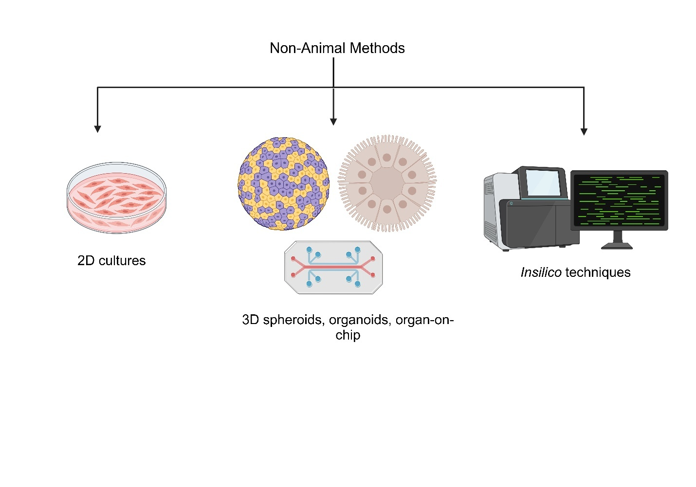

**Chapter 4: Non-animal Methodologies (NAMs) for drug testing**

**4.1 Background (Global and Indian - market size and number of
approvals)**

Animal testing has been the backbone of preclinical studies for drug
development. Both rodent and non-rodent models are used to
assess systemic as well as tissue specific toxicity, efficacy and
pharmacokinetics of a particular drug **1**. For example,
dermal toxicity assessments of a drug involves *invivo* skin irritation
assays in rabbits like the Draize skin irritation
assay2..However, these models often fail to
recapitulate the complexity of human biological systems specifically in
the context of organ-specific toxicity and disease-specific
responses3,4. Only 10% of the drug development
projects make it from phase 1 to
approval5,6,7. This results in delay in
the delivery of safe and effective therapies to patients8.
The animal models fail to recapitulate the complexity of human system
due to species-specific difference in physiology, metabolism and
genetics between animals and human which leads to discrepancies in
data9. For example, the poor translational response of mouse
model to human diseases is due to the complexity of the human disease,
the inbred nature of the mouse model, the use of single mechanistic
models, the differences in cellular composition between mouse and human
tissues **9**. This results in failure of clinical
trials10,11. These challenges emphasize on the
urgent need for innovative and human-centric non-animal testing
platforms.

Because of this, over the last few decades, there have been a number of
global regulatory developments to promote non-animal methodologies. The
main attention has been given to the 3R principles (replacement,
reduction, refinement of animal use) with more focus on tests that
reduce the use of animals .This has been mandated by the Directive
2010/63/EU and seen in the recent EU resolution ([TA
MEF](https://www.europarl.europa.eu/doceo/document/TA-9-2021-0387_EN.pdf))
and actions12,13.

The adoption of Non-Animal Methods or New Approach Methodologies (NAMs)
is revolutionizing the field of drug discovery and toxicity assessment
by offering more human-relevant, ethical and scientifically advanced
alternatives to traditional animal testing14.NAMs leverage
technologies such as 2D invitro cultures, 3D organoids,3D organ-on-chips
and computational modelling to address the limitations of animal testing
(Fig 1). NAMs can reduce animal testing in the non-clinical domain. For
example, in September 2024, FDA’s CDER accepted Emulate Bio’s liver on
chip into their ISTAND (Innovative Science and Technology Approaches for
New Drugs pilot program). The ISTAND Pilot Program accepts submissions
for qualification of types of drug development tools (DDTs) that are out
of scope for existing DDT qualification programs but may still be
beneficial for drug development. This liver on chip can be used to
predict DILI for different therapeutic drugs15.

**Fig 1:** Schematic showing the different Non-Animal Models

The global NAMs testing market size has grown rapidly in recent years. A
report from the business research company published in January 2025
estimated that the NAMs market will grow from \$ 2.33 billion in 2024 to
\$ 2.6 billion in 2025. This growth is due to i) increasing cost of
animal studies ii) increased adoption of such technologies iii)
increased investment towards NAMs iv) increased research grants for NAMs
v) increased social awareness against animal cruelty. 

(<u><https://www.thebusinessresearchcompany.com/report/non-animal-alternatives-testing-global-market-report>
)</u>

Many major pharmaceutical players in the field of NAMs are spin off from
academic institutions. For example, TissUse from Technische University
Berlin, Emulate Bio from Wyss Institute for Biologically Inspired
Engineering in Boston, Mimetas from Leiden University and Nortis from
University of Washington. Other suppliers licensed MPS technologies from
academia. For example, CN Bio licensing the PhysioMimix platform from
the Massachusetts Institute of technology (MIT) in Cambridge, InSphero
licensing the tissue plate platform from the ETH in Zurich and Hesperos
using the technology developed at Cornell University. This indicates a
collaborative approach between academia and industry16**.**

This chapter provides insight into the key global industry players in
NAMs. Some of these global industry players collaborate directly with
international regulatory agencies like US FDA to validate new
approaches. Studying these global industry players is essential because
these technologies can help to align bridge studies conducted by Indian
pharma companies with global regulatory standards making them more
streamlined, scientifically sound and accepted by regulatory agencies.
This chapter lists NAMs and their application in tissue specific
toxicity and efficacy studies with main focus on their strengths,
limitations. This study also lists recommendations for accelerating NAMs
adoption by the Indian pharmaceutical industry, CROs and academicians.

**4.2 Methodology (exact regulations cited and stakeholders consulted)**

A detailed list of major industry players in NAMs was created after
curating the websites of global industry players (attached in
supplementary document 1) which was validated by multiple stakeholders
(Table 1). Recommendations (specifically in an Indian context) for the
adoption of NAMs were made after consulting with these stakeholders. The
detailed methodology listed is as follows: (The flowchart for the
methodology is given in Fig 2)

**4.2.1. Analysing company websites, application notes and
publications**

Detailed information from manufacturers like AxoSim, Tissuse, Emulate
Bio, inSphero, EPISKIN, etc about their products/ technologies were
analyzed. This includes information on tissue-specific applications, the
disease model studied, the endpoints evaluated, type of cells used, the
type of NAMs, etc. Documents containing information on how NAMs are
applied in real-world scenarios including methodologies, protocols and
outcomes for specific use cases like drug toxicity, absorption, and
metabolism studies were collected and reviewed. These documents are
catalogued in specific folders (tissue-wise categorization of folders).
Publications that serve as validation reports, detailing experimental
outcomes and supporting the usage of NAM technologies were analyzed.
Over 122 company websites were curated and over 400 publications were
reviewed and analyzed.

**4.2.2. Compiling a list of industry- players in NAMs for
tissue-specific toxicity**

NAMs based on their application to specific tissues or organs such as
the liver, heart, skin, eye, kidney, intestine, lungs and nervous system
were listed in Supplementary document 1 and in Tables 2-9. The list
included information on whether the model is 2D, 3D or *insilico*, the
type of cells or materials used, and the *invitro* endpoints measured.
The models that meet global regulatory guidelines, e.g., OECD, FDA, and
ICH guidelines were identified ensuring relevance for preclinical
testing and regulatory submissions​​. The names, websites and contact
details of manufacturers, along with any supporting publications or
application notes were included in the list​​.

We have classified these NAMs based on their technology readiness level
(TRL) considering i) their complexity of adoption ii) their overall
impact including cost efficiency, reduction in animal usage iii) status
of their approval by regulatory agencies and iv) their scalability and
usage.

**4.2.3. Engaging stakeholders for input**

We engaged in discussions with key stakeholders to validate and refine
the list of industry players in NAMs. This was a critical step to ensure
their adoption in the Indian market. The stakeholders were consulted to
validate the list as well as provide recommendations to increase
adoption of NAMs in the Indian market. The following group of
stakeholders were consulted (Table 1 shows the details of the
stakeholders consulted):

1.  Pharmaceutical companies

2.  Contract Research Organizations (CROs)

3.  Academicians and researchers

4.  Toxicologists

      **Table 1**: Table showing the details of the stakeholder
consulted:

<table>
<colgroup>
<col style="width: 28%" />
<col style="width: 28%" />
<col style="width: 23%" />
<col style="width: 19%" />
</colgroup>
<thead>
<tr>
<th style="text-align: left;"><blockquote>

<strong>Name of stakeholder</strong>

</blockquote></th>
<th style="text-align: left;"><blockquote>

<strong>Designation</strong>

</blockquote></th>
<th style="text-align: left;"><blockquote>

<strong>Associated organization</strong>

</blockquote></th>
<th><strong>Type of organization</strong></th>
</tr>
</thead>
<tbody>
<tr>
<td style="text-align: left;"><blockquote>

Dr. Viraj Mehta

</blockquote></td>
<td style="text-align: left;">DMPK Scientist, Organoids technology
lab</td>
<td style="text-align: left;"><blockquote>

Sai Lifesciences

</blockquote></td>
<td>CRO</td>
</tr>
<tr>
<td style="text-align: left;"><blockquote>

Dr. Janette Turner

</blockquote></td>
<td style="text-align: left;">Director, Medicines, Research and
toxicology Dept</td>
<td style="text-align: left;"><blockquote>

Humane World for Animals

</blockquote></td>
<td></td>
</tr>
<tr>
<td style="text-align: left;"><blockquote>

Dr. Nirnith Devireddy, Dr. Pranav Karmwar and Dr. Daniel
Röshammar

</blockquote></td>
<td style="text-align: left;">
Dr. Nirnith Devireddy- Founder

Dr. Pranav Karmwar- Chief Scientific Officer

Dr. Daniel Röshammar- Vice President of R&amp;D Dept
</td>
<td style="text-align: left;"><blockquote>

InSilico Minds

</blockquote></td>
<td>CRO</td>
</tr>
<tr>
<td style="text-align: left;"><blockquote>

Dr. Rekha Pal, Dr. Peter Hsu

</blockquote></td>
<td style="text-align: left;">
Dr. Rekha Pal- Senior Director

Dr. Peter Hsu- Director of Business development
</td>
<td style="text-align: left;"><blockquote>

Crown Biosciences

</blockquote></td>
<td>CRO</td>
</tr>
<tr>
<td style="text-align: left;"><blockquote>

Dr. Jugnu Jain

</blockquote></td>
<td style="text-align: left;">Co-founder and CEO</td>
<td style="text-align: left;"><blockquote>

Sapien Biosciences

</blockquote></td>
<td>Biobank and personalised medicine company</td>
</tr>
<tr>
<td style="text-align: left;"><blockquote>

Dr. Rahul Date, Dr. Abhay Deshpande 

</blockquote></td>
<td style="text-align: left;">
Dr. Rahul Date- R&amp;D group
leader

Dr. Abhay Deshpande- Director
</td>
<td style="text-align: left;"><blockquote>

JRF Global

</blockquote></td>
<td>CRO</td>
</tr>
<tr>
<td style="text-align: left;"><blockquote>

Dr. Suresh Poosala

</blockquote></td>
<td style="text-align: left;">Founder and President</td>
<td style="text-align: left;"><blockquote>

OncoSeek Bio Pvt Ltd

</blockquote></td>
<td>CRO</td>
</tr>
<tr>
<td style="text-align: left;"><blockquote>

Dr. Prajakta Dandekar Jain

</blockquote></td>
<td style="text-align: left;">UGC Assistant Professor at Dept of
Pharmaceutical Sciences and Technology (DPST)</td>
<td style="text-align: left;"><blockquote>

ICT, Mumbai

</blockquote></td>
<td>Academic Institution</td>
</tr>
<tr>
<td style="text-align: left;"><blockquote>

Dr. Rajarshi Pal

</blockquote></td>
<td style="text-align: left;">Co-founder and chief scientist</td>
<td style="text-align: left;"><blockquote>

Eyestem

</blockquote></td>
<td>Biotech Startup</td>
</tr>
<tr>
<td style="text-align: left;"><blockquote>

ManojKumar S

</blockquote></td>
<td style="text-align: left;">Co-founder and Chief Executive
Officer</td>
<td style="text-align: left;"><blockquote>

Biodimensions

</blockquote></td>
<td>CRO</td>
</tr>
<tr>
<td style="text-align: left;"><blockquote>

Dr. Nirmala Raju

</blockquote></td>
<td style="text-align: left;">Senior Director, Biosimilars product
development</td>
<td style="text-align: left;"><blockquote>

Dr. Reddy’s laboratories

</blockquote></td>
<td>Pharma company</td>
</tr>
<tr>
<td style="text-align: left;"><blockquote>

Dr. Pushkar Kulkarni

</blockquote></td>
<td style="text-align: left;">Senior Research Scientist</td>
<td style="text-align: left;"><blockquote>

Dr. Reddy’s laboratories

</blockquote></td>
<td>Pharma company</td>
</tr>
<tr>
<td style="text-align: left;"><blockquote>

Dr Madhu Nag, Dr Arumugham Raghunathan

</blockquote></td>
<td style="text-align: left;">
Dr Madhu Nag- Chief Scientific
Officer

Dr Arumugham Raghunathan- Senior director of Business
development
</td>
<td style="text-align: left;"><blockquote>

inSphero

</blockquote></td>
<td>Biotech company</td>
</tr>
<tr>
<td style="text-align: left;"><blockquote>

Dr Sujit Tangadpalliwar

</blockquote></td>
<td style="text-align: left;"><blockquote>

CEO

</blockquote></td>
<td style="text-align: left;"><blockquote>

Biolligence

</blockquote></td>
<td>CRO</td>
</tr>
<tr>
<td style="text-align: left;"><blockquote>

Dr Sivacharan Kollipara

</blockquote></td>
<td style="text-align: left;">Biopharmaceutics head</td>
<td style="text-align: left;"><blockquote>

Dr. Reddy’s laboratories

</blockquote></td>
<td>Pharma company</td>
</tr>
<tr>
<td style="text-align: left;"><blockquote>

Dr Christian Pellevoisin

</blockquote></td>
<td style="text-align: left;">Scientific Director</td>
<td style="text-align: left;"><blockquote>

Mattek Lifesciences

</blockquote></td>
<td>Biotech company</td>
</tr>
<tr>
<td style="text-align: left;"><blockquote>

Dr Lorna Ewart

</blockquote></td>
<td style="text-align: left;">Chief Scientific Officer</td>
<td style="text-align: left;"><blockquote>

Emulate Bio

</blockquote></td>
<td>Biotech company</td>
</tr>
</tbody>
</table>

**Fig 2.** Flowchart for mapping the tissue-specific toxicity using
NAMs.

**4.3. NAMs in toxicity testing and their applications**

In this section we have highlighted the key industry players in NAMs
for tissue specific toxicity studies. Accordingly, the applications of
NAMs have been divided into type of toxicity testing including Dermal,
hepatic, renal, respiratory, CNS, cardiac, intestinal and ocular The
usage of NAMs in these areas are more relevant to humans and can also
lead to a potential reduction in the number of animals being used for
preclinical studies. The detailed list of the industry players is
provided in Supplementary document 1. This document contains details of
the respective companies, the NAMs that are being used to study the
tissue specific toxicity, the in vitro end points being studied, the
application of NAMs, the type of cells being used and the list of
corresponding publications.

**4.3.1. Hepatic toxicity testing**

The animal models to study hepatic toxicity, for example, idiosyncratic
DILI is difficult to reproduce in human. There are species specific
differences in metabolism between mice, rats, monkeys, dogs and humans.
For example, animals express homologs of cytochrome P450 in humans. All
the homologs of P450 do not have the same substrate specificity. While
mice show increased similarity of P450 activity to humans, rats show
less similarity17. This leads to preclinical failure of drugs
and poses a challenge in using animal models for predicting liver
toxicity in humans accurately. Therefore, application of NAMs in hepatic
toxicity testing holds a great potential for the pharma industry in the
drug development field. The *invivo* endpoints for liver toxicity are
DILI assessment. Parameters used to measure these endpoints are blood
biomarkers (ALT, AST, etc.), histopathology and clinical/behavioral
observations. The *invitro* endpoints for liver toxicity are assessment
of DILI by measuring the cell viability, release of hepatic enzymes like
cytochrome P450, measuring the Alanine Aminotransferase (ALT) activity,
Aspartate Aminotransferase (AST) activity and oxidative stress
markers12.

We have identified 26 global industry players in hepatic NAMs. The list
of hepatic NAMs are provided in Table 2 (A detailed list containing
details of the respective companies, the NAMs that are being used to
study the tissue specific toxicity, the *invitro* end points being
studied, the application of NAMs, the type of cells being used and the
list of corresponding publications is provided in Supplementary document
1). The Key regulatory guidelines ensuring the reliability of liver
toxicity studies using NAMs is the FDA Guidance on In Vitro
Methods18.

One of the companies that works in the field of liver NAMs is Emulate
Bio. In September 2024, FDA’s CDER accepted Emulate Bio’s liver on chip
into their ISTAND pilot program. This liver on chip is made of human
hepatocytes, human stellate cells, epithelial cells, extracellular
matrix, immune cells, endothelial cells, endothelial channel and can be
used to predict DILI for different therapeutic drugs. Ewing et al in
2024 has demonstrated the toxicology and pharmacology of cannabidol
(CBD) for the first time using these liver-on-chip systems. By measuring
the levels of ALT, miR-122 and Cyt P450 enzymes using these
micro-physiological systems, they showed the potential of these systems
to translate data into clinical studies15. InSphero, another
company working in the field of liver NAMs have developed liver
microtissues (consisting of primary hepatocytes and non-parenchymal
liver cells) which can be used for DILI prediction. In 2021, InSphero
launched a consortium in collaboration with key pharmaceutical companies
like Pfizer, Sanofi, Merck and Genentech for drug testing to predict
DILI. InSphero in collaboration with FDA NCTR published a study in 2024
where they tested 152 FDA approved drugs for hepatotoxicity using these
microtissues19**.** These studies indicate that these
advanced technologies provide robust tools for evaluating liver toxicity
ensuring safer pharmaceuticals and reducing reliance on animal studies.

To accelerate the adoption of these techniques by Indian pharmaceutical
companies, there is a need to develop scientifically validated sources
of cell lines like primary hepatocytes, human stellate cells, epithelial
cells, endothelial cells, non-parenchymal liver cells and HepG2 cell
lines 20. Therefore, the establishment of indigenous biobank
is necessary in the context of Indian drug development.

**Table 2:** Table listing the industry players in NAMs used for
studying hepatic toxicity.

<table>
<colgroup>
<col style="width: 19%" />
<col style="width: 22%" />
<col style="width: 13%" />
<col style="width: 21%" />
<col style="width: 9%" />
<col style="width: 14%" />
</colgroup>
<thead>
<tr>
<th style="text-align: center;"><strong>In vivo endpoints</strong></th>
<th style="text-align: center;"><strong>In vitro endpoints</strong></th>
<th style="text-align: center;"><strong>Guidelines</strong></th>
<th style="text-align: center;"><strong>Commercially available
NAMs</strong></th>
<th style="text-align: center;"><strong>Type of NAM</strong></th>
<th style="text-align: center;"><strong>Name of the
company</strong></th>
</tr>
</thead>
<tbody>
<tr>
<td rowspan="14">Detection of DILI: Detection and characterization of
hepatic changes (clinical chemistry, In life findings, enzymatic
induction, Liver macroscopic and histopathology)</td>
<td rowspan="14">
Detection of DILI: 1) Albumin production rate, urea
synthesis rate 2) Alanine aminotransferase (ALT), Lactate dehydrogenase
(LDH) activity

3) miR122, cytokines production and stability over time period of 14
days 4) Hepatocellular Necrosis, cell death end points (enzymes,
leakage/ dye exclusion) 5) ATP production assays like CTG assay 6) Liver
phase I/II metabolizing enzymes capability (measure of CYP450 enzymatic
capacity and induction)
</td>
<td rowspan="14">FDA guidance on invitro methods</td>
<td style="text-align: center;">HEPATOMUNE® Cultures </td>
<td style="text-align: center;">2D</td>
<td style="text-align: center;">BioIVT</td>
</tr>
<tr>
<td style="text-align: center;">Gut-liver Multi-chip<a
href="https://cn-bio.com/consumables/multi-chip-plates/physiomimix-dual-organ-plate/"><u> </u></a></td>
<td style="text-align: center;">3D</td>
<td style="text-align: center;">CN Bio</td>
</tr>
<tr>
<td style="text-align: center;">liver on chip</td>
<td style="text-align: center;">3D</td>
<td style="text-align: center;">Emulate Bio</td>
</tr>
<tr>
<td style="text-align: center;">Liver on chip</td>
<td style="text-align: center;">3D</td>
<td style="text-align: center;">Tissuse (HUMIMIC)</td>
</tr>
<tr>
<td style="text-align: center;">InSight™ Liver Safety solutions-
spheroids</td>
<td style="text-align: center;">3D</td>
<td style="text-align: center;">InSphero</td>
</tr>
<tr>
<td style="text-align: center;">invitro liver hepatocytes</td>
<td style="text-align: center;">2D</td>
<td style="text-align: center;">Primacyt</td>
</tr>
<tr>
<td style="text-align: center;">HUREL® Micro Livers- self-assembling
co-cultures (SACCs) of primary hepatocytes</td>
<td style="text-align: center;">3D</td>
<td style="text-align: center;">Visikol</td>
</tr>
<tr>
<td style="text-align: center;">Liver- kidney- intestine- bile duct- on
chip</td>
<td style="text-align: center;">3D</td>
<td style="text-align: center;">AZAR</td>
</tr>
<tr>
<td style="text-align: center;">heart-liver-neuron-skeletal muscle on
chip</td>
<td style="text-align: center;">3D</td>
<td style="text-align: center;">Hesperos</td>
</tr>
<tr>
<td style="text-align: center;">Intestine – Liver – Kidney – Neuro on
chip</td>
<td style="text-align: center;">3D</td>
<td style="text-align: center;">Tissuse (HUMIMIC)</td>
</tr>
<tr>
<td style="text-align: center;">Intestine – Liver – Kidney – Neuro +
Blood-Brain-Barrier on chip</td>
<td style="text-align: center;">3D</td>
<td style="text-align: center;">Tissuse (HUMIMIC)</td>
</tr>
<tr>
<td style="text-align: center;">Lung – Liver on chip</td>
<td style="text-align: center;">3D</td>
<td style="text-align: center;">Tissuse (HUMIMIC)</td>
</tr>
<tr>
<td style="text-align: center;">spheroid (GenuineSelect-TOX)</td>
<td style="text-align: center;">3D</td>
<td style="text-align: center;">PredictCan</td>
</tr>
<tr>
<td style="text-align: center;">HepG2 </td>
<td style="text-align: center;">2D</td>
<td style="text-align: center;">acCELLerate</td>
</tr>
<tr>
<td rowspan="4" style="text-align: center;">
Ultra structural
pathology,

Morphometrics, Histological special strains &amp; antibody
detection
</td>
<td rowspan="4" style="text-align: center;">1) Histology of MPS 2) Drug
metabolizing relevant gene expression levels (mRNA expression levels of
ADME genes and their stability over time) 3) Measuring mitochondrial
metabolism 4) Measuring mitochondrial mass, potential and number of
mitochondria 5) Measuring ROS production 6) Imaging based assays 7)
Measures of daily rates of transporter substrate and bile acid uptake,
metabolism, conjugation, and export in media</td>
<td rowspan="4" style="text-align: center;">FDA guidance on invitro
methods</td>
<td style="text-align: center;">HEPATOPAC Cultures </td>
<td style="text-align: center;">2D</td>
<td style="text-align: center;">BioIVT</td>
</tr>
<tr>
<td style="text-align: center;">iPSC derived hepatocytes (OptiHEP)</td>
<td style="text-align: center;">2D</td>
<td style="text-align: center;">Definigen</td>
</tr>
<tr>
<td style="text-align: center;">invitro liver hepatocytes</td>
<td style="text-align: center;">2D</td>
<td style="text-align: center;">Primacyt</td>
</tr>
<tr>
<td style="text-align: center;">3D Intestine – Liver on chip</td>
<td style="text-align: center;">3D</td>
<td style="text-align: center;">Tissuse (HUMIMIC)</td>
</tr>
<tr>
<td rowspan="10" style="text-align: center;">Clinical signs of toxicity,
Clinical chemistry- AST, ALT,Bilurubin; Organ weights-Liver, Macroscopic
and microscopic evaluation of Liver</td>
<td rowspan="10">1) Oxygen gradients and metabolic zonation for studying
zone specific toxicities 2) Regulated fluidic flow for sampling of media
flow-through for metabolites and biomarkers 3) Study of multicellular
biological interactions, including role of innate and adaptive immune
function on hepatobiliary BA transport Study of immune mediated
idiosyncratic DILI</td>
<td rowspan="10" style="text-align: center;">FDA guidance on invitro
methods</td>
<td style="text-align: center;">iPSC derived hepatocytes (OptiHEP)</td>
<td style="text-align: center;">2D</td>
<td style="text-align: center;">Definigen</td>
</tr>
<tr>
<td style="text-align: center;">InSight™ Liver Safety solutions-
spheroids</td>
<td style="text-align: center;">3D</td>
<td style="text-align: center;">InSphero</td>
</tr>
<tr>
<td style="text-align: center;">HUREL® Micro Livers- self-assembling
co-cultures (SACCs) of primary hepatocytes</td>
<td style="text-align: center;">3D</td>
<td style="text-align: center;">Visikol</td>
</tr>
<tr>
<td style="text-align: center;">LiverChip model cultured in Multi-chip
<a
href="https://cn-bio.com/consumables/multi-chip-plates/physiomimix-liver-plate/"><u>Liver
plates</u></a> by the <a
href="https://cn-bio.com/physiomimix-ooc/"><u>PhysioMimix® OOC</u></a>
range of microphysiological systems</td>
<td style="text-align: center;">3D</td>
<td style="text-align: center;">CN Bio</td>
</tr>
<tr>
<td style="text-align: center;">Human primary hepatocytes</td>
<td style="text-align: center;">2D</td>
<td style="text-align: center;">AnaBios</td>
</tr>
<tr>
<td style="text-align: center;">Javelin Liver Tissue Chip</td>
<td style="text-align: center;">3D</td>
<td style="text-align: center;">Javelin Biotech</td>
</tr>
<tr>
<td style="text-align: center;">Liver-on-chip</td>
<td style="text-align: center;">3D</td>
<td style="text-align: center;">Dynamic 42</td>
</tr>
<tr>
<td style="text-align: center;"><a
href="https://www.eurofinsdiscovery.com/solution/hepatotoxicity">DILI
mechanistic panel</a>, hepatocytes</td>
<td style="text-align: center;">3D</td>
<td style="text-align: center;">Eurofins</td>
</tr>
<tr>
<td style="text-align: center;">Hepatocytes</td>
<td style="text-align: center;">2D</td>
<td style="text-align: center;">JRF Global</td>
</tr>
<tr>
<td style="text-align: center;">Primary Human Hepatocytes or 3D
hLiMTs</td>
<td style="text-align: center;">
Primary Human -2D

hLiMTs-3D
</td>
<td style="text-align: center;">Evotec - Cyprotex</td>
</tr>
</tbody>
</table>

**4.3.2. Renal toxicity testing**

Kidney plays an important role in filtration, reabsorption and
excretion. This makes them highly susceptible to the toxic effects of
drugs. About 19-33% of acute kidney injury cases are due to drug
nephrotoxicity21. Therefore, renal toxicity testing becomes
an essential component of drug safety evaluation. The *invivo* endpoints
to detect renal toxicity for drugs includes urinary volume, specific
gravity, osmolality, pH, fluid/electrolyte balance, proteins, cytology,
evaluation of biomarkers of nephrotoxicity and blood chemistry
determinations such as blood urea nitrogen, creatinine and plasma
proteins (ICH S7A guidelines). These animal studies are expensive, have
low-throughput and are time-consuming and lower human
reproducibility22. Therefore, animal studies to predict renal
toxicity leads to 8% to 9% drug failure in preclinical and clinical
stages of drug development21,**23**. The use of
NAMs for this purpose can provide human-relevant alternatives that
enhance the accuracy of prediction. Evaluation of kidney toxicity using
NAMs includes a wide array of endpoints which include biomarkers of
renal toxicity including urinary total protein, kidney injury molecule-1
(KIM-1), clusterin, β2-microglobulin (β2-MG), cystatin C (CysC), trefoil
factor-3 (TFF-3), renal papillary antigen-1 (RPA-1) and albumin. The
measurement of cell viability, LDH, GSH and ATP can also be used for
studying renal toxicity24. We have identified 8 industry
players in the context of kidney NAMs which have been listed in Table
3. 

The regulatory guidelines like ICH S7A outline the requirements for
safety evaluation emphasizing the kidney toxicity endpoints in
preclinical studies and support the usage of NAMs where
validated25.

A study by Kaluzhny et al showed that EpiKidney from MatTek Lifesciences
can mimic human kidney. EpiKidney consists of human primary proximal
tubular epithelial cells. It expresses the markers for renal clearance,
secretion, and reabsorption. Therefore, it can be used to predict human
nephrotoxicity26. Another study from Mou et al, 2024 showed
that they have successfully built a kidney glomerulus-on-chip that
mimics glomerular morphology and barrier function using biomimetic
ultrathin membrane and human-induced pluripotent stem cells from Emulate
Bio. This chip can be used for modelling human kidney specific
morphogenesis and function27. Somova et al in 2024 developed
a renal cell carcinoma model using TissUse Humimic platform which can
mimic the interplay between healthy and malignant human tissue. They
co-cultured healthy human renal proximal tubule epithelial cells and
renal cell carcinoma spheroids. This co-culture system enabled them to
study host-tumor interactions28.These studies reveal that NAM
technologies can be used for drug-induced nephrotoxicity screening and
studying the PKPD of the drug.

Currently, a major factor which limits the adoption of invitro methods
for renal toxicity is the lack of validated in vitro cell models of the
kidney. Secondly there is a lack of robust markers of kidney toxicity
studies by in vitro methods29. A well-established indigenous
biobank which can provide validated human primary proximal tubular
epithelial cells, human-induced pluripotent stem cells and renal cell
lines can accelerate the development of adoption of NAMs by Indian
pharmaceutical companies.

**Table 3:** Table listing the industry players in NAMs used for
studying renal toxicity.

<table>
<colgroup>
<col style="width: 22%" />
<col style="width: 20%" />
<col style="width: 12%" />
<col style="width: 24%" />
<col style="width: 6%" />
<col style="width: 13%" />
</colgroup>
<thead>
<tr>
<th style="text-align: center;"><strong>In vivo endpoints</strong></th>
<th style="text-align: center;"><strong>In vitro end
points</strong></th>
<th style="text-align: center;"><strong>Guidelines</strong></th>
<th style="text-align: center;"><strong>Commercially available
NAMs</strong></th>
<th style="text-align: center;"><strong>Type of NAM</strong></th>
<th style="text-align: center;"><strong>Name of the
company</strong></th>
</tr>
</thead>
<tbody>
<tr>
<td rowspan="8" style="text-align: center;">Urinary volume, specific
gravity, osmolality, pH, fluid/electrolyte balance, proteins, cytology,
evaluation of biomarkers of nephrotoxicity and blood chemistry
determinations such as blood urea nitrogen, creatinine and plasma
proteins</td>
<td rowspan="8" style="text-align: center;">biomarkers of renal toxicity
including urinary total protein, kidney injury molecule-1 (KIM-1),
clusterin, β2-microglobulin (β2-MG), cystatin C , trefoil factor-3 ,
renal papillary antigen-1 (RPA-1) and albumin</td>
<td rowspan="8" style="text-align: center;">ICHS7A</td>
<td style="text-align: center;">kidney on chip</td>
<td style="text-align: center;">3D</td>
<td style="text-align: center;">Emulate Bio</td>
</tr>
<tr>
<td style="text-align: center;">EpiKidney™ (beta)</td>
<td style="text-align: center;">3D</td>
<td style="text-align: center;">MatTek Life Sciences</td>
</tr>
<tr>
<td style="text-align: center;">Proximal TubuleaProximate™,
aProximate™</td>
<td style="text-align: center;">3D</td>
<td style="text-align: center;">Newcells Biotech</td>
</tr>
<tr>
<td style="text-align: center;">Liver- kidney- intestine-bile duct on a
chip</td>
<td style="text-align: center;">3D</td>
<td style="text-align: center;">AZAR</td>
</tr>
<tr>
<td style="text-align: center;">
human telomerized cells from
different tissues and organs (e.g., Kidney)

RPTEC/TERT1, PODO/SVTERT152, PODO/TERT256
</td>
<td style="text-align: center;">2D</td>
<td style="text-align: center;">Evercyte</td>
</tr>
<tr>
<td style="text-align: center;">Intestine – Liver – Kidney – Neuro on
chip</td>
<td style="text-align: center;">3D</td>
<td style="text-align: center;">Tissuse (HUMIMIC)</td>
</tr>
<tr>
<td style="text-align: center;">Intestine – Liver – Kidney – Neuro +
Blood-Brain-Barrier on chip</td>
<td style="text-align: center;">3D</td>
<td style="text-align: center;">Tissuse (HUMIMIC)</td>
</tr>
<tr>
<td style="text-align: center;">Kidney (glomerulus) – Liver on chip</td>
<td style="text-align: center;">3D</td>
<td style="text-align: center;">Tissuse (HUMIMIC)</td>
</tr>
</tbody>
</table>

**4.3.3. Respiratory toxicity testing**

Respiratory toxicity testing is essential for evaluating the safety of
drugs, chemicals, and environmental pollutants that may impact lung
function. The *invivo* end points used to detect lung toxicity are
respiratory rate and respiratory function (e.g., tidal volume or
hemoglobin oxygen saturation). These include evaluations of both the
total respiratory system and the mechanical properties of the lung (ICH
S7A guidelines). But animal models fail to accurately predict lung
toxicity of drugs. Animal models differ from humans in the deposition
pattern of drugs and also in pathways by which the drug is cleared from
the lungs. This species-specific difference results in drug failure
during the drug development process30. The use of NAMs can
provide an accurate alternative to animal testing. These
*invitro* techniques mimic in vivo lung structure & function and are of
human origin. *Invitro* air-liquid interface (ALI) cell culture models
can potentially be used to assess inhalation toxicology endpoints like
percentage cytotoxicity and release of cytokines (IL-6, IL-8)/chemokines
(MCP-1/CCL2, CXCL1/Groα, CXCL2/Groβ) and trans-epithelial electrical
resistance (TEER)12. The use of NAMs in respiratory toxicity
testing is increasingly supported by regulatory guideline ICH S7A which
emphasizes the importance of safety evaluations that consider
respiratory system toxicity during non-clinical studies25.

We identified 14 global industry players in the context of respiratory
NAMs which have been listed in Table 4 (The detailed list containing
details of the respective companies, the NAMs that are being used to
study the tissue specific toxicity, the in vitro end points being
studied, the application of NAMs, the type of cells being used and the
list of corresponding publications. is provided in Supplementary
document 1). 

AlveoliX’s Lung-on-Chip has been widely used by academicians and CROs
for testing inhalation toxicity. Sengupta et al in 2022 for the first
time reported a primary derived alveolar epithelial cell line
on-chip which represented both Alveolar Type 1 and 2 characteristics.
This AXlung-on-chip from AlveoliX can be used for inhalation toxicity of
drugs and xenobiotics characterization31. Another study
conducted by Cochin et al in 2021 used MucilAir™ from Epithelix to show
that hydroxychloroquine and azithromycin cannot be used as antiviral
drugs against SARS-CoV-2 viral infections. MucilAir™ consists of Basal
cells (progenitor cells), Goblet cells (mucus producing cells), Ciliated
cells (with active cilia). This indicated that MucilAir™ can be used as
a reliable model system to mimic human lung and can be used to study
respiratory disease pathologies32. Burla et al in 2024 showed
that ALIsens®  (consisting of Alveolar cells) from
Invitrolize can identify respiratory toxic compounds. In this study they
have also identified   thymic stromal lymphopoietin receptor (TSLPr)
cell surface marker as a biomarker for predicting respiratory
hazards33. Wallace et al in 2023 has used human and rat
EpiAirway™ consisting tracheal/bronchial epithelial cells available as a
co-culture system with normal stromal fibroblasts, for studying the
inhalation toxicity of therapeutic drugs. The end points for toxicity
measurements were viability by MTT assay, epithelial barrier integrity
(TEER, transepithelial electrical resistance) and tissue morphology.
Their study led to the conclusion that both rat and human EpiAirway™
respond similarly to drugs34. Lung-on-chip from Emulate Bio
has also been used extensively. A study conducted by Si et al in 2021
utilized the lung-on-chip from Emulate Bio which consists of epithelial
and lung-specific endothelial cells to identify antiviral therapeutics
and prophylactics35. These various studies indicate that NAMs
have a potential for screening drugs for inhalation toxicity.

In order to facilitate adoption of these invitro methods for inhalation
toxicity prediction, the cell culture should be done in ALI conditions,
i.e., cultures where cells are grown in direct contact with air
30. Also, there should be an indigenous source of
validated primary derived alveolar epithelial cell, basal cells
(progenitor cells), goblet cells (mucus producing cells), ciliated cells
(with active cilia), tracheal/bronchial epithelial cells and stromal
fibroblasts cells to catalyze the adoption of NAMs by Indian
pharmaceutical companies.

 **Table 4:** Table listing the industry players in NAMs used for
studying respiratory toxicity

| **In vivo endpoints** | **In vitro end points** | **Guidelines** | **Commercially available NAMs** | **Type of NAM** | **Name of the company** |
|:--:|:--:|:--:|:--:|:--:|:--:|
| Respiratory rate, tidal volume, hemoglobin oxygen saturation; Follow up study parameters such as airway resistance, pulmonary arterial pressure, blood gases, Blood pH | Inhalation toxicology endpoints like percentage cytotoxicity and release of cytokines, chemokines and trans epithelial electrical resistance (TEER) | ICH S7A | AXLung-on-Chip System  | 3D | AlveoliX |
|  |  |  | lung on chip | 3D | Emulate Bio |
|  |  |  | MucilAir™- in vitro tissue model of the human upper airway epithelium | 3D | Epithelix |
|  |  |  | MucilAir™-Pool nasal- in vitro tissue model reconstituted with a mix of nasal cells from 14 different healthy human donors | 3D | Epithelix |
|  |  |  | SmallAir™ | 3D | Epithelix |
|  |  |  | ImmuPHAGE™ - an *in vitro* cell model of human alveolar macrophages | 2D | ImmuONE |
|  |  |  | ALIsens- human alveolar *in vitro* models | 3D | Invitrolize |
|  |  |  | EpiAirway™ | 3D | MatTek Life Sciences |
|  |  |  | Human Lung Fibroblasts | 3D | Newcells Biotech |
|  |  |  | Coculture models | 3D | Sabeu |
|  |  |  | invitro cells | 2D | Evercyte |
|  |  |  | Lung – Liver on chip | 3D | Tissuse (HUMIMIC) |
|  |  |  | Lung on a chip model | 3D | SynVivo |
|  |  |  | lung organoid | 3D | Thermo Fisher Scientific |

**4.3.4. Central Nervous System (CNS) toxicity testing**

CNS toxicity testing is a critical component in evaluating the safety of
pharmaceutical compounds particularly those that cross or interact with
the blood-brain barrier (BBB). The *invivo* endpoints used to detect
neurotoxicity of compounds include evaluation of motor activity,
behavioral changes, coordination, sensory/motor reflex responses and
body temperature (ICHS7A guidelines). But these animal models do not
accurately predict human disease. Specific differences in blood-brain
barrier (BBB) permeability, drug metabolizing enzymes and transporters
can lead to differences in drug exposure in the human brain compared to
animals36**.** NAMs can be used for replicating CNS-specific
toxicity thereby providing alternatives to traditional *invivo* methods.
The *invitro* end points include measurement of neurodevelopmental
process at cellular level (e.g., proliferation, migration, neurite
growth, synaptogenesis, myelination, apoptosis) and nervous system
connectivity (e.g. structural, neurochemical, neurophysiological). The
key guidelines include ICH S7A25 and OECD TG 426 which
provides guidelines for Developmental Neurotoxicity (DNT) invitro
battery testing37. 

In our study 20 global industry players in NAMs were identified in the
context of CNS which are listed in Table 5 (The detailed list containing
details of the respective companies, the NAMs that are being used to
study the tissue specific toxicity, the *invitro* end points being
studied, the application of NAMs, the type of cells being used and the
list of corresponding publications. is provided in Supplementary
document 1). 

A number of studies have been conducted globally using AxoSim’s 3D
technologies. For example in a study conducted by Zhong et al in 2020,
they used the brain spheroids consisting of neurons, astrocytes and
microglia to detect the developmental neurotoxicity of Paroxetine which
is a Selective serotonin reuptake inhibitor38. In another
study by Gabriel-Segard et al in 2023, used 2D- invitro iPSC culture
from Neurosetta to build a microfluidic technology to model bilateral
neuro-immunological communication. This model can be used to test drug
compounds along the gut-brain axis39. Another commercial
player is NETRI which produces 3D- Compartmentalized GABAergic &
Glutamatergic Neurons which can be used for detecting developmental
neurotoxicity and drug screening. In 2020, Fantuzzoa et al in his study
showed that these neurons can be used for drug screening
applications40.Such different studies indicate that these
NAMs can be used for studying developmental neurotoxicity and functional
neuronal evaluations.

Though these NAMs are available globally but their adoption by Indian
pharma companies is a challenge. Establishment of an indigenous biobank
which can provide verified iPSC derived neuronal cells, astrocytes and
microglial cells will help to accelerate these NAMs adoption.

**Table 5:** Table listing the industry players in NAMs used for
studying CNS toxicity.

<table style="width:100%;">
<colgroup>
<col style="width: 15%" />
<col style="width: 24%" />
<col style="width: 12%" />
<col style="width: 20%" />
<col style="width: 14%" />
<col style="width: 12%" />
</colgroup>
<thead>
<tr>
<th style="text-align: center;"><strong>In vivo endpoints</strong></th>
<th style="text-align: center;"><strong>In vitro end
points</strong></th>
<th style="text-align: center;"><strong>Guidelines</strong></th>
<th style="text-align: center;"><strong>Commercially available
NAMs</strong></th>
<th style="text-align: center;"><strong>Type of NAM</strong></th>
<th style="text-align: center;"><strong>Name of the
company</strong></th>
</tr>
</thead>
<tbody>
<tr>
<td></td>
<td></td>
<td></td>
<td></td>
<td></td>
<td></td>
</tr>
<tr>
<td rowspan="19" style="text-align: center;">Motor activity,
neuro-behavioural changes, coordination, sensory/ motor reflexes,
undisturbed behavioral observations and invasive tests such as reflex
testing</td>
<td rowspan="19">
Neurodevelopmental process at cellular level:

1) proliferation 2) migration

3) neurite growth 

4) synaptogenesis

5) myelination

6) apoptosis: 7) Differentiation 8) Neural network formation
</td>
<td rowspan="19">ICHS7A, OECD 426- DNT invitro testing battery</td>
<td style="text-align: center;">Organised individual neurons,
neurons-on-chip, NeuroHTS™</td>
<td style="text-align: center;">
Organised individual neurons- 2D,

neurons-on-chip, NeuroHTS™- 3D
</td>
<td style="text-align: center;">Ananda Devices</td>
</tr>
<tr>
<td style="text-align: center;">Vascularized Micro-Brain (VMB™)​</td>
<td style="text-align: center;">3D</td>
<td style="text-align: center;">Aracari Bio</td>
</tr>
<tr>
<td style="text-align: center;">brain-on-chip, brain organoids
(BrainSim, microBrain, NerveSim)</td>
<td style="text-align: center;">3D</td>
<td style="text-align: center;">AxoSim</td>
</tr>
<tr>
<td style="text-align: center;">neural spheroids, neurons, astrocytes,
microglia</td>
<td style="text-align: center;">
neural spheroids- 3D,

neurons, astrocytes, microglia- 2D
</td>
<td style="text-align: center;">BrainXell</td>
</tr>
<tr>
<td style="text-align: center;">brain on chip</td>
<td style="text-align: center;">3D</td>
<td style="text-align: center;">Creatio</td>
</tr>
<tr>
<td style="text-align: center;">neurospheres, hNPC (human neural
progenitor cells)</td>
<td style="text-align: center;">3D</td>
<td style="text-align: center;">DNTOX</td>
</tr>
<tr>
<td style="text-align: center;">Brain on chip</td>
<td style="text-align: center;">3D</td>
<td style="text-align: center;">Emulate Bio</td>
</tr>
<tr>
<td style="text-align: center;">NeuroExir™</td>
<td style="text-align: center;">3D</td>
<td style="text-align: center;">ExirBio</td>
</tr>
<tr>
<td style="text-align: center;">MEPS-BBB- blood brain barrier on
chip</td>
<td style="text-align: center;">3D</td>
<td style="text-align: center;">MEPSGEN</td>
</tr>
<tr>
<td style="text-align: center;">BBB-on-a-chip </td>
<td style="text-align: center;">3D</td>
<td style="text-align: center;">MIMETAS</td>
</tr>
<tr>
<td style="text-align: center;">Ncyte® Neural Mix.</td>
<td style="text-align: center;">3D</td>
<td style="text-align: center;">Ncardia</td>
</tr>
<tr>
<td> Directional Sensory Neurons Projections</td>
<td style="text-align: center;">3D</td>
<td style="text-align: center;">NETRI</td>
</tr>
<tr>
<td style="text-align: center;">Compartmentalized GABAergic &amp;
Glutamatergic Neurons</td>
<td style="text-align: center;">3D</td>
<td style="text-align: center;">NETRI</td>
</tr>
<tr>
<td style="text-align: center;">invitro iPSC culture</td>
<td style="text-align: center;">2D</td>
<td style="text-align: center;">Neurosetta</td>
</tr>
<tr>
<td style="text-align: center;">Human neural organoids</td>
<td style="text-align: center;">3D</td>
<td style="text-align: center;">Stem Pharm</td>
</tr>
<tr>
<td style="text-align: center;">Intestine – Liver – Kidney – Neuro on
chip</td>
<td style="text-align: center;">3D</td>
<td style="text-align: center;">Tissuse (HUMIMIC)</td>
</tr>
<tr>
<td style="text-align: center;">Blood-Brain-barrier – Neuro – Liver on
chip</td>
<td style="text-align: center;">3D</td>
<td style="text-align: center;">Tissuse (HUMIMIC)</td>
</tr>
<tr>
<td style="text-align: center;">heart-liver-neuron-skeletal muscle on
chip</td>
<td style="text-align: center;">3D</td>
<td style="text-align: center;">Hesperos</td>
</tr>
<tr>
<td style="text-align: center;">NMJ on chip</td>
<td style="text-align: center;">3D</td>
<td style="text-align: center;">Hesperos</td>
</tr>
</tbody>
</table>

 

**4.3.5. Cardiotoxicity testing**

Cardiotoxicity of drugs remains a serious concern in drug development
and chemical safety evaluation as adverse effects on the heart can lead
to severe health outcomes including arrhythmias, myocardial dysfunction
and heart failure41.A  large number of *invivo* tests are
routinely   performed to evaluate cardiotoxicity. The *invivo* endpoints
include measurement of blood pressure, heart rate, ECG and follow up
parameters include cardiac output, ventricular contractility and
vascular resistance (ICHS7A, ICHS7B guidelines). But species differences
lead to increasing chance of false positive or false negative prediction
of patient responses42. Therefore, NAMs can be used as an
alternative to animal testing offering human-relevant insights into
cardiac function, electrophysiology and cellular mechanisms of toxicity.
The *invitro* endpoints include measurement of pro-arrythmia risk by
delayed ventricular potential. This can be measured by measuring
the ionic currents in cardiomyocytes, action potential parameters in
isolated cardiac preparations and QT interval. Invitro IKr assays,
ventricular repolarization assays and *invitro* electrophysiology
studies like cardiomyocyte calcium handling transients, contractility,
calcium homeostasis are also measured as *invitro* parameters for
testing of cardiotoxicity (ICHS7B guidelines).The use of NAMs in
cardiotoxicity testing is increasingly supported by key guidelines which
include ICH S7A and S7B which focus on evaluating the potential for
delayed ventricular repolarization (QT interval prolongation) and
associated risks of arrhythmias. It supports the use of *invitro* and
*insilico* models for early hazard identification25,43. An 
initiative to accelerate use of invitro methods for cardiotoxicity
prediction is the FDA Comprehensive In Vitro Proarrhythmia Assay (CiPA)
which recommends combining ion channel assays, hiPSC-derived
cardiomyocytes, and in silico models to predict proarrhythmic risk,
enhancing the reliability of non-animal testing approaches44.

 (<u><https://www.fda.gov/drugs/regulatory-science-action/impact-story-improved-assessment-cardiotoxic-risk-drug-candidates-comprehensive-in-vitro-proarrhythmia>). </u>

We identified 16 key industry players for cardiac NAMs which have been
listed in Table 6 (The detailed list containing details of the
respective companies, the NAMs that are being used to study the tissue
specific toxicity, the in vitro end points being studied, the
application of NAMs, the type of cells being used and the list of
corresponding publications. is provided in Supplementary document 1).

In 2024, Axion Biosystems launched the new [Maestro
Volt](https://www.axionbiosystems.com/products/mea/maestro-volt)™
which serves as an affordable benchtop microelectrode array (MEA)
system. It can therefore meet the demands of academic labs with limited
budgets. In the field of cardiac NAMs, Axol Biosciences have also made a
significant progress. In a study conducted in 2021 by Kanade at al, they
used cardiomyocytes from Axol biosciences to determine the effect of
hypothermia on mechano-physiology and electrophysiology of
heart45. Another global player, Ncardia in January 2025
announced the launch of Ncyte® Heart in a Box which is a
robust platform to study heart development. These studies imply that
NAMs can be applied in the context of drug-induced cardiotoxicity
screening, investigating cellular and molecular pathways involved in
cardiotoxicity. 

In order to facilitate the adoption of these NAMs by Indian
pharmaceutical companies, there should be an indigenous source of
validated cell lines and iPSC derived cardiomyocytes.

**Table 6:** Table listing the industry players in NAMs used for
studying cardiac toxicity.

<table>
<colgroup>
<col style="width: 20%" />
<col style="width: 16%" />
<col style="width: 11%" />
<col style="width: 20%" />
<col style="width: 20%" />
<col style="width: 11%" />
</colgroup>
<thead>
<tr>
<th style="text-align: center;"><strong>In vivo endpoints</strong></th>
<th style="text-align: center;"><strong>In vitro endpoints</strong></th>
<th style="text-align: center;"><strong>Guidelines</strong></th>
<th style="text-align: center;"><strong>Commercially available
NAMs</strong></th>
<th style="text-align: center;"><strong>Type of NAM</strong></th>
<th style="text-align: center;"><strong>Name of the
company</strong></th>
</tr>
</thead>
<tbody>
<tr>
<td rowspan="14" style="text-align: center;">Blood pressure, Heart rate,
ECG; Follow up parameters:Cardiac output, ventricular contractility,
vascular resistance</td>
<td rowspan="14">
Delayed ventricular potential (pro-arythmia risk)
measured via the following: 1) Ionic currents in cardiomyocytes

2)Action potential parameters in isolated cardiac preparations

3)Proarrhythmic effects measured in isolated cardiac preparations (QT
interval). 
</td>
<td rowspan="14" style="text-align: center;">
1. ICH S7A

2. ICH S7B
</td>
<td style="text-align: center;">Cardiac organoid</td>
<td style="text-align: center;">3D</td>
<td style="text-align: center;">4DCell</td>
</tr>
<tr>
<td style="text-align: center;">heart on chip (uHeart)</td>
<td style="text-align: center;">3D</td>
<td style="text-align: center;">BiomimX</td>
</tr>
<tr>
<td style="text-align: center;">Engineered heart tissue (EHT), 2D heart
model, Celo.Cardiomyocytes</td>
<td style="text-align: center;">Engineered heart tissue (EHT)- 3D, 2D
heart model, Celo.Cardiomyocytes- 2D</td>
<td style="text-align: center;">Curi Bio</td>
</tr>
<tr>
<td style="text-align: center;">Cardiac organoid</td>
<td style="text-align: center;">3D</td>
<td style="text-align: center;">Foresee Biosystems</td>
</tr>
<tr>
<td style="text-align: center;">FLEXcyte 96 technology- growing  invitro
iPSC derived cardiomyocytes</td>
<td style="text-align: center;">2D</td>
<td style="text-align: center;">Innovitro</td>
</tr>
<tr>
<td style="text-align: center;">CardioExcyte 96- growing  invitro
non-contractile, such as hepatic or cancer cells, alongside contractile
cardiac cells.</td>
<td style="text-align: center;">2D</td>
<td style="text-align: center;">Innovitro</td>
</tr>
<tr>
<td style="text-align: center;">Ncyte® vCardiomyocytes, Ncyte®
aCardiomyocytes</td>
<td style="text-align: center;">2D</td>
<td style="text-align: center;">Ncardia</td>
</tr>
<tr>
<td style="text-align: center;">heart-liver on a chip</td>
<td style="text-align: center;">3D</td>
<td style="text-align: center;">Hesperos</td>
</tr>
<tr>
<td style="text-align: center;">heart-liver-neuron-skeletal muscle on
chip</td>
<td style="text-align: center;">3D</td>
<td style="text-align: center;">Hesperos</td>
</tr>
<tr>
<td style="text-align: center;">Cardio – Liver on chip</td>
<td style="text-align: center;">3D</td>
<td style="text-align: center;">Tissuse (HUMIMIC)</td>
</tr>
<tr>
<td style="text-align: center;">The <a
href="https://axionbiosystems.com/products/mea/maestro-pro"><u>Maestro
Pro</u></a> and <a
href="https://axionbiosystems.com/products/mea/maestro-edge"><u>Edge</u></a>
MEA systems</td>
<td style="text-align: center;"></td>
<td style="text-align: center;">Axion biosystems</td>
</tr>
<tr>
<td style="text-align: center;">Atrial cardiomyocytes</td>
<td style="text-align: center;">2D</td>
<td style="text-align: center;">Axol Bioscience</td>
</tr>
<tr>
<td style="text-align: center;">Ventricular cardiomyocytes</td>
<td style="text-align: center;">2D</td>
<td style="text-align: center;">Axol Bioscience</td>
</tr>
<tr>
<td style="text-align: center;">TrueCardium® Cardiac Organoids</td>
<td style="text-align: center;">3D</td>
<td style="text-align: center;">inSphero</td>
</tr>
</tbody>
</table>

**4.3.6. Intestinal toxicity testing**

The intestinal tract plays a critical role in nutrient absorption,
metabolism and barrier defense making it highly susceptible to toxicity
from pharmaceuticals, chemicals and environmental agents. Animal models
are used to study intestinal toxicity endpoints like gastric secretion,
gastrointestinal injury potential, bile secretion, transit time
*invivo*, ileal contraction in vitro, gastric pH measurement **(**ICHS7A
guidelines). The *invivo* testing methods are costly and not
translationally relevant due to species differences leading to failure
of clinical trials. NAMs can provide an alternative *invitro* platform
to test drugs for intestinal toxicity. The endpoints NAMs can be used to
study are barrier function, drug absorption, metabolism and drug
transport. Global regulatory guidelines that support the integration of
NAMs in intestinal toxicity studies are ICH S7A which emphasizes the
importance of safety evaluations that consider intestinal toxicity
during non-clinical studies25.

We identified 8 global industry players for intestinal NAMs which are
listed in Table 7 (The detailed list containing details of the
respective companies, the NAMs that are being used to study the tissue
specific toxicity, the in vitro end points being studied, the
application of NAMs, the type of cells being used and the list of
corresponding publications. is provided in Supplementary document 1).

The RepliGut systems consisting of human primary intestinal epithelial
cells from Altis Biosystems has been used extensively for studying drug
metabolism, e.g., in 2019, study conducted by Speer at al used this
technology to study the pharmacokinetics of drugs46. Ozkan et
al, 2024 used colon-on-chip from Emulate Bio which consists of
biopsy-derived colonoids and colonic endothelial cells to study the
drivers of Inflammatory Bowel Disease (IBD) where they studied the
effect of carcinogens on colon cancer progression and effect of female
hormones on IBD syndrome47. Another study by Simon et al,
2019 studied the effect of interleukin-6 on the drug metabolizing
enzymes and ABC transporters using EpiIntestinal™- 3D (consists of
enterocytes, Paneth cell, M cells, tuft cells and intestinal stem cells)
from MatTek Lifesciences48.These studies proved that these
alternative technologies can be applied for drug-induced toxicity
screening and pharmacokinetics of drug.

Establishment of an indigenous cell repository to provide as a source
for validated primary intestinal epithelial cells, enterocytes, Paneth
cells, intestinal stem cells and colonic endothelial cells is crucial to
accelerate the adoption of NAMs by Indian pharmaceutical companies.

**Table 7:** Table listing the industry players in NAMs used for
studying intestinal toxicity.

| **In vivo endpoints** | **In vitro endpoints** | **Guidelines** | **NAMs** | **Type of NAM** | **Name of the company** |
|----|----|----|----|----|----|
|  |  |  |  |  |  |
| Gastric secretion, gastrointestinal injury potential, bile secretion, transit time in vivo, ileal contraction in vitro, gastric pH measurement | Permeability, barrier function, Drug absorption, metabolism, drug transport | ICH S7A | Human primary intestinal epithelial cell model systems, RepliGut Systems | 2D | Altis Biosystems |
|  |  |  | colon-intestine chip | 3D | Emulate Bio |
|  |  |  | Duodenum intestine chip | 3D | Emulate Bio |
|  |  |  | Colon-on-a-plate®- in vitro simulation of the physiology and microbiology of the colon, SHIME®, Diamod® | 3D | Prodigest |
|  |  |  | EpiIntestinal™  | 3D | MatTek Life Sciences |
|  |  |  | Intestine – Liver on chip | 3D | Tissuse (HUMIMIC) |
|  |  |  | Intestine – Liver – Kidney – Neuro on chip | 3D | Tissuse (HUMIMIC) |
|  |  |  | Intestine – Liver – Kidney – Neuro + Blood-Brain-Barrier on chip | 3D | Tissuse (HUMIMIC) |

**4.3.7. Dermal toxicity testing**

The use of animal testing like the Draize skin test for testing of skin
irritation has limitations like a large variation in test results and
species-difference between rabbit and human2. Alternatives to
animal testing of dermal toxicity are designed to measure a range of
biological endpoints which are critical to understand the effects of
chemicals and drugs on human skin. These include evaluating skin
irritation, corrosion and sensitization. These endpoints can be
validated by measuring cell viability, histopathology and cytokine
release. International regulatory agencies have established
comprehensive guidelines to ensure the reliability and validity of
non-animal testing methods. OECD guidelines like OECD TG 431 and TG 439
permit the use of NAMs for chemical testing for invitro skin corrosion,
sensitization and irritation. OECD has validated five skin models:
SkinEthic RHE, Episkin, EpiDermTM, EPI-MODEl-24, and
epiCS®9. 

We have identified 23 global industry players in dermal NAMs. List of
global industry players in dermal NAMs are listed in Table 8.

A study by Fusco et al states that OECD TG 439 validated SkinEthic™
Reconstructed human Epidermis (RhE) consisting of human keratinocytes
can also be used for graphene-based materials (GBM). SkinEthic™ was used
in this study to predict the skin irritation potential of GBMs using MTT
assay and measuring cytokine release like IL-6, IL-8,
IL-1α49. In a study by Kojima et al in 2012, 25 chemicals
were tested for their dermal toxicity using LabCyte EPI-MODEL24
consisting of human epidermal keratinocytes. MTT assay and IL-1α
measurements were done using the model and the data generated was
accurate and highly reproducible between different
laboratories50. Similarly, the skin irritation test (SIT)
method for epiCS® was done for substances to distinguish them as
irritants and non-irritants by exposing the tissues to the substance for
20 mins followed by a MTT assay. The validation of the SIT method was
done by EURL-ECVAM and was incorporated into OECD TG 43951.
Since the RhE closely mimics the histological, morphological,
biochemical and physiological properties of the upper parts of the human
skin, i.e. the epidermis, these invitro models can provide to be an
alternative to animal testing while ensuring high compliance with global
regulatory standards. They are important for the development of safer
cosmetics and pharmaceuticals. RhE models can be used for measuring in
vitro drug release (IVRT) and in vitro drug permeation testing (IVPT) in
pharma industries52**.**

In order to ensure adoption of these NAMs in the Indian pharmaceutical
context, there should be collaborative work among academia, industry,
and regulatory agencies in the pharmaceutical community53.
Also, establishment of biobanks which can provide a source of human
epidermal keratinocytes and primary dermal cells can also act as the
driving force to facilitate the adoption of these NAMs.

**Table 8:** Table listing the industry players in NAMs used for
studying dermal toxicity

<table>
<colgroup>
<col style="width: 16%" />
<col style="width: 16%" />
<col style="width: 28%" />
<col style="width: 14%" />
<col style="width: 11%" />
<col style="width: 12%" />
</colgroup>
<thead>
<tr>
<th style="text-align: center;"><strong>Parameters / End points of In
vivo studies</strong></th>
<th style="text-align: center;"><strong>Parameters/ in vitro end
points</strong></th>
<th style="text-align: center;"><strong>Guidelines</strong></th>
<th style="text-align: center;"><strong>Commercially available
NAMs</strong></th>
<th style="text-align: center;"><strong>Type of NAM</strong></th>
<th style="text-align: center;"><strong>Name of the
company</strong></th>
</tr>
</thead>
<tbody>
<tr>
<td rowspan="11" style="text-align: center;">Skin
irritation/corrosion</td>
<td rowspan="11" style="text-align: center;">Skin
irritation/corrosion</td>
<td rowspan="11" style="text-align: center;">OECD TG 404, 431, 439 (Skin
corrosion/irritaion)</td>
<td style="text-align: center;">SkinEthic TM RHE , EPISKIN TM</td>
<td style="text-align: center;">3D</td>
<td style="text-align: center;">EPISKIN</td>
</tr>
<tr>
<td style="text-align: center;">Reconstructed human epidermis</td>
<td style="text-align: center;">3D</td>
<td style="text-align: center;">Scantox</td>
</tr>
<tr>
<td style="text-align: center;">Reconstructed human epidermis</td>
<td style="text-align: center;">3D</td>
<td style="text-align: center;">SenzaGen</td>
</tr>
<tr>
<td style="text-align: center;">Skin models using reconstructed human
tissues</td>
<td style="text-align: center;">3D</td>
<td style="text-align: center;">XCellR8</td>
</tr>
<tr>
<td style="text-align: center;">organoids (Skimune® AD, Skimune® Epi
AD)</td>
<td style="text-align: center;">3D</td>
<td style="text-align: center;">Alcyomics</td>
</tr>
<tr>
<td style="text-align: center;">EpiDermTM </td>
<td style="text-align: center;">3D</td>
<td style="text-align: center;">MatTek Life Sciences</td>
</tr>
<tr>
<td style="text-align: center;">Xenoskin H discs - ex vivo full
thickness skin explants</td>
<td style="text-align: center;">3D</td>
<td style="text-align: center;">Xenometrix</td>
</tr>
<tr>
<td style="text-align: center;">skin on chip</td>
<td style="text-align: center;">3D</td>
<td style="text-align: center;">Tissuse (HUMIMIC)</td>
</tr>
<tr>
<td style="text-align: center;">SURFACE (skin ubiome Reconstruction for
Assessment of Cutaneous Effects), </td>
<td style="text-align: center;">3D</td>
<td style="text-align: center;">Draper</td>
</tr>
<tr>
<td style="text-align: center;">Labcyte EPI-MODEl-24</td>
<td style="text-align: center;">3D</td>
<td style="text-align: center;">J-TEC</td>
</tr>
<tr>
<td style="text-align: center;">epiCS®</td>
<td style="text-align: center;">3D</td>
<td style="text-align: center;">SkinInVitro GmbH</td>
</tr>
<tr>
<td rowspan="8" style="text-align: center;">
Skin sensitization
studies

<table>
<colgroup>
<col style="width: 100%" />
</colgroup>
<thead>
<tr>
<th rowspan="2"></th>
</tr>
<tr>
</tr>
</thead>
<tbody>
</tbody>
</table></td>
<td rowspan="10" style="text-align: center;">Skin sensitization
studies</td>
<td rowspan="10" style="text-align: center;">OECD 406 (Skin
Sensitization)</td>
<td style="text-align: center;">3D skin models</td>
<td style="text-align: center;">3D</td>
<td style="text-align: center;">Keratify</td>
</tr>
<tr>
<td style="text-align: center;">keratinocyte cell lines KeratinoSens®
and LuSens</td>
<td style="text-align: center;">2D</td>
<td style="text-align: center;">acCELLerate</td>
</tr>
<tr>
<td style="text-align: center;">skin-on-a-chip</td>
<td style="text-align: center;">3D</td>
<td style="text-align: center;">Ten Bio</td>
</tr>
<tr>
<td style="text-align: center;">Skin-on-chip</td>
<td style="text-align: center;">3D</td>
<td style="text-align: center;">Vitrocell</td>
</tr>
<tr>
<td style="text-align: center;">Reconstructed human epidermis</td>
<td style="text-align: center;">3D</td>
<td style="text-align: center;">Scantox</td>
</tr>
<tr>
<td style="text-align: center;">organoids (Skimune® AD, Skimune® Epi
AD)</td>
<td style="text-align: center;">3D</td>
<td style="text-align: center;">Alcyomics</td>
</tr>
<tr>
<td style="text-align: center;">Reconstructed human epidermis</td>
<td style="text-align: center;">3D</td>
<td style="text-align: center;">XCellR8</td>
</tr>
<tr>
<td style="text-align: center;">Reconstructed human epidermis,
GARDskin</td>
<td style="text-align: center;">3D</td>
<td style="text-align: center;">SenzaGen</td>
</tr>
<tr>
<td rowspan="2" style="text-align: center;"></td>
<td style="text-align: center;">Skin including dermal papillae on
chip</td>
<td style="text-align: center;">3D</td>
<td style="text-align: center;">Tissuse (HUMIMIC)</td>
</tr>
<tr>
<td style="text-align: center;">SURFACE (skin ubiome Reconstruction for
Assessment of Cutaneous Effects)</td>
<td style="text-align: center;">3D</td>
<td style="text-align: center;">Draper</td>
</tr>
<tr>
<td rowspan="8" style="text-align: center;">Skin absorption</td>
<td rowspan="8" style="text-align: center;">Skin absorption</td>
<td rowspan="8" style="text-align: center;">OECD 428 (Skin
absorption)</td>
<td style="text-align: center;">in-vitro skin tissues, skin discs and
dermatomed skin, </td>
<td style="text-align: center;">
in-vitro skin tissues-2D;

skin discs and dermatomed skin-3D
</td>
<td style="text-align: center;">Primacyt</td>
</tr>
<tr>
<td style="text-align: center;">Xenoskin H discs - ex vivo full
thickness skin explants</td>
<td style="text-align: center;">3D</td>
<td style="text-align: center;">Xenometrix</td>
</tr>
<tr>
<td style="text-align: center;">invitro skin models</td>
<td style="text-align: center;">2D</td>
<td style="text-align: center;">DTL (Dermal tech lab)</td>
</tr>
<tr>
<td style="text-align: center;">Reconstructed human epidermis</td>
<td style="text-align: center;">3D</td>
<td style="text-align: center;">SenzaGen</td>
</tr>
<tr>
<td style="text-align: center;">frozen full thickness skin</td>
<td style="text-align: center;">3D</td>
<td style="text-align: center;">Xenometrix</td>
</tr>
<tr>
<td style="text-align: center;">in vitro skin tissues</td>
<td style="text-align: center;">3D</td>
<td style="text-align: center;">PKDERM</td>
</tr>
<tr>
<td style="text-align: center;">Reconstructed human epidermis,
GARDskin</td>
<td style="text-align: center;">3D</td>
<td style="text-align: center;">SenzaGen</td>
</tr>
<tr>
<td style="text-align: center;">SkinEthic RHE / Human Epidermis</td>
<td style="text-align: center;">3D</td>
<td style="text-align: center;">EPISKIN</td>
</tr>
<tr>
<td rowspan="7" style="text-align: center;">Photo toxicity testing</td>
<td rowspan="7" style="text-align: center;">Photo toxicity testing</td>
<td rowspan="7" style="text-align: center;">
ICH guideline S10:

Guidance on photosafety evaluationof pharmaceuticals

(EMA/CHMP/ICH/752211/2012)
</td>
<td style="text-align: center;">EpiDermTM </td>
<td style="text-align: center;">3D</td>
<td style="text-align: center;">MatTek Life Sciences</td>
</tr>
<tr>
<td style="text-align: center;">skin-on-a-chip</td>
<td style="text-align: center;">3D</td>
<td style="text-align: center;">Tenskin</td>
</tr>
<tr>
<td style="text-align: center;">SkinEthic RHE / Human Epidermis</td>
<td style="text-align: center;">3D</td>
<td style="text-align: center;">EPISKIN</td>
</tr>
<tr>
<td style="text-align: center;">Reconstructed human epidermis</td>
<td style="text-align: center;">3D</td>
<td style="text-align: center;">Scantox</td>
</tr>
<tr>
<td style="text-align: center;">EpiDermTM FT</td>
<td style="text-align: center;">3D</td>
<td style="text-align: center;">MatTek Life Sciences</td>
</tr>
<tr>
<td style="text-align: center;">skin tumor on chip</td>
<td style="text-align: center;">3D</td>
<td style="text-align: center;">Tissuse (HUMIMIC)</td>
</tr>
<tr>
<td style="text-align: center;">FibroExir™</td>
<td style="text-align: center;">3D</td>
<td style="text-align: center;">ExirBio</td>
</tr>
<tr>
<td style="text-align: center;">Photoallergy or dermal
phototoxicity</td>
<td style="text-align: center;">Photoallergy or dermal
phototoxicity</td>
<td style="text-align: center;">NDCT guidelines</td>
<td style="text-align: center;">Phenion® FT Skin Model</td>
<td style="text-align: center;">3D</td>
<td style="text-align: center;">Phenion</td>
</tr>
</tbody>
</table>

**4.3.8. Ocular toxicity testing**

Evaluating the safety of drugs and chemicals on eye is essential as
these may come into direct or indirect contact with our eyes. The
*invivo* models are used to measure endpoints like ocular corrosion,
irritation, sensitivity, absorption and phototoxicity. Parameters used
to measure ocular corrosion and irritation are tests that evaluates the
degree of eye irritation or corrosion by scoring lesions on the cornea,
iris, and conjunctiva. The animal models perform poorly to translate to
human studies. For example, Draize test is not reliable because of the
fundamental anatomical differences between the human and rabbit eye.
This highlights the disadvantages of in-vivo test over invitro
alternative. (Stephen R. Kaufman, M.D.). Thus, we should encourage the
usage of vitro technologies as an alternative to the *invivo* tests.
NAMs can act as robust tools for ocular safety assessments offering
human-relevant insights into toxicity mechanisms while reducing reliance
on animal testing. The *invitro* endpoints of ocular corrosion an
irritation can be measured using cell viability assays (MTT assays).
These technologies can be used for evaluating the irritancy potential of
pharmaceuticals, cosmetics and industry chemicals. The regulatory
guidelines that promote alternative methods include OECD TG 496, 498
which specifies the use of reconstructed human corneal epithelial
models, such as EpiOcular™ and SkinEthic™ HCE for assessing eye
irritation and serious eye damage54,55.

In our study we have identified 7 global industry players in the field
of ocular NAMs which have been listed in Table 9 (The detailed list
containing details of the respective companies, the NAMs that are being
used to study the tissue specific toxicity, the in vitro end points
being studied, the application of NAMs, the type of cells being used and
the list of corresponding publications. is provided in Supplementary
document 1).

In 2009, Pauly et al, studied the toxic effect of Benzalkonium Chloride
on eye using EpiSkin’s SkinEthicTM HCE - Human Corneal
Epithelium56 consisting of human corneal epithelium. Lebrun
labs in 2019 conducted a study using OptiSafeTM EIT3to develop a
prediction model for classifying irritants on the basis of in vitro
histopathology studies. They used 16 different chemicals based on
Globally Harmonized System (GHS) and U.S. Environmental Protection
Agency  (EPA) classification systems57.Therefore, these
technologies can be applied for eye irritancy testing, drug-induced
ocular toxicity testing and permeability and absorption studies.

Establishment of an indigenous cell repository which will provide
validated human corneal epithelial cells is crucial to accelerate the
adoption of NAMs by Indian pharmaceutical companies.

**Table 9:** Table listing the industry players in NAMs used for
studying ocular toxicity

| **In vivo endpoints** | **Invitro endpoints** | **Guidelines** | **Commercially available NAMs** | **Type of NAM** | **Name of the company** |
|:--:|:--:|:--:|:--:|:--:|:--:|
| Ocular corrosion and irritation assay | Ocular corrosion and irritation assay | OECD TG 405,496 | SkinEthicTM HCE - Human Corneal Epithelium, Statens Seruminstitut Rabbit Cornea (SIRC) cells | 2D | EPISKIN |
|  |  |  | EpiOcularTM | 3D | Mattek Life Sciences |
|  |  |  | Retinal organoids, Retinal Pigment Epithelium | 3D | Newcells Biotech |
|  |  |  | OptiSafeTM EIT | 3D | LEBRUN labs |
| Ocular Sensitization assay | Ocular Sensitization assay | NA | Reconstructed Human Cornea -like epithelium | 3D | XCellR8 |
| Ocular Absorption assay | Ocular Absorption assay | OECD TG 437 | 3D skin tissue | 3D | Scantox |
| Ocular Phototoxicity test  | Ocular Phototoxicity test  | OECD TG 498 | Reconstructed Human Cornea -like epithelium | 3D | XCellR8 |

Based on the analysis of industry- players involved in NAMs, we have
quantified the presence of industry players within the context of
tissue-specific toxicity studies. Of the 122 NAMs evaluated, the highest
number are utilized for studying dermal toxicity (23) and hepatic
toxicity (26). In addition to these, NAMs are also employed for toxicity
assessments of other tissues, including ocular, renal, respiratory,
intestinal, central nervous system (CNS), and cardiac toxicity, as
summarized in Table 10 and illustrated in Figure 3.

**Table 10:** Table quantifying the number of industry- players in NAMs
used for studying tissue-specific toxicity.

| **Tissue-specific toxicity** | **Number of industry players in NAMs** |
|:----------------------------:|:--------------------------------------:|
|            Dermal            |                   23                   |
|           Hepatic            |                   26                   |
|    Central nervous system    |                   20                   |
|        Cardiovascular        |                   16                   |
|            Ocular            |                   7                    |
|         Respiratory          |                   14                   |
|          Intestine           |                   8                    |
|            Renal             |                   8                    |

  
  
  
**Fig 3:** Bar graph showing the number of industry players in NAMs in
different tissue-specific toxicity testing

**4.4. Case studies of NAMs in efficacy assessment and precision
medicine**

**4.4.1. Rare diseases**

Rare diseases present an interesting area to use human-relevant
technologies as several challenges are associated with rare disease
therapeutics, with animal models either unavailable or often failing as
preclinical test systems and providing limited insights regarding their
biological mechanisms. Currently, there are no approved treatments for
95% of rare diseases. NAMs are being used in two domains of drug
development for rare diseases: nonclinical research (efficacy testing)
and precision medicine (Table 11).

**Table 11:** Table listing the NAMs in efficacy testing in nonclinical
research and precision medicine

<table>
<colgroup>
<col style="width: 14%" />
<col style="width: 0%" />
<col style="width: 15%" />
<col style="width: 7%" />
<col style="width: 5%" />
<col style="width: 11%" />
<col style="width: 0%" />
<col style="width: 24%" />
<col style="width: 0%" />
<col style="width: 20%" />
</colgroup>
<thead>
<tr>
<th colspan="10" style="text-align: center;"><strong>Nonclinical
Research</strong></th>
</tr>
</thead>
<tbody>
<tr>
<td colspan="2" style="text-align: left;"><strong>Name of the rare
disease</strong></td>
<td colspan="2" style="text-align: left;"><strong>NAM used</strong></td>
<td colspan="2" style="text-align: left;"><strong>Name of the
drug</strong></td>
<td colspan="3" style="text-align: left;"><strong>Description of the
usage</strong></td>
<td style="text-align: left;"><strong>Reference</strong></td>
</tr>
<tr>
<td colspan="2" style="text-align: left;"><strong>Chronic inflammatory
demyelinating polyneuropathy (CIDP)</strong></td>
<td colspan="2" style="text-align: left;">Human-on-a-chip model of
peripheral motoneuron conduction velocity.</td>
<td colspan="2" style="text-align: left;">Sutimlimab (SAR-445088;
formerly BIVV-020), a humanised anti-C1s monoclonal antibody</td>
<td colspan="3" style="text-align: left;">
<strong>Efficacy
testing</strong>

This was one of the first cases in 2023 where an IND application was
approved for conducting clinical trials based on efficacy data purely
generated from CIVM. 
</td>
<td style="text-align: left;"><a
href="https://doi.org/10.1016/j.devcel.2021.04.004">Rumsey et al
2022</a><u>58</u></td>
</tr>
<tr>
<td colspan="2" style="text-align: left;"><strong>Cystic
fibrosis</strong></td>
<td colspan="2" style="text-align: left;">In vitro models of the
different CFTR mutations in Fisher rat thyroid cell lines. These cells
were then treated with ivacaftor and assessed with Ussing chamber
electrophysiology</td>
<td colspan="2" style="text-align: left;">ivacaftor</td>
<td colspan="3" style="text-align: left;">
<strong>Extension of
pharmaceutical approval</strong>

In 2017, the FDA granted expanded approval to Vertex Pharmaceuticals’
cystic fibrosis (CF) drug ivacaftor on the basis of in vitro data. The
change adds 23 mutations in the cystic fibrosis transmembrane
conductance regulator (CFTR) gene to the existing 10 mutations
previously covered by the drug label, representing a further ~900
patients in the United States
</td>
<td style="text-align: left;"><a
href="https://doi.org/10.1007/s12551-021-00841-6#:~:text=In%20vitro%20data%20can%20be,diseases%20such%20as%20cystic%20fibrosis.">Kingwell,
2017</a>59</td>
</tr>
<tr>
<td colspan="10" style="text-align: center;"><strong>Clinical Research
(Efficacy testing and precision medicine)</strong></td>
</tr>
<tr>
<td style="text-align: left;"><strong>Rare disease</strong></td>
<td colspan="2" style="text-align: left;">
<strong>ClinicalTrials.gov
ID/</strong>

<strong>EudraCT Number</strong>
</td>
<td colspan="2" style="text-align: left;"><strong>Name of the
Project</strong></td>
<td colspan="2" style="text-align: left;"><strong>Start
Date/Status</strong></td>
<td
style="text-align: left;"><strong>Interventional/Observational</strong></td>
<td colspan="2" style="text-align: left;"><strong>Usage of
organoids/iPSCs in the clinical trials</strong></td>
</tr>
<tr>
<td style="text-align: left;"><strong>CF</strong></td>
<td colspan="2" style="text-align: left;">NCT06468527</td>
<td colspan="2" style="text-align: left;">Clinical Trial to Evaluate the
Efficacy and Safety of Dirocaftor/​Posenacaftor/​Nesolicaftor in Adults
With CF (CHOICES)</td>
<td colspan="2" style="text-align: left;">Ongoing</td>
<td style="text-align: left;">Interventional:
Dirocaftor/​Posenacaftor/​Nesolicaftor</td>
<td colspan="2" style="text-align: left;">(i)Performing a two-step
approach, where in the first step, novel CFTR modulators/combinations
were tested on organoids from over 500 European and Israeli CF patients
with rare CFTR mutations to identify patients predicted to clinically
benefit from these treatments. The second step will evaluate the
predicted clinical effect in subjects identified by their organoid
response.</td>
</tr>
<tr>
<td style="text-align: left;"><strong>CF</strong></td>
<td colspan="2" style="text-align: left;">
2016-001619-19

(Netherlands - Competent Authority)
</td>
<td colspan="2" style="text-align: left;">Genistein as an add-on
treatment for CF?</td>
<td colspan="2" style="text-align: left;">Ongoing</td>
<td style="text-align: left;">Interventional: Genistein</td>
<td colspan="2" style="text-align: left;">(i)Assessing correlations
between individual Ivacaftor genistein induced CFTR function in vitro
(organoid-based measurements) and in vivo treatment affect</td>
</tr>
<tr>
<td style="text-align: left;"><strong>CF</strong></td>
<td colspan="2" style="text-align: left;">
NCT05100823

(University Hospital, Montpellier, France)
</td>
<td colspan="2" style="text-align: left;">Validation of Therapeutic
Efficacy Targeting the Splicing Variants in Cystic Fibrosis and CFTR
Pathologies (ONB-CFTR)</td>
<td colspan="2" style="text-align: left;">Ongoing</td>
<td style="text-align: left;">Interventional: Oligonucleotide blockers
(ONB)</td>
<td colspan="2" style="text-align: left;">
(i)Assessing ONB (named
ONB-CFTR) to be performed using an air-liquid interface model of airway
epithelium, developed from nasal cells of patients, without or with a
combination of existing CFTR modulators, depending on the patient'
genotype.

(ii)Building a local biobank of rectal organoids from CF
patients
</td>
</tr>
</tbody>
</table>

**4.4.2. Cancer**

1.  **Colorectal cancer**

Using a large biobank of patient-derived colorectal cancer organoids
(CRC), MCLA-158, a bispecific antibody binding epidermal growth factor
receptor (EGFR) and leucine-rich repeat-containing G-protein-coupled
receptor 5 (LGR5), was identified as the most effective antibody as it
could reliably discriminate between cancerous and healthy cells. Based
on the data from human-derived cancer organoids, the compound went from
bench to bedside in just 3 years (Clinical Trial No:
[<u>NCT03526835</u>](https://clinicaltrials.gov/ct2/show/NCT03526835);
[<u>https://www.cancercarenorthwest.com/clinical-research/nct03526835</u>](https://www.cancercarenorthwest.com/clinical-research/nct03526835)
)

2.  **Small cell lung carcinoma**

Amivantamab is a bispecific antibody against EGFR and the
mesenchymal-epithelial transition receptor, and its efficacy was
preclinically tested in patient-derived cells and organoids that
harbour *EGFR* Exon20ins mutation62. The standard drugs,
including Tyrosine kinases, have a poor prognosis for this mutation. The
results were replicated in clinical trials (Clinical Trial No.:
[<u>NCT04538664</u>](https://clinicaltrials.gov/ct2/show/NCT04538664)),
and amivantamab was eventually approved by the EMA for the treatment of
non-small cell lung cancer.

3.  **Breast Cancer**

Currently, 36 trials are underway that are using patient-derived
organoids to verify the effectiveness, feasibility and consistency of
the PDO model in predicting treatment, and establish an evaluation
system for treatment plans to help precision treatment of advanced
breast cancer. Examples of five such trials have been provided for
reference in Table 12.

**Table 12:** Table listing the clinical trials using patient-derived
organoids

| **Clinical Trial No.** | **Trial Description** | **Description of the usage** |
|:---|:---|:---|
| **NCT06702800** | Clinical Exploratory Study on Predicting Drug Sensitivity for Breast Cancer Treatment Using Simulated Organoid Models | Assess drug sensitivity in PDO and compare with clinical characteristics. |
| **NCT06102824** | Organoid-based Functional Precision Therapy for Advanced Breast Cancer | Assess drug sensitivity in PDO and compare with clinical characteristics |
| **NCT06438055** | Clinical Treatment of Refractory Breast Cancer Based on Organoid Drug Sensitivity Results | Assess drug sensitivity in PDO and compare with clinical characteristics. |
| **NCT06468124** | Sensitivity of Organoids to Predict Treatment Outcome in Breast Cancer Metastases | Assess drug sensitivity in PDO and compare with clinical characteristics. |
| **NCT06268652** | Patient-Derived Organoid-guided Personalized Treatment Versus Treatment of Physician's Choice in Breast Cancer | Assess drug sensitivity in PDO and compare with clinical characteristics. |

**4.5*. In-silico* approaches to NAMs **

In order to reduce the animals usage in the drug discovery and
development, 3Rs principle was introduced by Russell and Birch in late
1950’s that focused on replacement, reduction, refinement of animal
use60. While the approaches of reduction and refinement have
been practiced widely since last few decades, the concept of replacement
now being increasingly used to promote the complete abolition of all
animal based research61. The US FDA modernization act passed
on Oct 2022. This act removed the animal testing as a requirement for
new drug applications (NDA) and is considered as a notable step to
replace animal testing with cutting-edge technologies, cell-based
assays, human organ chips and computational modelling. 

In silico approaches or computational tools in the recent times enabled
the simulation of entire drug discovery and development scenario. These
approaches have demonstrated applications in both preclinical and
clinical development scenarios. In the preclinical space, in silico
approaches are used to predict drug safety, toxicity, efficacy, suitable
formulation selection for toxicity studies and PK-PD correlations. In
clinical development scenarios, in silico approaches are applied to
simulate clinical scenarios such as clinical trial outcome,
bioequivalence and bioavailability predictions, drug-drug
interactions62,63, optimization of formulation to achieve
desired clinical response. Approaches such as physiologically based
pharmacokinetic modeling (PBPK) and physiologically based
biopharmaceutics modeling (PBBM) enabled clinical development and
transformation by reduction in human clinical studies and trials to a
greater extent64,65. Regulatory agencies such as US
FDA66, and EMA67 now have dedicated guidance
documents encouraging the sponsors to use these approaches widely at new
drug and generic product development scenarios. 

In the era of preclinical development, the application of in silico
approaches are multi-fold. In silico simulation approaches can be used
to predict the toxicity resulting from the new chemical entity. For
example, early prediction of cardiotoxicity is essential for drug
development. while the use of animal models raise concerns about ethical
and translational capabilities68, human based computational
models were reported. In silico approaches combining computational and
experimental methods69 can be used to predict clinical risk
of drug induced arrhythmias based on ion channel information. A deep
machine learning approach has been reported in the recent times
that70 can predict the prolongation of QT interval that can
lead to fatal cardiotoxicity that may result in withdrawal of drugs from
the market, if identified lately. Other models to predict hepatotoxicity
have also been reported in the literature wherein the models built on
complex pathology, hepatotoxicity end points was able to predict
hepatotoxicity early thereby enabling early flagging of molecules
exhibiting such risk patterns71. Similarly, computational
models also have been reported in the literature for prediction of
efficacy (e.g. in the field of Cancer)72 based on molecular,
cellular and clinical data thereby enabling selection of appropriate
molecules for drug development. Such models, when validated against
clinical data, becomes robust and powerful tools to reduce the extent of
preclinical testing in the drug discovery and development program. 

Other potential applications of in silico tools in reduction of animal
testing is the application of quantitative systems pharmacology (QSP) in
the drug development. The QSP models are the computational tools that
describe dynamic interactions between drug and pathophysiology to
understand how the system works
([<u>https://www.allucent.com/resources/blog/benefits-and-uses-qsp-drug-development</u>](https://www.allucent.com/resources/blog/benefits-and-uses-qsp-drug-development)).
QSP models are used to predict the exposure in preclinical species, to
perform interspecies scaling, estimating first in human (FIH) exposures
and establishment of in vitro in vivo extrapolation approaches. QSP was
found to have significant role in preclinical stage for oncology
molecules to increase the probability of success of proof of concept
(POC) studies when applied from early preclinical stage73.
Such approaches can reduce the use of preclinical studies and animal
requirement for the efficacy studies. Apart from the clinical
pharmacological studies, in silico approaches can be widely used to
support formulation development for preclinical studies, food effect
evaluation, impact of acid reducing agents etc., thereby avoiding the
requirement of preclinical studies74. 

This summary and assessment clearly indicate the applications of in
silico modeling in reducing the preclinical efficacy, toxicity, ADME
characterization and formulation selections. 

**Table 13:** Table listing the industry players in in-silico modeling 

| Type of study | **Objective** | NAMs | Name of company |
|:---|:---|:---|:---|
| Insilico prediction of cardiotoxicity | predicts a compound’s proarrhythmic risk using electrophysiology and machine learning | Cardiac Drug Safety Suite (QT/TdP Risk Screen) | InsilicoMinds |
| In silico | predict the behavior of a drug in the human body, identify potential safety concerns, and optimize dosing regimens | 505b2 insilsico support | InsilicoMinds |
| In silico | Quantitative Systems Pharmacology (QSP) is a mathematical modeling approach that integrates biological, pharmacological, and physiological knowledge to understand and predict the behavior of drugs in the body.   | Quantitative Systems Pharmacology (QSP) | InsilicoMinds |
| In silico to predict PBPK of drugs | Inter-species PBPK models are used to predict how a drug or chemical will be distributed, metabolized, and eliminated in the bodies of different animal species as well as humans.  | Inter-species PBPK Modeling | InsilicoMinds |
| In silico to predict PBPK of drugs | PK/PD modeling and simulation can be a valuable tool for assessing the safety and efficacy of drugs or chemicals in animal populations. insilico solutions can be used to estimate exposure levels and potential risks associated with the use of these substances in different animal species. | PopPK/PD Modeling (Non-Clinical) | InsilicoMinds |
| In silico to predict PBPK of drugs | IVIVE models are used to predict the in vivo performance of a drug based on its in vitro characteristics.  in silico solutions help optimize drug formulations and predict the effect of formulation & process changes on the drug's performance. | IVIVE models | InsilicoMinds |
| In silico prediction for carcinoma | QSP model for mammary carcinoma | InSilico ONCO | InsilicoMinds |
| In silico | In silico Quantitative Structure-Toxicity Relationship (QSTR) Model for Predicting Toxicity of Aromatic Aldehydes using Extended Topochemical Atom (ETA) Indices. | Insilico QSTR model | InsilicoMinds |
| In silico prediction of ADME | Provide high quality estimates of human ADME/PK (absorption, distribution, metabolism, excretion, pharmacokinetics) directly from chemical structure | ANDROMEDA | Prosilico |
| In Silico | The In Silico World project aims at accelerating the uptake of modelling and simulation technologies used for the development and regulatory assessment of medicines and medical devices, by lowering seven identified barriers: development, validation, accreditation, optimisation, exploitation, information, and training | InSilico Trials (IST) | InSilicoWorld |
| Insilico PBPK modeling | GastroPlus simulates intravenous, oral, oral cavity, ocular, inhalation, dermal, subcutaneous, and intramuscular absorption, biopharmaceutics, pharmacokinetics, and pharmacodynamics in humans and animals. | GastroPlus® | SimulationsPlus |
| Insilico absorption, distribution, metabolism, excretion and toxicity predictor | ADMET Predictor that accurately predicts more than 175 properties of a compound including solubility, logP, pKa, sites of CYP metabolism and Ames mutagenicity. | ADMET Predictor® | SimulationsPlus |
| Insilico | It is a Quantitative systems toxicology (QST) software for predicting drug-induced kidney injury. | RENAsym® | SimulationsPlus |
| Insilico | It is a mathematical model of idiopathic pulmonary fibrosis. | IPFsym® | SimulationsPlus |
| Insilico | It predicts the efficacy of drugs for the metabolic dysfunction-associated steatotic liver disease (MASLD) also known as nonalcoholic fatty liver disease (NAFLD).  | NAFLDsym® | SimulationsPlus |
| Insilico | It can predict Drug-Induced Liver Injury (DILI) | DILIsym® | SimulationsPlus |
| Insilico | BioTox supports better decision-making, ultimately bringing safer, more effective drugs to market faster. | BioTox | Biolligence |
| Insilico | It unravels the relationship ranging from genomic data, QSP and bio-marker outcomes | DeepPumas™ | PumasAI |

**4.6. Global regulatory requirements**

Global regulatory agencies like FDA, OECD and ICH support the adoption
and usage of NAMs. The FDA regulations under IND (21 CFR 312.23) and NDA
(21 CFR 314.50) allow the use of non-animal methods like in-vitro assays
for pharmacology and toxicology data submissions. The FDA and ICH
guidelines (Table 14) encourage the use of alternative methods aligned
with the 3Rs principles75. OECD guidelines support invitro
methods for ocular and skin irritation tests (Table 15). Specific ICH
guidelines such as S5(R3) and S10 describe the use of in vitro methods
for toxicity evaluations. These guidelines support the development and
regulatory adoption of NAMs for drug safety evaluations. The FDA
supports integrating NAMs into pharmaceutical development, provided
these methods are scientifically validated for their intended context.
Collaboration between sponsors, the FDA, and global partners is critical
for advancing the regulatory acceptance of NAMs. The FDA emphasizes
flexibility in adopting new methods, ensuring they meet safety and
efficacy standards.

The primary regulatory frameworks in NAMs are driven globally. This
section primarily focuses on the global landscape and industry-players
in NAMs to provide a deeper understanding of evolving technologies.
Understanding the global regulatory trends in NAMs will help the Indian
pharma companies to implement these technologies in compliance with the
international standards.

From the PBPK modeling perspective, regulatory agencies such as EMA and
USFDA have come up with detailed regulatory guidelines. EMA has issued a
guidance on reporting of PBPK modeling and simulation results (effective
in 2019\[SK1\] )67, which talks about submitting PBPK models
in regulatory applications. This document aimed to clarify which
supportive data are expected in order to qualify a PBPK platform for
intended application. Recently (Feb 2025), EMA76 \[SK2\] also
came up with a concept paper on reporting of mechanistic models used in
model informed drug development. The PBBM guidance issued by USFDA in
2\[SK3\] 02066 focusses on general recommendations regarding
development, evaluation and use of PBPK for biopharmaceutics
applications for both NDA and ANDAs. This guidance applies for orally
administered drug products and talks about evaluating the impact of
various biopharmaceutics attributes on the pharmacokinetic performance
of dosage forms. Most recently, the harmonized guidance (ICH M15\[SK4\]
)77 has also been issued that details the requirements of
model informed drug development. Overall, the issuance of specific
guidelines from regulatory agencies encourages the use of physiological
models in both new drugs as well as generic product development.

 

**Table 14**: Table showing the list of ICH and EMA guidelines for
toxicology studies using NAMs  (modified from Landscape New Approach
Methodologies by NIH <u>76)</u>

<table>
<colgroup>
<col style="width: 46%" />
<col style="width: 53%" />
</colgroup>
<thead>
<tr>
<th style="text-align: center;"><strong>ICH and EMA
guidelines</strong></th>
<th style="text-align: center;"><strong>Toxicological
endpoints</strong></th>
</tr>
</thead>
<tbody>
<tr>
<td>M3</td>
<td>Toxicokinetics and pharmacokinetics, chronic toxicity</td>
</tr>
<tr>
<td>S1A, B, C 
CPMP/SWP/2877/00 
CHMP/SWP/2592/02 
CPMP/SWP/372/0</td>
<td>Carcinogenicity</td>
</tr>
<tr>
<td>S2</td>
<td>Genotoxicity, chronic toxicity</td>
</tr>
<tr>
<td>S3</td>
<td>Toxicokinetic and pharmacokinetics, 
and biodistribution</td>
</tr>
<tr>
<td>S4, S6, S9 
CPMP/SWP/1042/99</td>
<td>Chronic toxicity</td>
</tr>
<tr>
<td>S5 
EMEA/CHMP/SWP/169215/2005 
CPMP/SWP/2600/01, EMEA/273974/2005 </td>
<td>Reproduction toxicity (fertility and 
developmental toxicity)</td>
</tr>
<tr>
<td>S7A</td>
<td>Cardiac toxicity, neurotoxicity, 
respiratory toxicity</td>
</tr>
<tr>
<td>S7B</td>
<td>Cardiac toxicity </td>
</tr>
<tr>
<td>EMEA/CHMP/SWP/94227/2004</td>
<td>Neurotoxicity</td>
</tr>
<tr>
<td>S8</td>
<td>Immunotoxicity</td>
</tr>
<tr>
<td>S10</td>
<td>Phototoxicity</td>
</tr>
<tr>
<td>EMA/CHMP/SWP/2145/2000</td>
<td>Local tolerance</td>
</tr>
<tr>
<td>EMEA/CHMP/SWP/150115/2006 
(reflection paper)</td>
<td>Hepatotoxicity</td>
</tr>
<tr>
<td>S11 </td>
<td>Multiple </td>
</tr>
<tr>
<td>S12</td>
<td>Biodistribution</td>
</tr>
</tbody>
</table>

**Table 15**: Table showing the list of OECD guidelines for toxicology
studies (modified from  OECD work on international acceptance of NAMs by
Patience Brown77)

| **OECD guidelines**         | **Toxicological endpoints**    |
|-----------------------------|--------------------------------|
| TG 420, 423, 425            | Oral toxicity                  |
| TG 402                      | Dermal toxicity                |
| TG 403, 433, 436            | Inhalation toxicity            |
| TG 496, 498                 | Eye Irritation and damage      |
| TG  431, 439                | Skin Irritation and corrosion  |
| TG 442C, 442D, 442E, TG 497 | Skin sensitization             |

**4.7 Current regulatory expectations in India**

Clinical trials in India are governed by the Drugs and Cosmetics Act of
1940, the Medical Council of India Act of 1956, the Central Council for
Indian Medicine Act of 1970 and the Guidelines for Exchange of
Biological Material (MOH order, 1997). Researchers seeking to conduct a
clinical trial in the country must obtain permission from the Drugs
Controller General India (DCGI), obtain approval from the Ethics
Committee established under Drugs and Cosmetics Rules and register on
the ICMR-maintained website
**(**[<u>https://iaspoint.com/india-amends-rules-to-allow-non-animal-drug-testing/</u>](https://iaspoint.com/india-amends-rules-to-allow-non-animal-drug-testing/)**).**

The government of India has passed the New Drugs and Clinical Trial
Rules (2023) whose objective is to replace the use of animals in
research particularly in drug testing. The amendment permits researchers
to use non-animal and human-relevant methods including technologies
like 3D organoids, organs-on-chip, and advanced computational methods
instead of traditional animal methods to test the safety and efficacy of
new drugs. Also, these rules require that any CRO conducting a clinical
trial or bioavailability/bioequivalence study of new drugs or
investigational drugs in human subjects must first obtain registration
from the Central Licensing Authority before proceeding with the study.

**(**[<u>https://www.biopharmaboardroom.com/news/14/743/india-takes-historic-step-towards-eliminating-animal-testing-in-drug-development.html</u>](https://www.biopharmaboardroom.com/news/14/743/india-takes-historic-step-towards-eliminating-animal-testing-in-drug-development.html)**)**

**4.8 Challenges **

Despite the readiness of these NAMs for implementation, several
challenges hinder their adoption in the Indian context:

1.  **Scientific Robustness and Validation:**

There is a lack of proper cell repositories in the country. Therefore,
it is critical to establish biobanks or cell repositories within India.
Multiple stakeholders whom we consulted from different fields like skin,
ocular, liver, lungs, cancer, intestine, brain and cardiac research have
emphasized on the importance of having indigenous quality-controlled
primary cells, cell lines, or immortalized cell lines. Organizations
such as Axol Biosciences
([<u>https://axolbio.com/</u>](https://axolbio.com/) ), Cellular
Dynamics
([<u>https://www.fujifilmcdi.com/</u>](https://www.fujifilmcdi.com/)),
and ATCC ([<u>https://www.atcc.org/</u>](https://www.atcc.org/))  offer
valuable  examples and similar infrastructure must be developed in
India. This will ensure rapid deployment and cost-effective construction
of both 2D and 3D models subject to appropriate intellectual property
considerations.

Robust international guidelines for *in-silico* modeling in drug
toxicity and efficacy studies have facilitated its adoption by companies
globally. Regulatory bodies such as the FDA, have proposed specific
frameworks for using in silico data in drug evaluations78.
The Indian scientific community must adopt and adapt these guidelines to
establish credibility and enable seamless integration of in-silico
models into the drug development pipeline.

1.  **Economic Considerations:**

The adoption of NAMs within India face economic challenges. This
includes high costs associated with importing the technology and
potential intellectual property constraints. These problems highlight
the need to develop similar technologies domestically. This will require
strategic planning, identification of specialized laboratories with the
required expertise and targeted funding. 

**4.9. Relevance in India**

Though the global scenario for NAMs usage is growing, the Indian
pharmaceutical industry is lagging behind. Therefore, Indian
pharmaceutical industry should catalyze the adoption of NAMs through
prioritizing its usage. The major step towards that will be the
indigenous establishment of a high quality and well-validated cell
repository for primary cells ,cell lines and cells from different
genetic backgrounds. The availability of well validated primary cells is
crucial for drug-screening. Indian users are currently importing the
cell lines from outside which increases the cost of invitro techniques.
Developing an indigenous cell repository will reduce the cost as well as
the time constraint. Also, sourcing the cell culture lab-wares, media
components and reagents from outside India is a challenge due to high
cost and logistical challenges which can be overcome by indigenous
production of media components. An effort towards development of an
indigenous production house which includes production of media
components will enhance India’s research capabilities in drug
development. India lacks the awareness for NAM technologies. Organizing
workshops, training initiatives, knowledge-sharing platforms can help
the Indian pharma industry to incorporate NAMs based technologies in
their drug development pipelines. Building public-private partnerships
can help to bridge the funding gap for Indian pharma companies and
academia. Grants from Indian government agencies like DBT, CSIR, BIRAC
can help to prioritize NAM development in India. A large population in
India is affected with diseases like cancer, diabetes and respiratory
disorders. Therefore, using NAMs like 3D spheroid cultures or patient
derived iPSC models can be used in efficacy testing of drugs to cure
these complex diseases. 

**4.10. Key Recommendations**

**4.10.1. Opportunities for waiver of toxicology studies**

**  **

**  **

Based on our analysis of the 122 evaluated NAMs, the NAMs related to
liver toxicity have the highest technological readiness level. Notably,
Liver-on-chip from Emulate Bio is part of the FDA’s Innovative Science
and Technology Approaches for New Drugs (ISTAND) Pilot Program and is in
the advanced stage of evaluation and approval. However, no NAMs have
currently received full regulatory acceptance. Therefore, at this stage,
no opportunities are identified for waiver of toxicology studies.

**4.10.2. Opportunities for reduction of animals in non-clinical
studies**

Our analysis of the 124 NAMs revealed that the highest number of NAMs
are utilized for studying dermal toxicity (23) and hepatic toxicity
(26). In addition to these, NAMs are also employed for toxicity
assessments of other tissues, including ocular, renal, respiratory,
intestinal, central nervous system (CNS), and cardiac toxicity, as
summarized in Table 10 and illustrated in Figure 3. 

Based on our classification of NAMs, NAMs with high TRL include two
liver NAMs: Liver-on-Chip by Emulate Bio and Liver Spheroids by
InSphero, and five skin NAMs: EPISKIN’s SkinEthic™ RHE**,**
EPISKIN™**,** SkinInVitro GmbH’s epiCS®**,** MatTek Lifesciences’
EpiDerm™**,** and J-Tec’s LabCyte EPI-MODEL-24™**.** 

The five skin NAMs have been validated by OECD Test Guidelines (TG) 431
and 439 for chemicals making them suitable for evaluating skin
irritation, corrosion, and sensitization. They have a high impact and
high complexity of adoption. Though the five skin NAMs are of high TRL
and are validated by OECD guidelines, they are less relevant in the
context of this study due to the limited use of topical drug
applications on the skin in toxicity testing. Additionally, most CROs
have already transitioned to in-vitro technologies for testing dermal
toxicity instead of in-vivo for chemicals. 

The liver NAMs are classified as high TRL since they have high impact in
terms of cost and animal reduction and also, cthey are widely being used
by pharma companies and CROs. The liver-on-chip model by Emulate Bio is
part of the FDA’s Innovative Science and Technology Approaches for New
Drugs (ISTAND) Pilot Program while InSphero’s 3D liver spheroids have
been utilized in collaboration with the U.S. FDA for liver toxicity
studies. These advanced TRL liver NAMs are particularly valuable for
assessing hepatotoxicity and drug-induced liver injury (DILI), offering
significant potential for integration into drug development processes
within the Indian pharmaceutical sector. Therefore, we recommend the
adoption of these high TRL liver NAMs in the Indian pharmaceutical
context.

Apart from the liver, NAMs with lower TRL, particularly for the kidney,
lungs and heart require urgent focus. Technologies such as 2D invitro
cell culture models for lungs, 2D iPSC-derived cardiomyocytes and
insilico cardiotoxicity prediction tools have low complexity of adoption
and high impact in terms of cost reduction. Therefore, the Indian pharma
industry should move towards adopting these NAMs in future.

<table>
<colgroup>
<col style="width: 40%" />
<col style="width: 21%" />
<col style="width: 37%" />
</colgroup>
<thead>
<tr>
<th style="text-align: center;"><strong>Key
recommendations</strong></th>
<th style="text-align: center;"><strong>Key stakeholder</strong></th>
<th style="text-align: center;"><strong>Implementation
Plan</strong></th>
</tr>
</thead>
<tbody>
<tr>
<td style="text-align: left;">Indigenous establishment of high quality
and well-validated cell repository for: i) HepG2, ii) primary
hepatocytes for liver, iii) enterocytes, iv) proximal tubular epithelial
cells, v) iPSC derived cardiomyocytes, vi) iPSC derived neuronal cells
from different genetic background, vii) primary keratinocytes, viii)
corneal epithelial cells , ix) primary alveolar epithelial cells, x)
primary intestinal cells, xi) colonic endothelia cells, xii) paneth
cells, xiii)astrocytes, xiv) microglial cells, xv) bronchial epithelial
cells, xvi) lung endothelial cells</td>
<td style="text-align: left;">Pharmaceutical companies, Academic
institutions, CROs</td>
<td style="text-align: left;">
Conduct case studies to analyze the
reason behind the failure of previous cell repository initiatives in
India

Setting up well-defined protocols for cell culture and cell
handling

Comprehensive training of individuals on proper cell culture SOPs to
maintain and freeze the cell lines according to proper protocol.

 Work in collaboration with stakeholders with expertise in this
area
</td>
</tr>
<tr>
<td style="text-align: left;">Indigenous production of media components,
labware and reagents for cell culture as sourcing them from outside
India is a challenge due to high cost.</td>
<td style="text-align: left;">Pharmaceutical companies, Academic
institutions, CROs</td>
<td style="text-align: left;">
Comprehensive training of individuals
to produce the media, and cell culture products.

Work in collaboration with stakeholders with expertise in this
area.
</td>
</tr>
<tr>
<td style="text-align: left;">Increasing awareness of the latest NAM
technologies</td>
<td style="text-align: left;">Pharmaceutical companies, Academic
institutions, CROs, Regulatory agencies</td>
<td style="text-align: left;">Organizing workshops, and roundtables with
the key stakeholders.</td>
</tr>
<tr>
<td style="text-align: left;">Leveraging public-private partnership
grants within India</td>
<td style="text-align: left;">Funding agencies, e.g., BIRAC, Industry
and academic partners</td>
<td style="text-align: left;">Consultations with funding agencies
(public and private) for prioritization of NAM development and use in
India</td>
</tr>
<tr>
<td style="text-align: left;">The implementation of NAMs in efficacy
studies, especially in areas like oncology and diabetes, offers
significant opportunities.</td>
<td style="text-align: left;">Pharmaceutical companies, Academic
institutions, CROs</td>
<td style="text-align: left;">Prioritization of pre-clinical stages of
drug development such as liver , cancer in consultation with
pharmaceutical companies</td>
</tr>
<tr>
<td style="text-align: left;">Adoption of <em>in-silico</em> tools like
GastroPlus, and SIMCYP. PKSIM can have a significant impact on
decreasing animal</td>
<td style="text-align: left;">Pharmaceutical companies, Academic
institutions, CROs</td>
<td style="text-align: left;">
Use of these tools in the regulatory
submissions as well as for internal decision making to reduce the extent
of animal testing. For example, a number of formulation variants can be
screened through these tools and the formulations can be shortlisted for
preclinical or clinical study based on the outcome.

Collaborating with the DCGI to utilize legacy drug data for creating
in-silico tools to predict drug toxicity.

Focus on the Indigenous development of software for predicting
pharmacokinetics and pharmacodynamics (PK/PD) in partnership with the
DCGI.
</td>
</tr>
</tbody>
</table>

**4.10.3. Opportunities for replacement of animals in non-clinical
studies**

Currently, no opportunities are identified for the replacement of
animals with NAMs. There are no existing NAMs with immediate regulatory
approval. Therefore, it cannot be immediately integrated into regulatory
frameworks as replacements for key animal safety studies, as only
qualified models are permitted for use. However, in-vitro and in-silico
methods can be used in the initial phases of the drug discovery pipeline
for lead identification to reduce the number of animal studies
conducted.

**4.11. The next actionable steps to take these recommendations
forward**

<table>
<colgroup>
<col style="width: 27%" />
<col style="width: 27%" />
<col style="width: 21%" />
<col style="width: 23%" />
</colgroup>
<thead>
<tr>
<th style="text-align: center;"><strong>Key
recommendations</strong></th>
<th style="text-align: center;"><strong>Possible challenges for
implementation</strong></th>
<th style="text-align: center;"><strong>Time period for
implementation</strong></th>
<th style="text-align: center;"><strong>Immediate next
steps</strong></th>
</tr>
</thead>
<tbody>
<tr>
<td style="text-align: left;">Indigenous establishment of high quality
and well-validated cell repository for specially liver : i) HepG2, ii)
primary hepatocytes for liver</td>
<td style="text-align: left;">Maintenance and scaling, QC, workflows of
the cell lines in the repository</td>
<td style="text-align: left;">1-3 years</td>
<td>Identify Indigenous stakeholders for the development of cell
repositories</td>
</tr>
<tr>
<td style="text-align: left;">Indigenous production of media components,
labware and reagents for cell culture as sourcing them from outside
India is a challenge due to high cost.</td>
<td style="text-align: left;">Production of reliable, high quality
growth factors and other additives for cell culture</td>
<td style="text-align: left;">1-3 years</td>
<td>Identify Indigenous stakeholders for the production of lab wares and
cell culture reagents</td>
</tr>
<tr>
<td style="text-align: left;">Increasing awareness of the latest NAM
technologies</td>
<td style="text-align: left;">Challenges adopting disruptive approaches
like using NAMs over traditional animal based approaches</td>
<td style="text-align: left;">-</td>
<td style="text-align: left;">Organizing workshops, and roundtables with
the key stakeholders.</td>
</tr>
<tr>
<td style="text-align: left;">Leveraging public-private partnership
grants within India</td>
<td style="text-align: left;">Convincing the funding agencies in
conjunction with regulators to prioritize funding in this area</td>
<td style="text-align: left;">-</td>
<td style="text-align: left;">Consulting with funding agencies (public
and private) for prioritization of NAM development and use in India</td>
</tr>
<tr>
<td style="text-align: left;">The implementation of NAMs in efficacy
studies, especially in areas like oncology and diabetes, offers
significant opportunities.</td>
<td style="text-align: left;">-</td>
<td style="text-align: left;">-</td>
<td style="text-align: left;">-</td>
</tr>
<tr>
<td style="text-align: left;">Adoption of in-silico tools like
GastroPlus, and SIMCYP. PKSIM can have a significant impact on
decreasing animal (to be filled by Sivacharan)</td>
<td style="text-align: left;">Accuracy of these physiological models to
mimic real world scenarios. Model validation is necessary before
implementation</td>
<td style="text-align: left;">1-2 years</td>
<td style="text-align: left;">
Validating the preclinical
physiological models across compounds to gain confidence on
predictability

Indigenous development of software for predicting pharmacokinetics
and pharmacodynamics (PK/PD) in partnership with the DCGI
</td>
</tr>
</tbody>
</table>

**References:**

1 Prior, H. *et al.* Justification for species selection for
pharmaceutical toxicity studies. *Toxicol Res (Camb)* **9**, 758-770
(2020). <https://doi.org/10.1093/toxres/tfaa081>

2 Lee, M., Hwang, J. H. & Lim, K. M. Alternatives to In Vivo Draize
Rabbit Eye and Skin Irritation Tests with a Focus on 3D Reconstructed
Human Cornea-Like Epithelium and Epidermis Models. *Toxicol Res* **33**,
191-203 (2017). <https://doi.org/10.5487/TR.2017.33.3.191>

3 Marshall, L. J., Bailey, J., Cassotta, M., Herrmann, K. & Pistollato,
F. Poor Translatability of Biomedical Research Using Animals - A
Narrative Review. *Altern Lab Anim* **51**, 102-135 (2023).
<https://doi.org/10.1177/02611929231157756>

4 Hackam, D. G. & Redelmeier, D. A. Translation of research evidence
from animals to humans. *JAMA* **296**, 1731-1732 (2006).
<https://doi.org/10.1001/jama.296.14.1731>

5 Mullard, A. Parsing clinical success rates. *Nat Rev Drug Discov*
**15**, 447 (2016). <https://doi.org/10.1038/nrd.2016.136>

6 Arrowsmith, J. Trial watch: phase III and submission failures:
2007-2010. *Nat Rev Drug Discov* **10**, 87 (2011).
<https://doi.org/10.1038/nrd3375>

7 Schuhmacher, A., Hinder, M., Brief, E., Gassmann, O. & Hartl, D.
Benchmarking R&D success rates of leading pharmaceutical companies: an
empirical analysis of FDA approvals (2006-2022). *Drug Discov Today*
**30**, 104291 (2025). <https://doi.org/10.1016/j.drudis.2025.104291>

8 Van Norman, G. A. Limitations of Animal Studies for Predicting
Toxicity in Clinical Trials: Is it Time to Rethink Our Current Approach?
*JACC Basic Transl Sci* **4**, 845-854 (2019).
<https://doi.org/10.1016/j.jacbts.2019.10.008>

9 Seok, J. *et al.* Genomic responses in mouse models poorly mimic human
inflammatory diseases. *Proc Natl Acad Sci U S A* **110**, 3507-3512
(2013). <https://doi.org/10.1073/pnas.1222878110>

10 Akhtar, A. The flaws and human harms of animal experimentation. *Camb
Q Healthc Ethics* **24**, 407-419 (2015).
<https://doi.org/10.1017/S0963180115000079>

11 Issa, N. T., Wathieu, H., Ojo, A., Byers, S. W. & Dakshanamurthy, S.
Drug Metabolism in Preclinical Drug Development: A Survey of the
Discovery Process, Toxicology, and Computational Tools. *Curr Drug
Metab* **18**, 556-565 (2017).
<https://doi.org/10.2174/1389200218666170316093301>

12 Avila, A. M. *et al.* An FDA/CDER perspective on nonclinical testing
strategies: Classical toxicology approaches and new approach
methodologies (NAMs). *Regul Toxicol Pharmacol* **114**, 104662 (2020).
<https://doi.org/10.1016/j.yrtph.2020.104662>

13 Turner, J. *et al.* Incorporating new approach methodologies into
regulatory nonclinical pharmaceutical safety assessment. *ALTEX* **40**,
519-533 (2023). <https://doi.org/10.14573/altex.2212081>

14 Sewell, F. *et al.* New approach methodologies (NAMs): identifying
and overcoming hurdles to accelerated adoption. *Toxicol Res (Camb)*
**13**, tfae044 (2024). <https://doi.org/10.1093/toxres/tfae044>

15 Ewing, L. E. *et al.* Human quad liver-on-chip system as a tool
toward bridging the gap between animals and humans regarding toxicology
and pharmacology of a cannabidiol-rich cannabis extract. *Drug Chem
Toxicol*, 1-8 (2024). <https://doi.org/10.1080/01480545.2024.2388292>

16 Marx, U. *et al.* Biology-inspired microphysiological systems to
advance patient benefit and animal welfare in drug development. *ALTEX*
**37**, 365-394 (2020). <https://doi.org/10.14573/altex.2001241>

17 McGill, M. R. & Jaeschke, H. Animal models of drug-induced liver
injury. *Biochim Biophys Acta Mol Basis Dis* **1865**, 1031-1039 (2019).
<https://doi.org/10.1016/j.bbadis.2018.08.037>

18 FDA(CDER). (2009).

19 Fas, L. *et al.* Physiological liver microtissue 384-well microplate
system for preclinical hepatotoxicity assessment of therapeutic small
molecule drugs. *Toxicol Sci* **203**, 79-87 (2025).
<https://doi.org/10.1093/toxsci/kfae123>

20 Soldatow, V. Y., Lecluyse, E. L., Griffith, L. G. & Rusyn, I. In
vitro models for liver toxicity testing. *Toxicol Res (Camb)* **2**,
23-39 (2013). <https://doi.org/10.1039/C2TX20051A>

21 Ramm, S. *et al.* A Systems Toxicology Approach for the Prediction of
Kidney Toxicity and Its Mechanisms In Vitro. *Toxicol Sci* **169**,
54-69 (2019). <https://doi.org/10.1093/toxsci/kfz021>

22 Krewski, D. *et al.* Toxicity testing in the 21st century: a vision
and a strategy. *J Toxicol Environ Health B Crit Rev* **13**, 51-138
(2010). <https://doi.org/10.1080/10937404.2010.483176>

23 Cook, D. *et al.* Lessons learned from the fate of AstraZeneca's drug
pipeline: a five-dimensional framework. *Nat Rev Drug Discov* **13**,
419-431 (2014). <https://doi.org/10.1038/nrd4309>

24 Qiu, X., Zhou, X., Miao, Y. & Li, B. An in vitro method for
nephrotoxicity evaluation using HK-2 human kidney epithelial cells
combined with biomarkers of nephrotoxicity. *Toxicol Res (Camb)* **7**,
1205-1213 (2018). <https://doi.org/10.1039/c8tx00095f>

25 ICHS7A. (2001).

26 Yulia Kaluzhny, J. F., Zack Stevens, Alex Armento, and Seyoum
Ayehunie.

27 Mou, X., Shah, J., Roye, Y., Du, C. & Musah, S. An ultrathin membrane
mediates tissue-specific morphogenesis and barrier function in a human
kidney chip. *Sci Adv* **10**, eadn2689 (2024).
<https://doi.org/10.1126/sciadv.adn2689>

28 Somova, M. *et al.* Integrating tumor and healthy epithelium in a
micro-physiology multi-compartment approach to study renal cell
carcinoma pathophysiology. *Sci Rep* **14**, 9357 (2024).
<https://doi.org/10.1038/s41598-024-60164-w>

29 Soo, J. Y., Jansen, J., Masereeuw, R. & Little, M. H. Advances in
predictive in vitro models of drug-induced nephrotoxicity. *Nat Rev
Nephrol* **14**, 378-393 (2018).
<https://doi.org/10.1038/s41581-018-0003-9>

30 Movia, D., Bruni-Favier, S. & Prina-Mello, A. In vitro Alternatives
to Acute Inhalation Toxicity Studies in Animal Models-A Perspective.
*Front Bioeng Biotechnol* **8**, 549 (2020).
<https://doi.org/10.3389/fbioe.2020.00549>

31 Sengupta, A. *et al.* A New Immortalized Human Alveolar Epithelial
Cell Model to Study Lung Injury and Toxicity on a Breathing Lung-On-Chip
System. *Front Toxicol* **4**, 840606 (2022).
<https://doi.org/10.3389/ftox.2022.840606>

32 Cochin, M. *et al.* Hydroxychloroquine and azithromycin used alone or
combined are not effective against SARS-CoV-2 ex vivo and in a hamster
model. *Antiviral Res* **197**, 105212 (2022).
<https://doi.org/10.1016/j.antiviral.2021.105212>

33 Burla, S. *et al.* Responses of an In Vitro Coculture Alveolar Model
for the Prediction of Respiratory Sensitizers (ALIsens((R))) Following
Exposure to Skin Sensitizers and Non-Sensitizers. *Toxics* **13**
(2024). <https://doi.org/10.3390/toxics13010029>

34 Wallace, J. *et al.* Evaluation of in vitro rat and human airway
epithelial models for acute inhalation toxicity testing. *Toxicol Sci*
**194**, 178-190 (2023). <https://doi.org/10.1093/toxsci/kfad058>

35 Si, L. *et al.* A human-airway-on-a-chip for the rapid identification
of candidate antiviral therapeutics and prophylactics. *Nat Biomed Eng*
**5**, 815-829 (2021). <https://doi.org/10.1038/s41551-021-00718-9>

36 Srinivas, N., Maffuid, K. & Kashuba, A. D. M. Clinical
Pharmacokinetics and Pharmacodynamics of Drugs in the Central Nervous
System. *Clin Pharmacokinet* **57**, 1059-1074 (2018).
<https://doi.org/10.1007/s40262-018-0632-y>

37 OECD. (2007).

38 Zhong, X. *et al.* Antidepressant Paroxetine Exerts Developmental
Neurotoxicity in an iPSC-Derived 3D Human Brain Model. *Front Cell
Neurosci* **14**, 25 (2020). <https://doi.org/10.3389/fncel.2020.00025>

39 Gabriel-Segard, T. *et al.* Proof-of-Concept Human Organ-on-Chip
Study: First Step of Platform to Assess Neuro-Immunological
Communication Involved in Inflammatory Bowel Diseases. *Int J Mol Sci*
**24** (2023). <https://doi.org/10.3390/ijms241310568>

40 Fantuzzo, J. A. *et al.* Development of a high-throughput arrayed
neural circuitry platform using human induced neurons for drug screening
applications. *Lab Chip* **20**, 1140-1152 (2020).
<https://doi.org/10.1039/c9lc01179j>

41 Mladenka, P. *et al.* Comprehensive review of cardiovascular toxicity
of drugs and related agents. *Med Res Rev* **38**, 1332-1403 (2018).
<https://doi.org/10.1002/med.21476>

42 Pang, L. *et al.* Workshop Report: FDA Workshop on Improving
Cardiotoxicity Assessment With Human-Relevant Platforms. *Circ Res*
**125**, 855-867 (2019). <https://doi.org/10.1161/CIRCRESAHA.119.315378>

43 ICHS7B. (2005).

44 Colatsky, T. *et al.* The Comprehensive in Vitro Proarrhythmia Assay
(CiPA) initiative - Update on progress. *J Pharmacol Toxicol Methods*
**81**, 15-20 (2016). <https://doi.org/10.1016/j.vascn.2016.06.002>

45 Kanade, P. P., Oyunbaatar, N.-E. & Lee, D.-W. Effects of low
temperature on electrophysiology and mechanophysiology of human induced
pluripotent stem cell-derived cardiomyocytes (hiPSC-CMs). *Micro and
Nano Systems Letters* **9** (2021).
<https://doi.org/10.1186/s40486-021-00135-2>

46 Speer, J. E., Wang, Y., Fallon, J. K., Smith, P. C. & Allbritton, N.
L. Evaluation of human primary intestinal monolayers for drug
metabolizing capabilities. *J Biol Eng* **13**, 82 (2019).
<https://doi.org/10.1186/s13036-019-0212-1>

47 Ozkan, A. *et al.* Inflammatory Bowel Disease Drivers Revealed in
Human Organ Chips. *medRxiv* (2024).
<https://doi.org/10.1101/2024.12.05.24318563>

48 Simon, F. *et al.* Impact of Interleukin-6 on Drug-Metabolizing
Enzymes and Transporters in Intestinal Cells. *AAPS J* **22**, 16
(2019). <https://doi.org/10.1208/s12248-019-0395-x>

49 Fusco, L. *et al.* Skin irritation potential of graphene-based
materials using a non-animal test. *Nanoscale* **12**, 610-622 (2020).
<https://doi.org/10.1039/c9nr06815e>

50 Kojima, H. *et al.* Validation study of the in vitro skin irritation
test with the LabCyte EPI-MODEL24. *Altern Lab Anim* **40**, 33-50
(2012). <https://doi.org/10.1177/026119291204000108>

51 ESAC. (2016).

52 Agonia, A. S. *et al.* Reconstructed Human Epidermis: An Alternative
Approach for In Vitro Bioequivalence Testing of Topical Products.
*Pharmaceutics* **14** (2022).
<https://doi.org/10.3390/pharmaceutics14081554>

53 Zhao, H. *et al.* The frontline of alternatives to animal testing:
novel in vitro skin model application in drug development and
evaluation. *Toxicol Sci* **196**, 152-169 (2023).
<https://doi.org/10.1093/toxsci/kfad093>

54 OECDTG496. In vitro Macromolecular Test Method for Identifying
Chemicals Inducing Serious Eye Damage and Chemicals Not Requiring
Classification for Eye Irritation or Serious Eye Damage. (2024).

55 OECDTG498. (2023).

56 Pauly, A., Meloni, M., Brignole-Baudouin, F., Warnet, J. M. &
Baudouin, C. Multiple endpoint analysis of the 3D-reconstituted corneal
epithelium after treatment with benzalkonium chloride: early detection
of toxic damage. *Invest Ophthalmol Vis Sci* **50**, 1644-1652 (2009).
<https://doi.org/10.1167/iovs.08-2992>

57 Lebrun, S., Xie, Y., Chavez, S., Chan, R. & Jester, J. V. An in vitro
depth of injury prediction model for a histopathologic classification of
EPA and GHS eye irritants. *Toxicol In Vitro* **61**, 104628 (2019).
<https://doi.org/10.1016/j.tiv.2019.104628>

58 Querol, L. A. *et al.* The Role of the Complement System in Chronic
Inflammatory Demyelinating Polyneuropathy: Implications for
Complement-Targeted Therapies. *Neurotherapeutics* **19**, 864-873
(2022). <https://doi.org/10.1007/s13311-022-01221-y>

59 Kingwell, K. FDA OKs first in vitro route to expanded approval. *Nat
Rev Drug Discov* **16**, 591-592 (2017).
<https://doi.org/10.1038/nrd.2017.140>

60 Tannenbaum, J. & Bennett, B. T. Russell and Burch's 3Rs then and now:
the need for clarity in definition and purpose. *J Am Assoc Lab Anim
Sci* **54**, 120-132 (2015).

61 Rowlett, J. 2:00 P.M. - 3:15 P.M - ANIMAL FORUM: THE 3RS CONCEPT OF
REPLACEMENT: FUTURE TOOLS OR POLITICAL STRATEGY?: Grand Ballroom II.
(2024).

62 Kollipara, S., Ahmed, T. & Praveen, S. Physiologically based
pharmacokinetic modeling (PBPK) to predict drug-drug interactions for
encorafenib. Part II. Prospective predictions in hepatic and renal
impaired populations with clinical inhibitors and inducers.
*Xenobiotica* **53**, 339-356 (2023).
<https://doi.org/10.1080/00498254.2023.2246153>

63 Kollipara, S., Ahmed, T. & Praveen, S. Physiologically based
pharmacokinetic modelling to predict drug-drug interactions for
encorafenib. Part I. Model building, validation, and prospective
predictions with enzyme inhibitors, inducers, and transporter
inhibitors. *Xenobiotica* **53**, 366-381 (2023).
<https://doi.org/10.1080/00498254.2023.2250856>

64 Heimbach5, W. L. Y. C. J. D. U. X. Z. D. W. T. Applications,
Challenges, and Outlook for PBPK Modeling and Simulation: A Regulatory,
Industrial and Academic Perspective. (2022).

65 Wu, D. *et al.* Physiologically Based Pharmacokinetics Modeling in
Biopharmaceutics: Case Studies for Establishing the Bioequivalence Safe
Space for Innovator and Generic Drugs. *Pharm Res* **40**, 337-357
(2023). <https://doi.org/10.1007/s11095-022-03319-6>

66 U.S. Department of Health and Human Services, F. a. D. A., Center for
Drug Evaluation and Research (CDER). (2020).

67 (CHMP), C. f. M. P. f. H. U. (ed European Medicines Agency) (2018).

68 Force, T. & Kolaja, K. L. Cardiotoxicity of kinase inhibitors: the
prediction and translation of preclinical models to clinical outcomes.
*Nat Rev Drug Discov* **10**, 111-126 (2011).
<https://doi.org/10.1038/nrd3252>

69 Passini, E. *et al.* Human In Silico Drug Trials Demonstrate Higher
Accuracy than Animal Models in Predicting Clinical Pro-Arrhythmic
Cardiotoxicity. *Front Physiol* **8**, 668 (2017).
<https://doi.org/10.3389/fphys.2017.00668>

70 Cai, C. *et al.* Deep Learning-Based Prediction of Drug-Induced
Cardiotoxicity. *J Chem Inf Model* **59**, 1073-1084 (2019).
<https://doi.org/10.1021/acs.jcim.8b00769>

71 Mulliner, D. *et al.* Computational Models for Human and Animal
Hepatotoxicity with a Global Application Scope. *Chem Res Toxicol*
**29**, 757-767 (2016). <https://doi.org/10.1021/acs.chemrestox.5b00465>

72 Robert, B. M., Brindha, G. R., Santhi, B., Kanimozhi, G. & Prasad, N.
R. Computational models for predicting anticancer drug efficacy: A multi
linear regression analysis based on molecular, cellular and clinical
data of oral squamous cell carcinoma cohort. *Comput Methods Programs
Biomed* **178**, 105-112 (2019).
<https://doi.org/10.1016/j.cmpb.2019.06.011>

73 Oishi, M., Sayama, H., Toshimoto, K., Nakayama, T. & Nagasaka, Y.
Practical QSP application from the preclinical phase to enhance the
probability of clinical success: Insights from case studies in oncology.
*Drug Metab Pharmacokinet* **56**, 101020 (2024).
<https://doi.org/10.1016/j.dmpk.2024.101020>

74 Kostewicz, E. S. *et al.* PBPK models for the prediction of in vivo
performance of oral dosage forms. *Eur J Pharm Sci* **57**, 300-321
(2014). <https://doi.org/10.1016/j.ejps.2013.09.008>

75 Brown, P. C. (2020).

76 NIH. Landscape New Approach Methodologies (NAMs) safety assessment
pharmaceutical products.

77 Browne, P. OECD WORK ON INTERNATIONAL ACCEPTANCE OF NAMS. (2023).

78 Valerio, L. G., Jr. In silico toxicology models and databases as FDA
Critical Path Initiative toolkits. *Hum Genomics* **5**, 200-207 (2011).
<https://doi.org/10.1186/1479-7364-5-3-200>
